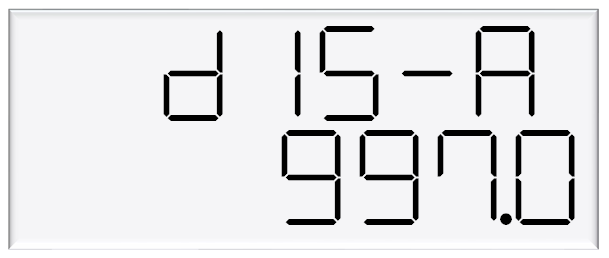
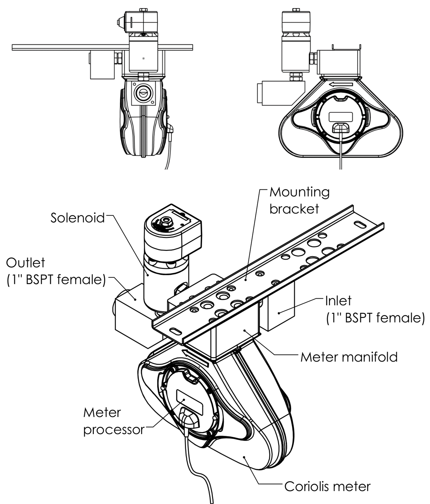
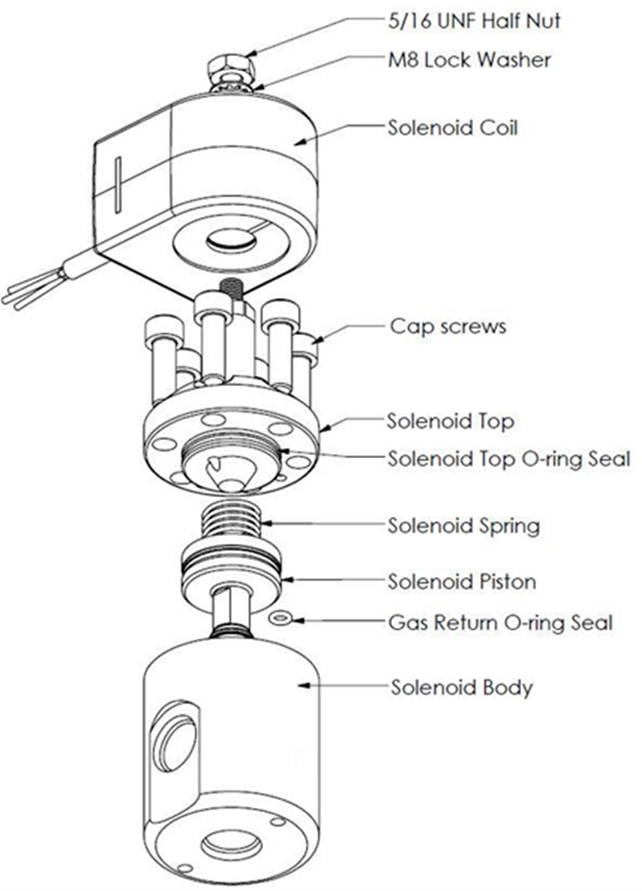
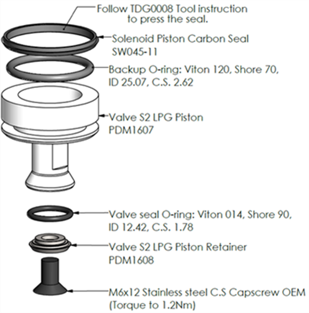
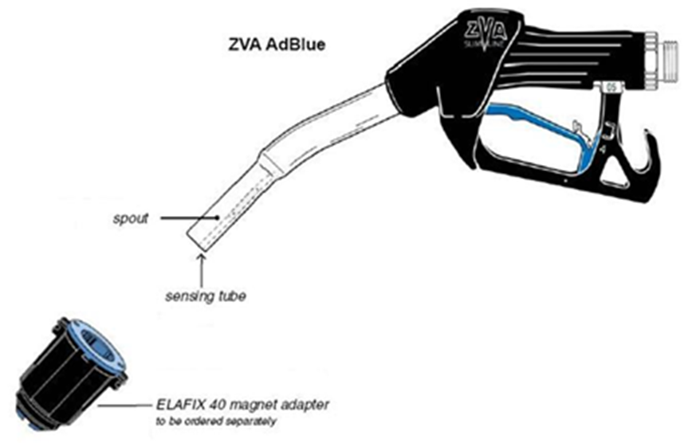

# Adblue Installation and Service Manual  

updated 21 April 2026

# Conditions of Use  

Please read this manual completely before working on, or making adjustments to Compac equipment

Compac Industries Limited accepts no liability for personal injury or property damage resulting from working on or adjusting the equipment incorrectly or without authorization.

Along with any warnings, instructions, and procedures in this manual, you should also observe any other common sense procedures that are generally applicable to equipment of this type.

Failure to comply with any warnings, instructions, procedures, or any other common sense procedures may result in injury, equipment damage, property damage, or poor performance of the Compac equipment

The major hazard involved with operating the Compac C4000 processor is electrical shock. This hazard can be avoided if you adhere to the procedures in this manual and exercise all due care.

Compac Industries Limited accepts no liability for direct, indirect, incidental, special, or consequential damages resulting from failure to follow any warnings, instructions, and procedures in this manual, or any other common sense procedures generally applicable to equipment of this type. The foregoing limitation extends to damages to person or property caused by the Compac C4000 processor, or damages resulting from the inability to use the Compac C5K processor, including loss of profits, loss of products, loss of power supply, the cost of arranging an alternative power supply, and loss of time, whether incurred by the user or their employees, the installer, the commissioner, a service technician, or any third party.

Compac Industries Limited reserves the right to change the specifications of its products or the information in this manual without necessarily notifying its users.

Variations in installation and operating conditions may affect the Compac C4000 processor's performance. Compac Industries Limited has no control over each installation's unique operating environment. Hence, Compac Industries Limited makes no representations or warranties concerning the performance of the Compac C4000 processor under the actual operating conditions prevailing at the installation. A technical expert of your choosing should validate all operating parameters for each application.

Compac Industries Limited has made every effort to explain all servicing procedures, warnings, and safety precautions as clearly and completely as possible. However, due to the range of operating environments, it is not possible to anticipate every issue that may arise. This manual is intended to provide general guidance. For specific guidance and technical support, contact your authorised Compac supplier, using the contact details in the Product Identification section.

Only parts supplied by or approved by Compac may be used and no unauthorised modifications to the hardware of software may be made. The use of non-approved parts or modifications will void all warranties and approvals. The use of non-approved parts or modifications may also constitute a safety hazard.

Information in this manual shall not be deemed a warranty, representation, or guarantee. For warranty provisions applicable to the Compac C4000 processor, please refer to the warranty provided by the supplier.

Unless otherwise noted, references to brand names, product names, or trademarks constitute the intellectual property of the owner thereof. Subject to your right to use the Compac C5K processor, Compac does not convey any right, title, or interest in its intellectual property, including and without limitation, its patents, copyrights, and know-how.

Every effort has been made to ensure the accuracy of this document. However, it may contain technical inaccuracies or typographical errors. Compac Industries Limited assumes no responsibility for and disclaims all liability of such inaccuracies, errors, or omissions in this publication.

# Specifications

## Models Covered

> **Note:** Do not use this manual for earlier models. Contact Compac for archived manuals if required.

# Validity

Compac Industries Limited reserves the right to revise or change product specifications at any time. This publication describes the state of the product at the time of publication and may not reflect the product at all times in the past or in the future.

# Manufactured By

The Compac Adblue Dispenser is designed and manufactured by Compac Industries Limited

52 Walls Road, Penrose, Auckland 1061, New Zealand

P.O. Box 12-417, Penrose, Auckland 1641, New Zealand

Phone: + 64 9 579 2094

Fax: + 64 9 579 0635

**Email:** [techsupport@compac.co.nz](mailto:techsupport@compac.co.nz)

**Website:** [http://www.compac.co.nz](http://www.compac.co.nz)

Copyright ©2015 Compac Industries Limited, All Rights Reserved

# Document Control

## Document Information

**Manual Title:** Adblue Installation and Service Manual

**Current Revision Author(s):** Trevor Watt

**Original Publication Date:** 22 April 2026

**Authorised By:** Emily Sione

**File Name:** Adblue Installation and Service Manual v.1.0.5

## Table of Contents

[**1.0 Commissioning**](#10-commissioning)

[**1.1 Adblue specific Dispenser settings**](#11-adblue-specific-dispenser-settings) 

[1.1.1 Meter Settings](#111-meter-settings)

[1.1.2 Variant Settings](#112-variant-settings)

[1.1.3 Quantity Settings](#113-quantity-settings)

[1.1.4 C-A and C-b Dispenser settings for Adblue](#114-c-a-and-c-b-dispenser-settings-for-adblue)

[1.1.5 Changing the V50 Meter ID](#115-changing-the-v50-meter-id)

[1.1.6 Changing the Temperature Calibration](#116-changing-the-temperature-calibration)

[1.1.7 Changing the Density Calibration](#117-changing-the-density-calibration)

[**1.2 Electrical**](#11-electrical)

[**1.3 Mechanical**](#13-mechanical)

[**1.4 Hydraulic System**](#14-hydraulic-system)

[**1.5 Typical Cycle**](#15-typical-cycle)

[**1.6 Hydraulic Layout**](#16-hydraulic-layout)

[**2.0 Servicing**](#20-servicing)

[2.1 Tools](#21-tools)

[2.2 Initial Servicing](#22-initial-servicing)

[2.3 Annual Servicing](#23-annual-servicing)

[2.4 **V50 Meter Servicing**](#24-v50-meter-servicing)

[2.4.1 Replacing the Electronic Module](#241-replacing-the-electronic-module)

[2.4.2 Pairing the Electronic Module](#242-pairing-the-electronic-module)

[2.4.3 Removing the V50 Meter](#243-removing-the-v50-meter)

[2.4.4 Replacing the V50 Meter](#244-replacing-the-v50-meter)

[2.4.5 Calibrating the V50 Meter K-Factor](#245-calibrating-the-v50-meter-k-factor)

[**2.5 Solenoid Servicing**](#25-solenoid-servicing)

[2.5.1 Removing Solenoid Valve Seals](#251-removing-solenoid-valve-seals)

[2.5.2 Replacing Solenoid Valve Seals](#252-replacing-solenoid-valve-seals)

[2.5.3 Solenoid Valve diagram](#253-solenoid-valve-diagram)

[2.5.4 Replacing the Solenoid Coil](#254-replacing-the-solenoid-coil)

[2.5.5 Replacing the Solenoid](#255-replacing-the-solenoid)

[**2.6 AdBlue Instructions**](#26-adblue-instructions)

[2.6.1 Cleaning the AdBlue Nozzle](#261-cleaning-the-adblue-nozzle)

[2.6.2 ZVA AdBlue Nozzle](#262-zva-adblue-nozzle)

# 1.0 Commissioning

# 1.1 Adblue specific Dispenser settings 

The following diagram displays how to change the dispenser settings, such as the meter type, variant and minimum delivery. 
To get to the following menu, depress the K-Factor switch once when not in a transaction.
 The menu shown is for side A – if side B is required, continue depressing the K-Factor switch until the same menu for side B is reached and follow the same set up instructions. 

These settings will likely be set in the factory. Only change the following settings if required. See following pages for information on these settings.

# 1.1.1 Meter Settings
This setting corresponds to the type of meter plugged in to the dispenser. Options 1-3 are for an encoder meter and depend on the channel setting of this meter. This should be selected if a hose is using diesel. V50 meters (option 4) are used for AdBlue and should be selected for hoses using AdBlue. 
Some settings (such as temperature and density calibration) are only available for V50 and therefore will not appear if the meter type is not set to V50. These will therefore not appear for hoses using diesel.

 

# 1.1.2 Variant Settings
This setting should be changed depending on the product – set the variant to 0 for diesel. Set the variant to 4 for diesel emissions fluid (AdBlue). 

 

# 1.1.3 Quantity Settings

This setting is what quantity will be shown on the main display when fuel is being dispensed. This is only valid for V50 meters and is ignored for encoder meters which always display Litres uncompensated.

 

# 1.1.4 C-A and C-b Dispenser settings for Adblue

C-A and C-A are used to change the dispenser settings including the meter type, variant and minimum delivery.
To get to the C-A and C-B, press the K-Factor switch once while the dispenser is in an idle state.
The menu shown is for side A – if side B is required, continue depressing the K-Factor switch until the same menu for side B is reached and follow the same set up instructions.

**Note:**
The specific settings for Adblue include the following
- Set the 6th digit to 4 for Adblue
- Set the 7th digit to 4 for V50 Adblue Meter

**Caution:** These settings are likely to have been set correctly in the Compac factory. Only change if required. See following pages for information on these settings.

|	Setting       |Digit             |    Function                                             |
|---------------|------------------|---------------------------                                 |
|C-A or C-B     | 1st Digit        |**Minimum Measured Quantity Coefficient** – MUST be 1, 2 or 5|
|               | 2nd digit        |**Minimum Measured Quantity Exponent** – Must be a valid digit- see below
|               | 3rd digit        |**Not used**
|               | 4th digit	       |**Air Switch settings**
|               |                  |0 = Normally open – turn air switch ON for error        
|               |                  |1 = Normally closed – turn air switch OFF for error 
|               | 5th digit        |**Quantity Settings - V50 Meter only**
|               |                  |0 = Litres Compensated 
|               |                  |1 = Litres Uncompensated
|               |                  |2 = Mass (CNG only)
|               | 6th Digit        |**Variant Settings**
|               |                  |0 = Non-LPG
|               |                  |4 = AdBlue (Diesel Emissions Fluid or DEF)
|               |                  |5 = LPG
|               | 7th Digit        |**Meter settings**
|               |                  |1 = 1 Channel Encoder
|               |                  |2 = 2 Channel Encoder 
|               |                  |3 = 3 Channel Encoder
|               |                  |4 = V50 or KG100 Meter
|               |                  |5 = GPIO Meter input

# 1.1.5 Changing the V50 Meter ID
All V50 meters have a specific ID which must match the ID recorded in the dispenser settings. This is a 6-digit number which can be found on the meter.
If the IDs do not match, the dispenser will return an error.
See Using the Dispenser Menus to edit these settings. Use the procedure for both side A and B.

As meter IDs are only relevant for V50 operation, this option will not show if the meter is not set to V50. Therefore, it will not be shown for hoses dispensing diesel. 

# 1.1.6 Changing the Temperature Calibration

The temperature calibration can be used to adjust the temperature being retrieved from the meter, if this is not the actual temperature of the product being dispensed. 
The actual temperature of product being dispensed should be entered in this menu. This will be used to adjust new temperatures returned from the meter.  
See Using the Dispenser Menus to edit these settings. Use the procedure for both side A and B.

As only V50 meters return temperature readings, this option is only for V50 operation and will not appear if the meter is not set to V50. 
Therefore, it will not be shown for hoses dispensing diesel.

# 1.1.7 Changing the Density Calibration
The density calibration can be used to adjust the density being retrieved from the meter, if this is not the actual density of the product being dispensed. 
The actual density of product at 15 °C being dispensed should be entered in this menu. 
This will be used to adjust new densities returned from the meter. 
See Using the Dispenser Menus to edit these settings. Use the procedure for both side A and B.

As only V50 meters return density readings, this option is only for V50 operation and will not appear if the meter is not set to V50. Therefore, it will not be shown for hoses dispensing diesel.

 

# 1.2 Electrical

This procedure outlines how to perform an electrical operational test, making sure that the dispenser is functioning correctly. Check for any damage that may have occurred in transit. 
Check all terminals, plugs, and chips to make sure that they are securely in place. 

**NOTE:** *Damage to electronics occurs most commonly from vibration and jarring.* 

Before beginning this test, check that fuel has **not** been applied to the dispenser. The factory set-up information should be programmed into the dispenser. 

For the location of LEDs, required for this operations test, see LEDs section. 

To perform an electrical operational test:
1.	Make sure that the inlet shut-off valves are closed (these are the valves in the inlet lines at the base of the dispenser, but they are not part of the dispenser).
2.	Turn on the power supply to the dispenser. The dispenser may be in purge mode. This is okay for the purpose of this test.
3.	With the dispenser in a **ready state**, check that the C5000 processor board Power LED is turned on. 

**NOTE:** *If the dispenser is receiving information, RD LED on the K-Factor board will be on. If the dispenser responds to polls for its respective pump number/s, TD LED will also be on.*

4.	Lift the nozzle. The display will show purge and the solenoids will energise, starting the pump motor. 
Check that three output LEDs (T1-7) turn on, indicating a signal is being sent to the triacs to open the solenoid valves. The LEDs that will turn on vary depending on the application. 

5.	The diagnostic LED (K-factor board) flashes quickly when the start button is pushed, or the nozzle removed from the holster to initiate a fill. When the button is released or the nozzle returned to the holster it will return to the normal state and flash slowly. 

6.	Verify solenoid operation by listening for a click, or by using a screwdriver tip or some other metallic tool to check for a magnetic field present on the solenoid coils.

# 1.3 Mechanical

Make sure that the electrical commissioning tests have been carried out and the solenoid operation has been verified before carrying out the following tests. 

Slowly open the supply valves to the dispenser, checking for any leaks. 

Turn on the power supply to the dispenser. 

The dispenser should be in purge mode when it arrives onsite. If it is not, use the Parameter button to put the dispenser into purge mode by changing the b setting to ***1. Retail dispensers will display Purge in the Dollars display. The temperature and measured density will toggle in the $/L display. Wait for the C5000 to time out and return to the normal display. 

Lift the nozzle. 

The display will show Purge and the solenoids will energise, starting the pump motor. Check that three output LEDs (T1-7) turn on, indicating a signal is being sent to the triacs to open the solenoid valves. The LEDs that will turn on vary depending on the variant and side being tested. 

In Purge mode the dispenser will only operate for 60 seconds at a time before shutting down. If the dispenser shuts down, hang up the nozzle and start again. 

Check all the dispenser fittings, solenoids and pipework for leaks. 
Slowly dispense AdBlue from the dispenser, being careful to shield yourself from splashes as there may be air in the fuel causing it to spray from the nozzle. If the dispenser stops, hang up the nozzle then remove it and start dispensing again. 

Continue until the AdBlue flows without any air being present, then hang up the nozzle. 

Put the dispenser back into normal mode by changing the b setting back to ***0. 

Lift the nozzle and slowly dispense AdBlue from the dispenser. The display and tote should increment when fuel is flowing. If the dispenser stops and the error message AIR displays, go back and purge the hose again. 

The dispenser can now be calibrated. 

Once the pump is connected on site, the final setup check and calibration to complete the installation must be carried out, using the Parameter Switch and Calibration (K-Factor) Switches on the C5000 K-Factor board.

# 1.4 Hydraulic System

Component|Function
|-|-
Manifold|Allows flow of AdBlue into and out of the Meter.
V50 Meter|Meters the flow of AdBlue. Also measures AdBlue density and temperature and detects vapour.
Solenoid|Provides on/off flow control over the AdBlue through the dispenser.

 

# 1.5 Typical Cycle

The following describes a typical hydraulic cycle.

Operator Action|What happens at the Dispenser
|-|-
Lift the nozzle|If there is no site controller, the C5000 activates the AdBlue pump and the display shows 88888 as the V50 meter checks the density of the AdBlue. If the density checks out, the display resets, the solenoid opens and the fill commences.
||If there is a site controller the AdBlue dispenser must be off hold before the nozzle is lifted. The nozzle must be hung up for 3 seconds before lifting and placing in the vehicle.
Nozzle lever opened.|	AdBlue flows through the dispenser and is metered.
Nozzle lever closed and nozzle is hung up.|	The solenoid closes and pump stops after the fill has ended.

 

# 1.6 Hydraulic Layout

# 2.0 Servicing

# 2.1 Tools

Servicing the dispenser does not require any specialised tools but to undertake comprehensive servicing, repairs and calibration the following equipment is required. 
Before attending the site, read the manual and establish the equipment that you will need to take to site.

- A full set of metric and imperial wrenches
- A 9/16” or 14mm Allen key or hex key
- Long nose pliers
- A multimeter
- An earthing strap 

 

# 2.2 Initial Servicing

Contamination of the fuel supply from dirty pipework is the prime cause of meter and solenoid problems. 
Two weeks and three months after commissioning a new site the strainer should be cleaned.

- Check the system for leaks.
- Check the nozzle for urea crystals
- Make sure the doors are correctly in place and all panels are secure.
- Check the operation.

 

# 2.3 Annual Servicing

Every twelve months:
- Do a calibration check. Adjust if necessary.
- Check the system for leaks.
- Check the nozzle for urea crystals
- Make sure the doors are correctly in place and all panels are secure.
- Check the condition of the AdBlue Hose. Replace if necessary.
- Check the operation.

# 2.4 V50 Meter Servicing

The V50 meter is field serviceable, and its electronic module can be removed and replaced.

 

# 2.4.1 Replacing the Electronic Module  

The electronic module can be replaced without draining the dispenser.

- Turn the power off the dispenser.
- Remove the side panel to access the meter.
- Undo the retaining screws on the front of the meter.
- Snip the sealing wires and remove the electronic module from the meter.
- Snip any cable ties and noting where it is plugged in, unplug the module from the C5000 K-Factror board. 
- Fit the new electronic module to the meter.  Feed the cable up to the C5000 K-Factror board and plug it into the same socket as the old module (the clips face outwards).
- Cable-tie the new cable in place and fix the module in place with screws and new anti-tamper seals.

 

# 2.4.2 Pairing the Electronic Module  

The new module needs to be paired to the C5000 processor board using the K-Factor switch.

- Start the dispenser and copy down the serial number stuck on the face of the new module.
- Using the K-Factor switch scroll through the menu until you reach the Id-A  (side A) or Id-b (side B) screen depending on which meter the module belongs to (dual hose models).
- By pressing then holding in the K-Factor switch, scroll through each digit in turn until the number matches the number printed on the new module.
- When you have the correct number continue to scroll through until you leave the Id menu entirely .

**NOTE:** On two hose units it is important to do this operation even if you are only replacing one module. 
Failure to do this is one of the prime causes of setup problems.

You will now need to calibrate the new module.

# 2.4.3 Removing the V50 Meter

The entire V50 meter is available as a spare part complete with electronic module.

- Turn off the inlet valve at the base of the dispenser.
- Turn the power off the dispenser.
- Snip any cable ties and noting where it is plugged in; unplug the meter from the C5000 K-Factror board. 
- Undo the four screws holding the meter in place and remove the meter.

# 2.4.4 Replacing the V50 Meter

- Make sure the O rings are in place and ensure the meter is in the correct orientation by checking the ‘IN’ and ‘OUT’ labels on the base of the meter.
- Using the four screws, fasten the new meter in place.
- Feed the meter cable up to the C5000 K-Factror board and plug it into the same socket. The clips face outwards.
- Cable-tie the lead neatly out of the way if required.
- Make sure all connections are tight and any drain valves closed.
- Pressurise slowly while checking for leaks.
- Restart the dispenser and pair the new meter to the C5000 unit.
- Calculate and enter the temperature and density offsets and then calibrate the meter.

# 2.4.5 Calibrating the V50 Meter K-Factor

The calibration factor is a proportional factor of calculated litres dispensed compared to actual litres dispensed. A calibration factor must be set for each meter in the dispenser.

**Volumetric Method:**

	Place an empty test pail near the dispenser.
	Remove the nozzle from the nozzle holder.
	Wait for the displays on the dispenser to go through its 88888's and return to 0.00.
	Using the nozzle, fill your test pail to the 20L mark.
	Hang up the nozzle.
	Record the litres delivered on the dispenser
	If the calibration is out adjust the K Factor using the following formula: New K Factor = Existing K Factor x Volume dispensed/Volume displayed.

# 2.5 Solenoid Servicing

# 2.5.1 Removing Solenoid Valve Seals

- Drain the dispenser.
- Switch off the power supply to the dispenser.
- Unscrew the solenoid coil retaining nut and move the coil out of the way.
- Remove the six cap screws from the solenoid top. 

**NOTE:** *Do not remove the angled grub screw from the solenoid top. This is epoxied in place during manufacture and should never be removed.*

- Remove the solenoid top and remove the old top O-ring seal and return O-ring.
- Remove the solenoid spring.
- Screw an M6 cap screw into the solenoid piston to withdraw it from the solenoid body. 
- Taking care not to damage the piston, hold the flat part of the piston with a spanner to prevent rotation, then unscrew the M6 x 12 mm cap screw from the bottom of the piston. This releases the solenoid seal retainer and valve seal.  
- Discard the old valve seal.
- Clean all oil and dirt off the components with a clean cloth and check that the bleed hole is not blocked.
- While the solenoid is apart, inspect the solenoid piston centre seal and piston for wear, scratching or damage. Replace piston if required.

**DANGER** 

Never remove any electrical components without first switching off the power to the dispenser.
Failure to turn off the power could result in an electric shock.

 

# 2.5.2 Replacing Solenoid Valve Seals

- Place the new valve seal and seal retainer on the cap screw.
- Taking care not to damage the piston, hold the flat part of the piston to prevent rotation, and then screw the M6 cap screw into the bottom of the piston.
- Insert a new return O-ring.
- Insert the piston back into the solenoid body.
- Insert the solenoid spring.
- Replace the solenoid top O-ring seal.
- Place the solenoid top back on the solenoid body, making sure that the locating dowel is engaged.
- Screw in and tighten the six cap screws.
- Replace the solenoid coil.
- Re-power the dispenser then check for leaks and correct operation of the valve.

 

# 2.5.3 Solenoid Valve diagram

 

 

# 2.5.4 Replacing the Solenoid Coil

- Drain the dispenser
- Switch off and isolate the power supply to the dispenser.
- Remove the flameproof box lid to gain access to the C5000 power supply board. 
- Disconnect the appropriate solenoid coil wiring from the C5000 power supply board.
- Loosen the gland on the flameproof box that is clamping the solenoid coil lead and pull the lead out of the gland. 
- Undo the nut on the top of the solenoid valve that is securing the coil and remove the coil from the top of the valve
- Replace with new coil.

**DANGER**
 
Never remove any electrical components without first switching off the power to the dispenser. Failure to turn off the power could result in an electric shock.

**NOTE:** *Solenoid coils are not interchangeable between models. Make sure you order the correct one by quoting the dispenser serial number. To replace obsolete coils, the entire solenoid will need replacing.*

 

# 2.5.5 Replacing the Solenoid

- Drain the dispenser.
- Switch off the power supply to the dispenser.
- Undo the nut and remove the solenoid coil.
- Undo the gland nuts connecting the solenoid valve to the pipework and manifold and remove valve
- Ensuring all surfaces are clean and any sealing plugs are removed from the valve, reconnect the pipework to the new solenoid valve and tighten the gland nuts.
- Replace the solenoid coil.
- Repower the unit, check for leaks and test for correct operation.

**DANGER**

Never remove any electrical components without first switching off the power to the dispenser. Failure to turn off the power could result in an electric shock.

**CAUTION**

Cleanliness is essential. When working on the open pipes and solenoids, cover the openings with a clean, lint-free cloth to prevent dust and dirt from entering.

# 2.6 AdBlue Instructions

# 2.6.1 Cleaning the AdBlue Nozzle

If AdBlue evaporates it may form crystals around the dispenser nozzle. 
A build up of crystals can block the air passage causing the nozzle to continuously trip off. 

If this occurs, rinsing the nozzle in a bucket of warm water will dissolve the crystals and unblock the air passage. 

To avoid contamination of the AdBlue, thoroughly dry the nozzle after rinsing. 

 

# 2.6.2 ZVA AdBlue Nozzle

The ZVA AdBlue nozzle with a magnetic safety catch is commonly used on AdBlue dispensers. The following image is included for reference. For further information refer to ZVA direct.

 

Automatic nozzle ZVA AdBlue for the refuelling of the “AdBlue” urea solution tanks. 

Flow rate up to 40 l/min, working pressure 0.5 – 3.5 bar. 

To avoid misfuelling, the standard type of ZVA AdBlue is equipped with a magnet opening in the spout. The nozzle will only open in combination with the magnet adapter ELAFIX 40 which must be installed in the AdBlue filler neck. 
 For the refuelling of other containers or canisters please push an ELAFIX 40 over the spout. 

AdBlue tends to crystallise. Due to the evaporation of water, white crystals will show. If these should block the air passage (a sign for this is that the ZVA AdBlue keeps tripping off continuously) this can be solved easily by moving the nozzle spout in a bucket with warm water. 
In order to avoid contamination, please rinse the nozzle spout with AdBlue previous to the next refuelling.

