

# C5000 Master Manual

# Specifications

## Models Covered

> **Note:** Do not use this manual for earlier models. Contact Compac for archived manuals if required.

# Validity

Compac Industries Limited reserves the right to revise or change product specifications at any time. This publication describes the state of the product at the time of publication and may not reflect the product at all times in the past or in the future.

# Manufactured By

The Compac C5000 is designed and manufactured by Compac Industries Limited

52 Walls Road, Penrose, Auckland 1061, New Zealand

P.O. Box 12-417, Penrose, Auckland 1641, New Zealand

Phone: + 64 9 579 2094

**Email:** [techsupport@compac.co.nz](mailto:techsupport@compac.co.nz)

**Website:** [http://www.compac.co.nz](http://www.compac.co.nz)

Copyright ©2015 Compac Industries Limited, All Rights Reserved

# Document Control

## Document Information

**Manual Title:** C5000 Master Manual

**Current Revision Author(s):** Trevor Watt

**Original Publication Date:** 20 September 2021

**Last updated:** 4 March 2026

**Authorised By:** Emily Sione

**File Name:** C5000 Master Manual

# Conditions of Use

Read this manual completely before working on, or making adjustments to, Compac equipment

Compac Industries Limited accepts no liability for personal injury or property damage resulting from working on or adjusting the equipment incorrectly or without authorization.

Along with any warnings, instructions, and procedures in this manual, you should also observe any other common sense procedures that are generally applicable to equipment of this type.

Failure to comply with any warnings, instructions, procedures, or any other common sense procedures may result in injury, equipment damage, property damage, or poor performance of the Compac equipment

The major hazard involved with operating the Compac C5K processor is electrical shock. This hazard can be avoided if you adhere to the procedures in this manual and exercise all due care.

Compac Industries Limited accepts no liability for direct, indirect, incidental, special, or consequential damages resulting from failure to follow any warnings, instructions, and procedures in this manual, or any other common sense procedures generally applicable to equipment of this type. The foregoing limitation extends to damages to person or property caused by the Compac C5K processor, or damages resulting from the inability to use the Compac C5K processor, including loss of profits, loss of products, loss of power supply, the cost of arranging an alternative power supply, and loss of time, whether incurred by the user or their employees, the installer, the commissioner, a service technician, or any third party.

Compac Industries Limited reserves the right to change the specifications of its products or the information in this manual without necessarily notifying its users.

Variations in installation and operating conditions may affect the Compac C5K processor's performance. Compac Industries Limited has no control over each installation's unique operating environment. Hence, Compac Industries Limited makes no representations or warranties concerning the performance of the Compac C5K processor under the actual operating conditions prevailing at the installation. A technical expert of your choosing should validate all operating parameters for each application.

Compac Industries Limited has made every effort to explain all servicing procedures, warnings, and safety precautions as clearly and completely as possible. However, due to the range of operating environments, it is not possible to anticipate every issue that may arise. This manual is intended to provide general guidance. For specific guidance and technical support, contact your authorised Compac supplier, using the contact details in the Product Identification section.

Only parts supplied by or approved by Compac may be used and no unauthorised modifications to the hardware of software may be made. The use of non-approved parts or modifications will void all warranties and approvals. The use of non-approved parts or modifications may also constitute a safety hazard.

Information in this manual shall not be deemed a warranty, representation, or guarantee. For warranty provisions applicable to the Compac C5K processor, please refer to the warranty provided by the supplier.

Unless otherwise noted, references to brand names, product names, or trademarks constitute the intellectual property of the owner thereof. Subject to your right to use the Compac C5K processor, Compac does not convey any right, title, or interest in its intellectual property, including and without limitation, its patents, copyrights, and know-how.

Every effort has been made to ensure the accuracy of this document. However, it may contain technical inaccuracies or typographical errors. Compac Industries Limited assumes no responsibility for and disclaims all liability of such inaccuracies, errors, or omissions in this publication.

## Table of Contents

[**1 Safety**](#1-safety)

[**2 Electrical Installation**](#2-electrical-installation)

[C5000 Power Supply 230v Mains connections](#c5000-power-supply-230v-mains-connections)

[Cable and Mains Power Requirements](#cable-and-mains-power-requirements)

[K-Factor board](#k-factor-board)

[Typical wiring](#typical-wiring)

[**3 COMMS connections and settings**](#3-comms-connections-and-settings)

[3-1 COMPAC and PEC COMMS](#3-1-compac-and-pec-comms)

[3-2 GILBARCO COMMS](#3-2-gilbarco-comms) 

[3-3 DART COMMS](#3-3-dart-comms)

[**4 K-Factor Switch settings**](#4-k-factor-switch-settings)

[Changing the C-A and C-b Dispenser settings](#changing-the-c-a-and-c-b-dispenser-settings)

[Changing the V50 Meter ID](#changing-the-v50-meter-id) 

[Changing the Temperature Calibration E-A and E-b](#changing-the-temperature-calibration-e-a-and-e-b)

[Changing the Density Calibration dIS-A](#changing-the-density-calibration-dis-a)

[Changing the Maximum Flow rate 9A and 9b](#changing-the-maximum-flow-rate-9a-and-9b)

[Changing the K factor FA and Fb](#changing-the-k-factor-fa-and-fb)

[Default K Factor setting](#default-k-factor-setting)

[Changing Configuration C](#changing-configuration-c)

[Changing COMMS CC](#changing-comms-cc)

[**5 Parameter Switch Settings**](#5-parameter-switch-settings)

[How to view the Software Version](#how-to-view-the-software-version)

[Changing the pump number](#changing-the-pump-number)

[Changing the price](#changing-the-price)

[Changing the Pump settings](#changing-the-pump-settings)

[Changing the High Preset Cut](#changing-the-high-preset-cut)

[Pump settings on Parameter switch explained](#pump-settings-on-parameter-switch-explained)

[Changing the Low-flow Cutoff](#changing-the-low-flow-cutoff)

[Changing the High-flow Cutoff](#changing-the-high-flow-cutoff)

[Changing the b setting](#changing-the-b-setting)

[Changing the Slave Display Configuration](#changing-the-slave-display-configuration)

[Assigning a number to slave display](#assigning-a-number-to-slave-display) 

[Changing the Custom Display Configuration](#changing-the-custom-display-configuration)

[How to view the Last Sale](#how-to-view-the-last-sale)

[How to view Electronic Totes](#how-to-view-electronic-totes)

[Enabling Amount or Quantity Preset](#enabling-amount-or-quantity-preset)

[Preset Board DIP Switch settings](#preset-board-dip-switch-settings)

[**GPIO board applications**](#gpio-board-applications)

[1 GPIO board set up for Pulse Input from a Flow Meter](#1-gpio-board-set-up-for-pulse-input-from-a-flow-meter)  

[2 GPIO board set up in Input Switch mode](#2-gpio-board-set-up-in-input-switch-mode)

[3 GPIO board set up in Pulse Output mode](#3-gpio-board-set-up-in-pulse-output-mode)

[**Commissioning**](#commissioning)

[Electrical](#electrical)

[Mechanical](#mechanical)

[**LED Diagnostics**](#led-diagnostics)

[C5K Processor Board](#c5k-processor-board)

[K Factor board](#k-factor-board)

[K Factor Board Output LEDs](#k-factor-board-output-leds)

[**Troubleshooting electrical problems**](#troubleshooting-electrical-problems)

[Electrical problems](#electrical-problems)

[Mechanical problems](#mechanical-problems)

[**Software upgrade**](#software-upgrade)

[Generator Power](#generator-power)

[**Error Codes**](#error-codes)

[**END OF SALE Indicators**](#end-of-sale-indicators)

 

# 1-0 Safety

### PRECAUTIONS
- Always follow safe operating procedures, any national or local regulations, and site-specific instructions.
- Always turn the power off to the unit and properly isolate so power cannot be turned on by mistake.
- Turn off isolating valves to the dispenser and drain the fuel before any mechanical servicing.

### Electrical Safety
Observe the following electrical precautions:
- Always turn off the power to the Compac C5000 processor before opening the flame-proof box.
- Never touch wiring or components inside the high voltage area with the power on.
- Always turn off the power to the Compac C5000 processor at the mains switch before removing or replacing software or memory ICs.
- Always take basic anti-static precautions when working on the electronics, i.e., wearing a wristband with an earth strap.

### Site Safety
- Obey all company regulations and site-specific instructions relating to the installation.
- Before working on any hydraulic equipment, drain the dispenser in an approved manner.

### Static Electricity Precautions
- Electronic components used are sensitive to static. Please take anti-static precautions.
- All circuit boards must be carried and transported in static-shielded bags.
- An anti-static wrist strap should be worn and connected correctly when working on any electronic equipment.
- If an anti-static wrist strap is unavailable, or in an emergency, hold onto an earthed part of the pump/dispenser frame whilst working on the equipment. This is not a recommended alternative to wearing an anti-static wrist strap.
- Compac Industries Limited reserves the right to refuse to accept any returned circuit boards if proper anti-static precautions have not been taken.

 

# 2 Electrical Installation

## C5000 Power Supply

The C5000 may be supplied unmounted for use in applications such as controlling mechanical registers in a bulk dispensing area or mounted on a truck for mobile dispensing.  
When installing the C5000 power supply, please observe the following instructions.

### Cable Entries
There are fourteen cable entries:  
- Five along the top of each of the long sides  
- Three along one short side of the box  
- One at the bottom  

All cable entries have an **M20 thread**.  
- The bottom cable entry is used for the power supply output cable.  
- The thirteen top cable entries are for power cable and communication connections.  

Use only certified **Ex 'd' glands** and thread adaptors if required.  
Blank all unused entries with certified **M20 Ex 'd' blanking plugs**.  
Do **not** use thread adaptors with blanking plugs.  
All cables must carry appropriate certification for the required application.

---

### Area of Use
Correctly installed, the power supply is suitable for use in **Zone 1 areas** as defined in **IEC 60079-14**, group classification **IIA**, temperature classification **T4**, ambient temperature range **-25°C to 55°C**.  
With the o-ring fitted in the base and the use of appropriate glands, the enclosure provides protection to **IP66**.

## Location
Mount the power supply in a **horizontal position**, isolated from vibration and sheltered from excess water spray.  
Failure to do this may void the warranty.

## Installation
Fasten the power supply using the four **M6 tapped holes** in the base.  
- Hole centres: **185 mm x 105 mm**  
- Minimum thread engagement: **9 mm**  
- Maximum thread engagement: **14 mm**

## Wiring
- Wiring must be carried out in accordance with the relevant code of practice.  
- All terminal wiring must have a cross section area of **0.5 mm² to 4 mm²**.  
- Wiring used should be suitable for **80°C**.  
- Insulation must extend to within **1 mm** of the metal face of the terminal.  
- Not more than one single or multi-stranded wire should be connected to the terminals unless they have been pre-joined in an appropriate manner.

## Installation Procedure
1. Ensure the unit is isolated from the power source.  
2. Remove the sixteen **M10 x 20 stainless steel cap screws** and remove the lid.  
3. Feed all wires into the box via an appropriate gland and connect.  
   - The Earth wire from the power lead must be earthed to the casing using a proper terminal.  
4. Replace the lid making sure the gasket is in place and clean and that no wires have been pinched.

## External Earthing
Where required, earth the C5000 Power Supply using an earth wire with a cross-sectional area at least equal to the largest conductor.  
The earth wire is attached to the integrated point.

 

# Cable and Mains Power Requirements

## Cable Requirements
### Power
- **Cable Type:** 3 Core Steel Wire Armour Cable, 2.5 mm²  
- **Voltage:** 220–240 V, 50 Hz, ±10%  
- **Core Details:**  
  - Core 1: 230 V Supply (Active)  
  - Core 2: Neutral  
  - Core 3: Earth  

**Dispensers:**  
- 25 W idle  
- 300 W with all solenoids active  

**Submersible Pump(s):**  
- Suitable cable for 230 V solenoid switching current  
- 300 mA maximum load  
- *Do not wire submersible pumps directly to C5000 power supply.*

### Pumps
- **C5000 Power Label:** 110–240 Vac, 50/60 Hz, 15 A  
- This rating caters for start-up current of two motors (e.g., MR160P).  
- Mains supply must support up to 15 A.  
- Actual usage:  
  - 2 × 750 W motors + 2 × dual solenoids (<30 W each) + electronics (<300 W)  
- **Examples:**  
  - MR80P (1 × 750 W motor): <1.1 kW with motor and solenoid active  
  - MR160P (2 × 750 W motors): <2 kW with both motors and solenoids active  

## Comms
- **Cable Type:** 2 Core Steel Wire Armour Cable, 1.5 mm²  
- **Max Length:** 100 m  
- **Voltage:** 12 V current loop  
- Ensure at least 2 m cable tail for both incoming 230 V and comms cables to reach C5000 flameproof box.  
- If using generator power, refer to the *Generator Power* section.  

 

# C5000 Power Supply 230v Mains connections
- Connections should be brought into the terminal board.  
- Optional: Emergency stop connection can replace the normal loop between triac and main phases.  
- **Wire Colours:**  
  - Incoming mains phase: **Brown**  
# Power Supply
The C5000 Power Supply is found within the flameproof box, located on the unit. 
The Power Supply enclosure also contains the Processor board, Terminal board and Comms board
which are piggy-backed on top of the Power Supply. 

# K-Factor board

Both the Parameter switch and K-Factor switches are located on the K-Factor board. Meters and air switches are also connected to this board. See below for the location of these.

# Typical Wiring

**Caution:**
The following diagrams are typical only and will vary between different models.
Check the installation instructions for the exact model that you are working on 

## Pumps

The following diagrams show the typical wiring required for C5000 pumps.

The motor can be connected to the terminal board for both side A and side B. Only wire in the required side(s). The location of the fuses on the terminal board are also shown. These can be used for diagnosing problems with the unit.

Solenoids for side A and B are optional and can be wired in if preset and prepay options are desired.

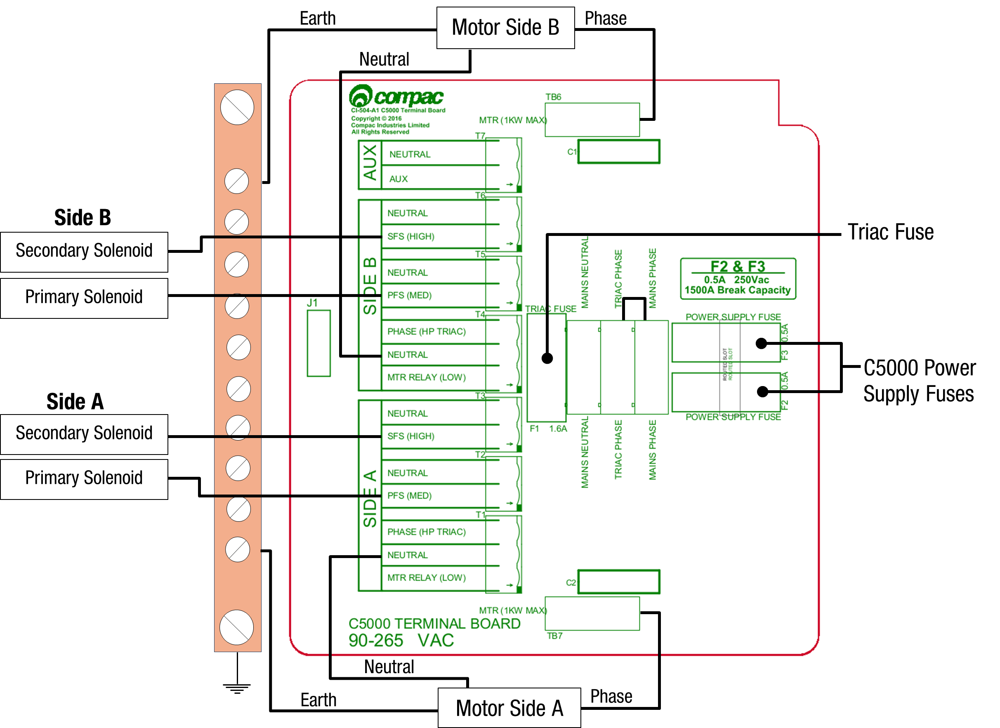

## Triac Wiring

The triac wiring is pre-installed and, in most cases, will not need to be changed. However, the wiring is shown here to aid triac replacement or other service procedures. These are colour coded with standard colours. In case these are not clear, the colours are as follows:

- MTR Relay: Orange
- Phase: Red
- Motor: White

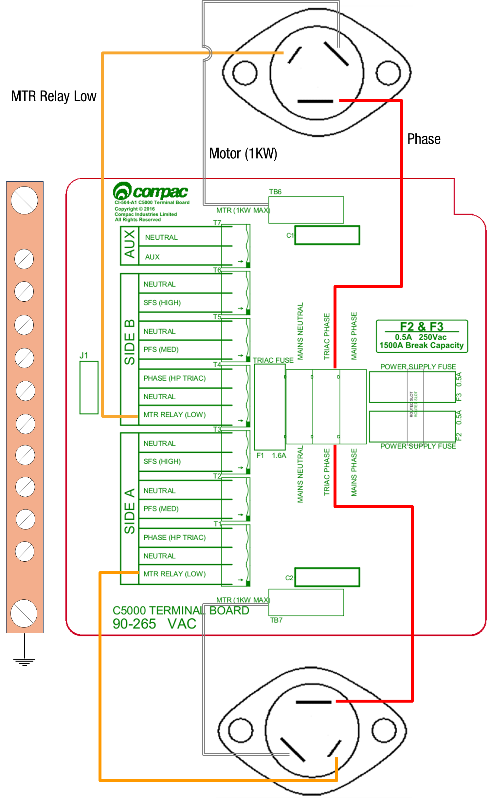

## Dispensers

When using the C5000 electronics for dispenser application, as well as connecting the incoming mains, the external pump contactors will have to be connected to the terminal board.

Solenoids for side A and B are optional and can be wired in if preset and prepay options are desired.

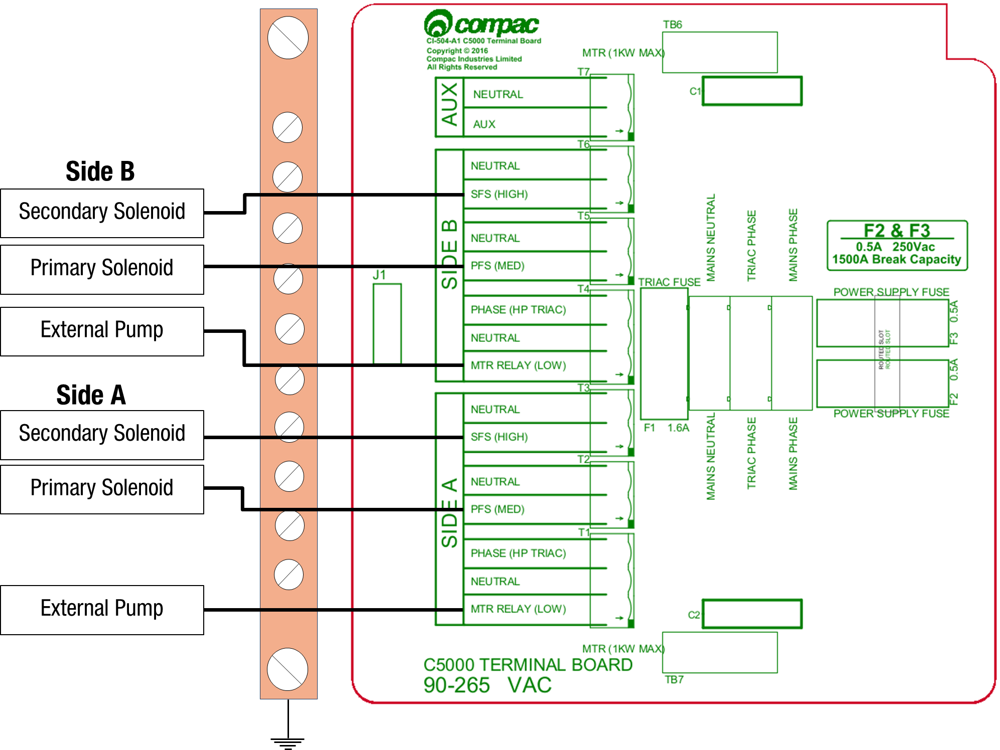  - Incoming mains neutral: **Blue**  
  - Incoming mains earth: **Green/Yellow**  

# 3 COMMS connections and settings

**Important note:**
There are two types of Comms Interface boards used in the C5000

CI501 - This is used in standard Pumps and Dispensers that are connected to either Compac or Third Party Contollers   
CI533 - This is used when the C5K is acting as the controller such as in PT1, ComfillV2 and Fillmaster

## CI501 Comms Board

The comms I/O is controlled by the connections to the Comms board. Refer to the following diagram for connecting RS485, RS232, Compac or Gilbarco pumps. The shown switch should be set to the desired setting. 

Switches 300, 302, and 303 are for RS485/RS232 Terminator application.   
Use the following table to configure these switches. Switch 300 is for channel 1, and switches 302 and 303 are for channel 2.

 

## CI533 Comms board

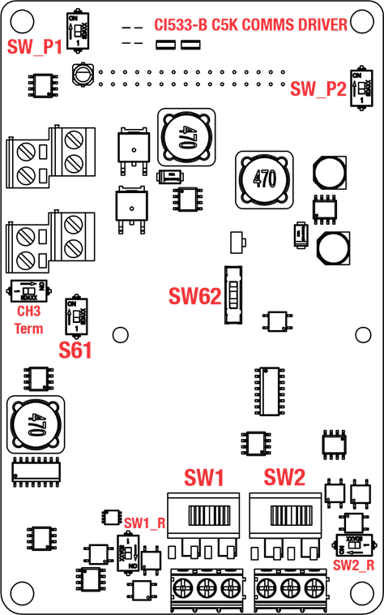

In C5000 Compac Pumps and Dispensers, the CI533 Comms interface PCB board is piggy-backed on top of the Processor Board

In a COMFILL or PT1, A 15 core multicore loom connects the CI533 Comms board to the DIN Terminal Rail where all the  site connections are made. The DIN Rail which is clearly labelled.
All site connections are made directly on the DIN rail.
No site connections are required directly onto the CI533 Comms board.

### CI533 COMMS board functions

The CI533 Comms board has two functions.

1.	Enables the C5000 to communicate with Compac, Gilbarco and Wayne Pumps and Dispensers.

2.	It has a Tank-gauging interface to connect to either 2x 4-20m Tank Probes or a 3rd party Tank controller ( Veeder-Root or Calibri)  via RS232

### CI533 COMMS channels

There are three Comms channels

Channel 1. CH1 can be configured for the following protocol options using Switch SW1

•	COMPAC standard current loop comms

•	COMPAC Comms over RS485

•	Wayne DART protocol over RS485

If Compac Comms over RS485 for long distances is required (ie greater than 100 metres), set CH1 to RS485 and configure CH1 for Compac in the COMFILL or PT1 settings. Refer to Local setup / Pumps / Comms

For Wayne DART protocol, configure CH1 for RS485 and configure CH1 in  Local setup / Pumps / Comms for Wayne DART protocol

There is an ENABLE switch SW_P1 to turn CH1 ON. A Green LED indicates that the CH1 is ON

When communicating with a Pump or Dispenser, the Tx and Rx red LEDS will flash

### SW_P1 
This switch is normally left in the ON position

Channel 2 CH2 can be configured for the following protocol options using Switch SW2

•	COMPAC protocol over RS485

•	GILBARCO protocol

•	Wayne DART protocol over RS485

If Compac Comms over RS485 for long distances is required (ie greater than 100 metres, set CH2 to RS485 and configure CH2 for Compac in the COMFILL or PT1 settings. Refer to Local setup / Pumps / Comms

For Wayne DART protocol, configure CH2 for RS485 and configure CH2 in  Local setup / Pumps / Comms for Wayne DART protocol

There is an ENABLE switch SW_P2 to turn CH2 ON. A Green LED indicates that the CH2 is ON

When communicating with a Pump or Dispenser, the Tx and Rx red LEDS will flash

### SW_P2
This switch is normally left in the ON position

Channel 3 CH3 can be configured for either RS232 or RS485 using Switch S61

CH3 is exclusively used for Tank Gauging Controllers eg Veeder-Root or Calibri

Only RS232 is currently supported on CH3 so the Tank Controller should also be setup for RS232

CI533 Comms board Dipswitch settings

These are the Dip-switch settings for Compac, Gilbarco, Wayne DART and RS485 Comms

### SW1 
CH1 Channel 1

1 = Compac ( standard Current Loop) comms

2 = RS485

### SW2 
CH2 Channel 2

1 = Gilbarco

2 = RS485

### S61 
– CH3 Channel 3 selector switch

ON = RS232

OFF = RS485

### SW62 
This switch is used for current loop systems on channel 1 (e.g. Gilbarco, Wayne). Adjust the switch according to the current (mA) of the site protocol as required. There are three current options.

Wayne = 45

Gilbarco AUS = 30

Gilbarco USA = 20

CH3 Term, SW1_R and SW2_R

These switches are used for an end of line termination resistor for RS485 applications.

They are not currently supported and should be left in the OFF position

# 3-1 COMPAC and PEC COMMS 

version V1.0 09-08-2021
## Connections

The following are the connections and switch settings for Compac/PEC comms on the CI533A. 

Note that Channel 2 is free to be used as Gilbarco or Dart

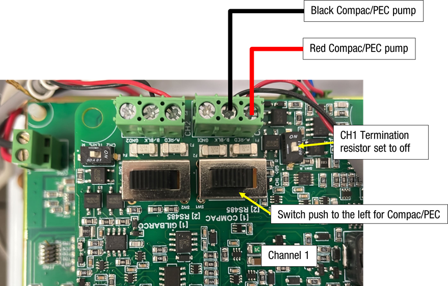

Also, you need to make sure that the Channel that you are using is switched on. When the channel is on, the led indercater will be on.

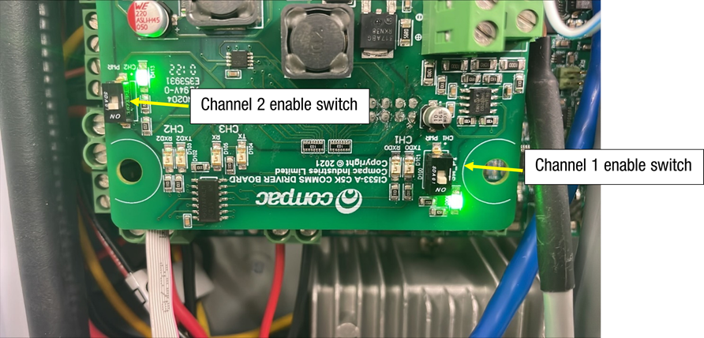

## Configuration / Setup

To set up pumps talking Gilbarco right click on the Site and the click on edit site.
Then click on the pumps tab

### Setup the pump as follows

Pump number: The number of the pump that you will select when prompted

Pump ID: This is the ID set in the pump (normally set the same as the pump number)

Channel: Compac/PEC is always on Channel 1

Pump Type: Set the Pump type “Compac12 ”,“Compac24”, “PEC12” and “PEC12\_6digit” Depending on what the Dispenser is set to

Flow timeout: This is the time in seconds after the C5000 says “Ready for delivery” before the c5000 times out and cannels the 
authorisation

Then, click the “Add” button

### Setup the Hoses

Assign the grades and the hoses on the pump

After the pump is setup in the admin tool, you have to flag the site to update the pump
Setup. 

To do this right click on the site and click “Flag status”. Then click “Update Pumps”

You then can check the events to see if the pumps have been updated

## Extra Compac/PEC settings
There are some pumps that need specific settings. 

Below is the symptom and the pump type to use. 

If you are changing a setting, you MUST reset the C5000 after making the change

Symptom|Setting to use
------|------|
The Dispenser seems to keep trying to price change or the price is displayed as $4.123 and it should be $1.234|If PEC12 change to Compac12 and if Compac12 change to PEC12
Compac dispenser. When you enter the auth $10 the pump is stopping at 10 litres because some Compac dispensers only do litres preset|Add the setting below this makes the C5000 work out the litres equivalent and sends it to the pump

|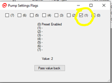

# 3-2 GILBARCO COMMS 
version V1.0 9/08/2021

## Connections

The following is the connections and switch setting for Gilbarco on the CI533A. Note that Channel 1 is free to be used as Compac or Dart

Also need to make sure that the Channel that you are using is switched on. When the channel is on the led indicator will be on.

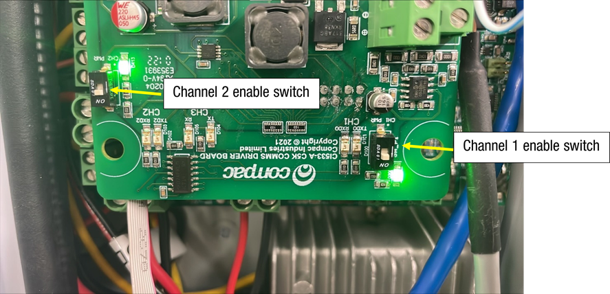

## Configuration / Setup

To set up pumps talking Gilbarco right click on the Site and the click on edit site.
Then click on the pumps tab

### Setup the pump

Pump number: The number of the pump that you will select when prompted

Pump ID: This is the ID set in the pump (normally set the same as the pump number)

Channel: Gilbarco is always on Channel 2

Pump Type: Set the Pump type “GILBARCO_V2_6D” or “GILBARCO_V2_5D” Depending on what the Dispenser is set to

Flow timeout: This is the time in seconds after the C5000 says “Ready for delivery” before the c5000 times out and cannels the authorisation

Then click the “Add” button

### Setup the Hoses
Assign the grades the hoses on the pump

After the pump is setup in the admin tool yoy have to flag the site it update the pump
Setup.to do this right click on the site and click “Flag status”. Then click “Update Pumps”

You then can check the events to see if the pumps have been updated

## Extra Gilbarco Settings

The C5000 is setup to automatically set the correct Gilbarco protocol. But sometimes the dispenser is a little different. In these cases, we have special Gilbarco protocol versions.

GILBARCO_V2_5D_Preset2D

GILBARCO_V2_5D_Preset4D

GILBARCO_V2_6D_Preset2D

GILBARCO_V2_6D_Preset4D

GILBARCO_V1_5D_Preset2D

GILBARCO_V1_5D_Preset4D

GILBARCO_V1_6D_Preset2D

GILBARCO_V1_6D_Preset4D

Compac Pumps Running Gilbarco need to be set to “GILBARCO_V1_5D_Preset2D” or “GILBARCO_V1_6D_Preset2D”
 
 
# 3-3 DART COMMS
version V1.0 09-08-2021

The following is the connections and switch setting for Dart on the CI533A Ch1 and Ch2

Also need to make sure that the Channel that you are using is switched on. When the channel is on the led indicator will be on.

## Configuration / Setup

To set up pumps talking Dart right click on the Site and the click on edit site.

Then click on the pumps tab

### Setup the pump

Pump number: The number of the pump that you will select when prompted

Pump ID: This is the ID set in the pump (normally set the same as the pump number)

Channel: The Channel that the pumps are connected to on the CI533 see above

Pump Type: set the Pump type “DRESSER WAYNE DART”

Flow timeout: This is the time in seconds after the C5000 says “Ready for delivery” before the c5000 times out and cannels the authorisation

Then click the “Add” button

### Setup the Hoses

Assign the grades to the hoses on the pump

After the pump is setup in the admin tool yoy have to flag the site it update the pump
Setup.to do this right click on the site and click “Flag status”. Then click “Update Pumps”

You then can check the events to see if the pumps have been updated

 
 

# 4 K-Factor Switch settings

A summary of the K-Factor settings can be seen below. Information on these settings and how to change them can be found on the following pages

| Setting               | Price Display                   | Litres Display                                      |
|-----------------------|---------------------------------|------------------------------------------------------|
| Dispenser settings    | **c-A** or **c-B**              | *******                                  |
| Meter ID              | **id-A** or **id-b**            | ******                                  |
| Temperature calibration| **E-A** or **E-b**             | **\*\*.\***                                         |
| Density calibration   | **d15-a** or **d15-b**          | **\*\*\*.\***                                       |
| Maximum flow          |                                 | **9A****** or **9b** ****                  |
| K-Factor              | **FA** or **Fb**                | **\*\*\*.\*\*\***                                 |
| Configuration code    | **c**                           | **\*\*\*\*\*\*\***                                  |
| Comms                 | **cc**                          | **\*\*\***                                        |
| Solenoid delay        |                                 | **SdA** *** or **Sdb** ***                    |
| Preset cutoff         |                                 | **PcA***.** or **Pcb***.**                  |
| Preset rounding       |                                 | **PrLA***.** or **PrLb***.** **PrHA***.** or **PrHb***.**|
| Flow time out         |                                 | **n-A** *** or **n-b** ***                    |
 

# Dispenser Settings

# Changing the C-A and C-b Dispenser settings

C-A and C-A are used to change the dispenser settings including the meter type, variant and minimum delivery.
To get to the C-A and C-B, press the K-Factor switch once while the dispenser is in an idle state.
The menu shown is for side A – if side B is required, continue depressing the K-Factor switch until the same menu for side B is reached and follow the same set up instructions.

**Caution:** These settings are likely to have been set correctly in the Compac factory. Only change if required. See following pages for information on these settings.

|	Setting       |Digit             |    Function                                             |
|---------------|------------------|---------------------------                                 |
|C-A or C-B     | 1st Digit        |**Minimum Measured Quantity Coefficient** – MUST be 1, 2 or 5|
|               | 2nd digit        |**Minimum Measured Quantity Exponent** – Must be a valid digit- see below
|               | 3rd digit        |**Not used**
|               | 4th digit	       |**Air Switch settings**
|               |                  |0 = Normally open – turn air switch ON for error        
|               |                  |1 = Normally closed – turn air switch OFF for error 
|               | 5th digit        |**Quantity Settings - V50 Meter only**
|               |                  |0 = Litres Compensated 
|               |                  |1 = Litres Uncompensated
|               |                  |2 = Mass (CNG only)
|               | 6th Digit        |**Variant Settings**
|               |                  |0 = Non-LPG
|               |                  |4 = AdBlue (Diesel Emissions Fluid or DEF)
|               |                  |5 = LPG
|               | 7th Digit        |**Meter settings**
|               |                  |1 = 1 Channel Encoder
|               |                  |2 = 2 Channel Encoder 
|               |                  |3 = 3 Channel Encoder
|               |                  |4 = V50 or KG100 Meter
|               |                  |5 = GPIO Meter input

## Meter Settings

This setting corresponds to the type of meter plugged in to the dispenser. Options 1-3 are for an encoder meter and depend on the channel setting of this meter. Encoder meters are used for petrol and diesel, while V50 meters (option 4) are used for LPG and AdBlue. Some settings (such as temperature and density calibration) are only available for V50 and therefore will not appear if the meter type is not set to V50.

## Variant Settings

This setting should be changed depending on the product – set the variant to 0 for liquid fuels such as petrol or diesel. Set the variant to 4 for diesel emissions fluid (AdBlue). Set the variant to 5 for LPG.

## Quantity Settings

This setting is what quantity will be shown on the main display when fuel is being dispensed. This is only valid for V50 meters and is ignored for encoder meters which always display Litres uncompensated.

## Air Settings

Air switches can be turned on or off to trigger this error, depending on this setting.

## Minimum Measurable Quantity (MMQ)

Minimum measured quantity (MMQ) is the minimum amount of fuel that can be dispensed and measured. The MMQ is calculated with the following equation:

MMQ=M x 10^n

With the value in litres. For example, if the coefficient was set to 2, and the exponent was set to 1:

MMQ=2 x 10^1=20L

So the minimum delivery would be 20 litres.

The exponent can only be certain values;

If the coefficient is 1, the exponent can be 0, 1, 2, 3 (valid values are then 1, 10, 100, 1000)

If the coefficient is 2, the exponent can be 0, 1, 2 (valid values are then 2, 20, 200)

If the coefficient is 5, the exponent can be 0, 1, 2 (valid values are then 5, 50, 500)

If either of the values entered are not valid, or the value is left as 00, the MMQ will be calculated from the maximum flow. The MMQ is the maximum flow x 0.05. For example, if the maximum flow was 40 (the default):

MMQ=40 x 0.05=2L

Note that the MMQ still must be one of the valid values listed above. If the MMQ is calculated from the maximum flow, and is NOT one of the valid values listed above, it will be rounded up to the next valid value. For example, if the maximum flow was 600:

MMQ=600 x 0.05=30L

30L is not a valid value, and therefore the MMQ would be rounded up to 50L.

The MMQ sets the display suppression. When a transaction starts, the quantity dispensed will not show until a percentage of the MMQ has been dispensed. For LPG, display suppression is 4% of the MMQ. For non-LPG operation, display suppression is 2% of the MMQ. For example, if the dispenser is in LPG mode and the MMQ is 2L:

2 x 0.04=0.08

So the quantity dispensed will not show until more than 0.08L has been dispensed.

# Changing the V50 Meter ID
All V50 Meters have a specific ID which must match the ID recored in the Dispenser settings
This is a 6 digit number which can be found written on the V50 Meter
80206 as in the image below is an example of a Meter ID 

If the IDs do not match, the Dispenser will return an error

Meter IDs ae only relevant for V50 operation. That is LPG, DEF or Adblue
This option will not appear if the Meter is not set to V50

See using the Dispenser Menus to edit these settings. Use the procedure for both Side A and Side B

# Changing the Temperature Calibration E-A and E-b

The Temperature calibration can be used to adjust the Temperature being retrieved from the meter, if this is not the actual Temperature of the product being dispensed, then the actual temperature of product being dispensed should be entered in this menu. This will be used to adjust new temperatures returned from the meter. 
See Using the Dispenser Menus to edit these settings. Use the procedure for both side A and B.

As only V50 meters return temperature readings, this option is only for V50 operation and will not appear if the meter is not set to V50

# Changing the Density Calibration dIS-A

The density calibration can be used to adjust the density being retrieved from the meter, if this is not the actual density of the product being dispensed. The actual density of product at 15 °C being dispensed should be entered in this menu. This will be used to adjust new densities returned from the meter. 
See Using the Dispenser Menus to edit these settings. Use the procedure for both side A and B.

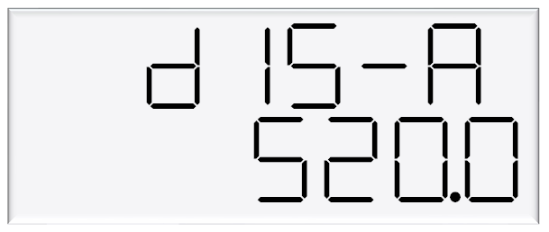

As only V50 meters return density readings, this option is only for V50 operation and will not appear if the meter is not set to V50

# Changing the Maximum Flow rate 9A and 9b

If this setting is left at 0000, the maximum flow rate, or Qmax, is 40 litres/minute by default. When changing the maximum flow, note that the high flow cutoff, low flow cutoff (LPG only), MMQ, and preset rounding are calculated from the maximum flow.
See Using the Dispenser Menus to edit these settings. Use the procedure for both side A and B.

# Changing the K factor FA and Fb

The K-Factor is used to calibrate product flow. It is a ratio of litres dispensed per revolution of the meter. The K-Factor may need to be calibrated after periods of time. 
To calibrate the pump, dispense fuel into a certified measuring container and compare the display value with the one dispensed.
Example:
The Display shows 10.00 litres but the True volume is actually 20.00 Litres

To calculate the correct K-Factor from the information above; firstly record the existing K-Factor and use this formula to calculate the new K Factor.

**New K Factor=Existing K Factor x (Dispensed Amount)/(Displayed Amount)**

=Existing K Factor x 20/10

=Existing K Factor x 2

See Using the Dispenser Menus to edit these settings. Use the procedure for both side A and B.

# Default K Factor setting

All Compac Meters have a default K Factor setting which is set at tiem of manufacture of the Compac Product that it is installed in.

This default K Factor will be very close to the final k Factor once the equipment is calibrated on site.

Default K Factors for Compac Meters used in compac equipment are as follows

|Meter model number|Default K Factor|Product|
|----------|----------|----------|
|COM50|0.6450|Petrol/Diesel|
|COM125|1.1125|Petrol/Diesel|
|COM250|2.1600|Petrol/Diesel|
|V40|1.000|Adblue DEF|
|V50|1.000|Adblue DEF|
|V50|1.000|LPG-if dispensing in Litres|
|KG80 and KG100|0.2500|CNG|

# Changing Configuration C

The Dispenser has settings for each side (as previously shown) as well as configuration settings for the entire unit.
Use the following diagram to set the unit up as desired.

|Setting       |Digit              |    Indication             |
|---------------|------------------|---------------------------|
|C              |1st digit         |**Hardware Variant**      
|               |                  |0 - Dispenser              | 
|               |                  |1 - Hybrid                 |
|               |2nd digit         |**unused**                 |
|               |3rd digit         |**unused**                 |
|               |4th digit         |**Sump**                   |
|               |                  |0-Sump                     |
|               |                  |1-Lo fuel                  |
|               |5th digit         |**Card totals & Sump**     |
|               |                  |0 - Card totals enabled    |
|               |                  |1 - Card totals disabled   |
|               |                  |2 - Sump/Lo fuel separate  |
|               |                  |3 - Card totals disabled & Sump/Lo fuel separate |
|               |                  |4 - Push to Start          |
|               |6th digit         |**Pump Mode**              |
|               |                  |0 - Retail                 |
|               |                  |1 - Commercial             |
|               |7th digit         |**Pump settings**          |
|               |                  |1 - Single                 |
|               |                  |2 - Dual                   |
|               |                  |4 - Dual 160               |
|               |                  |5 - Dual HSB               |  

## Hardware Variant
The hardware variant refers to the type of dispenser and should always be set to 0 – Dispenser for dispenser application.

## Card Totals
Card totals record the delivery totals for given cards. This is enabled by default but can be disabled if desired.

## Pump Mode
The dispenser can be switched between retail or commercial, depending on the application.

## Pump Settings
Each setting is a different configuration with different hardware. See below for descriptions of these configurations.
For all pump settings, the main display shows information on side A. Slave displays will need to be configured to show side B.

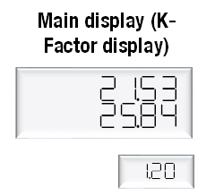

## Single Pump or Dispenser
In single mode, one outlet is used to dispense one product. The price per litre window for side B is not used. 
In this setting, only side A settings will appear in the menus.

## Dual Pump or Dispenser
In Dual mode, the dispenser or pump has two outlets which can be used separately, at the same time. Each outlet can be configured separately. Two separate products can be used. Side A supports high flow.

## Dual 160 Dispenser
In Dual 160 mode, the dispenser has two outlets, however they must dispense the same product. Either outlet can support high flow and both outlets can be used simultaneously. 
Dual 160 mode can only be used in dispenser application, and not for pump application.

## Dual HLB Pump or Dispenser
In Dual HLB mode, the dispenser or pump has two outlets which can be used separately, at the same time. Each outlet can be configured separately. Two separate products can be used. Side B supports high flow.

# Changing COMMS CC

Use the following table to setup COMMS as required.

|Setting        |Digit              |    Indication             |
|---------------|-------------------|---------------------------|
|CC             |1st digit          |**Unused**                 | 
|               |2nd digit          |**Mode**                   |
|               |                   |1 = 5 digit                |
|               |                   |0 = 6 digit                |
|               |3rd digit          |**Channel**                |
|               |                   |0                          |
|               |                   |1 = default channel        |
|               |                   |2                          |
|               |4th digit          |**Pump Protocol**          |
|               |                   |0 = Disabled               |
|               |                   |1 = Compac                 |
|               |                   |2 = PEC                    |
|               |                   |3 = Gilbarco               |                               

Change the Protocol and the mode to match the controller’s settings. Channel 1 is the default channel for dispensers (channel number should always match the with the comms board terminal block used).
E.g. CC = 0113  Gilbarco on Channel 1, 5 Digit mode

 # Changing the Display Decimal Points

In some countries, the decimal place needs to be configured because of the currency in that country.

Setting **dP A/B** allows you to configure the decimal place for each of the values on the LCD display:
- **Amount** (e.g., $)
- **Quantity** (e.g., litres)
- **Amount/Quantity** (e.g., $ / Litre)

The decimal place setting is after the communications setting on the **K-Factor button**.
Settings are from left to right (1st setting is on the left):

|Setting|Digit      |Indication               |
|-------|-----------|-------------------------|
|dP A   |1st digit  |**Decimal Point options**|
|       |           |1 = Match price and amount DP config to pump comms (controller)
|       |           |2 = Don't match price and amount DP to pump comms. Allow Amount DP to dynamically shift to 0dp
|       |2nd digit  |**Amount ($ or other currency) Decimal place**|
|       |           |0 = Default (2dp)        |
|       |           |1 = 1dp                  | 
|       |           |2 = 2dp (default)        |
|       |           |9 = 0dp                  |
|       |3rd digit  |**Quantity (litres or other unit of measure) Decimal place**|
|       |           |0 = Default (2dp)        |
|       |           |1 = 1dp                  | 
|       |           |2 = 2dp (default)        |
|       |           |9 = 0dp                  |
|       |4th digit  |**Amount / Quantity ($ per litre or other units) Decimal place**|
|       |           |0 = Default (2dp)        |
|       |           |1 = 1dp                  | 
|       |           |2 = 2dp (default)        |
|       |           |9 = 0dp                  |

### Example
If **dP A** is set to `1921`, the display will appear as:
- `000000` → Amount ($) = 0dp
- `0000.00` → Quantity (Litres) = 2dp
- `000.0` → Amount/Quantity ($/litre) = 1dp

This setup is used in **Vanuatu**. 

# Changing the Solenoid Delay SdA

Pumps have two solenoids for product flow. If the solenoids are unavailable, the pump preset should also be unavailable.   
The solenoid delay is the time between when the motor starts, and when the solenoids start at the beginning of a transaction.  
The value entered is in seconds. 

See Using the Dispenser Menus to edit these settings. Use the procedure for both side A and B.

# Changing the Preset cutoff

Preset cutoff is used to deliver an accurate amount of fuel.  
When dispensing fuel, two solenoids are used for fuel flow.  
When the dispensed amount of product reaches the preset cutoff, one solenoid is turned off to slow delivery rate and dispense an accurate volume of product.
The entered value should be in litres – for example, if 1.50 is entered, and the preset is 10, the primary solenoid will cut off once 8.5 litres have been dispensed.

See Using the Dispenser Menus to edit these settings. Use the procedure for both side A and B.

# Changing the Preset Rounding

The dispensed amount of fuel can be rounded to the preset if within the preset rounding parameters.  
If the preset rounding is left as zero, the preset rounding will be calculated from the MMQ. 
In LPG mode, 2% of the MMQ will be used for preset rounding.  
In non-LPG mode, 1% of the MMQ will be used for preset rounding.  
For example, if the dispenser is in LPG mode and the MMQ is 2L:

2 x 0.02=0.04

Therefore, if the dispensed value is within 0.04L of the preset, it will be rounded to the preset.
A high and low amount can be entered, which will be used to round the preset.  
The measurement is in litres. For example, if .80 was entered for the low amount, and the preset was 40L:
39.20 is within .80 of 40 and would therefore be rounded up to 40. 

If 2.00 was entered for the high amount, and the preset was 40L:
42.00 is within 2 of 40 and would therefore be rounded down to 40.
See Using the Dispenser Menus to edit these settings. Use the procedure for both side A and B.

Changing the Preset Rounding
The dispensed amount of fuel can be rounded to the preset if within the preset rounding parameters. If the preset rounding is left as zero, the preset rounding will be calculated from the MMQ. In LPG mode, 2% of the MMQ will be used for preset rounding. In non-LPG mode, 1% of the MMQ will be used for preset rounding. For example, if the dispenser is in LPG mode and the MMQ is 2L:

2 x 0.02=0.04

Therefore, if the dispensed value is within 0.04L of the preset, it will be rounded to the preset.
A high and low amount can be entered, which will be used to round the preset. The measurement is in litres. For example, if .80 was entered for the low amount, and the preset was 40L:
39.20 is within .80 of 40 and would therefore be rounded up to 40. 

If 2.00 was entered for the high amount, and the preset was 40L:
42.00 is within 2 of 40 and would therefore be rounded down to 40.  
See Using the Dispenser Menus to edit these settings.  
Use the procedure for both side A and B.

# Changing the Flow Time Out
The flow time out is the amount of time it takes for the transaction to time out after flow stops, if the nozzle is not hung up.  
The default depends on the dispenser mode.  
If the dispenser is in LPG mode, the default time out will be 10 seconds.  
In non-LPG mode, the default time out will be 20 seconds.

If a different value is desired, enter this value in the menu below, in seconds.  
The maximum flow time out is 120 seconds.  
If a value above 120 seconds is entered, the flow time out will stay as 120 seconds. 

See Using the Dispenser Menus to edit these settings. Use the procedure for both side A and B.

# 5 Parameter Switch Settings
The following table summarises the parameter switch settings.  
Information on these settings and how to change them can be found on the following pages.
NOTE: The configuration settings must be set before parameter settings can be accessed.

|Setting             |Price Display 	  |Litres Display       |
|--------------------|------------------|---------------------| 
|Software Version    |P**.**. **  	    |P**.**. **           |
|Pump Number  	     |                  |PnA *** or PnB ***   |
|Price               |                  |PA**.*** or Pb**.*** |
|Pump Settings       |	                |ba **** or bb ****   |
|High Preset cut off |                  |HCA** or HCb**       |
|High-flow cut off	 |                  |HFA***               |
|Low-flow cut off    |                  |LFA***               |
|b Setting           |                  |b****                |
|Slave display       |                  |d5 ****              |
|Custom display      |                  |dc ****              |
|Last Sale           |**.**             |A***.* or b***.*     |
|Electronic Totes    |LA **** or dA**** |L****.**             |
|                    |Lb **** or db****	|d****.**             |

# Using the Dispenser Menus
When changing settings on the dispenser, pressing the Parameter switch in quick succession cycles between the options available.  
The location of this switch can be found on page 7.  
Each press of the button will cycle between the digits. When going through the menus, each menu will cycle through the digits twice for ease of operation.  
When a digit is flashing, hold down the relevant switch to increment this digit.  
Release the switch on the desired value.
The system timeout is 10 seconds.

# How to view the Software Version

Pressing the parameter switch once will show the software version. 

The dispenser will then run through a segment test.

# Changing the Pump Number
If the parameter switch is continually depressed, the following menu to change the pump number will appear. Each side must be numbered between 1-99.

NOTE: Entering a pump number 0 will disable the pump.

See Using the Dispenser Menus to edit these settings. Use the procedure for both side A and B.

# Changing the Price

The price must be set before the dispenser can be used, otherwise an error will be returned.  
Set the price in dollars per litre.  
See Using the Dispenser Menus to edit these settings. Use the procedure for both side A and B.

# Changing the Pump settings

The pump can have different modes, which can be set using the table diagram below.  
See below for information on these modes.  
See Using the Dispenser Menus to edit these settings.  
Use the procedure for both side A and B. If the dispenser is in multi product mode (see page 17) there are only settings for side A, which will apply to the whole unit.

|Setting|Digit      |Indication                    |
|-------|-----------|------------------------------|
|bA     |1st digit  |**Pump Settings**             |
|       |           |0 = Authorisation Mode        |
|       |           |1 = Standalone Mode           |
|       |2nd digit  |**Preset Setting**            |
|       |           |0 = Preset in dollars         |
|       |           |1 = Preset in litres          |
|       |           |2 = Switchable                |
|       |           |4 = Forced Preset in Dollars  | 
|       |           |5 = Forced Preset in Litres   |
|       |           |6 = Forced Preset, switchable |
|       |3rd digit  |**Not used**                  |
|       |4th digit  |**Dispenser Modes**           |
|       |           |0 = Standard Mode             |
|       |           |1 = Purge Mode                |
|       |           |8 = Auto-Authorisation             |

# Changing the High Preset Cut
The settings HCA and HCB are used in high flow applications as an extra flow control.  
This setting is the number of litres before the preset that the output will switch off.  
It is used when extra high flow control is needed.  
The PCA and the PCB settings have a maximum setting, up to 9.99 litres, where-as the HCA and HCB can be set to a maximum of 99 litres.
In the MR400S, it is used to control the 2” extra High flow valve but this setting could also be used to control an extra high flow valve in a Volume Register application.  
In an MR400S dispenser, HCA is normally set to 20.

*Note: To use the HCA (high cut),it is also necessary to short the pins together on plug H/L A (or H/L B) on the k-factor board*

# Pump settings on Parameter switch explained

## Standard Mode

In standard mode, the main display will show:

Top row: Transaction total in dollars

Second row: Compensated litres for LPG, or uncompensated litres for non-LPG, dispensed by default, but can be changed in Dispenser Settings

The unit price window will display the price per litre.

## Purge Mode

Test mode can be used for all calibrated runs with the exception of vapour tests.  
When in purge mode, the following is displayed on the main display:

Top row: Purge

Second row: Uncompensated litres dispensed

If the meter setting is set to V50 meter, the unit price window will alternate between showing temperature and density at 15 °C.  
If the density is outside of the compensation range, then the observed density will be displayed.  
This information is obtained from the V50 meter.

If the meter settings are set to encoder meter, the unit price display will show flowrate.

In purge mode, all display suppression is turned off.

## Preset Options

A preset in dollars or litres can be set. Before a transaction, type in a desired preset value.  
There are three options for setting a preset:

Dollars – the preset will be shown in the top row of the main display

Litres – the preset will be shown in the bottom row of the main display

Switchable – The preset can be switched between dollars and litres by holding ‘#’ for three seconds when not in a transaction.

The above three options can be set up to be either Optional Preset or Forced Preset

Presets can still be entered during a transaction, as long as flow has not started.  
Enter a preset by using the keypad.  
Pressing # will clear a preset. As soon as flow starts, the preset can not be changed, however, pressing the # key during the transaction will display the preset amount. 

Pressing # after a transaction will recall the last preset. This will then be used for the next transaction, if it is displayed when the nozzle is picked up. This is useful for multiple transactions in a row requiring the same preset.

Presets entered must be larger than the MMQ. If the MMQ is large, when entering a preset after lifting the nozzle, the MMQ will automatically show up.  
Continue entering the desired preset to override this.  
If entering a preset before lifting the nozzle, and a value below the MMQ is entered, an error code will be returned.

# Changing the Low-flow Cutoff
A flow range is needed for each pump to dispense an accurate amount of product.  
If too much or too little fuel is dispensed, the meter can not accurately measure the dispensed fuel and therefore should cut off and display an end of sale message.  
The low-flow cutoff will end the transaction (without an error code) if flow drops below this value.  
In LPG operation, the default value for the low flow cutoff is 0.1x the maximum flow. For example, if the maximum flow was 40L/min (the default):

LF=0.1 x 40=4L/min

If a custom value is desired, enter the value in this menu in litres.  
In non-LPG mode, the low-flow cutoff only applies if a custom value is entered.  
See Using the Dispenser Menus to edit these settings. Use the procedure for both side A and B.

# Changing the High-flow Cutoff

The high-flow cutoff will stop transactions if the flowrate exceeds this value, and will return an error.  
For LPG operation the default value for the high flow cutoff is 1.5x the maximum flow. For example, if the maximum flow was 40L/min (the default):

HF=1.5 x 40=60L/min

If a custom value is desired, enter the value in this menu in litres.  
In non-LPG mode, the high-flow cutoff only applies if a custom value is entered.
See Using the Dispenser Menus to edit these settings. Use the procedure for both side A and B.

# Changing the b setting

The b setting is currently only used for LCD dimming. Set the b configuration code as desired.

|Setting|Digit      |Indication                    |
|-------|-----------|------------------------------|
|b      |1st digit  |**not used**                  |
|       |2nd digit  |**LCD Dimming**               |
|       |           |0 = Disabled                  |
|       |           |1 = Enabled                   |
|       |3rd digit  |**not used**                  |
|       |4th digit  |**not used**                  |

# Changing the Slave Display Configuration

Slave displays can be configured as, a clone of the main display, to show side A, or to show side B.  
Otherwise, it can be disabled. Slave display configuration is a two-step process.
1.	Change **ds** setting to assign a side to the slave display 
2.	Assign the correct number to the slave display by changing the slave display board dip switches. 

|Setting|Digit      |Indication                    |
|-------|-----------|------------------------------|
|dS     |1st digit  |**Slave display 4**           | 
|       |           |0 = Disabled                  |
|       |           |1 = Clone                     |
|       |           |2 = Side A                    |
|       |           |3 = Side B                    |
|dS     |2nd digit  |**Slave display 3**           | 
|       |           |0 = Disabled                  |
|       |           |1 = Clone                     |
|       |           |2 = Side A                    |
|       |           |3 = Side B                    |
|dS     |3rd digit  |**Slave display 2**           | 
|       |           |0 = Disabled                  |
|       |           |1 = Clone                     |
|       |           |2 = Side A                    |
|       |           |3 = Side B                    |
|dS     |4th digit  |**Slave display 1**           | 
|       |           |0 = Disabled                  |
|       |           |1 = Clone                     |
|       |           |2 = Side A                    |
|       |           |3 = Side B                    |

The first digit from the left correlates to slave display 1, and so on. 
In this example,  
Slave display 1 = clone  
Slave display 2 = disabled  
Slave display 3 = side A  
Slave display 4 - side B.

*Note: Each digit can have 4 different values, each value has a different meaning.*

# Assigning a number to slave display 

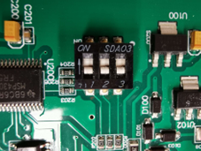

|Slave Display   |Switch 1      |Switch 2   |Switch 3|
|----------------|--------------|-----------|--------|
|1               |OFF           |OFF        |OFF     |
|2               |OFF           |OFF        |ON      |
|3               |OFF           |ON         |OFF     |
|4               |OFF           |ON         |ON      |    

# Changing the Custom Display Configuration

The custom display configuration can be used to show additional information on the unit price display.  
The additional information that can be shown includes the density, temperature, flowrate, and reset batch.  
This can be configured with the dc setting. Each digit corresponds to a custom display option.  
Setting a digit to 1, as opposed to 0, enables the custom display. The digits represent the following options:

|Digit| Function |
|----------------|--------------|
|1 |Reset Batch|
|2 |Temperature Display|
|3 |Density Display|
|4 |Flowrate display|

For example: The following code would enable temperature and flowrate to be shown on the custom display

# How to view the Last Sale

To view the last sale details, continue pressing the parameter switch until the following display is shown.  
This will only show up if the dispenser is in V50 mode.

The top row will show uncompensated, unsuppressed quantity dispensed in litres, while the bottom row will show the density reading at 15°C.  
The unit price display will show the temperature reading at the end of the sale.  
The left most character of the density reading indicates the nozzle side.  
There is a reading for side A and B.  
Last sale is useful for the calibration of LPG where the dispenser is set to compensated mode, but the uncompensated quantity is required

# How to view Electronic Totes

The dispenser records electronic totes for price and dollars.  
To view the electronic totes, continue pressing the parameter switch until the following display is shown:

The bottom row is a continuation of the top row.
For example, the above display should be read as 00310556.61.  
The side (A or B) will be shown in the unit price display.  
Dollars totals are also recorded, which can be viewed by continually pressing the parameter switch.

The electronic totes can also be viewed by pressing the # key five times on the main display, as long as the unit is not in a transaction.  
Each tote will be shown for ten seconds before the next tote is displayed.  
**NOTE:** Electronic totes and mechanical totes are disabled in purge mode.

# Enabling Amount or Quantity Preset

## Enable from CompacOnline Admin tool
Follow these steps:  

|Step number |Instruction|  
|------|------|
|1|In Pump settings, select Edit pump and click on Build Byte Array|
|2|Ensure 0 is selected to enable Preset|  
|3|Click on Pass value back and close the Edit page|
|4|Flag the site to update the pump settings|

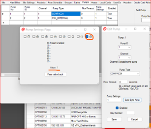

## Changing presets between Amount and Quantity
This can be achieved in two ways: 
1.	Using the Pinpad on the COM5
2.	Through Parameter settings on K-Factor board

Using the Pinpad on the COM5 to configure Preset 

|Step number |Instruction|  
|------|------|
|1|Press Cancel button and enter Passcode|
|2|On the Main Menu, Select 3. Pumps|
|3|On the Pumps menu, Select 1. Side A (or select corresponding pump)
|4|Side A Config 1 – Press # key for next screen|
|5|Side A Config 2 – Select 3. Preset
|6|Preset Config – Select 2. To cycle between Amount; Quantity or Switch

Parameter Settings on K-Factor board – navigate to Pump Settings
-	Change preset setting 0 or 1

## Changes to Prompts displayed
When changing between Amount or Quantity, the prompt display will be updated accordingly.

|Digit| Function |
|----------------|--------------|
|1|**Pump settings**|
| |0 = Authorisation Mode|
| |1 = Standalone Mode|
|2|**Preset setting**|
| |0 = Preset in dollars|
| |1 = Preset in litres|
| |2 = Switchable between dollars and litres preset|
| |4 = Forced Preset in dollars|
| |5 = Forced Preset in litres|
| |6 = Forced Preset which is switchable between dollars and litres|
|3|**Unused**|
|4|**Dispenser Modes**|
| |0 = Standard Mode
| |1 = Purge Mode|
| |8 = Auto-authorise|

Setting the Preset to Amount:

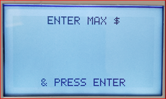

Setting the Preset to Quantity:

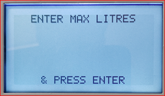
 
# Preset Board DIP Switch settings

Use the diagram below to to determine which layout applies and set the dipswitch accordingly on the Preset board.

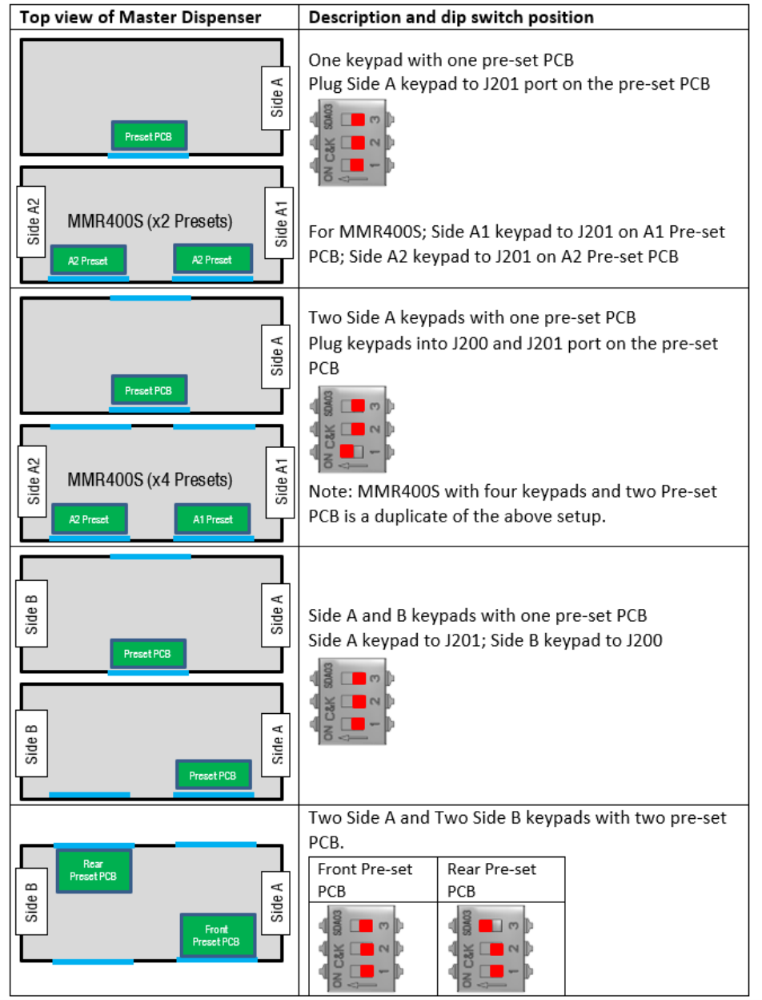

# GPIO Board applications

## GPIO K Factor settings  
The GPIO settings in the K factor board is where you set the GPIO specific settings.  
This table is common to all GPIO board applicaions 
The below table shows details of all the options available for each setting. 

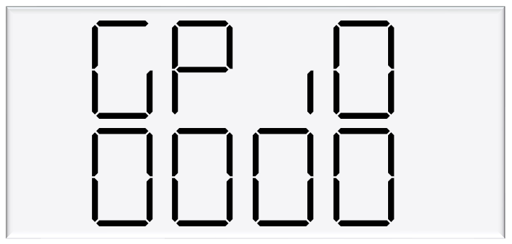

|Digit             |    Function                      |
|------------------|----------------------------------|
|1st Digit         |**Duty Cycle Setting**            |
|                  |0 = 50%                           |
|                  |1 = 10%                           |
|                  |2 = 20%                           |  
|                  |3 = 30%                           |
|                  |4 = 40%                           |
|                  |5 = 50%                           |
|                  |6 = 60%                           |
|                  |7 = 70%                           |
|                  |8 = 80%                           |
|                  |9 = 90%                           |
|2nd Digit         |**Input settings Pulse frequency**|
|                  |0 = 1Khz                          |
|                  |1 = 100Hz                         |
|                  |2 = 200Hz                         |
|                  |3 = 300Hz                         |
|                  |4 = 400Hz                         |
|                  |5 = 500Hz                         |
|                  |6 = 600Hz                         |
|                  |7 = 700Hz                         |
|                  |8 = 800Hz                         |
|                  |9 = 900Hz                         |
|                  |A = 1KHz                          |
|                  |b = 1.1KHz                        |
|                  |c = 1.2KHz                        |
|                  |d = 1.3KHz                        |
|3rd Digit         |**Output settings**               |
|                  |0 = 0 Off                         |
|                  |1 = Volume (Litres/KGs)           |
|                  |2 = Amount (Dollars)              |
|4th Digit         |**Input settings**                |
|                  |0 = 0 Off                         |
|                  |1 = 1 Channel Encoder             |
|                  |2 = 2 Channel Encoder             |
|                  |3 = 3 Channel Encoder             |
|                  |4 = Switch Input                  |  
# 1 GPIO board set up for Pulse Input from a Flow Meter 

Overview 
The Pulse input is designed to interface the Compac dispenser to a third party meter.  
The Pulse input can be up to 35 VDC.  
There are 2 settings that need to be set to enable the C5000 for third party meter input.  
The first is in the CA/CB setting. CA/CB needs to be set to CA XXXXXX5.  
The Pulse input can be configured for the following meter types:  
Type 1 - Single channel  
Type 2 - Two channel quadrature  
Type 3 - Three channel
 

## CA/CB Setting for third party input
To tell the C5000 to read meter pulses from the GPIO board, set the last (7th) digit on the right of CA/CB to 5.  
This digit disables the meter input on the K Factor board and tells the C5000 to read pulses from the GPIO board

|	Setting       |Digit             |    Function                                             |
|---------------|------------------|---------------------------                                 |
|C-A or C-B     | 1st Digit        |**Minimum Measured Quantity Coefficient** – MUST be 1, 2 or 5|
|               | 2nd digit        |**Minimum Measured Quantity Exponent** – Must be a valid digit- see below
|               | 3rd digit        |**Not used**
|               | 4th digit	       |**Air Switch settings**
|               |                  |0 = Normally open – turn air switch ON for error        
|               |                  |1 = Normally closed – turn air switch OFF for error 
|               | 5th digit        |**Quantity Settings - V50 Meter only**
|               |                  |0 = Litres Compensated 
|               |                  |1 = Litres Uncompensated
|               |                  |2 = Mass (CNG only)
|               | 6th Digit        |**Variant Settings**
|               |                  |0 = Non-LPG
|               |                  |4 = AdBlue (Diesel Emissions Fluid or DEF)
|               |                  |5 = LPG
|               | 7th Digit        |**Meter settings**
|               |                  |1 = 1 Channel Encoder
|               |                  |2 = 2 Channel Encoder 
|               |                  |3 = 3 Channel Encoder
|               |                  |4 = V50 or KG100 Meter
|               |                  |5 = GPIO Meter input

## Third Party Meter wiring

There are different types of meters with different numbers of channels. The below is the meter type and how to wire them to the GPIO Board.

### Single Channel Reed Switch Meter
When connecting to a reed switch type meter you connect the GPIO 5-volt to the reed switch and then all 3 inputs to the other terminal on the meter.

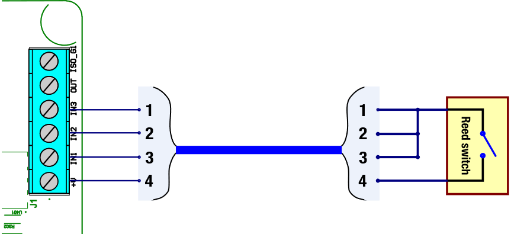

 
 

### 12 Volt Two Channel Meter
The two Channel 12 volt meter is not powered from the GPIO Board.  
Instead it is powered by its own power supply. Depending on the meter, pullup resistors may need to be added

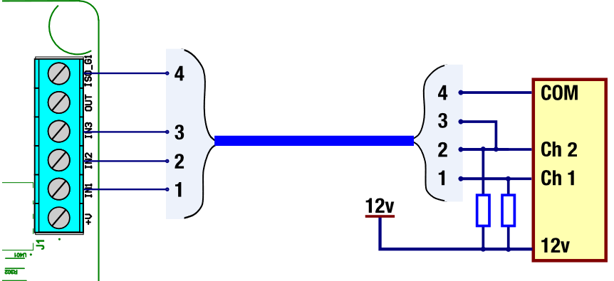

 
 

### 5 volt Two Channel Meter 
The 2 channel 5 volt meter is powered from the GPIO board.  
This means that the meter doesn’t need power from an external source.  
Depending on the meter, pullup resistors may need to be added.  
For 5 volts the pull up resister should be 820Ω

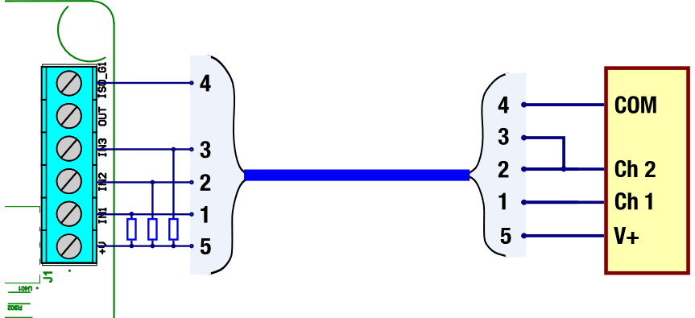

 
 

# 2 GPIO board set up in Input Switch mode

Overview 
The “Nozzle“ input is to act as a control allow or not allow the dispenser to be started.  
It is as if there is a switch in series with the real nozzle switch. with means that both nozzles need to be made for the dispenser to start.

## Input Switch setting

The setting on the K Factor board to enable the “nozzle Switch“ is GPIO XXX4.  That is, the 4th digit = 4 
When the switch input is enabled, the dispenser will not start a transaction until the GPIO nozzle input is high and the nozzle input on the k factor board is high (lifted) as well.  
Note that if the nozzle is lifted on the K-factor board and the GPIO Nozzle input is low (not shorted) the Diag LED on the K factor board won’t flash. In saying that if you want to troubleshoot the nozzle without the GPIO nozzle input you can disable the switch input by setting the GPIO setting to GPIO XXX0.

## Input Switch wiring

The GPIO nozzle input is wired in to the GPIO board in the flameproof box. The below figure shows the GPIO board and the location of the connectors

Side A connector is labelled J1
Side B connector is labelled J2

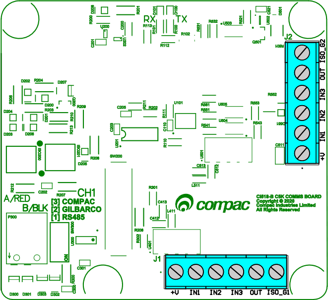

There are different ways to connect the GPIO Nozzle input to an external device and the specific way will depend on the application 

### Relay Switch wiring

In this application an external relay is used to enable the GPIO nozzle input.  
5 volts from the +V is fed into the relay and the output of the relay feeds back into the GPIO board via the IN1 terminal as shown below.  
This means that when the relay is energized the GPIO is pulled high enabling the nozzle.  
Use a relay means you can use any voltage AC or DC you just have to source the correct relay for your application  

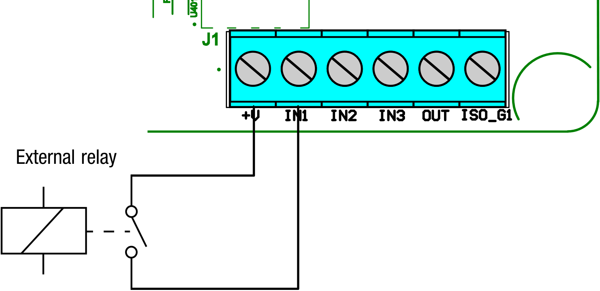

 
 

## External DC Voltage
In this application, an external DC voltage is applied to enable the GPIO nozzle input.  
This DC voltage can be between 3 to 50 volts DC.  
The ISO_G1 is connected to the Ground connection of the DC voltage source and the Positive side is connected to IN1.

Note that in the figure below the DC voltage sauce can be from a control system i.e. PLC

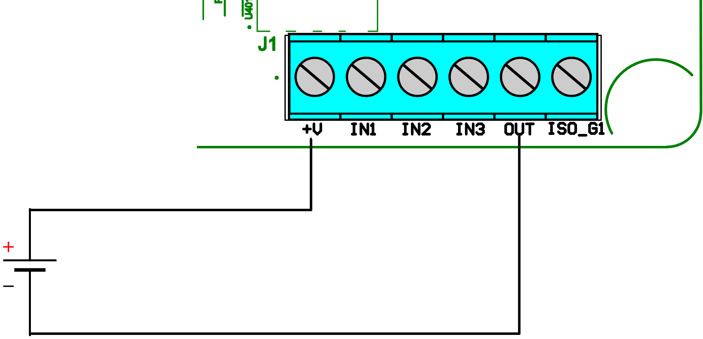

 
 

# 3 GPIO board set up in Pulse Output mode

Overview 
The Pulse output is designed to interface the Compac dispenser to a 3 party Controller/POS without the need to talk a communication protocol.  
The Pulse output has the following parameters that can be changed  
•	Frequency  
•	Duty Cycle  
•	Output pulses for volume or amount  
•	The Value of a pulse

## Output 
The output setting enables the GPIO board to output pulses. It also sets whether the output pulses are representing volume(litre/Kg’s) or amount(dollars). Majority of applications will set the pulses to represent volume
Note you cannot have meter input enabled at the same time.

## Frequency 
The Frequency output setting sets the maximum speed of the output pulses.  
The Default setting of 0 sets the frequency to 1KHz.  
This setting combined with the Value per pulse setting sets the maximum flow rate of the dispenser.  
For example  
Frequency set to 1KHz (1000 pulses/sec)  
Pulses per value are set to 00001 (10ml/pulse)  
That means the maximum flow rate the dispenser can do before the output pulses lag behind is 
maximum flow=maxium frequency × pulses per value 
maximum flow=1000Hz × 10ml 
maximum flow=10000 ml per second
maximum flow=600 l per minute

The default setting of 1KHz should be sufficient for most applications.  
In applications where the maximum flow rate is lower and the 3rd party controller is only able to read pulses at a lower frequency then a lower frequency output can be selected.  
Note that if the flow rate exceeds the maximum pulse output the next transaction will not be allowed until the pulses have completed being outputted.  

## Duty Cycle

The duty cycle setting gives the ability to set the percentage of the pulse high and low.  
The default setting is 50%. The pulse length is determined by the following formula.  
For example  
If the Duty cycle is set to 50% and the Frequency is set to 1KHz (1000 pulses/sec)  
Duty Cycle=Pulse Width (sec)×Frequency (Hz)×100
50= Pulse Width (sec)  ×1000×100 
50/100=Pulse Width (sec)  ×1000
0.5/1000=Pulse Width (sec)  
500 microseconds=Pulse Width (sec)
The Default setting of 50% should be sufficient for most applications.

## Pulse value
The pulse value setting sets what a pulse is worth.  
When the output is set to volume the lowest volume a pulse can be set to is 00001 which is 0.1 ml.  
If the output is set to amount the lowest amount a pulse can be set to is 00001 which is 0.0001 dollars.  
The most common setting for most applications would be 00100 or a factor of 10.  
Any other setting would cause an error with rounding. 

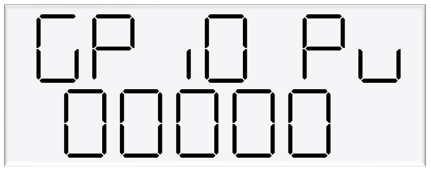

# Commissioning

# Electrical

This procedure outlines how to perform an electrical operational test, making sure that the dispenser is functioning correctly. Check for any damage that may have occurred in transit. Check all terminals, plugs, and chips to make sure that they are securely in place. 

*NOTE: Damage to electronics occurs most commonly from vibration and jarring.* 

Before beginning this test, check that fuel has **not** been applied to the dispenser. The factory set-up information should be programmed into the dispenser, but all K-factor and Parameter switch settings should be checked and confirmed before commissioning tests are carried out.

Check that pump number is set 

Check the pump price is set 

To perform an electrical operational test:
1.	Make sure that the inlet shut-off valves are closed (these are the valves in the inlet lines at the base of the dispenser, but they are not part of the dispenser).
2.	Turn on the power supply to the dispenser. 
3.	With the dispenser in a ready state, check that the C5000 processor board Power LED is turned on. 

*NOTE: If the dispenser is receiving information, RD LED on the K-Factor board will be on. If the dispenser responds to polls for its respective pump number/s, TD LED will also be on.*

4.	Lift the nozzle. The display will show 888888 and the solenoids will energise, starting the pump motor. Check that T1-3 (side A) or T4-6 (side B) turn on, indicating a signal is being sent to the triacs to open the solenoid valves.
5.	The diagnostic LED (K-factor board) flashes quickly when the start button is pushed, or the nozzle removed from the holster to initiate a fill. When the button is released or nozzle returned to the holster it will return to the normal state and flash slowly.
6.	Verify solenoid operation by listening for a click, or by using a screwdriver tip or some other metallic tool to check for a magnetic field present on the solenoid coils.

# Mechanical
The following mechanical commissioning instructions are for liquid fuel pumps and dispensers. If LPG, CNG, or AdBlue is being dispensed, refer to the specific manuals for these.
Make sure that the electrical commissioning tests have been carried out and the solenoid operation has been verified before carrying out the following tests.
Ensure the power supply to the dispenser is turned on, and lift the nozzle. Check all the dispenser fittings, solenoids and pipework for leaks.
Check all bungs have been removed.
Perform test transactions to ensure flow rate is within acceptable ranges and the dispenser is correctly measuring fuel.
If a preset is required, perform test transactions with presets and ensure they are working correctly.
Calibrate the unit with the K-Factor

# LED Diagnostics

LEDs on the circuit boards can be used to diagnose faults in the unit.  
View the LEDs and their corresponding tables to see the state of the board.

Note These instructions apply to the CI501 Comms interface board which is fitted to standard Pumps and Dispensers
There is also a CI533 Comms board which is used in the PT1 Payment Terminal, Comfill and Fillmaster 
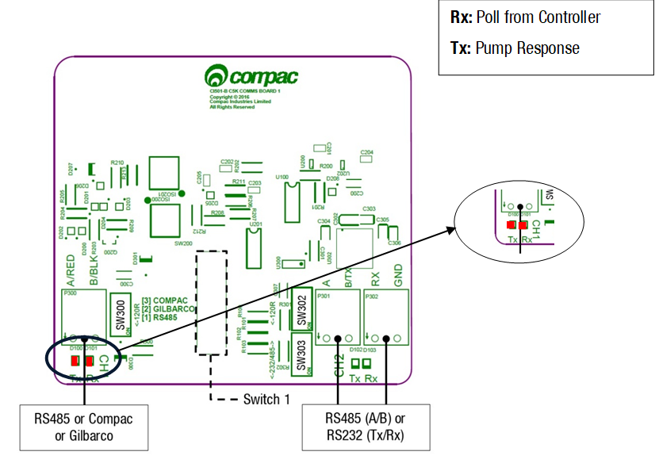

Comms board CI501 LEDs       |Operation/Possible Cause| 
|-----------------------------|------------------------|
Tx and Rx|Er41, Er 41 or Error 41 means that there is a communication problem between the Pump and the Controller. You can get more detail on what is causing the problem by looking at the two diagnostic LEDs on Comms channel 1 (CH1).  These are labelled Tx and Rx and are located next to Comms Terminals P300. These are used for both Compac and Gilbarco communications but work differently when there is a fault.  
**Compac comms**|Rx = Poll from the Controller Tx = Pump Response.    When working normally, both Rx and Tx LEDs flash If more than one pump is connected, Rx will flash for the number of pumps connected between each Tx flash. For example, if there are three pumps connected, Rx should flash 3 times for each Tx flash (on the pump that you are working on.)
**Compac comms faults**|1.	Neither Tx nor Rx are flashing:The Controller is either not working or there is no comms connection between and the Controller and the Pumps.   2.	Rx flashes but Tx is not flashing:Controller is polling the pump but the pump is not responding due to a fault or configuration issue eg. No pump number set.   3.	Rx stuck hard on faintly blinking:Comms cable *Tx and Rx wires are reversed - Reverse the comms wire connections.*
**Gilbarco comms**|Rx = Poll from the Controller   Tx = Pump Response   When working normally, both Rx and Tx LEDs flash   *Note: for Gilbarco comms, Tx and Rx flash very fast*  
**Gilbarco comms faults**|1.	Rx stuck hard on - Tx off and not flashing:   *The Controller is either not working or there is no comms connection between the Controller and the Pumps   The Controller is polling the pump but the pump is not responding due to a fault or configuration issue   Comms cable Tx and Rx wires are reversed - Reverse the comms wire connections.*
 
 

# C5K Processor Board

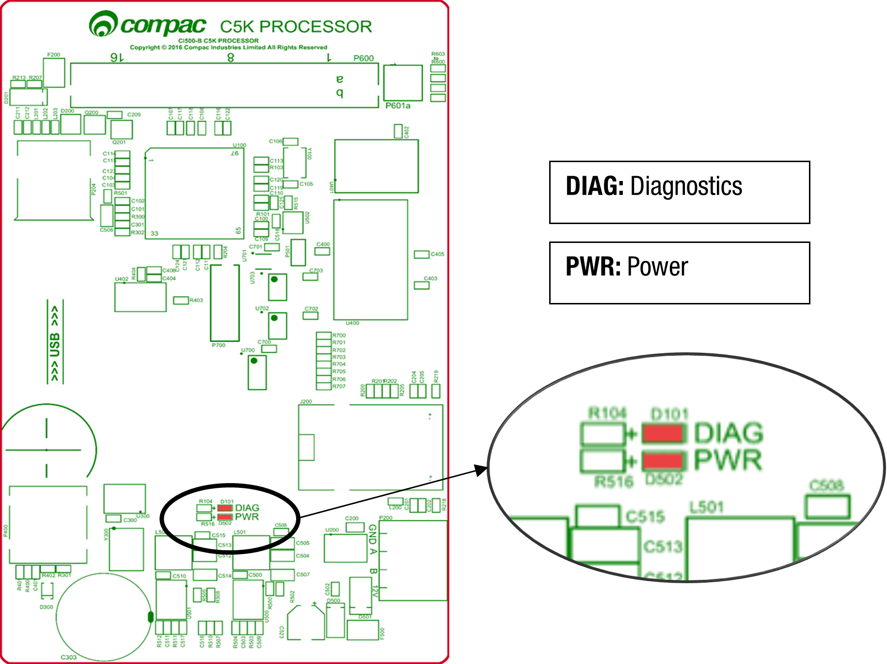

Processor board LEDs       |Operation/Possible Cause| 
|-----------------------------|------------------------|
**Power**|This should be on when there is power to the unit.
**Diagnostics**| This LED shows whether the firmware is running for the board. If it is off, the firmware is not running, and if it is on, the firmware is running.   Upon start up this LED will flash, indicating that the firmware is loading.   The flashing may last up to a minute before it stabilises to being constantly on.   If the flashing lasts longer, the board is in bootloader mode – this means that the firmware has crashed or not loaded correctly.

 

# K Factor board

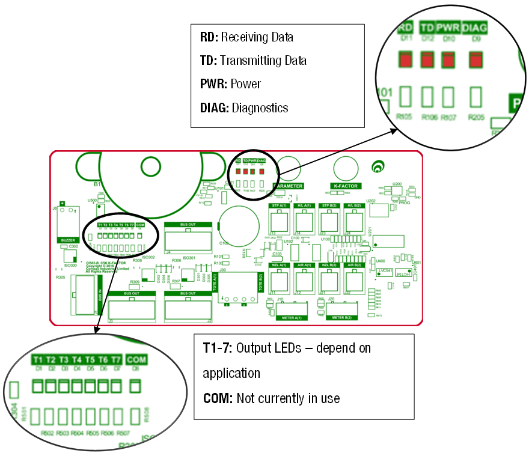

K Factor board LEDs       |Operation/Possible Cause| 
|-----------------------------|------------------------|
**Power**|This should be on when there is power to the unit.
**Diagnostics**|In normal operation, this should flash slowly, then flash quickly when the nozzle switch is lifted.
**Triac Output LEDs (T1-7)**| These LEDs correspond to side A and B motors and solenoids.    They will light up according to the hardware they represent.   See the following table for the output LEDs for each application.
**Receiving data/ Transmitting data**| In normal operation, these should be on when the Diagnostics light is on, and off when the diagnostics light is off.   If the diagnostics light is on, and the TD/RD LEDs are off, this means these is an error. This could be due to cabling – check the bus system cables.

# K Factor Board Output LEDs

The following table describes what each output LED represents for each mode. The output LED will light up when the corresponding outlet is engaged. Outputs for both side A and B are shown.

|Mode      |T1     |T2                |T3                  |T4         |T5                |T6                  |T7         |
|----------|-------|------------------|--------------------|-----------|------------------|--------------------|-----------|
|Single    |Motor A|Primary Solenoid A|Secondary Solenoid A|High flow A|Not used          |Not used            |High FLow A| 
|Dual      |Motor A|Primary Solenoid A|Secondary Solenoid A|Motor B    |Primary Solenoid B|Secondary Solenoid B|High FLow A| 
|Dual 160  |Motor A|Primary Solenoid A|Secondary Solenoid A|High flow B|Primary Solenoid B|Secondary Solenoid B|High FLow A|
|Dual HLB  |Motor A|Primary Solenoid A|Secondary Solenoid A|Motor B    |Primary Solenoid B|Secondary Solenoid B|High FLow B|

  

# Troubleshooting Guide 

# Electrical problems

|Symptom              | Possible  Cause                                         | 
|---------------------|-----------------------------------------------| 
No Power             | Check mains power to Dispenser or Pump unit   Check Power LED on Processor Board   Check connections   If Power LED is off, check for a short on intrinsic devices by unplugging each device until the Power LED lights up   Check Power Supply fuses   Replace C5000 if fault not found              |
No comms             | Check comms cable connections   Check operation of LEDs as detailed in Comms Board CI501 or CI533 LED Diagnostics section|  
Pump cuts out        | Check End of Sale EOS Indicator on the Parameter Switch to determine what ended the fill   Check diagnostic LED on the Processor Boards to see if there is a software issue   Replace C5000 if LED is not operating correctly after repowering unit. 
Pump not starting|Check Triac fuse.   Check all pump motor connections   Check pump motor   Check wiring   If Output LEDs are on, replace the High Current Triac   On the K-Factor board, if the output LEDs are off, check nozzle switch, the nozzle switch is working if the Diagnostic LED flashes faster when switch is on.   Check Display connection   Replace C5000 Power Supply if fault not found.                                                         |
Pump not stopping | Check that the nozzle switches are releasing. The nozzle switches are working if the Diagnostic LED on the K-Factor board flashes faster when switch is on and slower when it is off.   If Output LEDs are off, replace the High Current Triac   Replace C5000 Power Supply if fault not found.
Solenoid not energising| Check Triac fuse   Check if there is power on the Solenoid coil   Check all Solenoid connections  If output LEDs on the K-Factor board are off, check nozzle switch operation. The nozzle switches are working if the Diagnostic LED flashes faster when switch is on.   Replace C5000 Power Supply if fault not found.
Solenoid Not De-energising| If output LEDs on the K-Factor board are on, check nozzle switch is releasing, the nozzle switch is working if the Diagnostic LED flashes faster when switch is on.   Replace C5000 if fault not found.
Preset Display Digit flashing| Check if any preset buttons are stuck in   Check wiring and condition of display plugs   Replace if fault not found                                                       |
PIN Pad Not Working| Check that the unit is communicating with the controller using the RD/TD LEDs.   Check connectors are fitted correctly and free of dust.   Replace if fault not found                                                                 

 

# Mechanical problems

|Symptom              | Cause                                         | 
|---------------------|-----------------------------------------------| 
|Pre-Set Overrun| Solenoid blocked and cannot close or has a damaged piston.   Solenoid coil wired incorrectly. Check solenoid orientation.   P-cut setting too low. Adjust P-Cut setting.                                                   
|Calibration Problems| Check that configuration is correct for calibration method - i.e., temperature compensation on or off.   Check that filter is not dirty.   Check Flow Meter for wear and overhaul as required
|Solenoid Valve Not Opening| Check the output LEDs on the K-Factor board.   Check the electrical supply to the coil. Check that the C5000 output triac is switched on. There should be 220 – 240 volts across the solenoid coil.   Put power on the solenoid and hold a screwdriver above the coil to feel the magnetic field pull. Because of the construction of the coil a resistance reading cannot be obtained.

# Software Upgrade

## **Dispenser Software Upgrade/Replacement**
You can upgrade the dispenser software via USB Stick.   Make sure the USB stick is formatted as FAT32 and has the new dispenser software loaded on it.   **CAUTION:** Before working on the dispenser electronics, take basic anti-static precautions by wearing a wristband with an earth strap.
To record set-up data and tote information:
-	Access the K-Factor board by opening the cover behind the main display. 
-	Record all the set-up data by accessing the Parameter switch and the K-Factor switch. Refer to Parameter Switch Settings and K-Factor Switch Settings to obtain this information.

The following data is required from the Parameter switch :
- Dispenser pump price.
-	Dispenser pump number.
-	Dispenser Setting
-	Software Program number, if you are upgrading to a new version. 

The following data is required from the K-Factor switch:
-	The K-Factor. There is a value for side A and side B in dual hose dispensers.
-	Configuration Code C.
-	The Density Factor.

-	Record the tote information by pressing the nozzle switch or start button quickly five times

## To install the new C5000 software

1.	Switch off the power supply to the dispenser.

DANGER: Never remove any electrical components without first switching off the power to the dispenser. Failure to turn off the power could result in an electric shock.

2.	Remove the flameproof box lid to gain access to the C5000 Processor board.

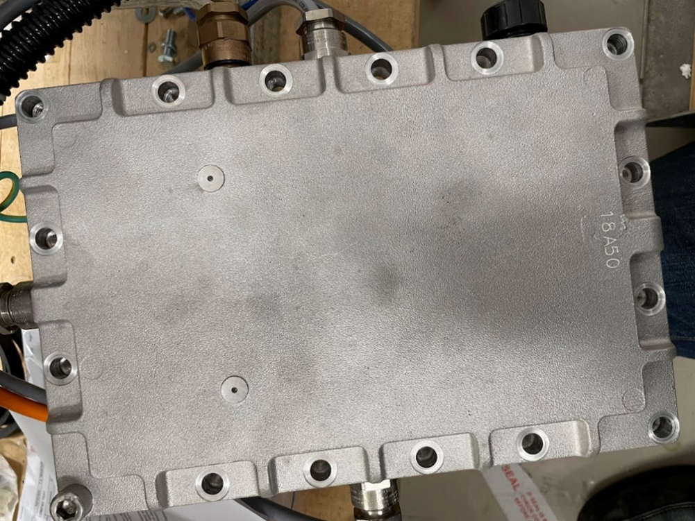

3.	Install the USB stick for the software that you want to install. If there is a coms or GPIO card installed on the C5000 processor board, you might have to remove it.

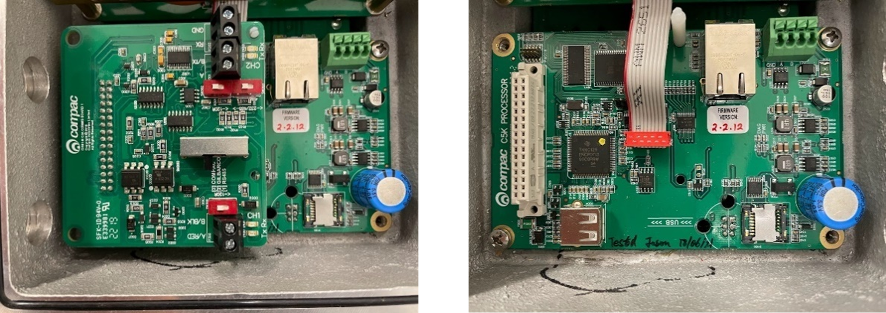

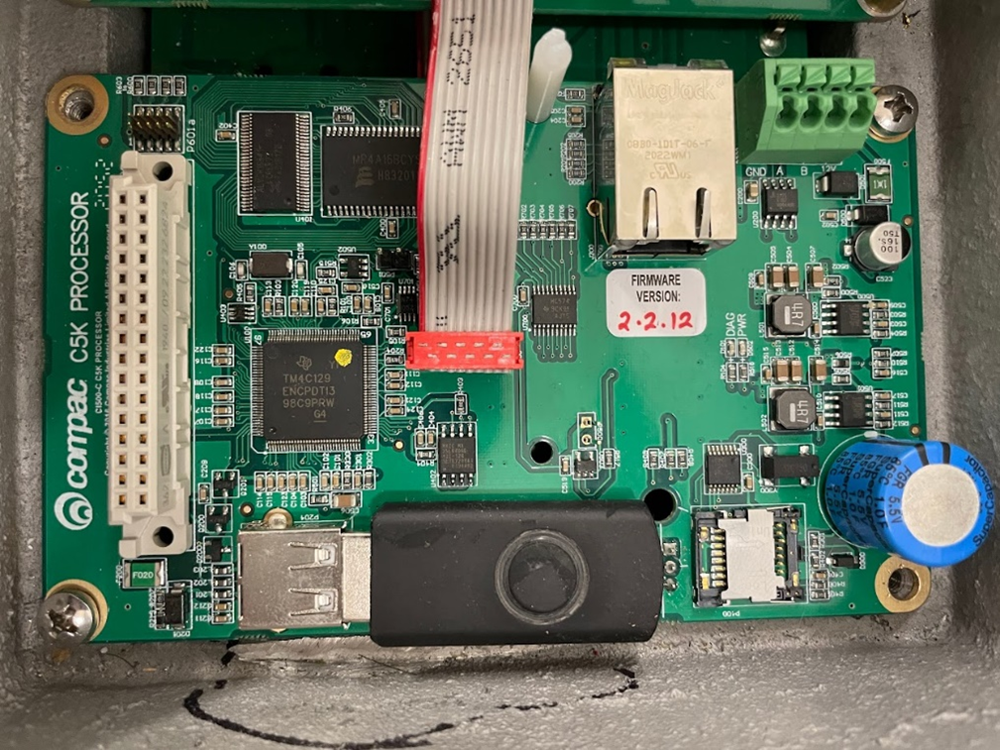

4.	Re-install the lid on the flameproof box

**DANGER:** Before replacing the lid on the flameproof box, make sure that the O-ring is not damaged, and is seated properly in its groove. If the O-ring is damaged and needs replacing, replace it with an O-ring of the same size and specification (176 N70). 

5.	Switch on the power supply to the dispenser.
6.	The Display will display hold. The display will change from hold to calib, this mean that the software has been upgraded.

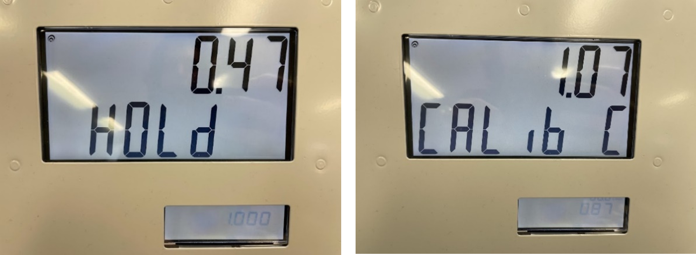

7.	Press the K-Factor board button on the K-Factor board to clear the caib from the display and sync the K-Factor board settings with the C5K processor board.

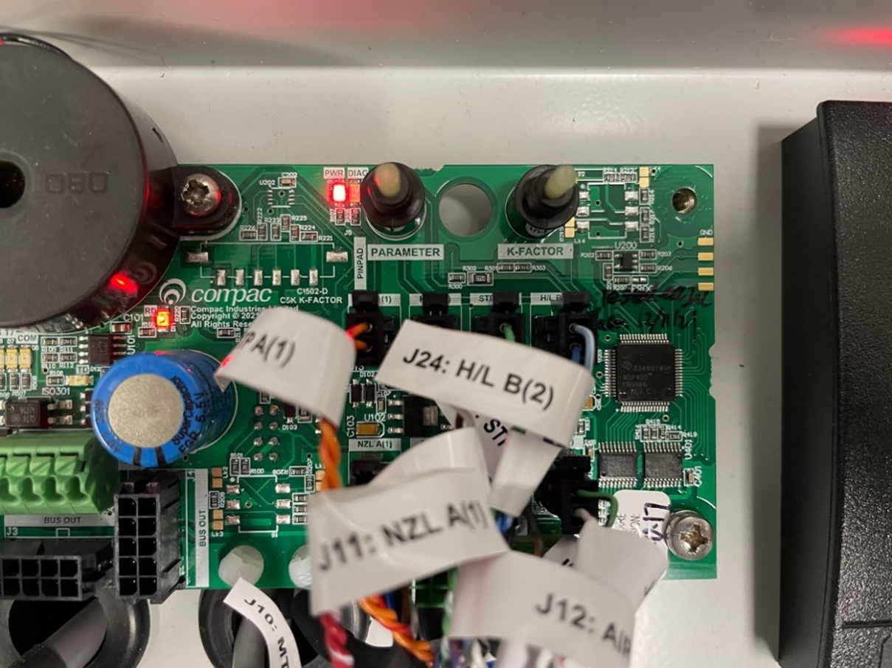

8.	Check the Dispenser operation.

 
# Generator Power

The power output from onsite generators can cause power spikes that may damage electrical components within the cabinet.  
Although generators are fitted with power regulators, most are not filtered sufficiently for powering sensitive electrical components.  
We recommend installing a commercial power conditioner and/or UPS between the generator and the unit.
Start Up:
	Before starting a generator, make sure the power to the unit is turned off.  
	Start the generator, let the generator reach stable operating speed and wait 30 seconds before reconnecting the power to the unit.  

For units where the generator starts and stops on demand, install a delay timer or PLC to automatically isolate the unit until the operating speed and consistent power output is achieved.

Isolate the unit before shutting down the generator.

# Error Codes

These are all the Error codes available in the C5000. Some are product specific so will not be found in all applications.

|Error Code      | Fuel specific | Possible causes                                | Suggested action  
-----------------| --------------| -----------------------------------------------| ---------------- 
**Er 3   Err 3**   |No             |Price not set in the Dispenser   Pump number not set in the Dispenser                 |1. If the Dispenser is connected to a Site Controller, the price on the Dispenser should be set to 0.00 and the pricing should be sent from the Controller   2. If the Dispenser is not connected to a Site Controler (ie. it is operating in standalone mode), then the price must be set in the Dispenser.   Set the hose number in the dispenser
**Er 8   Err 8**   |No             |Excessive reverse flow                          |Check that product is not flowing back into the tank once the delivery has finished. This can occur if the non-return valves on site are leaking
**Er 9   Err 9**   |No             |The Flow Meter is in an illegal state           |Re-power the Dispenser   Check Meter cable for loose wires or bad connections   Replace the Meter or the Encoder board on the Meter   
**Err91**           |No             |Meter sequence error                            |If 3rd party Meter, check the wiring
**Er 10   Err 10** |No             |Memory Error. Configuration data lost or corrupted|Re-configure Dispenser. If problem persists, replace Memory or Processor Board             
**Er 12   Err 12** |No             |Display error                                   |Replace Display
**Err 13**          |No             |Slave board has restarted                       |Power or Hardware failure
**Err 14**          |No             |K Factor board offline                          |Check the Bus Connections and C5K Power Supply
**Err 15**          |No             |K Factor board has restarted                    |Power or Hardware failure
**Err 16**          |No             |K Factor board is not talking to the LCD Display|Check wiring   Replace the K factor board or LCD Display       
**Err 31**          |No             |Transaction has ended but fuel is still flowing |The Solenoid is leaking. Repair or replace solenoid
**Er 41   Err 41** |No             | Pump not communicating with Controller          |1. If only one pump on the site is not communicating with the Controller, then the fault is likely to be in the pump.   a. Check the comms wire connection on the comms board   b. Check the diagnostic LEDs on the comms board in the Dispenser to diagnose cause   c. Check the configuration and setup in the Dispenser   2. If all pumps are not communicating, check the comms wire connections on the comms board   a. Check comms cables between the Dispenser and the Controller   b. check setup and operation of the Controller
**Er 50**           |NO               |Meter not communicating with Dispenser electronics|a. Check Meter connections   b. Check Dispenser configuration   c. Check that the Meter ID setup in the configuration matches the Meter ID
**Er 52**            | No             | Meter error | If the problem persists after repowering the unit, replace the meter.
**Er 53**            | LPG / Adblue / DEF / CNG |Meter stopped ibrating | Repower the unit. This error might display when the dispenser is powered up. In this case it is normal. If the problem persists, replace the meter
**Er 54**            | No           | Temperature sensor failure | Repower the unit. If the problem persists, replace the meter
**Er 55**            | CNG          | Meter not ready.  | Wait for meter to calibrate itself. The KG100 meter is in startup mode. If the problem persists, repower the unit.
**Er 61**            | LPG / Adblue / DEF / CNG | Error 61 happens because the Meter was not able to zero  This can be due to a leak in the line or crystals accumulated in the Meter.   Check for leaks / crystallization. Purge the line.   If that does not reset the Error 61, pull the Meter out and pour hot water on it to dissolve any crystals inside the Meter.   If the problem persists, replace the Meter.
**Er 62**            |LPG / Adblue / DEF / CNG | Meter could not reset the batch (Could not zero the transaction values when nozzle was lifted to start a new transaction)                                                                                                 | Try restarting the Meter. If the problem persists, Replace the meter.
**Er 71**            |LPG / Adblue / DEF | V50 meter is set but variant is not selected  | Configure Device to either AdBlue / DEF or LPG
**Abd**              |No             |Display offline / Display Fault | Check the connections to all displays.   Check the configuration of the  slave boards (If slave displays are connected) Check and/or replace the display
**CNG 157**          |CNG            |The Dispenser expected no flow. Potential Solenoid Valve leak                                    | Repair / rekit Solenoid
**CNG 158**          |CNG            |Tank volume predictor uncertainty | Check for leaks in the Dispenser hose or fittings
**CNG 159**          |CNG            |Temperature Probe out of range | Re-calibrate Temperature Probe
**CNG 160**          |CNG            |Pressure Probe alignment error. There is more than 10bar difference between the two probes       | Re-calibrate Pressure Probes (Dispensers with two Pressure Probes per hose)
**CNG 161**          |CNG            |Temperature Compensation calculation is uncertain |  No suggested action 
**CNG 162**          |CNG            |Generic CNG error with a number of potential causes |  No suggested action 
**CNG 164**          |CNG            |Pressure Probe error|  Check / replace / re-calibrate Pressure Probe.
**CNG 200**          |CNG            |The Dispenser is detecting unauthorised flow | Gas is flowing without the Start switch having been pressed to start a fill
**hoLd**             |No             |There are two types of HOLD error. There is a “Soft” HOLD err or that resets after the unit is re-powered and a “Hard” HOLD error that does not reset after the unit is re-powered. Display may also show Error 14 on display     | Re-power the unit. Does the HOLD error reset?   If the HOLD error resets but the problem persists, then the SD card may be corrupt and require replacement. Refer to the SD replacement procedure document.   If the HOLD error did not reset, then there is a possible hardware fault in the Power Supply PCB / Processor PCB board / K factor PCB board / other PCB board or Bus cable.
**Calib c**          |No             | K-Factor data integrity failure, or the processor board has been replaced                       |  To reset, break the K factor switch seal and momentarily press
**Calib p**          |No             |The K-Factor board has been swapped/replaced   |  To reset, break the K factor switch seal and momentarily press
**Calib**            |No             |The unit needs calibration, usually due to a hardware change   | Check the K-Factor, temperature and density calibration
**Calib f**          |No             |K-Factor is not set or is 00.0000     | Calibrate the unit and set the K factor
**Air**              |No             |1. Air is in the system. 2. Density out of range 3. Coil amplitude too low while meter is operating, displayed until next sale is started | Make sure pump is running. Check tank and pipework for leaks. Purge system. Increase the Solenoid delay on the K-Factor switch
**Orun**             |No             |Preset amount Overrun – flow above preset  | Check that solenoid is closing. Increase the preset cutoff
**5ump**             |No             |Sump error – liquid detected in the sump   | Empty the sump. Check the dispenser for leaks. Check for water etc getting into the sump.
**Ga5**              |LPG            |For LPG, the density being returned from the meter is too low  | Calibrate meter density using the K-Factor switch
**ABDL**             |No             |Display LCD error | There is a problem with the K Factor Board talking to the LCD. Check cables, plugs etc. If problem persists, replace K Factor board / LCD Display
**Er FLO**           |No             |Excess Flow        | Maximum flow rate exceeded, Increase Maximum flow rate setting or restrict flow
**ErPrSt**           |No             |The preset entered is below the MMQ   | Enter a preset above (or equal to) the MMQ
**Er dEn**           |LPG            |Density or Temperature out of Range | Calibrate meter density using the K-Factor switch  Calibrate meter temperature using the K-Factor switch

# END OF SALE Indicators

The purpose of the END OF SALE Indicator to give the reason why the last fill ended.

This is useful if it is not apparent why the last fill stopped

The EOS number will appear on the Dispenser Display at the end of the fill.
If there is a PINPad keypad / Display fitted, an EOS error code will be displayed on it

Some END OF SALE Indicators are a result of a fault in the system.

Other END OF SALE Indicators are normal operation

Note: This is a complete list of all the available END OF SALE Indicators and covers all Compac products. Some END OF SALE Indicators are Product / Fuel type specific

|Keypad Display (if fitted)   | Dispenser Display  | Description                                                              |  
|-----------------------------|--------------------|--------------------------------------------------------------------------|
**NOZ**                          | 1                  | The nozzle was hung up This is normal operation                          
**PRESET**                       | 2                  | The fill ended when it reached the preset amount or quantity          
**DISP**                         | 3                  | Normal fill                                                              
**OFFLINE**                      | 4                  | Comms not connected between Dispenser and Controller. Check comms connections and setup in the Dispenser and Controller.
**MAX**                          | 5                  | The fill reached either the maximum dollars or litres amount allowed     
**AIR**                          | 6                  | Air was detected in the fuel so the air switch cut out. Check for air in the fuel.
**ERROR**                        | 7                  | There was an error with the encoder in the flow meter. Check the Flow Meter   
**SUMP**                         | 9                  | Sump switch cut out because there was either water or fuel in the sump   
**TO ATH**                       | 12                 | Pre-auth from the Controller or Payment Terminal timed out. The customer may have taken too long to start the fill after it was authorised
**POR**                          | 13                 | The unit was repowered 
**STP SW**                       | 14                 | The Stop Switch was activated 
**PRST ERR**                     | 15                 | An Invalid preset value was entered
|                             | 17                 | There is a Display offline 
|                             | 18                 | The Displays are not paired 
|                             | 30                 | Controller initiated stop 
**DENSITY**                      | 35                 | The Density was out of range 

