

# C5000 CNG Dispenser Installation and Service Manual  

updated 16 June 2026

# Conditions of Use  

Please read this manual completely before working on, or making adjustments to Compac equipment

Compac Industries Limited accepts no liability for personal injury or property damage resulting from working on or adjusting the equipment incorrectly or without authorization.

Along with any warnings, instructions, and procedures in this manual, you should also observe any other common sense procedures that are generally applicable to equipment of this type.

Failure to comply with any warnings, instructions, procedures, or any other common sense procedures may result in injury, equipment damage, property damage, or poor performance of the Compac equipment

The major hazard involved with operating the Compac C4000 processor is electrical shock. This hazard can be avoided if you adhere to the procedures in this manual and exercise all due care.

Compac Industries Limited accepts no liability for direct, indirect, incidental, special, or consequential damages resulting from failure to follow any warnings, instructions, and procedures in this manual, or any other common sense procedures generally applicable to equipment of this type. The foregoing limitation extends to damages to person or property caused by the Compac C4000 processor, or damages resulting from the inability to use the Compac C5K processor, including loss of profits, loss of products, loss of power supply, the cost of arranging an alternative power supply, and loss of time, whether incurred by the user or their employees, the installer, the commissioner, a service technician, or any third party.

Compac Industries Limited reserves the right to change the specifications of its products or the information in this manual without necessarily notifying its users.

Variations in installation and operating conditions may affect the Compac C4000 processor's performance. Compac Industries Limited has no control over each installation's unique operating environment. Hence, Compac Industries Limited makes no representations or warranties concerning the performance of the Compac C4000 processor under the actual operating conditions prevailing at the installation. A technical expert of your choosing should validate all operating parameters for each application.

Compac Industries Limited has made every effort to explain all servicing procedures, warnings, and safety precautions as clearly and completely as possible. However, due to the range of operating environments, it is not possible to anticipate every issue that may arise. This manual is intended to provide general guidance. For specific guidance and technical support, contact your authorised Compac supplier, using the contact details in the Product Identification section.

Only parts supplied by or approved by Compac may be used and no unauthorised modifications to the hardware of software may be made. The use of non-approved parts or modifications will void all warranties and approvals. The use of non-approved parts or modifications may also constitute a safety hazard.

Information in this manual shall not be deemed a warranty, representation, or guarantee. For warranty provisions applicable to the Compac C4000 processor, please refer to the warranty provided by the supplier.

Unless otherwise noted, references to brand names, product names, or trademarks constitute the intellectual property of the owner thereof. Subject to your right to use the Compac C5K processor, Compac does not convey any right, title, or interest in its intellectual property, including and without limitation, its patents, copyrights, and know-how.

Every effort has been made to ensure the accuracy of this document. However, it may contain technical inaccuracies or typographical errors. Compac Industries Limited assumes no responsibility for and disclaims all liability of such inaccuracies, errors, or omissions in this publication.

# Specifications

## C5000 CNG Dispenser Models Covered

|Models covered|Standard|High Flow|Ultra-High Flow
|--------------|--------|---------|---------------
|Laser |L-CNG15 |L-CNG50 |L-CNG80 
|      |L-CNGD15 |L-CNGD50 |L-CNGD80 
|      |         |L-CNG50-15 |L-CNG80-15
Legend |LGDCNG15 |LGDCNG50 |LGDCNG80-15
|      |LGDCNGD15 |LGDCNGD50 |LGDCNGD80
|      |         |LGDCNG50-15 |LGDCNG80-15

> **Note:** Do not use this manual for earlier models or Compac CNG Dispensers with C4000 electronics. 
Contact Compac for archived manuals if required.

# Validity

Compac Industries Limited reserves the right to revise or change product specifications at any time. This publication describes the state of the product at the time of publication and may not reflect the product at all times in the past or in the future.

# Manufactured By

The Compac C5000 CNG Dispenser is designed and manufactured by Compac Industries Limited

52 Walls Road, Penrose, Auckland 1061, New Zealand

P.O. Box 12-417, Penrose, Auckland 1641, New Zealand

Phone: + 64 9 579 2094

Fax: + 64 9 579 0635

**Email:** [techsupport@compac.co.nz](mailto:techsupport@compac.co.nz)

**Website:** [http://www.compac.co.nz](http://www.compac.co.nz)

Copyright ©2015 Compac Industries Limited, All Rights Reserved

# Document Control

## Document Information

**Manual Title:** C5000 CNG Installation and Service Manual

**Current Revision Author(s):** Trevor Watt

**Original Publication Date:** 22 April 2026

**Authorised By:** Emily Sione

**File Name:** C5000 CNG Installation and Service Manual v.1.0.5

## Table of Contents

[**1.0 Safety**](#10-safety)

[1.1 System Design](#11-system-design)

[1.2 Mechanical Safety](#12-mechanical-safety)

[1.3 Electrical Safety](#13-electrical-safety)

[**2.0 Introduction**](#20-introduction)

[**3.0 Refuelling Modes**](#30-refuelling-modes)

[**4.0 Installation**](#40-installation)

[**5.0 Commissioning - Electrical**](#50-commissioning---electrical)

[**6.0 Commissioning - Mechanical**](#60-commissioning---mechanical)

[**7.0 Dispenser settings**](#70-dispenser-settings)

[7.0.1 Dispenser set up master list of settings](#701-dispenser-set-up-master-list-of-settings) 

[**7.1 Parameter Switch**](#71-parameter-switch)

[7.1.1 Software Version](#711-software-version)

[7.1.2 Pump Number **PnA**](#712-pump-number-pna)

[7.1.3 Current Pressure](#713-current-pressure) 

[7.1.4 Standalone setting **bA**](#714-ba-standalone-setting)

[7.1.5 Unit Price **PrA**](#715-unit-price-pra)

[7.1.6 Minimum Flow Rate **LFA**](#716-minimum-flow-rate-lfa) 

[7.1.7 Maximum Flow Rate **HFA**](#717-maximum-flow-rate-hfa)

[7.1.7 Changing the b Setting](#717-changing-the-b-setting)

[7.1.8 Heat of Compression **HCA**](#718-heat-of-compression-hca)

[7.1.9 **b** setting](#719-b-setting)

[7.1.10 Slave Display configuration **dS**](#7110-slave-display-configuration-ds)

[7.1.11 Custom Display Configuration **dC**](#7111-custom-display-configuration-dc)

[7.1.12 Custom Display configuration **dP**](#7112-custom-display-configuration-dp)

[7.1.13 Custom Display configuration **du**](#7113-custom-display-configuration-du)

[7.1.14 Electronic Totalizers](#7114-electronic-totalizers)

[**7.2 K-Factor Switch**](#72-k-factor-switch)

[7.2.1 Dispenser settings **C-A**](#721-dispenser-settings-c-a) 

[7.2.2 Meter ID **id-A**](#722-meter-id-id-a)

[7.2.3 Meter Temperature Calibration **E-A**](#723-meter-temperature-calibration-e-a) 

[7.2.4 Meter Density Calibration **dIS-A**](#724-meter-density-calibration-dis-a)

[7.2.5 **LdA**](#725-lda)

[7.2.6 **Hose-b**](#726-hose-b)

[7.2.7 Display settings **Disp**](#727-display-settings-disp)

[7.2.8 Target fill pressure **FPA**](#728-target-fill-pressure-fpa)

[7.2.9 **hPA**](#729-hpa)

[7.2.10 Overfill pressure **OPA**](#7210-overfill-pressure-opa)

[7.2.11 CNG setting **cn9 C**](#7211-cng-setting-cn9-c)

[7.2.12 **uALu tA**](#7212-ualu-ta)

[7.2.13 CNG Region **Cn9r9n**](#7213-cng-region-cn9r9n)

[7.2.14 Density Factor **dSF**](#7214-density-factor-dsf)

[7.2.15 Ambient Temperature **E-Anb**](#7215-ambient-temperature-e-anb)

[7.2.16 Low Pressure point calibration **uA1L**](#7216-low-pressure-point-calibration-ua1l)

[7.2.17 Low Pressure point calibration **ub1L**](#7217-low-pressure-point-calibration-ub1l)

[7.2.18 Low Pressure point calibration **uA1H**](#7218-low-pressure-point-calibration-ua1h)

[7.2.19 Low Pressure point calibration **ub1H**](#7219-low-pressure-point-calibration-ub1h)

[7.2.20 Overfill time **deb**](#7220-overfill-time-deb)

[7.2.21 **SdEL**](#7221-sdel)

[7.2.22 **9A**](#7222-9a) 

[7.2.23 K Factor **FA**](#7223-k-factor-fa)

[7.2.24 C Configuration **C**](#7224-c-configuration-c)

[7.2.25 Comms protocol **cc**](#7225-comms-protocol-cc)

[7.2.26 **nbC0n5**](#7226-nbc0n5)

[7.2.27 **Sd A**](#7227-sd-a)

[7.2.28 **PcutA**](#7228-pcuta)

[7.2.29 **Pr1A**](#7229-pr1a)

[7.2.30 **PrHA**](#7230-prha)

[7.2.31 **nA**](#7231-na)

[7.2.32 GPIO setting **9pi0**](#7232-gpio-setting-9pi0)

[7.2.33 GPIO Pu setting **9pi0 Pu**](#7233-gpio-pu-setting-9pi0-pu)

[**8.0 Operation**](#80-operation)

[**9.0 Servicing**](#90-servicing)

[9.1 Degassing the Dispenser](#91-degassing-the-dispenser)

[9.2 Scheduled Servicing](#92-scheduled-servicing)

[9.3 Checking Dispenser operation](#93-checking-dispenser-operation)

[9.4 Checking that the Solenoid is sealing](#94-checking-that-the-solenoid-is-sealing)

[9.5 Checking the Regulator](#94-checking-that-the-solenoid-is-sealing)

[9.6 Checking the Over Pressure cut off operation](#96-checking-the-over-pressure-cut-off-operation) 

[9.7 Checking for leaks](#97-checking-for-leaks)

[9.7.1 Checking the Refuelling Hose for Leaks](#971-checking-the-refuelling-hose-for-leaks)

[9.8 Checking Isolation Ball Valve operation](#98-checking-isolation-ball-valve-operation)

[9.9 Checking the 3way valve operation](#99-checking-the-3way-valve-operation)  

[9.10 Draining the Filter](#910-draining-the-filter)

[9.10.1 Filter Element Replacement](#9101-filter-element-replacement)

[9.11 Solenoid Valve Seal replacement](#911-solenoid-valve-seal-replacement)

[9.12 Solenoid Coil replacement](#912-solenoid-coil-replacement)

[9.13 Complete Solenoid replacement](#913-complete-solenoid-replacement)

[9.14 Regulator Valve Seal replacement](#914-regulator-valve-seal-replacement)

[9.15 Isolation Valve Seal replacement](#915-isolation-valve-seal-replacement)

[9.16 Bleed Valve Replacement](#916-bleed-valve-replacement)

[9.17 Pressure Relief Valve Replacement](#917-pressure-relief-valve-replacement)

[9.18 KG100 Meter Replacement](#918-kg100-meter-replacement)

[9.19 Refuelling Hose Replacement](#919-refuelling-hose-replacement)

[9.20 Power Supply Fuse Replacement](#920-power-supply-fuse-replacement)

[9.21 Power Supply Replacement](#921-power-supply-replacement)

[9.22 Processor Board Replacement](#922-processor-board-replacement)

[9.23 Temperature Pressure Board Replacement](#923-temperature-pressure-board-replacement) 

[9.24 Dispenser Software Upgrade or Replacement](#924-dispenser-software-upgrade-or-replacement)

[**10.0 Dispenser Calibration**](#100-dispenser-calibration)

[10.1 Meter Calibration](#101-meter-calibration)

[10.2 Pressure Transducer Calibration](#102-pressure-transducer-calibration) 

[10.3 Ambient Temperature Sensor Calibration](#103-ambient-temperature-sensor-calibration)

# 1.0 Safety

**DANGER PRECAUTIONS** 

You must adhere to the following safety precautions at all times when working on the Compac equipment. 
Failure to observe these safety precautions could result in damage to the dispenser, injury, or death. 
Make sure that you read and understand all safety precautions before operating the Compac equipment 
Failure to take adequate safety precautions could result in explosion, injury and loss of life.

# 1.1 System Design
Ensure the system design does not allow the dispenser inlet pressure to exceed its rating. 
The dispenser does not include any safeties to protect against excessive inlet pressure. 
If necessary, suitable protective devices should be fitted prior to the dispenser inlet.

# 1.2 Mechanical Safety

Observe the following mechanical precautions: 

- Never tighten a fitting under pressure, even if a fitting or joint is leaking. Always depressurise the line first.
- Never disassemble a fitting under pressure. Always depressurise the line first.
- Be very careful when disassembling frozen pipework, as gas pressure may be trapped and suddenly released. Always depressurise the line before using.
- Never reuse any O-ring seals that have been in a high pressure gas atmosphere and then exposed to air. These o-rings swell and cannot be reused. Always make sure you have a new seal kit available to replace the seals before disassembly.
- Make sure that all internal surfaces are cleaned and that sliding surfaces are lightly greased with O-ring lubricant before reassembly. Dust and dirt entering components reduce the life span of the components and can affect operation.
- Ensure the service area is thoroughly cleaned before initiating service on CNG components. Dust and dirt entering the components reduce the life span of the component and affect future operations. 

# 1.3 Electrical Safety

Observe the following electrical precautions: 

- Always turn off the power to the CNG Dispenser before removing the box lid. Never touch wiring or components inside the CNG Dispenser with the power on.
- Never power up the CNG dispenser with the flameproof box lid removed.
- Always turn off the power to the dispenser before upgrading software or replacing components.
- Always take basic anti-static precautions when working on the electronics, i.e., wearing a wristband with an earth strap. 

# 2.0 Introduction

The Compac CNC dispenser is designed to provide safe and reliable dispensing of CNG fuels. 
They are available in either single or dual hose configurations and with different flow rates.  

Compac CNG dispensers are controlled by a C5000 board which has many programmable features to suit your individual operation. 

This manual contains the information required to operate and maintain your dispenser. Due to ongoing improvements and customised designs, there may be software features that are not available on your particular unit. 

For clarity, this manual will refer to the "Dollars" display. If you do not use dollars please substitute this for your local currency. 

# 3.0 Refuelling Modes

# 4.0 Installation

# 5.0 Commissioning - Electrical

This procedure outlines how to perform an electrical operational test before carrying out full mechanical commissioning, making sure that the dispenser is functioning correctly. 
Check for any damage that may have occurred in transit. Check all terminals, plugs, and chips to make sure that they are securely in place.  

**NOTE:** *Damage to electronics occurs most commonly from vibration and jarring.* 

Before beginning this test, check that no gas pressure has been applied to the dispenser inlets. 
The factory set-up information should be programmed into the dispenser, but all K-factor and Parameter switch settings should be checked and confirmed before commissioning tests are carried out.

To perform an electrical operational test: 

1.	Make sure that the inlet shut-off valves are closed (these are the valves in the inlet lines at the base of the dispenser, but they are not part of the dispenser).

2.	Turn on the power supply to the dispenser. 
The displays and backlighting will illuminate, and the displays read hold.
The dispenser is in a ready state once the hold is finished, and the display shows 0.00.

3.	With the dispenser in a ready state.
Press the Start button. 
The display will show 888888 and the solenoids energise, initiating a fill. On the K factor board check that the output leds T1 T2 and T3 turn on, indicating a signal is being sent to the triacs to open the solenoid valves.
The diagnostic LED (D9) flashes quickly when the start button is pushed or the nozzle removed from the holster to initiate a fill. When the button is released or nozzle returned to the holster it will return to the normal state and flash slowly.

4.	Verify solenoid operation by listening for a click, or by using a screwdriver tip or some other metallic tool to check for a magnetic field present on the solenoid coils.
The solenoids will switch off after 10 seconds. This is a default time-out setting in the software for situations when there is no gas flow registered. 

5.	Press the stop button. The solenoids switch off and the fill ends. 
When you release the stop button, the dispenser resets and returns to a ready state.

# 6.0 Commissioning - Mechanical

At the mechanical commissioning stage, the dispenser should not be pressurised. 

**NOTE:** *If you find any leaks during commissioning, immediately close all the valves and de-gas the dispenser.* 

To perform a mechanical test:
 
1.	Make sure that the inlet shut-off valves are closed. (These are the valves in the inlet lines at the base of the dispenser, but they are not part of the dispenser.)
2.	Check all dispenser fittings, especially the inlet connections, to make sure that they are tight. 

**DANGER:** Always de-gas the lines before tightening any fittings. Never tighten fittings while they are under pressure. 

3.	Check that the outlet supply valve to hose 1 on the side of the dispenser (or hose 2 if you are working on side 2) is closed and the nozzle valve is closed. 

4.	Turn on the dispenser and wait for it to power up. 

The dispenser initially displays **PA:uSE**. When it is ready, **0.00** is displayed. 

5.	Press the START button. 

**NOTE:** *If you are commissioning a dual hose dispenser, press the Start button on either side. This opens the dispenser's solenoids. The dispenser automatically shuts off after approximately one minute if no flow is detected.* 

6.	Slowly open the inlet shut-off valves until the dispenser pressure gauge reads **5 bar**. Close the inlet shut-off valves and listen for leaks. If you hear leakage, shut off the inlets immediately. If the dispenser shuts off during this process, shut off the inlet valves, restart the dispenser, and continue. 

7.	Allow the dispenser to time out on the 1-minute no-flow timer and shut the solenoid valves, or, manually shut it down and close the solenoid valves by pressing the STOP button. 

8.	Press the 5tart button on the dispenser and repeat steps 6 and 7 at **25 bar, 125 bar** and **250 bar**(if applicable).

**NOTE:** *If you are commissioning a dual hose dispenser, only press the Start button for one of the hoses.* 

9.	Press the START button 

10.	Slowly open the outlet isolation valve on the side of the dispenser until the dispenser pressure gauge reads **5 bar**. 
Close the outlet isolation valve and listen for leaks. If you hear leakage, shut the valve immediately.

If the dispenser shuts off during this process, then shut the outlet supply valve, restart the dispenser, and continue. 

11.	Allow the dispenser to time out on the 1-minute no-flow timer and shut the solenoid valves, or, manually shut it down and close the solenoid valves by pressing the STOP button. 

12.	Repeat steps 9 to 11 at **25 bar, 125 bar** and **250 bar**(if applicable). 

Repeat steps 9 to 12 for the second hose on a dual hose dispenser. 

The dispenser and hose(s) are now fully pressurised. 

13.	Use soapy water to check all fittings (including the hose fittings) for leaks. 

**DANGER:** Always de-gas the lines before tightening any fittings. Never tighten fittings while they are under pressure. 

14.	Complete a few fills on a test cylinder, checking for leaks or unusual operation.

# 7.0 Dispenser settings

# 7.0.1 Dispenser set up master list of settings

This table lists all the settings on the Parameter and K factor switches for CNG applications 
Where applicable, the Compac factory default settings for a new standard dual hose CNG dispenser are noted 
Some settings only appear when the dispenser is configured for dual hose 
Some settings such as the Price, Pump number and K factor will need to be changed when the Dispenser is installed

**Parameter Switch**

|Setting|Description|Single or dual hose|Dual hose Factory default|
|-------|-----------|-------------------|---------------|
|Pn A|Pump number side A||01|
|Pn b|Pump number side B|dual hose only|02|
|LPr-A|Current Pressure side A|||
|LPr-b|Current Pressure side B|dual hose only||
|b-A|Standalone setting side A||0000|
|b-b|Standalone setting side B|dual hose only|0000|
|Pr A|Price side A||001.000|
|Pr b|Price side B|dual hose only|001.000|
|LFA|Low Flow cutoff side A||01.0|
|LFb|Low Flow cutoff side B|dual hose only|01.0|
|HFA|High Flow cutoff side A||0075|
|HFb|High Flow cutoff side B||0075|
|HCA|Heat of Compression side A||0000
|HCb|Heat of Compression side B|dual hose only|0000|
|b|LCD dimming||0000
|dS|Slave display configuration||0003
|dC|not applicable for CNG||00000
|dp|not applicable for CNG||0000
|A|not applicable for CNG||1.0|
|b|not applicable for CNG||1.0|
|LA|Totalizer side A|||
|Lb|Totalizer side b|dual hose only||

 

**K factor switch**
|Setting|Description|Single or dual hose|Factory default settings|
|-------|-----------|-------------------|---------------|
|C-A|Dispenser setting side A||0000264| 
|C-B|Dispenser setting side B|dual hose only|0000264|
|Id-A|Meter side A ID||
|Id-B|Meter side B ID|dual hose only|
|E-A|Meter side A temperature||
|E-b|Meter side B temperature|dual hose only||
|DIS-A|Density side A||0001.0| 
|DIS-B|Density side B|dual hose only |0001.0
|LdA|||0|
|Hose-b|||0.00|
|Disp|Display settings||0033220
|FpA|Target fill pressure side A||200|
|Fpb|Target fill pressure side B|dual hose only|200|
|hPA|High pressure cutoff side A||200
|hPb|High pressure cutoff side B|dual hose only|200
|OPA|Overfill pressure cutoff side A||300|
|OPA|Overfill pressure cutoff side B|dual hose only|300
|Cn9 C|CNG specific settings||1100315|
|uALu tA|||0.00|
|uALu tb|||0.00|
|Cn9 r9n|||0000|
|dSF|Density factor||1.0000|
|E-Anb|Ambient temperature||ambient temperature|
|uA1L|Low pressure point calibration side A||
|ub1L|Low pressure point calibration side B|dual hose only||
|uA1H|High pressure point calibration side A||
|ub1H|High pressure point calibration side B|dual hose only||
|deb|Overfill pressure time||99.0|
|Sdel||||
|9A|Maximum Flow side A|||
|9b|Maximum Flow side B|dual hose only||
|FA|K factor side A||1.0000|
|Fb|K factor side B|dual hose only|1.0000|
|C|Configuration code||0000602|
|cc|comms protocol||0011(Compac) or 0013 (Gilbarco)|
|nb COn5|not applicable||000|
|SdA|not applicable||000|
|Sdb|not applicable|dual hose only|000|
|Pcut A|not applcable||0.00|
|Pcut b|not applicable|dual hose only|0.00| 
 Pr1A|not applicable||0.00|
|Pr1b|not applicable|dual hose only|0.00|
|PrHA|not applicable||0.00|
|PrHb|not applicable|dual hose only|0.00|
|nA|not applicable||000|
|nb|not applicable|dual hose only|000|
|9pi0|GPIO settings||0000|
|9pi0 Pu|GPIO settings||0000|

 

# 7.1 Parameter Switch

The Parameter switch is located on the K factor board behind the main display and allows you to adjust the unit price, hose number, Pump settings high low cut off and display setting. 

The Parameter switch also enables you to view the Dispenser Software Version and End of Sale Indicators.

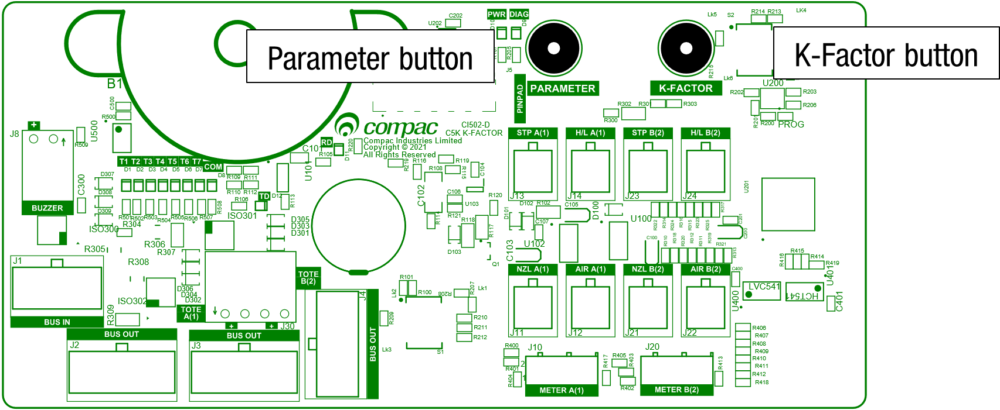

Menu Options 

Listed below is the order in which the **Parameter** switch menu options are presented. 
There are different menu options depending on the current setting of the C configuration code.  
The * indicates that you can achieve the displayed menu option, regardless of what the indicated part is set to. 
You may need to change the C configuration in order to access the parameter code you require.

Setting|Price Display|Litres Display
|------|------|------
Software Version|	P**.**. **      |	P**.**. **
Pump Number|| 	Pna *** or Pnb ***
Pump Settings||		bA **** or bb ****
Low-flow cut off||		LFA***
High-flow cut off||		HFA ***
Heat of compression|| 		hcA**
b Setting||		b****
Slave display||		dS****
Custom display||	dc****
|||dP
|||du
Last Sale|	**. ** |	A ***. * or b ***. *
Electronic Totes|	LA **** or dA ****|L****.**
||Lb **** or dA ****|d****.**

# 7.1.1 Software Version 

Pressing the parameter switch once will show the software version. 

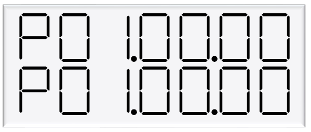

The dispenser will then run through a segment test.

# 7.1.2 Pump Number PnA  

If the parameter switch is continually depressed, the following menu to change the pump number will appear.  
Each side must be numbered between 1-99.

**NOTE:** Entering a pump number 0 will disable the pump.to the pump controller
See Using the Dispenser Menus to edit these settings. Use the procedure for both side A and B.

# 7.1.3 Current Pressure 

# 7.1.4 Standalone setting bA

The bA setting is where you can set the dispenser in to standalone mode. 
Standalone mode means that the dispenser doesn’t communicate to a controller or POS. 

If the dispenser is in authorisation mode the dispenser will not start even if there is no controller or POS connected.

**Note:** *If the dispenser is communicating to a controller or POS it will not operatate in standalone mode. To put the dispenser in to standalone while still connected to the controller or POS set the **CC** setting to **cc0000** setting*

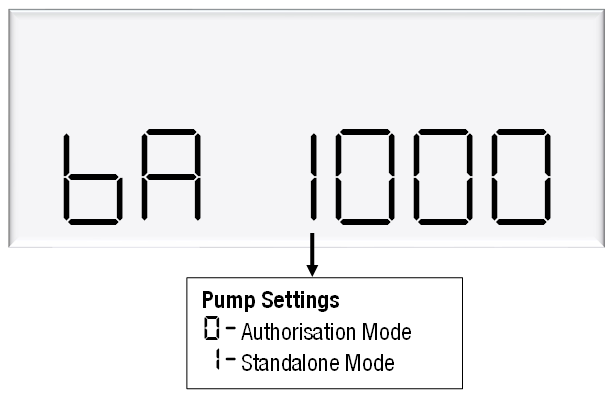  

# 7.1.5 Unit Price PrA

The unit price (PA) is used to calculate the total value of the quantity dispensed. 
The unit price can be different on each side of a dual hose dispenser. 
The unit price can be set at the dispenser or set remotely via a POS or controller

**NOTE:** If the unit price is not set Error 3 will be displayed and the dispenser will not operate. 

To set the unit price:
- Make sure that the dispenser is idle, with the nozzle in its holster.
- Press and release the Parameter switch until the required unit price is displayed (PA).
- Enter in the unit price. 

**NOTE:** Each press of the **Parameter** switch passes you over a digit in a setting, making the digit blink. 
Holding the switch down for more than a second changes whichever digit is currently displayed. 
If you want to pass over a setting without changing any digits, keep pressing and releasing the switch. 

Let the menu time out so that the value and quantity amounts are displayed.

# 7.1.6 Minimum Flow Rate LFA 

The minimum flow rate (LFA and LFb) is the low flow cut-off at the end of the fill.  
LFA is the minimum flow rate of side A of the dispenser. 
LFb is the minimum flow rate of side B of the dispenser. 
These values are adjustable and can be set between 0.5-99 kg⁄min. 

**CAUTION:** Do not set the minimum flow rate so that it is equal to or above the maximum flow rate. 

**To Adjust the Minimum Flow Rate** 

- Make sure that the dispenser is idle, with the nozzle in its holster.
- Press and release the Parameter  switch until the required minimum flow rate is displayed. (LFA or LFb)
- Enter the new minimum flow rate.

**NOTE:** Each press of the Parameter switch passes you over a digit in a setting, making the digit blink. 
Holding the switch down for more than a second changes whichever digit is currently displayed. 
If you want to pass over a setting without changing any digits, keep pressing and releasing the switch.
NOTE: The Compac factory default setting is 1.0 kg⁄min.

Let the menu time out so that the value and quantity amounts are displayed.

# 7.1.7 Maximum Flow Rate HFA

The maximum flow rate (HFA and HFb) is the high flow cut-off for when the flow through the dispenser is too high. 

HFA is the maximum flow rate of side A of the dispenser. 
HFb is the maximum flow rate of side B of the dispenser. 

These values are adjustable and can be set between 1-9999 kg⁄min. 

**CAUTION:** Do not set the maximum flow rate so that it is equal to or below the minimum flow rate.

**To Adjust the Maximum Flow Rate**
	
- Make sure that the dispenser is idle, with the nozzle in its holster
- Press and release the Parameter switch until the required maximum flow rate is displayed. (HFA or HFb)
- Enter the new maximum flow rate.

**NOTE:** Each press of the Parameter switch passes you over a digit in a setting, making the digit blink. 
Holding the switch down for more than a second changes whichever digit is currently displayed. 
If you want to pass over a setting without changing any digits, keep pressing and releasing the switch. 

**NOTE:** The Compac factory default setting is 40 kg⁄min for Car Dispensers and 60 kg⁄min for High flow or Bus dispensers.

Let the menu time out so that the value and quantity amounts are displayed.

# 7.1.7 Changing the b Setting
The b setting is currently only used for LCD dimming. Set the b configuration code as desired.

|	Setting       |Digit             |    Function                                             |
|---------------|------------------|---------------------------                                 |
|b|2nd digit|0 = disabled
| |         |1 = disabled

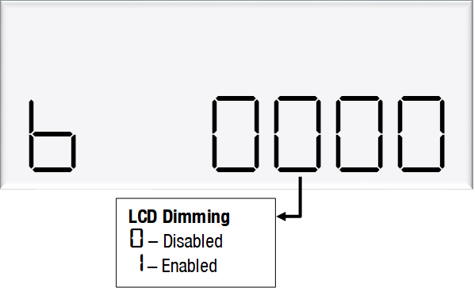

# 7.1.8 Heat of Compression HCA

This can be set to allow for the increased temperature in the tank due to heat of compression. 

In low flow car filling applications, this may not be required. 

In high flow applications such as filling Buses and trucks, this would typically be set to approximately 30 degrees

# 7.1.9 b setting

The b setting is currently only used for LCD dimming. Set the b configuration code as required.

|Setting|Digit      |Indication                    |
|-------|-----------|------------------------------|
|b      |1st digit  |**not used**                  |
|       |2nd digit  |**LCD Dimming**               |
|       |           |0 = Disabled                  |
|       |           |1 = Enabled                   |
|       |3rd digit  |**not used**                  |
|       |4th digit  |**not used**                  |

# 7.1.10 Slave Display configuration dS

Slave displays are the displays that are additional to the K-factor board display. 
You can have up to 4 slave displays connected to one C5000. 
These displays can be configured as one of the following: 

•	Clone of the main display. This will display what is on the A side display but not error check the LCD 
•	Side A will display what is on the A side display but will error check the LCD 
•	Side B. will display what is on the B side display but will error check the LCD 
•	disabled.  

Slave display configuration is a two-step process.
1.	Assign the correct number to the slave display by changing the slave display board dip switches. 
2.  Change DS setting to assign a side to the slave display 

Slave display numbers can be set with dip switch 2 and 3 on the slave display board. 
Use the following table as a guide to configure the slave displays 

|Slave Display   |Switch 1      |Switch 2   |Switch 3|
|----------------|--------------|-----------|--------|
|1               |OFF           |OFF        |OFF     |
|2               |OFF           |OFF        |ON      |
|3               |OFF           |ON         |OFF     |
|4               |OFF           |ON         |ON      |    

The first digit from the right correlates to slave display 1, and so on.
In this example, 
slave display 1 – clone 
slave display 2 – disabled 
slave display 3 - side A 
slave display 4 - side B. 

Note: Each digit can have 4 different values, each value has a different meaning.

|Setting|Digit      |Indication                    |
|-------|-----------|------------------------------|
|dS     |1st digit  |**Slave display 4**           | 
|       |           |0 = Disabled                  |
|       |           |1 = Clone                     |
|       |           |2 = Side A                    |
|       |           |3 = Side B                    |
|dS     |2nd digit  |**Slave display 3**           | 
|       |           |0 = Disabled                  |
|       |           |1 = Clone                     |
|       |           |2 = Side A                    |
|       |           |3 = Side B                    |
|dS     |3rd digit  |**Slave display 2**           | 
|       |           |0 = Disabled                  |
|       |           |1 = Clone                     |
|       |           |2 = Side A                    |
|       |           |3 = Side B                    |
|dS     |4th digit  |**Slave display 1**           | 
|       |           |0 = Disabled                  |
|       |           |1 = Clone                     |
|       |           |2 = Side A                    |
|       |           |3 = Side B                    |

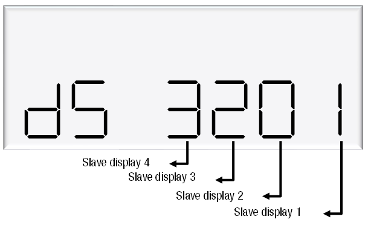

# 7.1.11 Custom Display Configuration dC

The custom display configuration can be used to show additional information on the unit price display. 
The additional information that can be shown includes the density, temperature, flowrate, and reset batch. 
This can be configured with the dc setting. 
Each digit corresponds to a custom display option. 
Setting a digit to 1, as opposed to 0, enables the custom display. The digits represent the following options:

Digit 1: Reset batch
Digit 2: Temperature display
Digit 3: Density display
Digit 4: Flowrate display

For example, the following code would enable temperature and flowrate to be shown on the custom display. 

# 7.1.12 Custom Display configuration dP

For CNG Dispensers, leave this set to 0000

# 7.1.13 Custom Display configuration du

For CNG Dispensers, leave this set to 0000

# 7.1.14 Electronic Totalizers

The dispenser records electronic totes for price and dollars.
To view the electronic totes, continue pressing the parameter switch until the following display is shown:

 

The bottom row is a continuation of the top row. For example, the above display should be read as 00310556.61.
The side (A or B) will be shown in the unit price display.
Dollars totals are also recorded, which can be viewed by continually pressing the parameter switch.

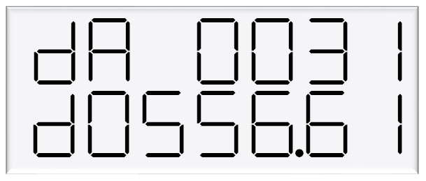 

The electronic totes can also be viewed by pressing the # key five times on the main display, as long as the unit is not in a transaction.
Each tote will be shown for ten seconds before the next tote is displayed.

# 7.2 K-Factor Switch

The K-Factor switch is located on the C5000 K-factor board. It is used to access and set up options on the dispenser. 

**K-Factor Settings** 
A summary of the K-Factor settings can be seen below. 
Information on these settings and how to change them can be found on the following pages. 

| Setting                  | Price Display                   | Litres Display                                      |
|-----------------------|---------------------------------|------------------------------------------------------|
| Dispenser settings    | **c-A** or **c-B**              | *******                                  |
| Meter ID              | **id-A** or **id-b**            | ******                                  |
| Meter Temperature calibration| **E-A** or **E-b**             | **\*\*.\***                                         |
| Meter Density calibration   | **d15-a** or **d15-b**          | **\*\*\*.\***                                       |
|Target fill pressure          |                                 |**FPA** ***                 |
|Overfill pressure|	**0PA**|	***. *
|CNG Setting	cNG	*******
|Density factor	D5f	*.****
|Ambient temperature	E	**.*
|Pressure probe 1 low calibration point|	uA1L|	*\*.\*\*\*\**
|Pressure probe 1 high calibration point|	ua1H|	*. ****
|Pressure probe 2 low calibration point|	uA2L|	*. ****
|Pressure probe 2 high calibration point|	uA2H|	*. ****
|Overpressure time	Deb	**.*
|Maximum flow		QA **** or qb ****
|K-Factor              | **FA** or **Fb**                | **\*\*\*.\*\*\***                                 |
|Configuration code    | **c**                           | **\*\*\*\*\*\*\***                                  |
|Comms                 | **cc**                          | **\*\*\***                                        |
|Solenoid delay        |                                 | **SdA** *** or **Sdb** ***                    |
|Preset cutoff         |                                 | **PcA***.** or **Pcb***.**                  |
|Preset rounding       |                                 | **PrLA***.** or **PrLb***.** **PrHA***.** or **PrHb***.**|
|Flow time out         |                                 | **n-A** *** or **n-b** ***                    |
|GPIO                  |GPiO                             | **** 
|GPIO pulse value      |GPiOPu                           | *****               
|CNG Region setting    |cnGrGn                           | ****

 

# 7.2.1 Dispenser settings C-A 

C-A and C-B are used to change the dispenser settings including the meter type, variant and minimum delivery.
To get to the C-A and C-B, press the K-Factor switch once while the dispenser is in an idle state.
The menu shown is for side A – if side B is required, continue depressing the K-Factor switch until the same menu for side B is reached and follow the same set up instructions.

**Caution:** These settings are likely to have been set correctly in the Compac factory. Only change if required. See following pages for information on these settings.

**CNG specific C-A and C-B settings table**

|Setting     |Digit             |Function                                             |
|---------------|------------------|---------------------------                                 |
|C-A or C-B     | 1st Digit        | 
|               | 2nd digit        | 
|               | 3rd digit        | 
|               | 4th digit	       | 
|               | 5th digit        |**Quantity Settings - KG100 Meter only**
|               |                  |2 = Mass (CNG only)
|               | 6th Digit        |**Variant Settings**
|               |                  |6 = CNG
|               | 7th Digit        |**Meter settings**
|               |                  |4 = KG100 Meter 

# 7.2.2 Meter ID id-A 

All KG100 meters have a specific ID which must match the ID recorded in the dispenser settings. 
This is a 6-digit number which can be found on the meter.
If the IDs do not match, the dispenser will return a **calib** error .

![image]

To set the meter id Each press of the K-Factor switch passes you over a digit, making the digit blink. 
Holding the switch down for more than a second changes whichever digit is currently displayed. 
If you want to pass over a setting without changing any digits, keep pressing and releasing the switch.

# 7.2.3 Meter Temperature Calibration E-A 

The temperature calibration can be used to adjust the temperature being retrieved from the meter, if this is not the actual temperature of the product being dispensed. 
The actual temperature of product being dispensed should be entered in this menu. 
This will be used to adjust new temperatures returned from the meter. 

![image]

# 7.2.4 Meter Density Calibration dIS-A

The density calibration can be used to adjust the density being retrieved from the meter, if this is not the actual density of the product being dispensed.  
The actual density of product at 15 °C being dispensed should be entered in this menu. This will be used to adjust new densities returned from the meter.

![image]

# 7.2.5 LdA

# 7.2.6 Hose-b

# 7.2.7 Display settings Disp

The "DISP" setting is a 7 digit configuration code that is used to select what to display on the upper, lower and price displays, along with the DP (Decimal Point) when configured as a CNG dispenser.

Digits are numbered 1 to 7 starting from the left hand side

These are the defaault settings are for a standard CNG Dispenser.  
The Decimal Point may need to be changed to suit the market

**Standard CNG Dispenser display code** = 0033220

|Display        |Data     |DP  |
|---------------|---------|----|
|TOP (UPPER)    |AMOUNT   |2DP |
|BOTTOM (LOWER) |QUANTITY |3DP |
|PRICE          |PRICE    |2DP |  

|Digit             |Function                     |Available DP options | 
|------------------|-----------------------------|---------------------|
|1st digit         |Upper display                |                     | 
|2nd digit         |Upper display DP             |0 (default 2dp),1,2  |  
|3rd digit         |Lower display                |                     |
|4th digit         |Lower display DP             |0 (default 2dp)1,2,3 |
|5th Digit         |Price Display                |                     |
|6th Digit         |Price Display DP             |0 (default 3dp)1,2,3 |                     
|7th Digit         |**Not currenty used for CNG**|                     | 

# 7.2.8 Target fill pressure FPA

The target fill pressure is the pressure that the dispenser will fill the tank to. 
The dispenser will use the start fill pressure and the flow rate throughout the fill the dynamically work out the pressure in the tank. 
When the dispenser pressure reaches this the fill will end.

![image]

# 7.2.9 hPA

# 7.2.10 Overfill pressure OPA

The Overfill pressure is the pressure that the dispenser will end the fill at. 
This setting is used with the **deb** setting(time is seconds over the overfill pressure) to adjust the final fill pressure.

![image]

# 7.2.11 CNG setting cn9 C

|Digit     |Function               |Options              |
|----------|-----------------------|---------------------|
|1st digit |Repeat fill guard time | 0 = none            |     
|          |                       | 1 = 30 secs         |        
|2nd digit |Gas type               | 1 = CNG             | 
|3rd digit |Sequencing speed       | 0 = Fast (5kg/min)  |
|          |                       | 1 = Normal (3kg/min)|
|          |                       | 2 = Slow (1kg/min)  |        
|4th digit |Valve type             | 0 = Air downstream  |
|          |                       | 1 = Air downstream  | 
|          |                       | 2 = Solenoid downstream |
|          |                       | 3 = Solenoid downstream |
|5th digit |Number of banks        | 0 = single          | 
|          |                       | 1 = Single          |
|          |                       | 2 = dual            |
|          |                       | 3 = triple          |
|6th digit |Pressure Probes        | 0 = single          |                      
|          |                       | 1 = Single          | 
|          |                       | 2 = Dual probes     | 
|          |                       | 3 = NONE            |
|7th digit |Fill Mode              | 0 = Mechanical Regulator |
|          |                       | 1 = Mechanical Regulator with temperature compensated goal |
|          |                       | 2 = elec reg basic |
|          |                       | 3 = elec normal    |       
|          |                       | 4 = elec advanced  |
|          |                       | 5 = elec pinnacle  |     

# 7.2.12 uALu tA

# 7.2.13 CNG Region Cn9r9n

The "CNG-RGN" setting is a 4 digit config code that is used to apply region-specific settings.

The factory default setting is 0000

# 7.2.14 Density Factor dSF

The density factor (d5F) is used to set the format of the quantity that is displayed. 
For KG, a density factor of 1.000 is used. For other units of measure, different density factors are required.

![image]

To determine the correct density factor for the unit of measure you would like to use on the read-out, consider the following:
1. The dispenser read-out displays the measured quantity in KG divided by the density factor
2. When the required unit of measure is kg the density factor should be set to 1. 
In this case the display will show the measured quantity in kg
3. When another unit of measure is required, the density factor should be set to the ratio between the required unit of measure and kgs. 
In this case the display will show the measured quantity (kg) / density factor (unit of measure/kg)

# 7.2.15 Ambient Temperature E-Anb

# 7.2.16 Low Pressure point calibration uA1L

# 7.2.17 Low Pressure point calibration ub1L

# 7.2.18 Low Pressure point calibration uA1H

# 7.2.19 Low Pressure point calibration ub1H

# 7.2.20 Overfill time deb

# 7.2.21 SdEL

# 7.2.22 9A 

# 7.2.23 K Factor FA

# 7.2.24 C Configuration C

# 7.2.25 Comms protocol cc

Use the following table to setup COMMS as required.

|Setting        |Digit              |    Function               |
|---------------|-------------------|---------------------------|
|CC             |1st digit          |**Unused**                 | 
|               |2nd digit          |**Mode**                   |
|               |                   |1 = 5 digit                |
|               |                   |0 = 6 digit                |
|               |3rd digit          |**Channel**                |
|               |                   |0                          |
|               |                   |1 = default channel        |
|               |                   |2                          |
|               |4th digit          |**Pump Protocol**          |
|               |                   |0 = Disabled               |
|               |                   |1 = Compac                 |
|               |                   |2 = PEC                    |
|               |                   |3 = Gilbarco               |                               

Change the Protocol and the mode to match the controller’s settings. Channel 1 is the default channel for dispensers (channel number should always match the with the comms board terminal block used).
E.g. CC = 0113  Gilbarco on Channel 1, 5 Digit mode

# 7.2.26 nbC0n5

Not applicable to CNG. Factory default setting is **000**  
Do not change

# 7.2.27 Sd A

Not applicable to CNG. Factory default setting is **000**  
Do not change

# 7.2.28 PcutA

Not applicable to CNG. Factory default setting is **0.00**  
Do not change

# 7.2.29 Pr1A

Not applicable to CNG. Factory default setting is **0.00**  
Do not change

# 7.2.30 PrHA

Not applicable to CNG. Factory default setting is **0.00**  
Do not change

# 7.2.31 nA

Not applicable to CNG. Factory default setting is **000**  
Do not change

# 7.2.32 GPIO setting 9pi0

This is only used for Triscan type Pulse applications with a GPIO board

# 7.2.33 GPIO Pu setting 9pi0 Pu

This is only used for Triscan type Pulse applications with a GPIO board

# 8.0 Operation

# 9.0 Servicing

# 9.1 Degassing the Dispenser

# 9.2 Scheduled Servicing

 

# 9.3 Checking Dispenser operation

To check that the dispenser is operating correctly:
1.	Fill two gas bottles.
2.	Check that:
-	The bottles fill to the desired pressure.
-	The dispenser fills to the preset value.
-	The displays and gauges are working.

 

# 9.4 Checking that the Solenoid is sealing

-	De-gas the hose by opening the 3 way valve. 
-	When the hose is empty check that the flow has stopped. If the flow does not stop, the seals in the final stage solenoid will need to be replaced.

 

# 9.5 Checking the Regulator

Before you start, make sure you have: 
An 8mm hex key

**NOTE:** When you are undertaking this check, the dispenser must be turned on and pressurised. 
To check the setting and sealing of the regulator:

-	Hang up the nozzle and check that the three-way valve is closed.
-	Press the start button to initiate a fill and open the solenoids.
-	Check that the pressure gauge is at the setpoint reading (typically 200 bar).
-	Check that the pressure gauge reads at a steady state, rather than creeping after a fill. 

If the pressure gauge is not reading the correct setpoint: 

- Insert an 8mm hex key into the top of the regulator body.
- Adjust the pressure up clockwise or down anticlockwise to 200 bar.

If the pressure on the gauge does not remain stable, the regulator valve seal is leaking and will have to be replaced.

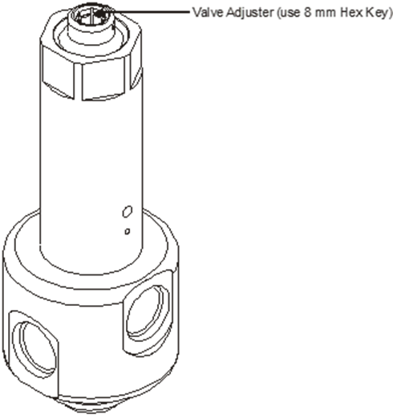

 

# 9.6 Checking the Over Pressure cut off operation

Checking the Over-Pressure Operation : 

To check the operation of the Overfil Pressure cut off:
-	Access the K-Factor switch on the K-Factor board.
-	Obtain the overfill pressure settings 0pa
-	Set the overfill pressure cut-off point to below the regulator pressure.
-	Set the over pressure time to (deb) 01.0 or 1 second.
-	For example, if the regulator pressure is 220 bar, then set the over-pressure to 100 bar. An exact value is not required; just make sure that the value is significantly lower than the regulator pressure.
-	Start a fill. The dispenser should stop the fill after 1 second.
-	Check the dispenser End of Sale indicator states that the fill has ended because of over-pressure. End of Sale Indicators.
-	Reset the over-pressure cut-off point to its original value.

 

# 9.7 Checking for leaks

Before you start, make sure you have: 
-	Soapy water
To check the dispenser for leaks:

**CAUTION:** Be careful not to spray or drip water into any of the dispenser electronics when checking for leaks.
-	Apply soapy water to all joins in the assemblies and fittings on the inside and outside of the dispenser, including the hose. 

If bubbles form, there is a leak with that assembly or fitting. The fitting may require tightening, or the seals might need to be replaced.

**DANGER:** You must isolate the gas supply and depressurise the dispenser before disassembling any component or adjusting any fitting. Serious injury may result if components are removed while the dispenser is under pressure.

-	Threaded SAE Fittings.
-	Adjustable Threaded SAE Fittings.
-	Compression Fittings.

-	To remedy a leak, refer to the appropriate section, depending on the leak is location.  
-	After checking for leaks, wipe any excess water off the dispenser to prevent corrosion.

# 9.7.1 Checking the Refuelling Hose for Leaks
Before you start, make sure you have:
-	Soapy water

To check the refuelling hose:
-	Visually check the refuelling hose for damage, such as fraying and cuts.
-	Apply soapy water to all valves and connections.

If bubbles form, there is a leak in that assembly or fitting. The fitting may require tightening or the seals might need to be replaced.

**DANGER:** You must isolate the gas supply and depressurise the dispenser before disassembling any component or adjusting any fitting. Serious injury may result if components are removed while the dispenser is under pressure.

Replace the hose if it is damaged or leaking.

 

# 9.8 Checking Isolation Ball Valve operation

Before you start, make sure you have: 
-	Soapy water
To check the operation of the isolation ball valve:
-	Close the isolation valve.
-	Open the dispenser access door.
-	Open the bleed valve on the utility manifold block (where fitted) and bleed the gas from the refuelling hose.
-	Close the bleed valve once the hose is degassed.
-	Start a fill. 

If the pressure gauge starts to move, the isolation ball valve is leaking or passing gas. 
-	Apply soapy water to the valve. 

If bubbles form, there is a leak in the assembly or fitting. The fitting may require tightening, or the seals might need to be replaced.
For servicing refer to Isolation Valve Seal Replacement.

 

# 9.9 Checking the 3way valve operation  

Before you start, make sure you have: 
-	Soapy water
Check the Sealing of the Three-Way Refuelling Valve 

To check the sealing of the three-way refuelling valve, apply soapy water to the valve. 

If bubbles form, there is a leak, in which case you should replace the three-way refuelling valve seals. 

**To check the operation of the three-way refuelling valve:** 

To check the operation of the three-way refuelling valve, do a test fill to check that the valve is filling the vehicle, and venting properly when you disconnect it from the vehicle. 

If bubbles form, there is a leak, in which case you should replace the three-way refuelling valve seals.

 

# 9.10 Draining the Filter

Before you start, make sure you have:
-	A 3/16" hex key
To drain the coalescing filter:
-	De-gas the dispenser.
-	Open the dispenser access doors.
-	Unscrew the drain plug from the bottom of the filter cover.
-	Allow all oil and water to drain from the filter*. 
-	If excessive amounts of oil and water are present, remove and replace the coalescing filters.
-	Screw in the drain plug and repeat steps 1 to 4 for all additional filters.

**NOTE:** Make sure you dispose of any fluids responsibly.

# 9.10.1 Filter Element Replacement
The coalescing filters are designed to trap dirt, moisture, oil, and other debris that may damage the valve seals.
Before you start, make sure you have:
-	A seal kit - Part number FC-FIL-0001
	1 x filter
	1 x filter bowl O-ring seal
-	O-ring lubricant
To remove the coalescing filter:
-	Degas the dispenser.
-	Drain the coalescing filters if they have not been drained already. 
-	Unscrew the filter bowl(s) with a spanner on the 22mm hex nut at the base of the filter bowl.
-	Remove the filter element.
-	Clean all oil and dirt off the components with a clean cloth.
To install the new coalescing filter:
-	Insert the new filter element and lubricated filter bowl O-ring seal. 

**CAUTION:** O-rings that are subjected to natural gas at high pressure swell when exposed to air. Once swollen, they cannot be reused and must be replaced.

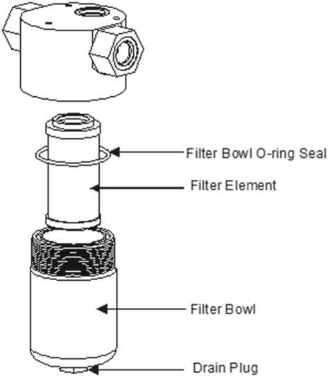

**NOTE:** Always use O-ring lubricant to prevent damage to the O-rings.

-	Screw in the filter bowl(s)
-	Check the dispenser for leaks.

 

# 9.11 Solenoid Valve Seal replacement

These instructions refer to the current Compac S2-350 solenoid valve. The solenoids are available in several types 
Standard and low temperature. Always quote the dispenser serial number when ordering parts and check the model number on the valve body before installation.

Before you start, make sure you have: 
- A seal kit - Part number FC-SK-0001
- 1 x Teflon valve seal
- 1 x solenoid top O-ring seal
- 1 x gas return line O-ring seal 

-	O-ring lubricant
-	Solenoid piston – Part number FC-VLV-PSTN-0001 
-	Solenoid top service kit standard. Part number FC-SVK-0003 (replace valve top if leak detected through stem)
-	Solenoid top service kit - low temperature option (-40 degrees C). Part number FC-SVK-0004 (replace valve top if leak detected through stem).

**CAUTION:** Never remove or service the stem. If it is leaking, it must be replaced using the appropriate top service kit.

**CAUTION:** Cleanliness is essential. When working on the open solenoid assembly, cover the opening with a cloth to prevent dust and dirt from entering.

**CAUTION:** O-rings that are subjected to natural gas swell when exposed to air. Once swollen, they cannot be reused and **must** be replaced.

**CAUTION:** The Nitrile O-rings have a life span of over 10 years from cure date but improper handling of these O-rings before use can shorten their useful life. 
O-rings will deteriorate if exposed to ozone or ultraviolet light so keep in original packaging and away from UV light. 
If unsure about their condition, do not use old O-rings and order new ones. 

**NOTE:** It is not necessary to remove the solenoid body from the dispenser to service the solenoid seals.

To remove the old solenoid valve seals:
-	De-gas the dispenser.
-	Switch off the power supply to the dispenser

**DANGER:** Never remove any electrical components without first switching off the power to the dispenser. Failure to turn off the power could result in an electric shock.

-	Unscrew the solenoid coil retaining nut and move the coil out of the way.
-	Remove the six cap screws from the solenoid top.

**NOTE:** *Do not remove the angled grub screw from the solenoid top. This is epoxied in place during manufacture and should never be removed.*

-	Remove the solenoid top and remove the old top O-ring seal and gas return O-ring.
-	Remove the solenoid spring.
-	Screw an M6 cap screw into the solenoid piston to withdraw it from the solenoid body.

-	Taking care not to damage the piston, hold the flat part of the piston with a spanner to prevent rotation, then unscrew the M6 x 12 mm cap screw from the bottom of the piston. This releases the solenoid seal retainer and valve seal.  
-	Discard the old valve seal.
-	Clean all oil and dirt off the components with a clean cloth and check that the bleed hole is not blocked.
-	While the solenoid is apart, inspect the solenoid piston centre seal and piston for wear, scratching or damage. Replace piston if required.

To install new solenoid valve seals:

-	Place the new valve seal and seal retainer on the cap screw.
-	Taking care not to damage the piston, hold the flat part of the piston to prevent rotation, and then screw the M6 cap screw into the bottom of the piston.
-	Insert a new gas return O-ring.
-	Insert the piston back into the solenoid body.
-	Insert the solenoid spring.
-	Replace the solenoid top O-ring seal.
-	Place the solenoid top back on the solenoid body, making sure that the locating dowel is engaged.
-	Screw in and tighten the six cap screws.
-	Replace the solenoid coil.

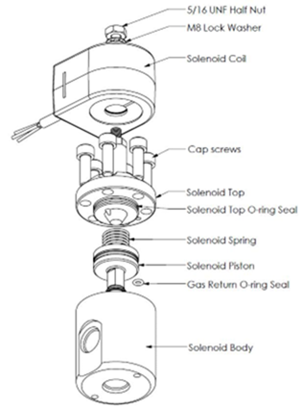

-	Re-power and re-gas the dispenser then check for leaks and correct operation of the valve

 

# 9.12 Solenoid Coil replacement

Before you start, make sure you have: 
-	Replacement solenoid coil FC-COIL-0005 (Compac S2-350).

**NOTE:** Solenoid coils are not interchangeable between models. Make sure you order the correct one by quoting the dispenser serial number. 
To replace obsolete coils, the entire solenoid will need replacing.

To remove the solenoid coil:
-	De-gas the dispenser.
-	Switch off and isolate the power supply to the dispenser.

DANGER: Never remove any electrical components without first switching off the power to the dispenser. Failure to turn off the power could result in an electric shock.

-	Remove the flameproof box lid to gain access to the C5000 Terminal board. 
-	Disconnect the appropriate solenoid coil wiring from the C5000 Terminal board board.

**CAUTION:** Take basic anti-static precautions by wearing a wristband with an earth strap. 

-	Loosen the gland on the flameproof box that is clamping the solenoid coil lead and pull the lead out of the gland. 

Undo the nut on the top of the solenoid valve that is securing the coil and remove the coil from the top of the valve.

To install the new solenoid coil:
-	To install a new solenoid coil, reverse the procedure above.

**NOTE:** Before replacing the lid on the flameproof box, make sure that the O-ring is not damaged and is seated properly in its groove. 
If the O-ring is damaged and needs replacing, replace it with an O-ring of the same size and specification (176 N70).

 

# 9.13 Complete Solenoid replacement

These instructions refer to the current Compac S2-350 solenoid valve. This replaces all previous solenoids.
Before you start, make sure you have: 
-	Solenoid valve standard 350 bar model (FC-VALVE-0035) or
-	Solenoid valve 350 bar O ring seal option for high oil content gasses (FC-VALVE-0036) or
-	Solenoid valve 350 bar low temperature option (FC-VALVE-0037) 

**NOTE:** Solenoid valves are supplied without coils. If you need the coil it must be ordered as well. 

**CAUTION:** Cleanliness is essential. When working on the open pipes and solenoids, cover the openings with a clean, lint-free cloth to prevent dust and dirt from entering.
To remove the old solenoid valve:
-	De-gas the dispenser.
-	Switch off the power supply to the dispenser.

**DANGER:** Never remove any electrical components without first switching off the power to the dispenser. Failure to turn off the power could result in an electric shock.

-	Undo the nut and remove the solenoid coil.
-	Undo the gland nuts connecting the solenoid valve to the pipework and manifold and remove valve.

To replace the solenoid valve:
-	Ensuring all surfaces are clean and any sealing plugs are removed from the valve, reconnect the pipework and tighten the gland nuts.
-	Replace the solenoid coil.
-	Repower and re-gas the unit, check for leaks and test for correct operation.

 

# 9.14 Regulator Valve Seal replacement

Before you start, make sure you have: 
- A regulator seal kit - Part Number FC-SK-0002
- 2 x regulator O-ring seals
- 2 x Teflon back-up ring
- 1 x Teflon valve seal
- O-ring lubricant 

To remove the old regulator valve seals:
-	De-gas the dispenser.
-	Open the dispenser access doors.
-	Unscrew the spring tube by placing a 1 ¼" spanner on the machine hex nut at the top of the spring tube.

**NOTE:** Do not unscrew the valve adjustment nut. The spring remains at the set tension. 

-	Unscrew the bottom plug in the regulator body.
-	Using a hex key inserted into the base of the piston to stop the piston from twisting sideways and being damaged, push the piston downwards out the bottom of the regulator body.
-	Hold the piston by the 8mm flat and remove the M6 cap screw from the bottom. 

**NOTE:** The M6 cap screw has a special hole through it. Never substitute it for a normal cap screw.

To install the new regulator valve seals:
-	Install the new valve seal. Make sure that the larger flat side of the seal faces upwards.

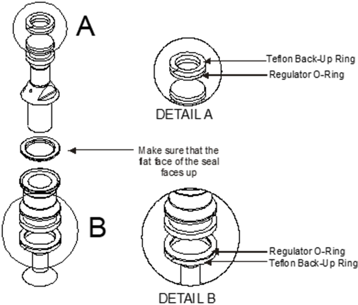

**NOTE:** *O-rings that are subjected to natural gas at high pressure swell when exposed to air. Once swollen, they cannot be reused and must be replaced.*  

**CAUTION:** The Nitrile O-rings have a life span of over 10 years from cure date but improper handling of these O-rings before use can shorten their useful life. 
O-rings will deteriorate if exposed to ozone or ultraviolet light so keep in original packaging and away from UV light. 
If unsure about their condition, do not use old O-rings and order new ones. 

-	Lever off the two regulator O-rings and two Teflon back-up rings.
-	Install two new regulator O-rings and two new Teflon back-up seals.

The back-up rings go on the outside of the O-rings. 

**NOTE:** Always use O-ring lubricant on the O-rings to increase the service life. 

-	Reassemble the piston.
-	Push the piston back up into the regulator body with a hex key. 

**NOTE:** Keep the piston straight, rotate it clockwise to prevent the new O-ring from catching or ripping. 

-	Screw in the bottom plug.
-	Screw on the spring tube until tight.
Check the setting and sealing of the regulator for correct pressure.

 

# 9.15 Isolation Valve Seal replacement
 
**NOTE:** Please make sure you identify the valve before disassembling it to make sure you have the correct seal kit available.  

This instruction only applies to the Parker make valve

Complete valve is part number FC-Valve-0001

Before you start, obtain the following replacement parts and equipment:
-	FC-SK-0010 Parker Isolation Valve Seal Kit
-	Refer to Spare Parts list for other items that you may need. 

To remove the isolation valve seals:  

**CAUTION:** Take care when disassembling the valve, as a lot of parts look similar.

-	De-pressurise the valve and remove it from the pipework.
-	Remove the handle and panel nut to remove it from the cabinet.
-	Disassemble the valve, as per the drawing below.
-	Undo the packing nut and remove packing washers, packing and stem.
-	Undo the end connectors and remove the seals, seat assembly and ball

Clean all components with a clean dry lint free rag.

**CAUTION:** O-rings that are subjected to Natural Gas at high pressure. Swell when exposed to air. Once swollen they must be replaced.

-	Blow compressed air (100 psi) through all ports to remove any impurities that may damage the seals in operation. 

**CAUTION:** Wear appropriate safety eye wear when using compressed air.

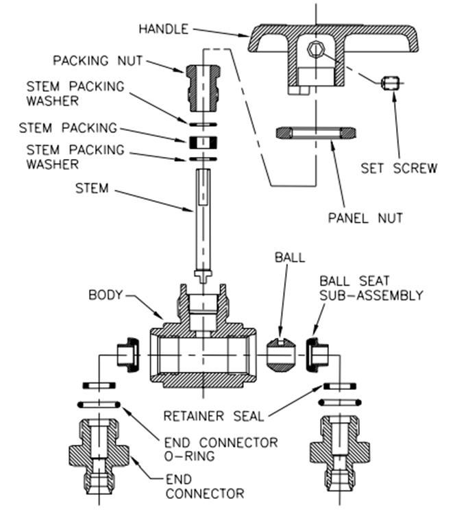

To replace the isolation valve seals: 

**CAUTION:** Take care to keep all parts clean while assembling.

-	Apply a light coating of approved grease to the ball then replace the ball and ball seat sub-assemblies, making sure the slot in the ball is at the top. 
-	Making sure the retainer seal and end connector O ring are in place, screw in the end connectors. Do not tighten yet. 
-	Locate the stem in the ball slot then replace the stem washers, stem packing and packing nut.
-	Open and close the valve a few times to seat the ball valve before tightening the end connectors and packing nut. 
-	Reattach the valve to the cabinet and reconnect the pipework.
-	Reapply gas to the valve and check for leaks.

 

# 9.16 Bleed Valve Replacement
The bleed valve seldom gives problems and is not serviceable. 

For a replacement valve and instructions if required, contact your Compac service agent with your Model and Serial numbers.

 

# 9.17 Pressure Relief Valve Replacement
The pressure relief valve seldom gives problems and is not serviceable.  
For a replacement valve and instructions if required, contact your Compac service agent with your Model and Serial numbers.

 

# 9.18 KG100 Meter Replacement

To remove the meter:
-	Shut off gas supply and degas the meter.
-	Remove the inlet and outlet pipes from the old meter.
-	Unscrew the SAE fittings from the meter inlet and outlet.
-	Take note of the position and orientation of the communications plug then unplug the meter cable from the K-Factor board and cut any cable ties that hold it in place. 
-	Undo the four bolts that hold the meter on the dispenser frame.
-	Remove the old meter.

To replace the meter:
-	Secure the new meter to the dispenser frame using the four bolts.
-	Plug the communications cable into the K-Factor board.
-	Screw the SAE fittings into the meter inlet and outlet.
-	Install the inlet and outlet pipes.
-	Cable tie the communications cable to avoid pulling or damage to it.
-	Load the meter ID into the K-Factor board
-	Pressurise the meter and check for leaks.
-	Calibrate the meter in accordance with the instructions in the dispenser service manual.

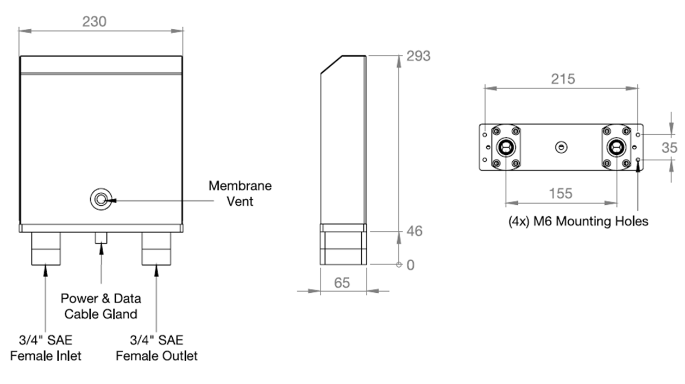

 

# 9.19 Refuelling Hose Replacement

To remove the refuelling hose:
-	De-gas the dispenser.
-	Undo the JIC hose connection at the dispenser's outlet block.
-	Undo the connection between the hose and the nozzle assembly. 

To install the new refuelling hose:
-	Attach the nozzle assembly to the new hose.
-	Attach the new hose to the dispenser at the outlet block. 
-	Re-gas the dispenser and push the Start button to fill the new hose assembly with gas.
-	Check all hose connections for leaks by applying soapy water mixture and looking for bubbles.

# 9.20 Power Supply Fuse Replacement

**NOTE:** There are three fuses used in the C5000 Flame proof box. 
Before you start, make sure you have the following fuses with these ratings: 
- F1 = 1.6 A 
- F2,F3 = 0.5 A 
- OR Compac fuse kit F-C5PWR-FKE 

Fuse locations are displayed on the C5000 terminal board in the flameproof box. 
**NOTE:** Every new dispenser is supplied with one spare F1, F2 and F3 fuse, located on the inside of the flameproof box lid.

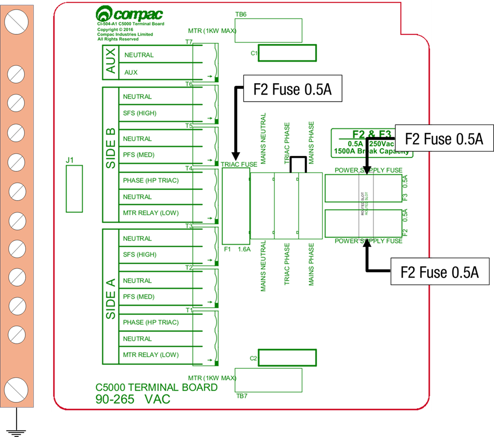

To remove the C5000 terminal board fuse(s):
-	Degas the dispenser.
-	Switch off the power supply to the dispenser.

**DANGER:** Never remove any electrical components without first switching off the power to the dispenser. Failure to turn off the power could result in an electric shock.

-	Remove the flameproof box lid.
-	Remove the blown fuse and discard.

**CAUTION:** Take basic anti-static precautions by wearing a wristband with an earth strap. 
To install the new C5000 terminal board fuse(s):
-	Replace the blown fuse element with a new one of equal type and rating.

**CAUTION:** You must use the correct rating when replacing a fuse. The correct ratings are printed next to each fuse on the printed circuit board. Using the incorrect fuse rating may compromise the intrinsic safety of the dispenser.

-	Replace the flameproof box lid, ensuring that the O-ring in the lid engages in its associated groove. 
-	Turn on the power to the dispenser.

**DANGER:** Do not power up the dispenser with the flameproof box lid removed.

**NOTE:** *Before replacing the lid on the flameproof box, make sure that the O-ring is not damaged and is seated properly in its groove. 
If the O-ring is damaged and needs replacing, replace it with an O-ring of the same size and specification (176 N70).*

 

# 9.21 Power Supply Replacement
Before you start, obtain the following replacement parts 
-	Replacement Power Supply part number F-CP-C5K-PS
To remove the C5000 Power Supply:
-	De-gas the dispenser.
-	Switch off the power supply to the dispenser.

**DANGER:** Never remove any electrical components without first switching off the power to the dispenser. Failure to turn off the power could result in an electric shock.

-	Remove the flameproof box lid to gain access to the C5000 power supply board.

**CAUTION:** Take basic anti-static precautions by wearing a wristband with an earth strap. 

-	Undo the screws that hold the earth bar in the Flameproof box, taking care not to lose any of the spacers or other mounting hardware
-	Undo the screws that hold the terminal board in the flame proof box and remove the terminal board.
-	Undo the screws that hold any coms or GPIO board into the C5000 processor board.
-	Undo the screws that hold the C5000 processor board in the flameproof box and remove the C5000 processor board.
-	Undo the screws that hold the C5000 power supply board in the flame proof box 
-	Carefully slide out the C5000 power supply board to gain access to the plugs on the Com bus Cable that connects into the bottom PCB, and unplug this.

Completely remove the C5000 power supply board.

 
To install the new C5000 power supply:
-	To install the new C5000 power supply, reverse the procedure above.

**DANGER:** Before replacing the lid on the flameproof box, make sure that the O-ring is not damaged, and is seated properly in its groove. If the O-ring is damaged and needs replacing, replace it with an O-ring of the same size and specification (176 N70). 

**NOTE:** It should not be necessary to recalibrate the dispenser. However, in some locations, this may be legally required as per the Calibrate the Meter section.

# 9.22 Processor Board Replacement

Before you start, obtain the following replacement parts 
-	Replacement C5000 Processor part number **F-CP-C5K-PROCES**

To remove the C5000 processor board:
-	De-gas the dispenser.
-	If possible, record all the set-up data by accessing the **Parameter** switch and the **K-Factor** switch. The Software Set-Up and Upgrade section contains details on obtaining this information. 
-	Switch off the power supply to the dispenser.

**DANGER:** Never remove any electrical components without first switching off the power to the dispenser. 
Failure to turn off the power could result in an electric shock.

-	Remove the flameproof box lid to gain access to the C5000 Processor board.

**CAUTION:** Take basic anti-static precautions by wearing a wristband with an earth strap. 

-	Undo the screws that hold any coms or GPIO board into the C5000 processor board.
-	Undo the screws that hold the C5000 processor board in the flameproof box and remove the C5000 processor board.

To install the new C5000 processor board:
-	Put the new C5000 board in place of the old one, 
-	Do up the screws that hold the C5000 processor board in the flameproof box.
-	Do up the screws for any coms or GPIO board into the C5000 processor board.
-	Reinstalled the lid on the flameproof box

**DANGER:** Before replacing the lid on the flameproof box, make sure that the O-ring is not damaged, and is seated properly in its groove. If the O-ring is damaged and needs replacing, replace it with an O-ring of the same size and specification (176 N70). 

-	Switch on the power supply to the dispenser.
-	Press the K-factor button on the K-Factor board to sync the settings in the K-Factor board with the C5000 processor board 
-	Check dispenser operation

**NOTE:** It necessary to recalibrate the dispenser.

# 9.23 Temperature Pressure Board Replacement 

Before you start, obtain the following replacement parts 

Replacement Temperature and Pressure board part number: **F-CP-C5K-CNG-TP**

To remove the temperature pressure board:
-	De-gas the dispenser.
-	Switch off the power supply to the dispenser.

**DANGER:** Never remove any electrical components without first switching off the power to the dispenser. Failure to turn off the power could result in an electric shock.

-	Access the temperature pressure board. 

**CAUTION:** Take basic anti-static precautions by wearing a wristband with an earth strap.

Unplug all wiring from the temperature pressure board and remove the board from its position.
To install the new temperature pressure board:
-	Put the new board in place of the old one and plug all the wiring back in the same order as before. 
-	Make sure the Dip switches are the same as the board that was taken out
-	Turn the power to the dispenser back on.
-	Check Dispenser operation. Checking Dispenser Operation.  

**NOTE:** It should not be necessary to re-calibrate the dispenser unless a pressure transducer or temperature probe needs to be replaced.

# 9.24 Dispenser Software Upgrade or Replacement
You can upgrade the dispenser software via USB Stick. Make sure the USB stick is formatted as FAT32 and has the new dispenser software loaded on it.

**CAUTION:** Before working on the dispenser electronics, take basic anti-static precautions by wearing a wristband with an earth strap. 

To record set-up data and tote information:
-	Access the K-Factor board by opening the cover behind the main display. 
-	Record all the set-up data by accessing the Parameter switch and the K-Factor switch. Refer to Parameter Switch Settings and K-Factor Switch Settings to obtain this information.

The following data is required from the Parameter switch :
	Dispenser pump price.
	Dispenser pump number.
	Dispenser Setting
	Software Program number, if you are upgrading to a new version. 

The following data is required from the K-Factor switch:
	The K-Factor. There is a value for side A and side B in dual hose dispensers.
	Configuration Code C.
	The Density Factor.

-	Record the tote information by pressing the nozzle switch or start button quickly five times
 
To install the new C5000 software
-	Switch off the power supply to the dispenser.

**DANGER:** Never remove any electrical components without first switching off the power to the dispenser. Failure to turn off the power could result in an electric shock.

-	Remove the flameproof box lid to gain access to the C5000 Processor board.
-	Install the USB stick for the software that you want to install. If there is a coms or GPIO card installed on the C5000 processor board, you might have to remove it.
-	Reinstalled the lid on the flameproof box

**DANGER:** Before replacing the lid on the flameproof box, make sure that the O-ring is not damaged, and is seated properly in its groove. If the O-ring is damaged and needs replacing, replace it with an O-ring of the same size and specification (**176 N70**). 

-	Switch on the power supply to the dispenser.
-	The Display will display hold. The display will change from hold to calib, this mean that the software has been upgraded.
-	Press the K-Factor board button on the K-Factor board to clear the caib from the display and sync the K-Factor board settings will the C5000 processor board.
-	Check the dispenser operation Checking Dispenser Operation.
 
 

# 10.0 Dispenser Calibration

# 10.1 Meter Calibration

Calibrating the meter involves: 

- Comparing the dispensers stated amount dispensed to actual amount dispensed.  
- Adjusting the K-Factor if accuracy is not within the required tolerance.  

**NOTE:** *The K-Factor for each new dispenser is factory set but the Dispenser must be calibrated on site.*  

To test the meter accuracy: 
Record the dispenser’s current density factor and set it to read out in kg Density Factor (d5F). 

- Test the meter accuracy using either Calibration Test Fill Procedure Method 1 or Calibration Test Fill Procedure Method 2. 

To calculate the meter K-Factor:
- Make sure that the dispenser is idle.
- Press and release the **K-Factor** button on the K-Factor board until the K-Factor is displayed

Calculate the new K-Factor with the following formula: 

New K Factor=existing K Factor×(Dispensed quantity)/(Displayed quantity) 

Example: 

Existing K Factor=0.98  
Displayed quantity=5.80 
Dispensed quantity=6.00kg 
New K Factor=0.98×(6.00/5.80) =1.0138 (4dp)

To input dispenser settings:
- Input the new meter K-factor.
- Set the density factor back to its original value. (dSF).

**Calibration Test Fill Procedure Method 1**

Method 1 of checking calibration involves filling a gas bottle and comparing the read-out scale reading with the dispenser display reading.

Before you start, make sure you have: 

-	Certified weighing scales with a read-out accuracy of +/- 20 g or better and a range of  0 – 120 kg
-	A CNG cylinder with a fill and release valve

To carry out the Calibration Test Fill Procedure Method 1:

-	Put the CNG cylinder on the scales.
-	Empty the CNG cylinder by venting it to the atmosphere.

**DANGER:** Always vent cylinders in a safe manner and safe location.

-	Zero the TARE read-out on the scales. 
-	Fill the CNG cylinder from the Dispenser. 
-	Compare the read-out weight (Dispensed Quantity) on the scales with the dispenser display (Displayed Quantity).

If the results are not within 0.5% of each other, you will need to change the calibration, as per the Calculate and Set the New K-Factor section above.

**Calibration Test Fill Procedure Method 2**
 
Method 2 of checking calibration involves filling a vessel and comparing a Master Meter reading with the dispenser display readings. 
This method assumes that the master meter is sufficiently accurate and reliable enough to be considered a good reference. 
Before you start, make sure you have a Master Meter 

To carry out the Calibration Test Fill Procedure Method 2:
-	Plug the dispenser refuelling probe into the Master Meter, and then plug the master meter refuelling probe into a vehicle to fill.
-	Turn on the Master Meter valve, if applicable, and reset to zero.
-	Fill the vehicle from the dispenser. 
-	Turn off the dispenser refuelling valve and Master Meter valve, if applicable. 
-	Compare the Master Meter read-out (Dispensed Quantity) with the dispenser display (Displayed Quantity).

If the results are not within 0.5% of each other, you will need to change the calibration, as per the Calculate and Set the New K-Factor section above.

# 10.2 Pressure Transducer Calibration 

Calibrating the dispenser pressure transducers is done by setting the Pressure probe calibration points. 
The following procedure is how to set these points.

**NOTE:** *The pressure transducers are calibrated at the factory and usually do not require recalibration.*

To set pressure probe calibration points: 

-	Degas the dispenser and close all outlet isolation valves
-	Turn on the gas to the dispenser. 
-	Remove the nozzle from its holster or press the start button, allowing gas to pass through the dispenser.
-	Slowly open the outlet isolation valve and watch as the pressure gauge begins to rise. Shut the valve when the reading is approximately 10 bar.
-	Hang up the nozzle or press the stop button.
-	Set the uA1L (low pressure probe 1 calibration point)to 10. If there are 2 pressure transducers per side set uA2L (low pressure probe 2 calibration point) as well
-	Remove the nozzle from its holster again or press the start button.
-	Increase the gauge pressure to approximately 200 bar.
-	Hang up the nozzle or press the STOP button.
-	Set the uA1h (high pressure probe 1 calibration point) to 200. If there are 2 pressure transducers per side set Ua2h (high pressure probe 2 calibration point) as well
-	Check current calibrated pressure is the same as the Pressure gauge 

# 10.3 Ambient Temperature Sensor Calibration

Calibrating the Ambient Temperature Sensor involves:
-	Comparing the dispensers stated temperature to the actual temperature. 
-	Adjusting the ambient temperature reading if it is found to be incorrect.

To test the sensor accuracy: 

Using a calibrated temperature meter, determine the temperature of the body of the dispenser Ambient temperature sensor. 
Access the current dispenser ambient temperature reading.
To adjust the dispenser reading:

Adjust the dispenser’s ambient temperature reading to match that of the calibrated temperature meter.

# Technical Specifications

Operating Conditions:

Compac CNG Dispensers (excluding hose assembly) are desgned to operate within the atmospheric environment. 

Gas parameters are outlined below

CNG Dispensers require the following operating conditions

|Parameter |Condition| 
|----------|---------|
|Air Temperatue range |- 25 °C to + 55 °C |
|Air humidity range   |10% to 95% |
|Gas type             |High pressure natural gas (CNG)|
|Gas temperature      |- 40 °C to + 80 °C (continuous)|
|                     |- 55 °C to + 80 °C (intermittent)|
|Maximum water Dew Point |- 32°C at 250bar|

**General specifications**

Power Requirements are 230V +/-10%, 50Hz, 2A

|Specific specifications|Standard model|High Flow Model| Ultra High Flow Model|
|-----------------------|--------------|---------------|----------------------|
|**Flow** (The maximum flow rate is not only determined  by the type of dispenser  but also depends on the size of the refuelling hose,  the model of the breakaway,  the type of refuelling nozzle, and the vehicle coupling.) |1 – 15 kg /min |1-50 kg /min |1 – 80 kg /min
|**Pressure Rating** (350 bar options utilise air actuated valves  and require a compressed air supply.) |275 bar   (350 bar option) |275 bar  (350 bar option) |350 bar
|**Accuracy** |+/- 1.0% |+/- 1.0% |+/- 1.0%
|**Meter** |Compac KG100   Coriolis Mass flow |Compac KG100   Coriolis Mass flow |Compac KG100   Coriolis Mass flow
**Internal Pipework** |1/2” |1/2” |1/2” or 3/4"|
|**Refuelling hose** |3/8” |1/2” | 1/2” or 3/4"|
|**In-line breakaways** |Various available |Various available |Heavy Duty|
|**Refuelling valve** | NGV1 or NZ 7/16" probe | NGV1 or NGV2 |NGV2 |
|**Master (without   hoses or high masts**) |600W x 400D x 1220H |600W x 400D x 1220H |600W x 400D x 1220H|
|**Laser (without   hoses or high masts**) |830W x 450D x 1608H |830W x 450D x 1608H |830W x 450D x 1608H|
|**Legend (without hoses)** | 850W x 425D x 2355H |850W x 425D x 2355H |850W x 425D x 2355H
|**Minimum flow cut off** |0.5 -10 kg/min (settable) |0.5 -10 kg/min (settable) |0.5 -10 kg/min (settable) |
|**Maximum flow cut off** |10 - 99  kg/min (settable) |10 - 99  kg/min (settable) |10 - 99  kg/min (settable)

 

# Component Specifications

See below for information on components.

|Equipment Item |Compac Code |Specifications |Description |
|---------------|------------|---------------|------------|
|**Coalescing filters**| |Grade 10 Coalescing Filter |The coalescing filters are designed to trap dirt, moisture, oil,  and other debris that may damage the valve seals.  A Grade 10 coalescing filter will remove 95% of liquid aerosols   in the 0.3 to 0.6 micron range.
|**Compac filter/ check valve** | FCVCI-12-SS |3/4” SAE female inlet.  2 x 3/4” SAE female outlets. 350 bar max. |The filter/check valve prevents back-flow from the high storage to the medium and low storage, and from the medium storage to the low storage.  The valve has a metal to metal seat and should not leak or require servicing.
|**Solenoid valve** |SCI-12-SS |3/4” SAE female inlet.   3/4" SAE female outlet.   275 bar max. |The high flow solenoid valve is designed to control the flow of gas in a CNG Dispenser.   Between the inlet and outlet, the valve opens with a differential pressure of more than 275 bar.|
|**Regulator valve** |RCI-12-SS |3 x 3/4" SAE female inlets.   3/4" SAE female outlet.   275 bar max |The regulator is a high flow valve, designed to limit the outlet pressure of the dispenser.   In the **fixed pressure** dispenser, the regulator limits the final fill pressure to 200 bar.   In the **temperature compensated** dispenser, the regulator acts as a safety device to limit the amount of over-pressure if the main solenoid fails to shut off at the correct pressure. 
|**NZ probe** | 7/16" NZ Probe 1-15 kg/min |1/4" NPT port. | In New Zealand, the probe complies with NZS 5425.1.   In Australia, the probe complies with AS/NZS 2739.
|**Nozzles** | OPW CT1000 1-50 kg/min |9/16" SAE inlet port   200 bar max. |Nozzles allow refuelling for high pressure NGV applications.|
|            |OPW CT5000 1-80 kg/min |7/8" SAE inlet port 250 bar max. | Nozzles allow refuelling for high pressure NGV applications.
|**Inline breakaways**|OPW ILB- 1  1-50 kg/min | 9/16" SAE inlet & outlet ports.  250 bar max.  150 to 200 lbs.  (668 to 890 N)   breakaway force. |Inline breakaway with reconnectable design.   Corrosion-Resistant with high flow quick fuelling of large storage vehicles.
|            |OPW ILB-5  1-80 kg/min |7/8" SAE inlet & outlet ports.   310 bar max.  150 to 200 lbs.  (668 to 890 N) breakaway force. |Inline breakaway with reconnectable design.   Corrosion-Resistant with high flow quick fuelling of large storage vehicles.
|**Isolation ball valve** |||Parker 2-way 8 series ball valve
|**Backlit LCD Display** |Compac 7D1 ||The display has seven digits for amount, seven digits for quantity and five digits for unit price.  
**Analogue Pressure Gauge** |||Dual scale, class 1 pressure gauges are available with psi and either bar, MPa, or kPa.   CE Approved
**CNG Hose** ||Single and twin line  3/8", 1/2" or 3/4". |The hose is specifically designed to dissipate static electrical build-up and wear resistance.

# Hydraulic Layout

# Dispenser Fittings

Aside from some NPT fittings located in the utility manifold, all fittings used in a Compac CNG Dispenser are SAE.  Some SAE fittings are adjustable to allow for rotational positioning of components such as solenoids.  Nipples, tees, and elbows are used, but the procedure is the same for each.

Fitting replacement and servicing: 

When replacing, disassembling or tightening fittings:
1.	De-gas the dispenser 
2.	Switch off the power supply to the dispenser.

**DANGER:** Never remove any electrical components without first switching off the power to the dispenser.  Failure to turn off the power could result in an electric shock.

3.	Make sure that your work area (including the vice, workbench, tool storage area, and floor) are totally clean of particles or previous work.  Cleanliness and correct assembly practice can avoid most seal problems. 
4.	Make sure that the gas inlet pipes are properly supported before connection.
5.	Refer to one of the following procedures, depending on the fitting that you are using:
- Connect Threaded SAE Fittings
- Connect Adjustable threaded SAE Fittings 
- Connect Compression Fittings 

**Connecting SAE Fittings**
1.	Inspect the components ensuring that the threads and sealing faces are clean and undamaged.
2.	Lubricate the O-ring with a light oil.
3.	Screw the components together by hand until the O-ring touches the face of the port.
4.	Tighten the fitting firmly with a suitable spanner.

**CAUTION:** Never use thread tape on SAE parallel fittings.

**Connecting Adjustable SAE fittings**

1.	Inspect the components ensuring that the threads and sealing faces are clean and undamaged.
2.	Lubricate the O-ring with a light oil. 
3.	Back off the lock nut fully so that the O-ring and washer are on the plain shank of the fitting. 
4.	Screw the components together by hand until the O-rings touch the faces of the ports.
5.	Position the components to the desired alignment.
6.	Hold the fitting in position and firmly tighten the lock nut.

**CAUTION:** Never use thread tape on SAE parallel fittings.

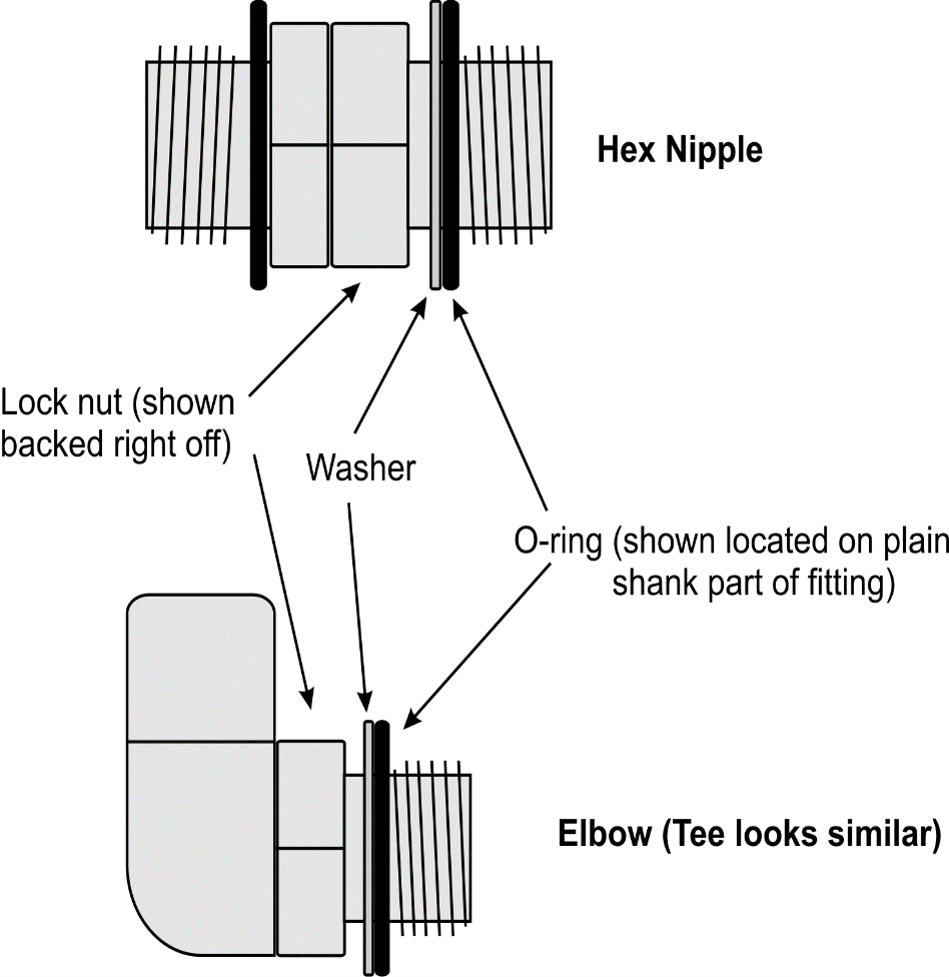

**Connecting Compression Tube Fittings**
1.	Ensure the end of the tube is square, not deformed, clean and free from burrs inside and out.
2.	Remove the nut from the fitting and ensure the two ferrules are present and correctly orientated.
3.	Replace the nut and insert the tube ensuring it is located hard up against the internal shoulder of the fitting.
4.	Pre-swage the tube by tightening the nut by hand and then a further 1 1/4" turns.
5.	Disassemble the fitting and inspect the pre-swaging. The ferrules should square and unable to be removed from the tube. 
6.	Reassemble the fitting, tightening it by hand and then a further 1/4" turns with the appropriate spanner.

**NOTE:** Correctly made tube should not need to be sprung into position.

# Electrical Drawings

**CNG Dispenser typical Electrical Schematic**

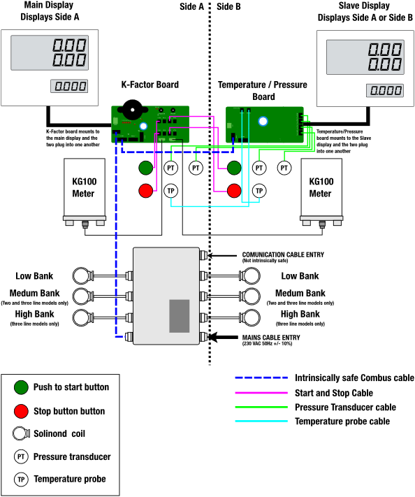

# Power supply

The C5000 power supply is found within the flameproof box, located on the unit. 
The power supply contains the processor board, comms interface board and the terminal board. 

# Incoming mains

Incoming mains connections should be brought in to the terminal board. 
An emergency stop connection, if desired, can also be wired into the terminal board, shown below.  This will be in place of the normal loop between the triac and main phases. Wires have standard colours which are shown.  
In case these are unclear, the colours are as follows: 
- Incoming mains phase: Brown
- Incoming mains neutral: Blue
- Incoming mains earth: Green/Yellow
 

# Solid State Relays (Triacs)
There are 7 separate solid state relays (small triacs) on the C5000 terminal board.  
The output terminals for these triacs are T1 to T7. See below for information about the use of these outputs.

|Terminal name|Function|
|-------------|--------|
|T1|Solenoid Low Bank Side A |
|T2|Solenoid Medium Bank Side A |
|T3|Solenoid High Bank Side A |
|T4|Solenoid Low Bank Side B |
|T5|Solenoid Medium Bank Side B|
|T6|Solenoid High Bank Side B|
|T7|Auxiliary Output for Fill Active|

**Auxiliary Output for Fill active and Beacon lights** 

In Single Hose CNG Dispensers, the 230V low current output T7 is turned ON for the duration of the fill. 

This can be used to switch a contactor or relay to operate an external light to indicate a fill is in progress (example a Beacon Light) 

**GPIO wiring for remote push to start** 

In this application the start signal will wire to IN1 terminal on the J1 connector. The signal from the PLC should be at least a 0.5 second 3  to 24 volt DC pulse. 

The end of fill indicator is wired to the OUT terminal on the J2 connector.  
This is an open collector output. Depending on the PLC you might have to install pullup resistors on the input to the PLC. 

The Output pulse signal is to be wired to the OUT terminal on the J2 connector. Like the end of fill indicator, the output is and open collector. 

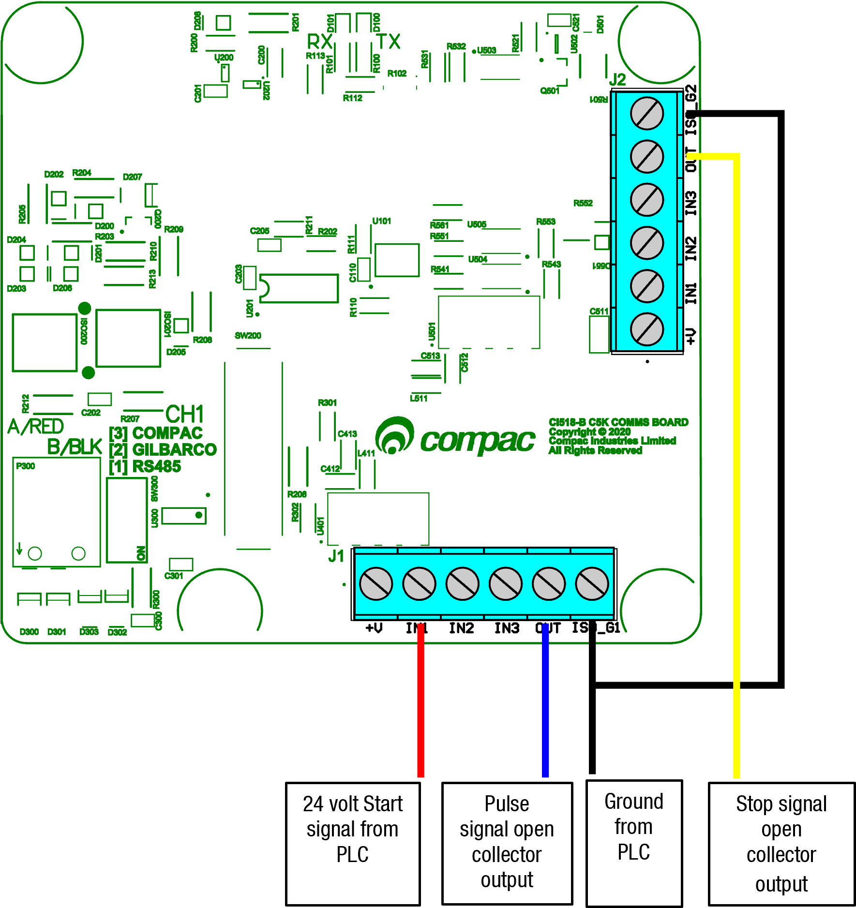

# C5000 K-Factor board

The Compac C5000 K-Factor board is the Main Calculator in the Compac Dispenser. 
It communicates with the KG100 meter to get the current mass and returns it to the C5000 Processor board. It also reads the Start and stop buttons for both sides (side A and side B). 
The Compac C5000 K-Factor board also is a user interface enabling the setup operation of the dispenser 
These set-up interfaces (located on the drawing) are: 
- The Parameter switch.
- The K-Factor switch.

# Temperature Pressure Board
The Temperature pressure board is responsible for the following tasks: 
•	Communication to the slave display 
•	Reading the Gas temperature probe 
•	Reading the ambient temperature 
•	Reading the Pressure transducer  
•	Communication to the C5000 Processor board 

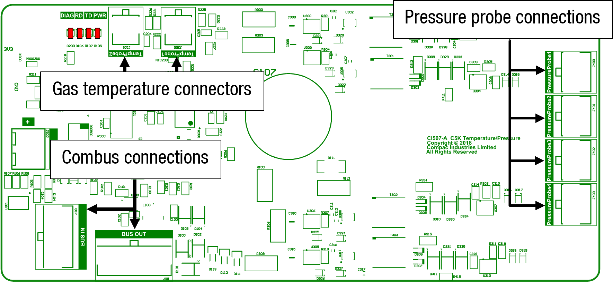

# Spare Parts

The following lists contain the most commonly used spare parts and kits for Servicing Compac Dispensers.  They are not an exhaustive list of all possible parts for current or historical Dispensers. If a part you want to order is not listed, please contact the Compac spare parts department for a complete listing. 
Please quote the Dispenser serial number to ensure that you are supplied the correct parts 
Part numbers in the list below are for standard -25°C Dispensers. 
Special parts are required for -40°C rated Dispensers. These are not included in the list below

|Location|Part number|Description|
|--------|-----------|-----------|
|Flameproof box|F-CP-C5K-COMMS|Comms board|
|A|F-CP-C5K-CNG-TP|Temperature Pressure board CI507
|A|F-CP-C5K-DSPY7D1|Main LCD Display|
|A|F-CP-C5K-KFACT|K-Factor board CI502|
|A|F-BA-TOTE-A-K|Electromechanical Totalizer|
|B|FC-GAUGE-0001|Pressure Gauge 100mm bar and psi -25°C|
|B|FC-GAUGE-0006|Pressure Gauge 100mm Mpa and psi -25°C|
|C|FC-VALVE-0001|Outlet Isolation Valve|
|D|FC-PBSW-ESTOP|Stop Switch|
|D|FC-PBSW-START|Start Switch|
|Flameproof box|F-CP-C5K-PROCES|C5K Processor board|
|Flameproof box|F-CP-C5K-PS|C5000 Power Supply|
|Flameproof box|F-CP-C5K-TERM|Terminal board|
|Hydraulics|F-D-MTR350-C5|C5K KG100 Mass Flow Meter|
|Hydraulics|FC-COIL-0005|Coil for Compac Solenoid| 
|Seal kits|FC-SK-0001|Solenoid seal kit|
|Seal kits|FC-VALVE-PSTN-0001|Solenoid piston| 
|Seal kits|FC-SK-0002|Regulator seal kit|
|Seal kits|FC-FIL-0001|Filter element and oring|

# Troubleshooting

This **troubleshooting** section outlines issues that you may encounter when using the dispenser, and provides recommended actions. 
For sites where the temperature falls below –10°C, power should only be removed from the dispenser for servicing.

**For all problems not listed here please contact your service agent**

|Problem|Likely cause|Recommended action|
|-------|------------|------------------|
|The C5000 electronics are not working.  The indicator LEDs are off and nothing  happens when you lift the nozzle  (i.e., no beeps or 888888s are displayed). |Unacceptable voltage spikes are causing  the fuses on the C5000 to blow.|Fit a voltage-stabilising UPS to the dispenser.  Contact your service agent.
| |There is low input voltage. |Turn the dispenser off and then on again. Check power supply to dispenser.
|A display LCD segment is always on or always off |Display is faulty. |Contact your service agent
|When the Start button is pressed, the dispenser   does not display the 88888s and reset for the next fill. |The dispenser number has not been set. |Set the dispenser number.|
||The Start button or nozzle switch is faulty, stuck, or broken.| Check that the nozzle switch is operating correctly and is not broken.  Check the nozzle switch mechanism is free to move in and out. Contact your service agent.
||The connection between the forecourt controller   and dispenser communications connection is faulty. |Check the forecourt controller.  Contact your service agent.
|The dispenser is under filling the vehicle | The pressure in the storage cascades is lower than target filling pressure.|This is not a dispenser fault.  If cascade pressure is above target filling pressure, please contact your service agent.
|The preset display is flashing after a fill. |The preset amount has been exceeded.   **NOTE:** The preset display will stop flashing when the next fill is started |If problem continues contact your service agent.|
|The dispenser stops at 9999.99, 99999.9,   or 999999 units according to where the decimal point is set.|The dispenser will stop dispensing if either the money or the quantity displays ever reach these values.| Hang up the nozzle to reset the display and restart. This is not a dispenser fault

# End of Sale Indicators

The End of Sale indicator (EOS) allows you to determine the reason why the last fill ended. 
This can be very useful for fault finding and diagnostics.

To View the End of Sale indicators: 
- Press and release the Parameter switch until the required hose number is displayed. 
- The number in the unit price display is the end of sale indicator for the hose number shown 
See the table below for the meaning of the number displayed. 

|Number|Meaning|Checks|
|------|-------|------|
|1|Nozzle switch de-activated (does not apply to push to start dispensers).
|2|Preset or temperature compensated value reached.  **Normal end of sale message for temperature compensated  and Fast Fill dispensers.**|
|3|Fill timed out. Start button pressed, or nozzle lifted, without flow.|Check inlet gas pressure.   Check solenoid operation.  Refer Solenoid Problems  Check nozzle and breakaway for blockages.|
|4|The dispenser was stopped by a remote device such as a Point of Sale (POS)  or Compac Controller.|Check that the point of sale is not sending a stop command  and is correctly configured.|
|5|Maximum display value reached.|Check display resolution (Sr) setting. Refer Display Resolution
|7|An error has occurred.  The error will be shown on the main display.|Check error code reason.  Refer Error Codes
|8|Outputs sequenced normally and dispenser finished on the low flow cutoff setting.  **Normal end of sale message for regulator controlled dispensers** |
|12|Parity error on main display.  This is caused by a fault in the display or a bad connection in the display wiring loom.|Check displays are dry and all connections tight. Try swapping with another display if available.
|14|Main display not detected. This is caused by a fault in the display or a bad connection in the display wiring loom.|See above.|
|20|The pressure at the first measurement was within 20bar of the calculated maximum pressure.|Check for blockage in the fuel delivery hose, breakaway or vehicle pipework.|
|21|The pressure at the second measurement exceeded the calculated maximum pressure.|Check for blockage in the fuel delivery hose, breakaway or vehicle pipework.
|22|The pressure at the third measurement exceeded the calculated maximum pressure. |Check for blockage in the fuel delivery hose, breakaway or vehicle pipework.
|25|5top switch operated.| Check the stop switch wiring and switch operation. Refer CNG Dispenser Electrical Schematic|
|26|Twin pressure sensor values (when fitted) do not agree.|Check pressure sensor calibration.|
|30|Maximum flow rate exceeded.|
|31|Over-pressure switch has been activated.|
|32|Dispenser on Hold. (No fuel will be dispensed).|

# Error Codes

These are all the Error codes available in the C5000. Some are product specific so will not be found in all applications.

|Error Code      | Fuel specific | Possible causes                                | Suggested action  
-----------------| --------------| -----------------------------------------------| ---------------- 
**Er 3   Err 3**   |No             |Price not set in the Dispenser   Pump number not set in the Dispenser                 |1. If the Dispenser is connected to a Site Controller, the price on the Dispenser should be set to 0.00 and the pricing should be sent from the Controller   2. If the Dispenser is not connected to a Site Controler (ie. it is operating in standalone mode), then the price must be set in the Dispenser.   Set the hose number in the dispenser
**Er 8   Err 8**   |No             |Excessive reverse flow                          |Check that product is not flowing back into the tank once the delivery has finished. This can occur if the non-return valves on site are leaking
**Er 9   Err 9**   |No             |The Flow Meter is in an illegal state           |Re-power the Dispenser   Check Meter cable for loose wires or bad connections   Replace the Meter or the Encoder board on the Meter   
**Err91**           |No             |Meter sequence error                            |If 3rd party Meter, check the wiring
**Er 10   Err 10** |No             |Memory Error. Configuration data lost or corrupted|Re-configure Dispenser. If problem persists, replace Memory or Processor Board             
**Er 12   Err 12** |No             |Display error                                   |Replace Display
**Err 13**          |No             |Slave board has restarted                       |Power or Hardware failure
**Err 14**          |No             |K Factor board offline                          |Check the Bus Connections and C5K Power Supply
**Err 15**          |No             |K Factor board has restarted                    |Power or Hardware failure
**Err 16**          |No             |K Factor board is not talking to the LCD Display|Check wiring   Replace the K factor board or LCD Display       
**Err 31**          |No             |Transaction has ended but fuel is still flowing |The Solenoid is leaking. Repair or replace solenoid
**Er 41   Err 41** |No             | Pump not communicating with Controller          |1. If only one pump on the site is not communicating with the Controller, then the fault is likely to be in the pump.   a. Check the comms wire connection on the comms board   b. Check the diagnostic LEDs on the comms board in the Dispenser to diagnose cause   c. Check the configuration and setup in the Dispenser   2. If all pumps are not communicating, check the comms wire connections on the comms board   a. Check comms cables between the Dispenser and the Controller   b. check setup and operation of the Controller
**Er 50**           |NO               |Meter not communicating with Dispenser electronics|a. Check Meter connections   b. Check Dispenser configuration   c. Check that the Meter ID setup in the configuration matches the Meter ID
**Er 52**            | No             | Meter error | If the problem persists after repowering the unit, replace the meter.
**Er 53**            | LPG / Adblue / DEF / CNG |Meter stopped ibrating | Repower the unit. This error might display when the dispenser is powered up. In this case it is normal. If the problem persists, replace the meter
**Er 54**            | No           | Temperature sensor failure | Repower the unit. If the problem persists, replace the meter
**Er 55**            | CNG          | Meter not ready.  | Wait for meter to calibrate itself. The KG100 meter is in startup mode. If the problem persists, repower the unit.
**Er 61**            | LPG / Adblue / DEF / CNG | Error 61 happens because the Meter was not able to zero  This can be due to a leak in the line or crystals accumulated in the Meter.   Check for leaks / crystallization. Purge the line.   If that does not reset the Error 61, pull the Meter out and pour hot water on it to dissolve any crystals inside the Meter.   If the problem persists, replace the Meter.
**Er 62**            |LPG / Adblue / DEF / CNG | Meter could not reset the batch (Could not zero the transaction values when nozzle was lifted to start a new transaction)                                                                                                 | Try restarting the Meter. If the problem persists, Replace the meter.
**Er 71**            |LPG / Adblue / DEF | V50 meter is set but variant is not selected  | Configure Device to either AdBlue / DEF or LPG
**Abd**              |No             |Display offline / Display Fault | Check the connections to all displays.   Check the configuration of the  slave boards (If slave displays are connected) Check and/or replace the display
**CNG 157**          |CNG            |The Dispenser expected no flow. Potential Solenoid Valve leak                                    | Repair / rekit Solenoid
**CNG 158**          |CNG            |Tank volume predictor uncertainty | Check for leaks in the Dispenser hose or fittings
**CNG 159**          |CNG            |Temperature Probe out of range | Re-calibrate Temperature Probe
**CNG 160**          |CNG            |Pressure Probe alignment error. There is more than 10bar difference between the two probes       | Re-calibrate Pressure Probes (Dispensers with two Pressure Probes per hose)
**CNG 161**          |CNG            |Temperature Compensation calculation is uncertain |  No suggested action 
**CNG 162**          |CNG            |Generic CNG error with a number of potential causes |  No suggested action 
**CNG 164**          |CNG            |Pressure Probe error|  Check / replace / re-calibrate Pressure Probe.
**CNG 200**          |CNG            |The Dispenser is detecting unauthorised flow | Gas is flowing without the Start switch having been pressed to start a fill
**hoLd**             |No             |There are two types of HOLD error. There is a “Soft” HOLD err or that resets after the unit is re-powered and a “Hard” HOLD error that does not reset after the unit is re-powered. Display may also show Error 14 on display     | Re-power the unit. Does the HOLD error reset?   If the HOLD error resets but the problem persists, then the SD card may be corrupt and require replacement. Refer to the SD replacement procedure document.   If the HOLD error did not reset, then there is a possible hardware fault in the Power Supply PCB / Processor PCB board / K factor PCB board / other PCB board or Bus cable.
**Calib c**          |No             | K-Factor data integrity failure, or the processor board has been replaced                       |  To reset, break the K factor switch seal and momentarily press
**Calib p**          |No             |The K-Factor board has been swapped/replaced   |  To reset, break the K factor switch seal and momentarily press
**Calib**            |No             |The unit needs calibration, usually due to a hardware change   | Check the K-Factor, temperature and density calibration
**Calib f**          |No             |K-Factor is not set or is 00.0000     | Calibrate the unit and set the K factor
**Air**              |No             |1. Air is in the system. 2. Density out of range 3. Coil amplitude too low while meter is operating, displayed until next sale is started | Make sure pump is running. Check tank and pipework for leaks. Purge system. Increase the Solenoid delay on the K-Factor switch
**Orun**             |No             |Preset amount Overrun – flow above preset  | Check that solenoid is closing. Increase the preset cutoff
**5ump**             |No             |Sump error – liquid detected in the sump   | Empty the sump. Check the dispenser for leaks. Check for water etc getting into the sump.
**Ga5**              |LPG            |For LPG, the density being returned from the meter is too low  | Calibrate meter density using the K-Factor switch
**ABDL**             |No             |Display LCD error | There is a problem with the K Factor Board talking to the LCD. Check cables, plugs etc. If problem persists, replace K Factor board / LCD Display
**Er FLO**           |No             |Excess Flow        | Maximum flow rate exceeded, Increase Maximum flow rate setting or restrict flow
**ErPrSt**           |No             |The preset entered is below the MMQ   | Enter a preset above (or equal to) the MMQ
**Er dEn**           |LPG            |Density or Temperature out of Range | Calibrate meter density using the K-Factor switch  Calibrate meter temperature using the K-Factor switch

# MODBUS

MODBUS Registers

|Register|Type|Access|Designation|Operational|Notes
|-|-|-|-|-|-
0100|	U16|	RO|	Operation Flags|	YES	
0101|	U16|	RO|	Unit Pric	YES	
0102|	U32|	RO|	Current Quantity|	YES|	3dp implied
0104|	U32|	RO|	Current Amount|	YES|	2dp implied
0106|	BCD12|	RO|	Hose Quantity|	YES|	00+ 5 BYTES BCD
0109|	BCD12|	RO|	Hose Amount|	YES|	00+ 5 BYTES BCD
0112|	U16|	RO|	Pressure|	YES|	Live, Transducer
0113|	U16|	RO|	Flow rate|	YES|	Live, kg/min 2dp (3dp is available with native I32)
0114|	U16|	RO|	Error Flags|	YES|	
0115|	I16|	RO|	Ambient Temperature|		YES|	Live from onboard T/P Board sensor
0116|	I16|	RO|	Gas Temperature|	YES|	Live from MODBUS meter 
0117|	BCD8|	RO|	Hose Quantity per electronic tote|	YES|	2dp implied
0124|	U16|	RO|	End of sale indicator| 	YES|	Last end of delivery
0125|	U32|	RO|	Quantity|	YES|	Last end of delivery, 3dp
0127|	U32|	RO|	Amount| 	YES|	Last end of delivery, 3dp
0129|	I16|	RO|	Gas Temperature|	YES|	Last end of delivery, 1dp
0130|	U16|	RO|	Pressure|	YES|	Start of last delivery, 0dp
0131|	U16|	RO|	Pressure|	YES|	End of last delivery, 0dp
0200|	U16|	RW|	Dispenser lock|	YES|	0 = free; 1 = locked. Acts as a nozzle up reason to prevent fill or stop fill. These things to right are no longer in use ->Setting the C4000 B code to 1xxx will continue to apply the lock status after dispenser re-power, else the dispenser will re-power in stand-alone mode
0201|	U16|	RW|	Unit Price|	YES|	0.00->655.35, 2dp implied. Size limited by U16 register. Stored as U32, 3dp.
0202|	U16|	RW|	Target Fill Pressure|	YES|	0-350, bar 0dp
0203|	U16|	RW|	Max fill pressure|	YES|	0-350.0, bar 1dp. Internally sets overpressure cutoff (Max pressure setting is now redundant
0204|	U16|	RW|	Sequence rate Low to Med bank|	YES|	0,1,2 (fast, med, slow). internally does not exist, sets global bank switch over rate! Only Side 1 changes. Side 2 is ignored to stop toggling of shared global setting. Backwards compatible with existing tool if 10,20,30 (10,2.0,3.0) etc is sent, sets the closest setting (1.0kg slow, 3.0kg med, 5.0kg fast)
0205|	U16|	RW|	Sequence rate Med to High bank|	NO|	Register is not linked to config. Use 204 to change sequencing speed.
0206|	U32|	RW|	Density Factor (NEW)|	YES|	Density factor, 4dp (10000 -> 1.0000)
0208|	U16|	RW|	Virtual switch||		0 (0b00) no switch pressed. 1 (0b01) start. 2 (0b10) stop. 3 (0b11) Start & stop.

# Compac MODBUS timing diagram

The following Compac MODBUS timing diagram specifies the Start Interval Time  

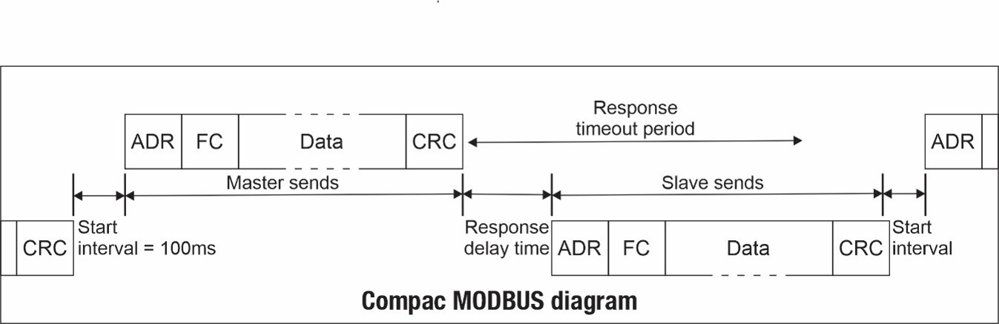

