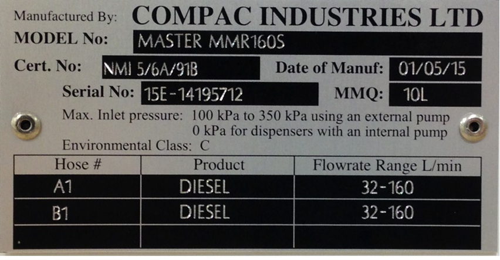
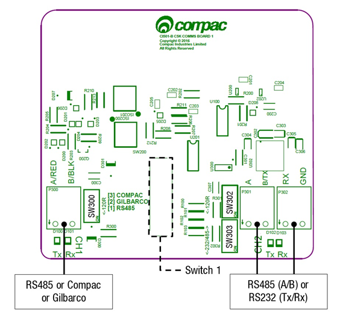
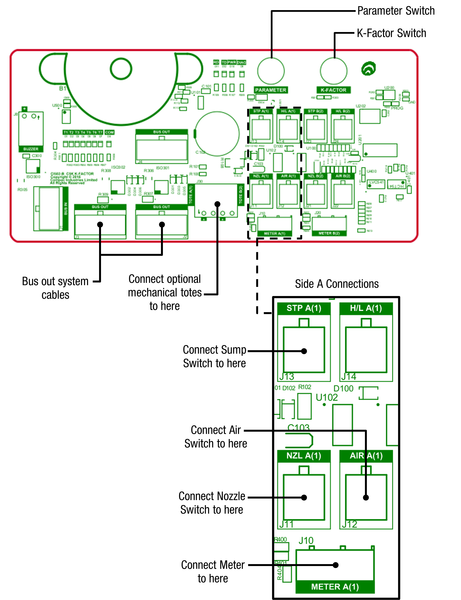
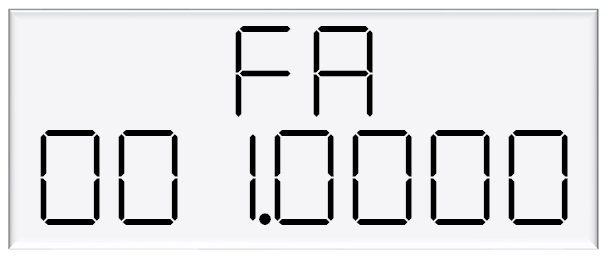

# Installation Guide for Compac Liquid Fuel Dispensers

Updated 18 March, 2026

**Conditions of Use**

- Read this manual completely before working on, or making adjustments to, the Compac equipment 
- Compac Industries Limited accepts no liability for personal injury or property damage resulting from working on or adjusting the equipment incorrectly or without authorization.  
- Along with any warnings, instructions, and procedures in this manual, you should also observe any other common sense procedures that are generally applicable to equipment of this type. 
- Failure to comply with any warnings, instructions, procedures, or any other common sense procedures may result in injury, equipment damage, property damage, or poor performance of the Compac equipment 
- The major hazard involved with operating the Compac C5000 processor is electrical shock. This hazard can be avoided if you adhere to the procedures in this manual and exercise all due care. 
- Compac Industries Limited accepts no liability for direct, indirect, incidental, special, or consequential damages resulting from failure to follow any warnings, instructions, and procedures in this manual, or any other common sense procedures generally applicable to equipment of this type. The foregoing limitation extends to damages to person or property caused by the Compac C5000 processor, or damages resulting from the inability to use the Compac C5000 processor, including loss of profits, loss of products, loss of power supply, the cost of arranging an alternative power supply, and loss of time, whether incurred by the user or their employees, the installer, the commissioner, a service technician, or any third party.  
- Compac Industries Limited reserves the right to change the specifications of its products or the information in this manual without necessarily notifying its users. 
- Variations in installation and operating conditions may affect the Compac C5000 processor's performance. Compac Industries Limited has no control over each installation's unique operating environment. Hence, Compac Industries Limited makes no representations or warranties concerning the performance of the Compac C5000 processor under the actual operating conditions prevailing at the installation. A technical expert of your choosing should validate all operating parameters for each application. 
- Compac Industries Limited has made every effort to explain all servicing procedures, warnings, and safety precautions as clearly and completely as possible. However, due to the range of operating environments, it is not possible to anticipate every issue that may arise. This manual is intended to provide general guidance. For specific guidance and technical support, contact your authorised Compac supplier, using the contact details in the Product Identification section.
- Only parts supplied by or approved by Compac may be used and no unauthorised modifications to the hardware of software may be made. The use of non-approved parts or modifications will void all warranties and approvals. The use of non-approved parts or modifications may also constitute a safety hazard.
- Information in this manual shall not be deemed a warranty, representation, or guarantee. For warranty provisions applicable to the Compac C5000 processor, please refer to the warranty provided by the supplier.
- Unless otherwise noted, references to brand names, product names, or trademarks constitute the intellectual property of the owner thereof. Subject to your right to use the Compac C5000 processor, Compac does not convey any right, title, or interest in its intellectual property, including and without limitation, its patents, copyrights, and know-how. 
- Every effort has been made to ensure the accuracy of this document. However, it may contain technical inaccuracies or typographical errors. Compac Industries Limited assumes no responsibility for and disclaims all liability of such inaccuracies, errors, or omissions in this publication.

**Validity**

Compac Industries Limited reserves the right to revise or change product specifications at any time. 
This publication describes the state of the product at the time of publication and may not reflect the product at all times in the past or in the future.

**Manufactured by:** 
Compac Laser and Master Dispensers are designed and manufactured by Compac Industries Limited 
52 Walls Road, Penrose, Auckland 1061, New Zealand 
P.O. Box 12-417, Penrose, Auckland 1641, New Zealand 
Phone: + 64 9 579 2094 
Fax: + 64 9 579 0635 
Email: techsupport@compac.co.nz 
www.compac.co.nz 
Copyright ©2015 Compac Industries Limited, All Rights Reserved
 
 

These are the basic steps to installing and commissioning a Compac dispenser 
For more detailed information, please refer to the C5000 Master Manual.

# Overview of the steps required to instal a Compac Dispenser

1. Identify the model that you are installing. This is stamped on the side of the unit.
2. Download the correct footprint 
3. Check the External Pump connections for your model from the table further down
4. Calibrate the Dispenser and adust the K Factor if required
5. Set the Solenoid Delay time
6. Set the Pump Number
7. Set the Price. **Important**: If connected to Controller, ensure that the correct price is being sent down to the Dispenser
8. If connected to a Controller, set the Standalone b setting as required.

# Product Identification
Ensure you are using the correct installation instructions and footprint drawing before commencing site work or installation. 
The identification plate is fastened to the bottom of the right-hand side panel when facing the front of the dispenser. 
The model number is on the first line of the identification plate. 

Understanding the model number:
The model number for dispensers is split into: Chassis style, hose configuration, pump or dispenser and specific application.
Use the table below to help identify the unit.

The same format applies to both Laser and Master models
The following example is for the Master Pump or Dispenser

|Style|L/min oer hose|Pump style|Options
|-----|-----|-----|-----|
MR=single hose|MR40 = one hose @ 40l/min|P = Pump|Blank = standard|
MMR=multi hose|MMR40=two hoses @ 40 l/min|S = Dispenser|Avi = Aviation|
| |MMR80-40 = side A 80 lpm, side B = 40 lpm||Marine = Marine|

For example: **MMR 80-40S Marine** is a two-hose unit. 
Hose side A is 80 l/min, side B is 40 l/min with external pumps. 
As a marine model, it has stainless steel pipework and stainless-steel chassis for marine conditions.

## Static Electricity Precautions
Electronic components used are sensitive to static. Please take anti-static precautions.
An anti-static wrist strap should be worn and connected correctly when working on any electronic equipment. If an anti-static wrist strap is unavailable, or in an emergency, hold onto an earthed part of the pump/dispenser frame whilst working on the equipment. This is not a recommended alternative to wearing an anti-static wrist strap. 

**NOTE:** Compac Industries Limited reserves the right to refuse to accept any circuit boards returned, if proper anti-static precautions have not been taken.

## Pre-installation Check
Once the pump is received on site, check that no damage has occurred while in transit – in particular, damage to electronics due to vibration or jarring. 
All terminals and plugs should be checked, including IC chips, to ensure they are securely in place.

## Procedures
Installation should be in accordance with local regulations. 
The dispensing equipment shall be installed to prevent the delivery hose from contacting the ground when not in use. 
Where local regulations require a sump to be fitted: 
a.	Sumps must be provided at all dispenser installations with secondary containment pipework and at all new installations. 
b.	At all sites with sumps, dispensers must be installed with a liquid level detection device fitted in the sump that will raise an alarm if liquid is detected in the base of the sump. 
c.	All Compac Master dispensers at automotive sites must have a safe break device installed in the delivery hose. 
d.	External pump systems required to have an automatic emergency shut-off device installed at the base of each dispenser and it must be activated if the dispenser is knocked over or pulled from its mount. 

## Dispensing Hoses and Nozzles

The unit may or may not be supplied with dispensing hose and nozzle assemblies.  
If customer supplied hose assemblies, pylons, reels, safe breaks and nozzles are used they must comply with the requirements outlined in AS/NZS 2229. 
All dispenser nozzles must trip shut when returned to the nozzle holder. 

## Breakaways

For all dispensers fitted with breakaways, ensure the breakaway is installed between the nozzle and the high-mast or pylon (if fitted). 
Any breakaways that have been subject to a break-away situation should be inspected and refitted or replaced in accordance with the original manufacturer’s instructions.

## Typical Wiring for a Dispenser

The instructions below refer to basic installation wiring. 
Prior to pump installation ensure that there is at least a two-metre tail on both the incoming underground mains supply cable and
comms cable (if comms enabled). 
These cables are terminated at the C5000 power supply, which is housed in the flameproof enclosure located in the bottom of the pump, behind the door. 
Mains power wiring should be rated for a maximum current draw of 10 A rms at 220-240 V ac.
Refer to AS/NZS 60079.14 for appropriate cabling. 

**NOTE:** All cables entering the power supply must be glanded with certified 20mm flameproof
glands. 
**NOTE:** Output to submersible pump(s) is 230 V ac, 300 mA max. It is wired to the pump
contactor/relay at the switchboard and not directly to the pump. 
**NOTE:** Before any additional switch or replacement switch (e.g. remote nozzle or sump switch) is
connected to the K-Factor board (J11-J14 or JJ21-J24), the switch circuit must be tested to
ensure that with the two switch wires connected together there is at least 500Vac (700Vdc)
isolation between the switch and earth. 
**NOTE:** Comms cable is not intrinsically safe. 
**NOTE:** Pump comms connects to pump controller such as a CmfillV2, PT1 or 3rd Party Controller etc. (optional). 
When replacing the lid of the flameproof enclosure, ensure the sealing O ring is in place

## Incoming Mains
Incoming mains connections should be brought in to the terminal board. 
 
If an emergency stop button was ordered with the dispenser, it will be factory wired into the
terminal board, shown below. 
This will be in place of the normal loop between the triac and
main phases. 
If there is an Overfill Protection System (either Compac or Third Party), it should be wired as an Emergency Stop Switch would be between the Triac Phase and Mains Phase 
If there is both an Emergency Stop Switch and an Overfill Protection System, they should be wired in series so that either can interupt the Triac Phase in cas of an emergency 

Wires have standard colours which are shown. In case these colours are unclear, they are as
follows: 
▪ Incoming mains phase: Brown 
▪ Incoming mains neutral: Blue 
▪ Incoming mains earth: Green/Yellow 

 

# Comms connections
The comms I/O is controlled by the connections to the CI501 Comms board which is piggy backed on the Power Supply inside the flame-proof enclosure. 

Refer to the following diagram for connecting RS485, RS232, Compac or Gilbarco pumps. The shown switch should be set to the desired setting.  

**NOTE** Ensure that SW200 (Switch 1) is set the required protocol

 

Switches 300, 302, and 303 are for RS485/RS232 Terminator application.
Use the following table to configure these switches. Switch 300 is for channel 1, and switches 302 and 303 are for channel 2.

## K-Factor Board

Both the Parameter switch and K-Factor switch are found on the K-Factor board. Meters and air switches are also connected to this board. See below for the location of these.

# Setting up the C5000

## K-Factor Settings
The settings that can be accessed from the K-Factor switch are shown below. Not all of these will need to be changed during installation, therefore information on the following pages refers only to the settings that must be changed. Once the Dispenser has been installed, if further customisation of the unit is required, refer to the C5000 Master Manual.

| Setting               | Price Display       | Litres Display|Important notes  |
|-----------------------|---------------------|---------------|-----------------|
| Dispenser settings    | **c-A** or **c-B**  |  *******  | These are set in the factory and should not be changed|
| Maximum flow          |                     | **9A****** or **9b** ****                  |
| K-Factor              | **FA** or **Fb**    | **\*\*\*.\*\*\***                                 |
| Configuration code    | **c**               | **\*\*\*\*\*\*\***  | This is set in the factory and should not be changed|                                |
| Solenoid delay        |                     | **SdA** *** or **Sdb** ***                    |
| Preset cutoff         |                     | **PcA***.** or **Pcb***.** |This is available if a secondary solenoid is wired in
| Preset rounding       |                     | **PrLA***.** or **PrLb***.** **PrHA***.** or **PrHb***.**|
| Flow time out         |                     | **n-A** *** or **n-b** ***                    |

# Changing the K factor FA and Fb

The K-Factor is used to calibrate product flow. It is a ratio of litres dispensed per revolution of the meter. The K-Factor may need to be calibrated after periods of time. 
To calibrate the pump, dispense fuel into a certified measuring container and compare the display value with the one dispensed.
Example:
The Display shows 10.00 litres but the True volume is actually 20.00 Litres

To calculate the correct K-Factor from the information above; firstly record the existing K-Factor and use this formula to calculate the new K Factor.

**New K Factor=Existing K Factor x (Dispensed Amount)/(Displayed Amount)**

=Existing K Factor x 20/10

=Existing K Factor x 2

See Using the Dispenser Menus to edit these settings. Use the procedure for both side A and B.

 

# Changing the Solenoid Delay

This is the time delay from when the submersible pump starts to when the solenoids in the dispenser open to allow time for the leak detector to reset. 

This is factory set by Compac at 005 (five seconds). 

If problems are experienced with the leak detector tripping, firstly check that the solenoid delay is still set and then, if necessary, make it longer as follows. 

To change the solenoid delay, depress the K-Factor switch repeatedly until the following display is shown. To increment a digit, press and hold the parameter switch when the desired digit is flashing. Repeat this procedure for side B if applicable.

# 5 Parameter Switch Settings
The settings that can be accessed from the parameter switch are shown below. 
Not all of these will need to be changed during installation, therefore information on the following pages refers only to the settings that must be changed. 
Once the pump has been installed, if further customisation of the unit is required, refer to the C5000 Master Manual.

|Setting             |Price Display 	  |Litres Display       |
|--------------------|------------------|---------------------| 
|Software Version    |P**.**. **  	    |P**.**. **           |
|Pump Number  	     |                  |PnA *** or PnB ***   |
|Price               |                  |PA**.*** or Pb**.*** |
|Pump Settings       |	                |ba **** or bb ****   |
|High Preset cut off |                  |HCA** or HCb**       |
|High-flow cut off	 |                  |HFA***               |
|Low-flow cut off    |                  |LFA***               |
|b Setting           |                  |b****                |
|Slave display       |                  |d5 ****              |
|Custom display      |                  |dc ****              |
|Last Sale           |**.**             |A***.* or b***.*     |
|Electronic Totes    |LA **** or dA**** |L****.**             |
|                    |Lb **** or db****	|d****.**             |

## Changing the Pump Number
If the parameter switch is continually depressed, the following menu to change the pump number will appear. 
Each side must be numbered between 1-99. Entering a pump number 0 will disable the pump.  
To change the pump number, depress the parameter switch repeatedly until the following display is shown. 
To increment a digit, press and hold the parameter switch when the desired digit is flashing. Repeat this procedure for side B if applicable.

## Changing the Price
The price must be set before the dispenser can be used, otherwise an error will be returned. Set the price in dollars per litre. 

To change the price, depress the parameter switch repeatedly until the following display is shown. To increment a digit, press and hold the parameter switch when the desired digit is flashing. Repeat this procedure for side B if applicable.

# Standalone Mode
In standalone operation, the dispenser will continue working when not connected to a controller. When in Standalone mode no authorisation of fills is required and so fills are simply initiated by removing the refuelling assembly from its holder. If standalone operation is inhibited, the dispenser will not work in standalone mode, regardless of whether the dispenser is ONLINE to a controller or not.   
The dispenser ceases to work in standalone mode if connected to a controller, regardless of the position of standalone setting.   
Generally, on retail forecourts the dispenser should be set-up for standalone operation.  Hence, if the forecourt controller breaks down the dispensers can be set to work in standalone mode simply by turning them off then on again.   
For unattended refuelling sites, the dispensers should not be able to work in standalone mode in the event of a controller failure. Therefore, the dispenser should be set-up to inhibit standalone operation.   
This is set in the b code on the K factor switch. The b code to run Standalone without Dispenser Controller is 1000.  The b code to inhibit Standalone is 0000.

# Notes

## Pump Controller
If the pump is connected to a controller, check that pump data and transaction information is being correctly uploaded to it. 
Refer to the controller manual for specific instructions regarding connection and setup.

## Spare Fuses
In the event of a fuse blowing on the C5000 Power supply a bag of 3 is included in each flameproof box. Any fuses used from this bag should be replaced. 
NOTE: There are three different ratings used. If replacing a fuse, ensure that the correct value is used. 

## Precautions if Using Generator Power
The power output from onsite generators can cause power spikes that may damage electrical components within the cabinet. When connecting to sites powered by generators, please take the following precautions:
1.	Install a power conditioner. Although generators are fitted with power regulators, most are not filtered sufficiently for powering sensitive electrical components. We recommend installing a commercial power conditioner and/or UPS between the generator and the unit.
2.	Before starting a generator, make sure the power to the unit is turned off. Start the generator, let the generator reach stable operating speed and wait 30 seconds before reconnecting the power to the unit.
3.	For units where the generator starts and stops on demand, install a delay timer or PLC to automatically isolate the unit until the operating speed and consistent power output is achieved.
4.	Isolate the unit before shutting down the generator.

# Important notes for installing Compac Dispensers

## External Pump Outputs 
External pump outputs have a maximum rating of 300mA so must be connected via a contactor, not directly to the Pump Motor.
 

## Dual hose Dispensers with 160lpm and 400lpm hoses
When both hoses on either a dual or duo hose Dispenser are 160lpm, or, one side is 160 lpm, the other side is 400 lpm, 
there is only one available External Pump output which either hose can activate  

In the above cases, if separate External Pump outputs are required for each hose,then the Dispenser would need to be ordered with two sets of C5K electronics

# Dual Hose and Duo Hose Dispensers

Unless otherwise noted in the following table, Dual Hose and Duo hose Dispensers have an External Pump Output for each hose.
If there is only one pump to supply both hoses, then Side A-MTR RELAY (LOW) T1 may be looped together with Side B-MTR RELAY (LOW) T4 and a single feed taken back to the Contactor   

# External Pump connections for each model

|Dispenser Model number|Side A|Output|Side B|Output|Comments 
|-----|-----|-----|-----|-----|-----|
|MR40S|Side A-MTR RELAY (LOW)|T1|||
|MR80S|Side A-MTR RELAY (LOW)|T1|||
|MR160S|Side A-MTR RELAY (LOW)|T1|||
|MMR40S|Side A-MTR RELAY (LOW)|T1|Side B-MTR RELAY (LOW)|T4|
|MMR80S|Side A-MTR RELAY (LOW)|T1|Side B-MTR RELAY (LOW)|T4|
|MMR80-40S|Side A-MTR RELAY (LOW)|T1|Side B-MTR RELAY (LOW)|T4|
|MMR160S|Side A-MTR RELAY (LOW)|T1|||**Only one external pump may be connected**
|MMR160-40S|Side A-MTR RELAY (LOW)|T1|Side B-MTR RELAY (LOW)|T4|
|MMR160-80S|Side A-MTR RELAY (LOW)|T1|Side B-MTR RELAY (LOW)|T4|
|MR400S|Side A-MTR RELAY (LOW)|T1|||
|MMR400-80S|Side A-MTR RELAY (LOW)|T1|Side B-MTR RELAY (LOW)|T4|
|MMR400-160S|Side A-MTR RELAY (LOW)|T1|||**Only one external pump may be connected**
|MA30S|Side A-MTR RELAY (LOW)|T1|||
|MMA30S|Side A-MTR RELAY (LOW)|T1|Side B-MTR RELAY (LOW)|T4|
|MMA30-160S|Side A-MTR RELAY (LOW)|T1|Side B-MTR RELAY (LOW)|T4|
|MMA30-80S|Side A-MTR RELAY (LOW)|T1|Side B-MTR RELAY (LOW)|T4|
|L40S|Side A-MTR RELAY (LOW)|T1|||
|L80S|Side A-MTR RELAY (LOW)|T1|||
|L160S|Side A-MTR RELAY (LOW)|T1|||
|LL40S|Side A-MTR RELAY (LOW)|T1|Side B-MTR RELAY (LOW)|T4|
|LL80S|Side A-MTR RELAY (LOW)|T1|Side B-MTR RELAY (LOW)|T4|
|L40SD|Side A-MTR RELAY (LOW)|T1|Side B-MTR RELAY (LOW)|T4|
|LL80-40S|Side A-MTR RELAY (LOW)|T1|Side B-MTR RELAY (LOW)|T4|
|LL80-40SQ|Side A-MTR RELAY (LOW)|T1|Side B-MTR RELAY (LOW)|T4|
|LL160-40|Side A-MTR RELAY (LOW)|T1|Side B-MTR RELAY (LOW)|T4|
|L160-40SD|Side A-MTR RELAY (LOW)|T1|Side B-MTR RELAY (LOW)|T4|
|LL160-80S|Side A-MTR RELAY (LOW)|T1|Side B-MTR RELAY (LOW)|T4|
|LL160-80SD|Side A-MTR RELAY (LOW)|T1|Side B-MTR RELAY (LOW)|T4|
|LL160S|Side A-MTR RELAY (LOW)|T1|||**Only one external pump may be connected**
|L160-SD|Side A-MTR RELAY (LOW)|T1|||**Only one external pump may be connected**
|LA30S|Side A-MTR RELAY (LOW)|T1|||
|LLA30S|Side A-MTR RELAY (LOW)|T1|Side B-MTR RELAY (LOW)|T4|
|LA30SD|Side A-MTR RELAY (LOW)|T1|Side B-MTR RELAY (LOW)|T4|
|LLA30-80S|Side A-MTR RELAY (LOW)|T1|Side B-MTR RELAY (LOW)|T4|
|LA30-80SD|Side A-MTR RELAY (LOW)|T1|Side B-MTR RELAY (LOW)|T4|
|LLA30-80SQ|Side A-MTR RELAY (LOW)|T1|Side B-MTR RELAY (LOW)|T4|**This model has two sets of C5K electronics**
|L400S|Side A-MTR RELAY (LOW)|T1|||
|L400SD|Side A-MTR RELAY (LOW)|T1|||**Only one external pump may be connected**
|L400-40SD|Side A-MTR RELAY (LOW)|T1|Side B-MTR RELAY (LOW)|T4|
|L400-80SD|Side A-MTR RELAY (LOW)|T1|Side B-MTR RELAY (LOW)|T4|
|L400-160SD|Side A-MTR RELAY (LOW)|T1|||**Only one external pump may be connected**
|LL400S|Side A-MTR RELAY (LOW)|T1|||**This model has two sets of C5K electronics**
|LL400S-40S|Side A-MTR RELAY (LOW)|T1|Side B-MTR RELAY (LOW)|T4|
|LL400S-80S|Side A-MTR RELAY (LOW)|T1|Side B-MTR RELAY (LOW)|T4|
|L400-160S|Side A-MTR RELAY (LOW)|T1|||**Only one external pump may be connected**
 
 

## Solenoid connections for each model

**Note:** Solenoids are pre-wired in the Compac Factory at time of manufacture 

|Model|Side A|Side A| Side A|Side B|Side B|Side B|AUX|
|-----|------|------|-------|------|------|------|---|
||**MTR RELAY(LOW)**|**PFS(MED)**|**SFS(HIGH)**|**MTR RELAY(LOW)**|**PFS(MED)**|**SFS(HIGH)**|**AUX**|
||**T1**            |**T2**      |**T3**       |**T4**|**T5**|**T6**|**T7**|  
|MR40S       |Ext. Pump |Pri Solenoid(L)|Sec Solenoid(L)
|MR80S       |Ext. Pump |Pri Solenoid(L)|Sec Solenoid(L)
|MR160S      |Ext. Pump |Pri Solenoid(L)|Sec Solenoid(L)||||Pri + Sec Solenoid(H)
|MMR40S      |Ext. Pump |Pri Solenoid(L)|Sec Solenoid(L)|Ext. Pump|Pri Solenoid(L)|Sec Solenoid(L)|
|MMR80S      |Ext. Pump |Pri Solenoid(L)|Sec Solenoid(L)|Ext. Pump|Pri Solenoid(L)|Sec Solenoid(L)|
|MMR80-40S   |Ext. Pump |Pri Solenoid(L)|Sec Solenoid(L)|Ext. Pump|Pri Solenoid(L)|Sec Solenoid(L)|
|MMR160S     |Ext. Pump |Pri Solenoid(L)|Sec Solenoid(L)|Pri + Sec Solenoid(H)|Pri Solenoid(L)|Sec Solenoid(L)|Pri + Sec Solenoid(H)
|MMR160-40S  |Ext. Pump |Pri Solenoid(L)|Sec Solenoid(L)|Ext. Pump|Pri Solenoid(L)|Sec Solenoid(L)|Pri + Sec Solenoid(H)
|MMR160-80S  |Ext. Pump |Pri Solenoid(L)|Sec Solenoid(L)|Ext. Pump|Pri Solenoid(L)|Sec Solenoid(L)|Pri + Sec Solenoid(H)
|MR400S      |Ext. Pump |Pri Solenoid(L)|Sec Solenoid(L)||||Large single stage solenoid
|MMR400-80S  |Ext. Pump |Pri Solenoid(L)|Sec Solenoid(L)||Pri Solenoid(L)|Sec Solenoid(L)|Large single stage solenoid 
|MMR400-80S  |Ext. Pump |Pri Solenoid(L)|Sec Solenoid(L)|Pri + Sec Solenoid(H)|Pri Solenoid(L)|Sec Solenoid(L)|Large single stage solenoid
|MA30S       |Ext. Pump |Pri Solenoid(L)
|MMA30S      |Ext. Pump |Pri Solenoid(L)||Ext. Pump|Pri Solenoid(L)||
|MMA30-160S  |Ext. Pump |Pri Solenoid(L)||Ext. Pump|Pri Solenoid(L)|Sec Solenoid(L)|Pri + Sec Solenoid(H)
|MMA30-80S   |Ext. Pump |Pri Solenoid(L)||Ext. Pump|Pri Solenoid(L)|Sec Solenoid(L)|
|L40S        |Ext. Pump |Pri Solenoid(L)|Sec Solenoid(L)
|LR80S       |Ext. Pump |Pri Solenoid(L)|Sec Solenoid(L)
|L160S       |Ext. Pump |Pri Solenoid(L)|Sec Solenoid(L)||||Pri + Sec Solenoid(H)
|LL40S       |Ext. Pump |Pri Solenoid(L)|Sec Solenoid(L)|Ext. Pump|Pri Solenoid(L)|Sec Solenoid(L)|
|LL80S       |Ext. Pump |Pri Solenoid(L)|Sec Solenoid(L)|Ext. Pump|Pri Solenoid(L)|Sec Solenoid(L)|
|L40SD       |Ext. Pump |Pri Solenoid(L)|Sec Solenoid(L)|Ext. Pump|Pri Solenoid(L)|Sec Solenoid(L)|
|LL80-40S    |Ext. Pump |Pri Solenoid(L)|Sec Solenoid(L)|Ext. Pump|Pri Solenoid(L)|Sec Solenoid(L)|
|LL160-40S   |Ext. Pump |Pri Solenoid(L)|Sec Solenoid(L)|Ext. Pump|Pri Solenoid(L)|Sec Solenoid(L)|Pri + Sec Solenoid(H)
|L160-40SD   |Ext. Pump |Pri Solenoid(L)|Sec Solenoid(L)|Ext. Pump|Pri Solenoid(L)|Sec Solenoid(L)|Pri + Sec Solenoid(H)
|LL160-80S   |Ext. Pump |Pri Solenoid(L)|Sec Solenoid(L)|Ext. Pump|Pri Solenoid(L)|Sec Solenoid(L)|Pri + Sec Solenoid(H)
|L160-80SD   |Ext. Pump |Pri Solenoid(L)|Sec Solenoid(L)|Ext. Pump|Pri Solenoid(L)|Sec Solenoid(L)|Pri + Sec Solenoid(H)

