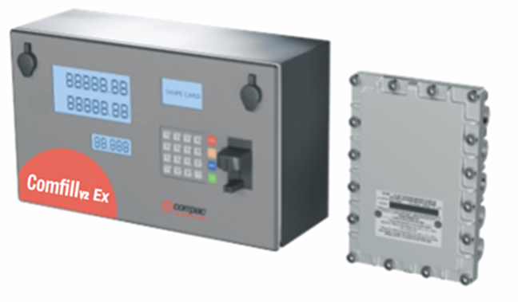

# Comfill Ex
# Installation and Service Manual
Updated 9 September 2026

COMFILL Ex

**Conditions of Use**

- Read this manual completely before working on, or making adjustments to, the Compac equipment 
- Compac Industries Limited accepts no liability for personal injury or property damage resulting from working on or adjusting the equipment incorrectly or without authorization.  
- Along with any warnings, instructions, and procedures in this manual, you should also observe any other common sense procedures that are generally applicable to equipment of this type. 
- Failure to comply with any warnings, instructions, procedures, or any other common sense procedures may result in injury, equipment damage, property damage, or poor performance of the Compac equipment 
- The major hazard involved with operating the Compac C5000 processor is electrical shock. This hazard can be avoided if you adhere to the procedures in this manual and exercise all due care. 
- Compac Industries Limited accepts no liability for direct, indirect, incidental, special, or consequential damages resulting from failure to follow any warnings, instructions, and procedures in this manual, or any other common sense procedures generally applicable to equipment of this type. The foregoing limitation extends to damages to person or property caused by the Compac C5000 processor, or damages resulting from the inability to use the Compac C5000 processor, including loss of profits, loss of products, loss of power supply, the cost of arranging an alternative power supply, and loss of time, whether incurred by the user or their employees, the installer, the commissioner, a service technician, or any third party.  
- Compac Industries Limited reserves the right to change the specifications of its products or the information in this manual without necessarily notifying its users. 
- Variations in installation and operating conditions may affect the Compac C5000 processor's performance. Compac Industries Limited has no control over each installation's unique operating environment. Hence, Compac Industries Limited makes no representations or warranties concerning the performance of the Compac C5000 processor under the actual operating conditions prevailing at the installation. A technical expert of your choosing should validate all operating parameters for each application. 
- Compac Industries Limited has made every effort to explain all servicing procedures, warnings, and safety precautions as clearly and completely as possible. However, due to the range of operating environments, it is not possible to anticipate every issue that may arise. This manual is intended to provide general guidance. For specific guidance and technical support, contact your authorised Compac supplier, using the contact details in the Product Identification section.
- Only parts supplied by or approved by Compac may be used and no unauthorised modifications to the hardware of software may be made. The use of non-approved parts or modifications will void all warranties and approvals. The use of non-approved parts or modifications may also constitute a safety hazard.
- Information in this manual shall not be deemed a warranty, representation, or guarantee. For warranty provisions applicable to the Compac C5000 processor, please refer to the warranty provided by the supplier.
- Unless otherwise noted, references to brand names, product names, or trademarks constitute the intellectual property of the owner thereof. Subject to your right to use the Compac C5000 processor, Compac does not convey any right, title, or interest in its intellectual property, including and without limitation, its patents, copyrights, and know-how. 
- Every effort has been made to ensure the accuracy of this document. However, it may contain technical inaccuracies or typographical errors. Compac Industries Limited assumes no responsibility for and disclaims all liability of such inaccuracies, errors, or omissions in this publication.

**Validity**

This manual covers the following
- Comfill Ex

Compac Industries Limited reserves the right to revise or change product specifications at any time. 
This publication describes the state of the product at the time of publication and may not reflect the product at all times in the past or in the future.

**Manufactured by:** 
The Comfill Ex is designed and manufactured by Compac Industries Limited 
52 Walls Road, Penrose, Auckland 1061, New Zealand 
P.O. Box 12-417, Penrose, Auckland 1641, New Zealand 
Phone: + 64 9 579 2094 
Fax: + 64 9 579 0635 
Email: techsupport@compac.co.nz 
www.compac.co.nz 
Copyright ©2015 Compac Industries Limited, All Rights Reserved
 
 

# Table of Contents

[**Safety**](#safety)

[**Introduction to the Comfill Ex**](#introduction-to-the-comfill-models)

[**Comfill Ex Footprint and Layout Drawings**](#comfill-ex-footprint-and-layout-drawings)

[**Pre-installation**](#pre-installation)

[Zone requirements and Electrical Approvals](#zone-requirements-and-electrical-approvals)

[Static Electricity Precautions](#static-electricity-precautions)

[Tools](#tools)

[**Installation**](#installation)

[**Mechanical Installation**](#mechanical-installation)

[Mounting](#mounting)

[Glanding](#glanding)

[Perspex Guard removal](#perspex-guard-removal)

[**Connecting Power, Motors and Solenoids**](#connecting-power-motors-and-solenoids) 

[Terminal Board 230V version Mains and Motor connections](#terminal-board-230v-version-mains-and-motor-connections)

[Wiring in an Emergency Stop Switch or Overfill Protection System](#wiring-in-an-emergency-stop-switch-or-overfill-protection-system)

[Connecting External pumps such as Submersible or Transfer Pumps](#connecting-external-pumps-such-as-submersible-or-transfer-pumps)

[Standard Solenoid connections for Comfill V2 and Comfill LITE](#standard-solenoid-connections-for-comfill-v2-and-comfill-lite)

[Modulated Control Valve Solenoid connections](#modulated-control-valve-solenoid-connections) 

[C5000 Power Supply in flame-proof box](#c5000-power-supply-in-flame-proof-box)

[**Connecting 3rd Party Meters/Encoders and Comms to the GPIO Board**](#connecting-3rd-party-metersencoders-and-comms-to-the-gpio-board)

[DIN Rail Connections](#din-rail-connections)

[Connecting a Compac Encoder](#connecting-a-compac-encoder)

[Connecting a Compac V50 Meter](#connecting-a-compac-v50-meter)

[Connecting a Piusi meter](#connecting-a-piusi-meter)

[Connecting a Reed Switch Meter](#connecting-a-reed-switch-meter)

[Connecting a Veeder Root Pulser Meter](#connecting-a-veeder-root-pulser-meter)

[Connecting a Macnaught meter](#connecting-a-macnaught-meter) 

[Encoder interface for 3rd party encoders](#encoder-interface-for-3rd-party-encoders)

[**K Factor and PINPad board connections**](#k-factor-and-pinpad-board-connections)

[K Factor board](#k-factor-board)

[PINPad board](#pinpad-board)

[**Electronics**](#electronics)

[Electrical Parameters](#electrical-parameters)

[**Servicing**](#servicing)

[Cleaning the Cabinet](#cleaning-the-cabinet)

[Card Reader cleaning](#card-reader-cleaning)

[PIN Pad cleaning](#pin-pad-cleaning)

[Testing](#testing)

[Perspex Guard removal and replacement](#perspex-guard-removal-and-replacement)

[Modem or Router](#modem-or-router)

[Display and K Factor boards](#display-and-k-factor-boards)

[PIN pad Board replacement](#pin-pad-board-replacement)

[Terminal Board](#terminal-board)

[Comms Board](#comms-board)

[Processor Board replacement](#processor-board-replacement)

[Baseboard](#baseboard)

[PIN Pad replacement](#pin-pad-replacement)

[Card Reader replacement](#card-reader-replacement)

[HID Reader](#hid-reader)

[**LED Diagnostics**](#led-diagnostics)

[PINPad Board LEDs](#pinpad-board-leds) 

[K Factor board](#k-factor-board-1)

[Processor board diagnostics](#processor-board-diagnostics)

[Base Board](#base-board)

[**Troubleshooting**](#troubleshooting)

[**Error Codes and EOS**](#error-codes-and-eos)

[**Valve Modulation**](#valve-modulation)

[Core-functionality](#core-functionality)

[C5000 Terminal board mapping](#c5000-terminal-board-mapping)

[Solenoid truth table](#solenoid-truth-table)

[Flow State table](#flow-state-table)

[Ideal vs real flow rate graph](#ideal-vs-real-flow-rate-graph)

[Modulated valve configurable settings](#modulated-valve-configurable-settings)

[Pinpad Settings Navigation](#pinpad-settings-navigation)

[Tuning to correctly hit a preset amount](#tuning-to-correctly-hit-a-preset-amount)

[Advanced settings](#advanced-settings)

[Valve Modulation Troubleshooting](#valve-modulation-troubleshooting)

# Safety

 

Please adhere to the following safety precautions at all times when working on the Compac Comfill V2. 
Failure to observe these safety precautions could result in damage to the Comfill V2, injury, or death. 
Ensure that you read and understand all safety precautions before installing, servicing or operating the Compac Comfill V2.

**PRECAUTIONS**

Always follow safe operating procedures, any national or local regulations and site specific instructions. 

Make sure that the service area is thoroughly clean when servicing. Dust and dirt entering the components reduce the life span of the components and can affect operation. 

Some components have sharp edges and corners. Wear gloves whenever practicable while working inside the cabinet. 

**Site Safety**

Comply with all safe site regulations for the site you are working on and any additional instructions from the site manager. 

Wear and use appropriate safety equipment such as safety boots, high visibility clothing, hard hat, gloves and barrier cream. 

Cordon off the area you are working in using cones, barriers, caution tape etc.

**CAUTION** 

When working near any flammable goods area, take all precautions to avoid all potential sources of ignition. This includes but is not limited to: Open flames, hot exhausts, welding flames or sparks, static electricity, non-intrinsically safe electrical equipment, use of mobile phones. 

These instructions are to be used as a guide only and may not cover all situations. It is the responsibility of yourself and the site manager to take appropriate health and safety precautions. 

**Electrical Safety**

**CAUTION** 

Always turn off the power to the Comfill V2 before removing the high voltage area Perspex guard. Never touch wiring or components inside the high voltage area with the power on. 

Always turn off the power to the Comfill V2 before removing or replacing software. 

Always take basic anti-static precautions when working on the electronics, i.e., wearing a wristband with an earth strap.

**240 Volts** 

The Comfill V2 is powered by 240 Volt AC mains power. The mains power enters the cabinet via a gland in the base and is connected to the terminal board. From the terminal board, the power supply goes to the power supply. The power supply steps down the 230 Volts AC to 12 volt DC to power the main electronic components. 

Technicians should be able to safely operate and diagnose a Comfill V2 with the cabinet door open as long as they do not touch any of the 230 Volt powered components behind the Perspex cover or the 230 Volt terminals on the power supply.
 
 

# Introduction to the Comfill Ex

 

# Comfill Ex Footprint and Layout Drawings

 

# Pre-installation

# Zone requirements and Electrical Approvals

**Electrical Approvals**

The Compac **Comfill V2 Ex** has **ATEX** and **IECEx** approvals for installation in a hazardous area 
Latest copies of these approvals can be downloaded from the Compac Website
The IECEx Approval number is stamped on a label on the C5000 Flame proof box 

For adequately ventilated fuel dispensing sites (not including CNG/NGV), in most cases the following will apply: 
- The unit is not designed to be constantly exposed to the elements. A shelter should be installed to protect it. 
- The card reader and PIN pad should face away from the prevailing wind especially in dusty or wet areas. 
- In areas experiencing extremes of weather (heat, cold, wind, rain, salt spray etc.) consideration should be given to installing additional shelter. 
- The Comfill V2 location or protection should be such as to minimise the possibility of damage from vehicles, trailers, boats, or the like. 
- On heavy vehicle sites, mounting the unit on a raised pad and/or installing bollards to help protect from damage should be considered. 
- If mounting on a post, the base needs to be attached to a smooth, level surface of sufficient strength to securely hold the retaining bolts or fasteners.  
- The Comfill V2 should be placed at least 8 metres from any above ground flammable liquid storage or handling facility other than a dispenser. 
- The Comfill V2 should be placed at least 0.5 metres from any flammable liquid fuel dispensers and 1.5 metres from any LPG dispensers. 
- The Comfill V2 should be mounted so that the base of the cabinet is at least 1.2 metres above the ground.  
- If the Comfill V2 is mounted on a post, and the post is within 4 metres of a dispenser or within 1 metre of the end of any fuel dispenser hose, then the entire interior of the post may be considered a hazardous area. Any cables running through, or electrical equipment mounted in the post should be suitable for that hazardous area (refer AS/NZS 2381). 
- Whenever running a cable through the post into the base of the cabinet always ensure that the cable entry into the cabinet uses a vapour tight gland.  
- Generally, the area below the Comfill V2 may be a hazardous area and therefore some appropriate signage may be required e.g. no smoking.  
- Lighting should be provided during the hours of operation. Lighting should be sufficient to provide safe working conditions that include, but are not limited to, clear visibility of all markings on packages, signs, instruments and other necessary items. A minimum value of 50 lux is recommended. 

For more information and guidelines on classifications of hazardous zones, please refer to AS/NZS 60079-10.1 (Classification of Areas – Explosive gas atmospheres) 
These requirements do not apply to any specific site but are merely recommendations that will apply in most cases. 
The owner/installer must ensure that the installation complies with AS/NZS 3000, AS 1940, and any other applicable regulations.
# Static Electricity Precautions
Electronic components used are sensitive to static. Please take anti-static precautions. 
An anti-static wrist strap should be worn and connected correctly when working on any electronic equipment. If an anti-static wrist strap is unavailable, or in an emergency, hold onto an earthed part of the pump/dispenser frame whilst working on the equipment. This is not a recommended alternative to wearing an anti-static wrist strap. 

NOTE: Compac Industries Limited reserves the right to refuse to accept any circuit boards returned, if proper anti-static precautions have not been taken.

# Tools

Having all the correct tools will make installation, upgrade and repair procedures easy and minimise the risk of damage to components.
Before you arrive on site, make sure you have a minimum of all the tools listed here.

- 5.5mm nut driver
- 7mm nut driver
- 8mm nut driver
- T30 Torx drive bit or driver
- T10 Torx drive bit or driver
- Metric spanner set
- Metric 3/8" or 1/4" drive socket set
- 1/4" screwdriver bit holder
- 1/4" A/F spanner
- 6" adjustable spanner
- Flat blade screwdriver set (1.5 - 5mm blades)
- #0, #1, #2 Phillips screwdrivers
- #1, #2 Pozidriv screwdrivers
- Set of metric Allen (hex) keys
- Fine long nose pliers, side cutters & pliers
- Hacksaw
- Stanley knife or similar sharp blade
- Ruler
- Multimeter
- Laptop or smartphone with internet

# Installation

# Mechanical Installation

# Mounting

The Comfill V2 can be mounted from the rear or the bottom of the unit. Refer to Footprints for locations of the mounting holes. 
To mount the unit, the following will be supplied:

- 4x M8x25 button head hex drive stainless steel screws
- 4x M8x16 button head hex drive stainless steel screws
- 8x M8 nylon washers
- 8x M8 stainless steel flat washers
- 8x M8 stainless steel nuts

Stainless steel is recommended due to the reduced risk of corrosion when exposed to weather conditions. 
The Comfill V2 is suitable for outdoor installation. 
M8x25 screws are recommended for mounting from the rear of the unit and are suitable for mounting to surfaces up to 10mm thick. 
M8x16 screws are recommended for mounting from the bottom of the unit and are suitable for mounting to surfaces up to 4mm thick. 

# Glanding

The following grommets will be supplied with either the Comfill V2 and the Comfill LITE:

- 5x 16mm rubber grommets
- 5x 19.1mm rubber grommets

Any unused gland access holes should be blanked with the supplied grommets. 
19.1mm grommets will fit the 20mm access holes. 

The gland access is as follows:

# Perspex Guard removal

A Perspex guard is supplied with the Comfill V2 and Comfill LITE and will need to be removed to access the terminal board and baseboard. 
The location of the guard is as shown: 
 

**DANGER:** The unit must be isolated before attempting to remove or reattach the Perspex guard. 

The Perspex guard is attached with 4x M4x10 pozi screws and M4 nylon washers. 
An 8mm nut driver will be appropriate for removing and reattaching the Perspex guard.

**NOTE:** *Always reattach the Perspex guard after working on the Comfill V2 unit.* 
 
**NOTE:** *Always reattach fuse covers after working on the Comfill V2 unit.*
 

# Connecting Power, Motors and Solenoids 

 

# Terminal Board 230V version Mains and Motor connections

The external incoming mains and motor connections will need to be connected onsite. 
The motor will need to be connected for both side A and side B as shown.

|Motor|Phase terminal|Neutral Terminal|Earth 
|-----|-----|-----|-----|
|Motor Side A|TB7|Neutral|Earth Busbar
|Motor Side B|TB6|Neutral|Earth busbar

Wire the incoming mains into the terminal board. 
The incoming mains wiring is as follows. Wires have standard colours which are shown. 
In case these are unclear, the colours are as follows: 

•	Incoming mains phase: Brown 
•	Incoming mains neutral: Blue 
•	Incoming mains earth: Green/Yellow 

# Wiring in an Emergency Stop Switch or Overfill Protection System

If wiring in an Emergency connection, it should be connected in place of the triac phase / mains phase loop. This will cut power to all outputs on the terminal board. 

If both an Emergency Stop Switch and Overfill Protection System are fitted, they should be wired in series so that either being activated will isolate power to the outputs

# Connecting External pumps such as Submersible or Transfer Pumps

For third party pump motors over 1KW, the contactor coil needs to be connected to the “MTR RELAY (LOW)” terminal and neutral terminal beside it. 

The MTR relay (low) output is 230VAC and it can supply up to 0.5A. However, the total output from 7 triac outputs (T1-T7) must not exceed 1A.

Connect the Nozzle and meter connections to the DIN rail as necessary (Refer to the “K-Factor board” for the DIN rail terminals diagram to connect nozzles and meters).

# Standard Solenoid connections for Comfill V2 and Comfill LITE

For 40lpm and 80lpm Comfill V2 and Comfill LITE units with solenoids, connect as shown   

# Modulated Control Valve Solenoid connections 

For Comfill units connected to Modulated control Valves, connect the Upstream and Downstream Solenoids as shown 

# C5000 Power Supply in flame-proof box 

In the Comfill V2 Ex, the C5000 Power Supply with Processor board and Comms board in housed in the same flame-proof box as in a standard Pump or Dispenser. 
Power and Comms cable to be glanded into the flame proof box

 

# Connecting 3rd Party Meters/Encoders and Comms to the GPIO Board

This section is only relevant when 3rd Party Meters or Encoders are used which are not Intrinsically Safe

In this case, a Compac GPIO Board is fitted as a barrier

When there is a GPIO board, the pump comms are also connected through the GPIO Board (instead of directly off the C5000 Power Supply)

# 6.1 GPIO board set up for Pulse Input from a Flow Meter 

Overview 
The Pulse input is designed to interface the Compac dispenser to a third party meter.  
The Pulse input can be up to 35 VDC.  
There are 2 settings that need to be set to enable the C5000 for third party meter input.  
The first is in the CA/CB setting. CA/CB needs to be set to CA XXXXXX5.  
The Pulse input can be configured for the following meter types:  
Type 1 - Single channel  
Type 2 - Two channel quadrature  
Type 3 - Three channel
 

## CA/CB Setting for third party input
To tell the C5000 to read meter pulses from the GPIO board, set the last (7th) digit on the right of CA/CB to 5.  
This digit disables the meter input on the K Factor board and tells the C5000 to read pulses from the GPIO board

|	Setting       |Digit             |    Function                                             |
|---------------|------------------|---------------------------                                 |
|C-A or C-B     | 1st Digit        |**Minimum Measured Quantity Coefficient** – MUST be 1, 2 or 5|
|               | 2nd digit        |**Minimum Measured Quantity Exponent** – Must be a valid digit- see below
|               | 3rd digit        |**Not used**
|               | 4th digit	       |**Air Switch settings**
|               |                  |0 = Normally open – turn air switch ON for error        
|               |                  |1 = Normally closed – turn air switch OFF for error 
|               | 5th digit        |**Quantity Settings - V50 Meter only**
|               |                  |0 = Litres Compensated 
|               |                  |1 = Litres Uncompensated
|               |                  |2 = Mass (CNG only)
|               | 6th Digit        |**Variant Settings**
|               |                  |0 = Non-LPG
|               |                  |4 = AdBlue (Diesel Emissions Fluid or DEF)
|               |                  |5 = LPG
|               |                  |6 = CNG 
|               | 7th Digit        |**Meter settings**
|               |                  |1 = 1 Channel Encoder
|               |                  |2 = 2 Channel Encoder 
|               |                  |3 = 3 Channel Encoder
|               |                  |4 = V50 or KG100 Meter
|               |                  |5 = GPIO Meter input

**GPIO K Factor settings**  
The GPIO settings in the K factor board is where you set the GPIO specific settings.  
This table is common to all GPIO board applicaions 
The below table shows details of all the options available for each setting. 

|Digit             |    Function                      |
|------------------|----------------------------------|
|1st Digit         |**Duty Cycle Setting**            |
|                  |0 = 50%                           |
|                  |1 = 10%                           |
|                  |2 = 20%                           |  
|                  |3 = 30%                           |
|                  |4 = 40%                           |
|                  |5 = 50%                           |
|                  |6 = 60%                           |
|                  |7 = 70%                           |
|                  |8 = 80%                           |
|                  |9 = 90%                           |
|2nd Digit         |**Input settings Pulse frequency**|
|                  |0 = 1Khz                          |
|                  |1 = 100Hz                         |
|                  |2 = 200Hz                         |
|                  |3 = 300Hz                         |
|                  |4 = 400Hz                         |
|                  |5 = 500Hz                         |
|                  |6 = 600Hz                         |
|                  |7 = 700Hz                         |
|                  |8 = 800Hz                         |
|                  |9 = 900Hz                         |
|                  |A = 1KHz                          |
|                  |b = 1.1KHz                        |
|                  |c = 1.2KHz                        |
|                  |d = 1.3KHz                        |
|3rd Digit         |**Output settings**               |
|                  |0 = 0 Off                         |
|                  |1 = Volume (Litres/KGs)           |
|                  |2 = Amount (Dollars)              |
|4th Digit         |**Input settings**                |
|                  |0 = 0 Off                         |
|                  |1 = 1 Channel Encoder             |
|                  |2 = 2 Channel Encoder             |
|                  |3 = 3 Channel Encoder             |
|                  |4 = Switch Input                  |  

**Third Party Meter wiring**

There are different types of meters with different numbers of channels. The below is the meter type and how to wire them to the GPIO Board.

**Single Channel Reed Switch Meter**
When connecting to a reed switch type meter you connect the GPIO 5-volt to the reed switch and then all 3 inputs to the other terminal on the meter.

 
 

**12 Volt Two Channel Meter**
The two Channel 12 volt meter is not powered from the GPIO Board.  
Instead it is powered by its own power supply. Depending on the meter, pullup resistors may need to be added

 
 

**5 volt Two Channel Meter** 
The 2 channel 5 volt meter is powered from the GPIO board.  
This means that the meter doesn’t need power from an external source.  
Depending on the meter, pullup resistors may need to be added.  
For 5 volts the pull up resister should be 820Ω

 

# DIN Rail Connections
When the Comfill V2 arrives onsite, all internal wiring will already be connected. Incoming external cables will have to be inserted through the glands and then connected to the back of the DIN rail. The nozzle switch and meter will be connected to the DIN rail. The connections are as shown:

The Comfill V2 supports Compac encoders, Compac V50 Meters and most third-party meters. 
Some third-party meters require 10 kΩ resistors to be connected. In case of this, 6x 10kΩ resistors will be supplied with the Comfill V2 unit.

# Connecting a Compac Encoder

The Compac encoder connects to the DIN rail via a six-core (only five cores used) data cable. 
The five cores used are: 
Orange or White		-	5V terminal 
Yellow or Black		-	0V terminal (GND) 
Brown			-	B0 terminal (used for single, dual, and triple channel encoders) 
Blue			-	B1 terminal (used for dual and triple channel encoders) 
Red			-	B2 terminal (used for triple channel encoders) 

Where B0, B1 & B2 are the three opto-sensor connections. Not all of these may be used depending on the meter connected. 

To reverse the rotation of the encoder sensing, the B0 & B2 wires should be reversed. The error message for reverse rotation is Err 8.

# Connecting a Compac V50 Meter

V50 meters can be connected directly to the K-Factor board. Refer to K-Factor Board for the location of the meter plug.

# Connecting a Piusi meter

A Piusi K700 Modular Pulse Meter has three data cores. 

If connecting a Piusi meter, the data cores should be connected as following: 
|Colour|Terminal
|-----|-----
|White|		5V terminal (a resistor should be included)
|Black|		0V terminal (GND)
|Yellow| 	B2 terminal

# Connecting a Reed Switch Meter

If connecting a Reed switch type meter: 
Reed switch type meters require three signal connections and one earth connection as shown:

**NOTE:** Ensure the wiring is shorted on the meter end, not the Comfill V2 end.

 

# Connecting a Veeder Root Pulser Meter

**Dual Channel:**

**NOTE:** Ensure the wiring is shorted on the meter end, not the Comfill V2 end.

  

**Single Channel:**

**NOTE:** Ensure the wiring is shorted on the meter end, not the Comfill V2 end.

## Comfill V2 Pulses for encoder( K-factor = 1)

|Channels|State changes|Volume 
|-----|-----|----- 
|1 channel| 50 state changes (high and low )|0.16 litres 
|2 channel| 100 state changes (high and low)|0.25 litres
|3 channel| 150 state changes (high and low)|0.50 litres

 

**Veeder Root 7671 models**

|767163-xxx|Bidirectional|Clockwise|Counter Clockwise|Pulse per rotation|C5000 rotations per litre. K factor = 1
|-----|-----|-----|-----|-----|-----
|Single Channel|-32x|-42x|-51x|100|1 rotation = 0.66 litres
|Dual Channel (staggered)|-31x|-41x|-51|50|1 rotation = 0.66 litres
|Dual channel (overlap)|-30x|-40x|-50x|50|1 rotation = 0.66 litres

**NOTE:** *Comfill V2 only supports single channel and dual channel staggered signals. 
Dual channel overlapping signals are not supported.*
 
 

# Connecting a Macnaught meter 

Macnaught meter is a Hall Effect single channel meter

The Compac CI266A Pulser/Encoder is an optional extra. 
If fitted, it provides detection if the Meter or a Channel is disconnected.
Refer to section on **Encoder interface for 3rd party encoders** for further information 

 

**Connection to a Macnaught Meter if a Pulser/Encoder I/F is installed (on the DIN Rail)**

**Connection to a Macnaught Meter if a Pulser/Encoder I/F is NOT installed**

**NOTE:** *Ensure the wiring is shorted on the meter end, not the Comfill V2 end.*

# Encoder interface for 3rd party encoders

**NOTE:** The interface board is not intrinsically safe therefore it should not be used in a hazardous area.

Pulser/Encoder I/F is used to interface from third-party pulser/meter. This can be DIN rail mounted.
12V source can be connected to the 12V and GND pin 1 and 2 of P2 terminal to provide a 12V supply on P1-8. 
The terminal must not exceed 0.25A. 

If the 12V supply is not required, the I/F board will work without the 12V. The COM terminals on P1 are connected to the ground terminals of P2. 
Do not connect the COM to the pulser/meter frame and do not connect the common and frame together.

The 5V power supply must be connected to the P2 terminal pin 4 and 8 to power up the I/F board. 
5V supply can also be used to power third-party meter from terminal P1 pins 5 & 1.

P2 terminal Ch1, Ch2 and Ch3 (pins 5,6 and 7) are the signal outputs from the pulser/encoder
which need to be wired into DIN rail Ch1, Ch2, and Ch3. If not wired correctly it will cause error 9.

**P1 Terminals** 

Most third-party pulsers/meters have one or two channels and run on 12V. 
For error detection, at least two channels need to be wired from the pulser/meter. 
For single channel pulsers/ meters, two wires need to be connected together at the meter and the outputs need to be connected to Ch1 and Ch2 of the P1 terminal.

Below are some examples of wiring to a third-party pulser/meter from the P1 terminal. 
The pull-up resistors are internal to the pulser/meter.  

**Single channel third-party 12V pulser**

**Single channel third-party 12V pulser**

**Three channel Compac 5V pulser**

# Electronics

The following diagram shows a standard configuration for the internal wiring of the Comfill V2 unit. 
Connections may change during ordering, production or customisation. 
These connections will be pre-installed and most likely will not need to be changed.

The following diagram shows the location of several of the C5000 circuit boards underneath the Perspex guard. 
The K-Factor and PIN Pad board can be found on the inside of the Comfill V2 Box cabinet door.

**NOTE:** If using external pumps, there will be relays in place of triacs. 

**NOTE:** The optional comms board is not shown in these drawings. 
The comms board is located above the processor board.

# Electrical Parameters

|Paramater||Terminal|Min.|Max.|Unit
|---------|-|--------|----|----|----
|VIN (12V in)||P2: 1|9|24|V|
|VCC (5V in) ||P2: 4|4.6|5.5|V|
|VOH (Ch1, Ch2, Ch3) output high voltage||P2: 5, 6, 7|3|Vcc|V|
|VOL (Ch1, Ch2, Ch3) output low voltage||P2: 5, 6, 7|0|0.8|V
|VOUT (12V out) output current||P1: 8|0|100|mA|
|5V output current||P1: 5|0|40|mA|
|VIH (Ch1, Ch2, Ch3) input high voltage||P1: 4, 3, 2|2|24|V|
|IIH (Ch1, Ch3) input high current|VIH = 3V|P1: 4, 2|-0.14|0|mA|
||VIH > 5V||0|0.1|mA|
IIH (Ch2) input high current|VIH = 3V|P1: 3|0.1|0.15|mA|
||VIH = 5V||0.15|0.22|mA|
||VIH =12V||0.45|0.55|mA|
||VIH =24V||10|13|mA|
|VIL (Ch1, Ch2, Ch3) input low voltage||P1: 4, 3, 2|-0.5|0.8|V
|IIL (Ch1, Ch3) input low current||VIL = 0V	P1: 4, 2|-0.3|0.24|mA|
|IIL (Ch2) input low current|VIL = 0V|P1: 3|0|0|mA|
||VIL =0.8V||0|0.05|mA|

# Servicing

Having all the correct tools will make installation, upgrade and repair procedures easy and minimise the risk of damage to components. 

Before you arrive on site, make sure you have a minimum of all the tools listed here.

- 5.5mm nut driver
- 7mm nut driver
- 8mm nut driver
- T30 Torx drive bit or driver
- T10 Torx drive bit or driver
- Metric spanner set
- Metric 3/8" or 1/4" drive socket set
- 1/4" screwdriver bit holder
- 1/4" A/F spanner
- 6" adjustable spanner
- Flat blade screwdriver set (1.5 - 5mm blades)
- #0, #1, #2 Phillips screwdrivers
- #1, #2 Pozidriv screwdrivers
- Set of metric Allen (hex) keys
- Fine long nose pliers, side cutters & pliers
- Hacksaw
- Stanley knife or similar sharp blade
- Ruler
- Multimeter
- Laptop or smartphone with internet

**Maintenance** 

The Comfill V2 is a relatively simple unit with no moving parts and therefore needs minimal maintenance. 

# Cleaning the Cabinet

The cabinet should be cleaned with a soft cloth and non-abrasive cleaner to remove dirt, grease, graffiti and unauthorised stickers. 
All instruction and branding decals should be replaced if damaged or faded. 

**NOTE:** Do not use buckets of water, hoses or water blasters to clean the cabinet as water may enter and damage delicate components. 

# Card Reader cleaning

The card reader should be swiped through with a cleaner card wet with cleaner fluid. 
The card reader may need to be cleaned daily on dirty, dusty or wet sites.

# PIN Pad cleaning

The PIN pad should be cleaned to keep the printing legible. A soft dry rag should be used. 
Do not use a rag wet with solvent or petrol as the PIN pad printing may be damaged. 

# Testing

Regular zero dollar tests with valid PINs, cards or HID readers (whichever applicable) should be undertaken to ensure the unit is operating correctly.  

# Perspex Guard removal and replacement

The Perspex guard houses the 230V components and will need to be removed to repair or replace components such as the power supply and several of the circuit boards.

**DANGER**

Ensure the unit is isolated before attempting to remove the Perspex guard. 
The unit should remain isolated while removing or repairing any components underneath the Perspex guard. 
Do not repower the unit until the guard is back in place.

To remove the Perspex guard, simply unscrew the M4x10 pozi screws holding the guard in place. 
Replacement is the opposite of removal. 

# Modem or Router
The Modem or Router is not repairable on site and will need to be replaced with a new part. 

It can be removed simply by removing the screws securing it to the gear plate, and by removing any cables connecting it to other components.

# Display and K Factor boards

The display can be found on the inside of the Comfill V2 box door. 
The display is connected to the K-Factor board. 

**CAUTION**

Always take anti-static precautions when working with electronic components for example, wearing a wristband with an earth strap.

Removal:
1.	Unplug connections to the K-Factor board. Refer to Electronics for the K-Factor board connections
2.	Remove the screws holding the display in place
3.	Gently remove the display

Replacement is the reverse of removal.  

In cases where the K-Factor board is removed from the display:
1.	Unplug connections to the K-Factor board. Refer to Electronics for the K-Factor board connections
2.	Remove the screws holding the K-Factor board in place
3.	The K-Factor board is held on to the display with a pin connection. Gently remove the board, taking care not to damage the pin

Replacement is the reverse of removal.

**Important** If the K-Factor board is replaced, press and hold the parameter button and press the K-Factor button once to transfer the old settings to the new K-Factor board.

# PIN pad Board replacement

The PIN Pad board can be found on the inside of the Comfill V2 box door.

**CAUTION** 

Always take anti-static precautions when working with electronic components for example, wearing a wristband with an earth strap.
Removal:
1.	Unplug connections to the PIN Pad board. Refer to Electronics for the PIN Pad board connections
2.	Remove the screws holding the board in place 

Replacement is the reverse of removal.

# Terminal Board

Before removing the Terminal board, the Perspex guard must be removed. Refer to Perspex guard removal instructions. 

**CAUTION**
Always take anti-static precautions when working with electronic components for example, wearing a wristband with an earth strap.
Removal:
1.	Unplug all connections to the Terminal board
2.	Unscrew and remove the earth bar
3.	Remove screws holding the Terminal board in place
4.	The Terminal board is connected to the baseboard with a plug and socket connection. Remove the board with care 

Replacement is the reverse of removal. Refer to Electronics for Terminal connections.

# Comms Board

Before removing the Comms board, the Perspex guard must be removed. Refer to Perspex guard removal instructions. 

**CAUTION**
Always take anti-static precautions when working with electronic components for example, wearing a wristband with an earth strap.
Removal:
1.	Disconnect any cables connected to the Comms board
2.	Remove screws holding the Comms board in place
3.	The Comms board is connected to the processor with a plug and socket connection. Remove the board with care 

Replacement is the reverse of removal. Refer to Electronics for Comms connections.

# Processor Board replacement

Before removing the processor board, the Perspex guard and Comms board (if included) will need to be removed. Refer to removal instructions in Service. 

**CAUTION**

Always take anti-static precautions when working with electronic components for example, wearing a wristband with an earth strap.

**CAUTION**

The Processor board stores all transactions and data. Before replacing the processor board, it is recommended to download the memory dump to recover information. Please contact Compac to access this. 

Removal:
1.	Disconnect any cables connected to the Processor
2.	Remove screws securing the Processor
3.	The Processor is connected to the Baseboard with a plug and socket connection. Remove the board with care

Replacement is the opposite of removal. 

If the processor board is replaced, press the K-Factor button once to transfer settings to the processor board.

# Baseboard

The Baseboard is located underneath the Perspex guard, below the Processor and Terminal boards. 
Remove these components before removing the baseboard.  
The Baseboard can be removed simply by removing the screws securing it.

# PIN Pad replacement

The PIN Pad may need to be replaced if it gets worn or becomes faulty. 
The PIN Pad can be removed from the back to the Comfill V2 V2 door. 

1.	Remove any cables obstructing the PIN Pad. Refer to Electronics for the replacement of these cables
2.	Remove the white plastic brackets by removing the screws securing them
3.	Remove the PIN Pad unit 

Replacement is the opposite of removal.

# Card Reader replacement

To remove the card reader: 

1.	Disconnect cables going to the PIN pad board. Refer to Electronics for PIN pad board connections
2.	Remove the screws securing the card reader gear plate to the Comfill V2 V2 door
3.	Slide the card reader out into the inside of the box 

Replacement is the opposite of removal. 

Test the card reader by using a valid card to perform a zero-dollar transaction.

# HID Reader

To remove the HID Reader: 

1.	Disconnect cables going to the PIN pad board. Refer to Electronics for PIN pad board connections
2.	Remove cables connecting to the HID Reader
3.	Remove screws securing the HID Reader to the Comfill V2 V2 door 

Replacement is the reverse of removal. 

Test the HID reader by using a valid key to perform a zero dollar transaction.

# LED Diagnostics

# PINPad Board LEDs

LEDs on the circuit boards can be used to diagnose faults in the unit. 
View the LEDs and their corresponding tables to see the state of the board.

RD = Receiving Data
TD = Transmitting Data
PWR = Power
DIAG = Diagnostics

|LEDS|Operation or possible cause|
|----|---------------------------|
|Power|This should be on when there is power to the unit.|
|Diagnostics|This should be on whenever the power LED is on.|
||In normal operation, these should be on when the Diagnostics light is on, and off when the diagnostics light is off.|
Transmitting and Receiving data|If the diagnostics light is on, and the TD/RD LEDs are off, this means these is an error.  This could be due to cabling – check the bus system cables.

# K Factor board

|K-Factor Board LEDs|Operation or possible cause|
|-------------------|---------------------------|
|Power (PWR)|This should be on when there is power to the unit.
|Diagnostics (DIAG)|In normal operation, this should flash slowly, and then flash quickly when the nozzle switch is lifted.|
|Output LEDs (T1-7)|These LEDs correspond to side A and B motors and solenoids. They will light up according to the hardware they represent. These outputs change depending on the configuration of the unit. See Output table below
|Receiving data/ Transmitting data (RD/TD)|In normal operation, these should be on when the Diagnostics light is on, and off when the diagnostics light is off.|
||If the diagnostics light is on, and the TD/RD LEDs are off, this means these is an error. This could be due to cabling – check the bus system cables. 

Output table

|Output|Single|Dual|Dual 160|
|------|------|----|--------|
|T1|Side A Motor|Side A Motor|Sides A anb B motors|
|T2|Side A Solenoids|Side A Solenoids|Side A Solenoids|
|T3|Side A Solenoids|Side A Solenoids|Side A Solenoids|
|T4|Side A high flow Solenoid|Side B Motor|Side B High Flow Solenoid|
|T5|Not used|Side B Solenoids|Side B Solenoids|
|T6|Not used|Side B Solenoids|Side B Solenoids|
|T7|Side A high flow Solenoid|Side A high flow Solenoid|Side A high flow Solenoid|
 

# Processor board diagnostics

|Processor Board LEDs|Operation or Possible Cause|
|--------------------|---------------------------|
|Power|This should be on when there is power to the unit.|
||This LED shows whether the firmware is running for the board. 
||If it is off, the firmware is not running, and if it is on, it is running.|
|Diagnostics|Upon start up this LED will flash, indicating that the firmware is loading. 
||The flashing may last up to a minute before it stabilises to being constantly on. |
||If the flashing lasts longer, the board is in bootloader mode – this means that the firmware has crashed, or not loaded correctly.

 

# Base Board

The baseboard LEDs will turn on when the respective power supplies are on

D100 = Power 12V
D101 = Power 5V
D103 = Power 9V

 

# Troubleshooting

|Problem|Possible cause|Recommended action|
|-------|---------------|------------------|
|No Power/No Lights|No power entering  unit|Ensure that power is entering unit, check external fuses and switches
|                  |Faulty power supply|Replace the power supply
|Will not read cards|Debris on card or magnetic head|Clean card or card reader’s magnetic head using head cleaning kit.
|                   |Wrong system (with distributer / In-house cards)|Wrong card base (ISO, Access number) Check card base is loaded onto the Comfill V2	
|Pump Error on display|One of the linked pumps or dispensers has encountered an error.|Read the error message on the pump display to find out what is wrong.
|Pumps will not dispense fuel|Wrong pump number selected|Ensure pump number set in pumps matches pump number set in controller and also pump number written on the pump.
|                            |No fuel in tanks|Verify tanks have sufficient product 
|                            |                |Try another pump to verify. Contact pump service agent 
|                            |Pump fault	  |Have service agent check pumps
|Unable to access Compac Onsite|Wrong username / passcode|Enter correct username / passcode into Compac Online software
|                              |Internet connection down|Check with internet service provider for information on internet service quality
|                              |Wrong device ID entered into browser|Enter correct Device ID
|                              |No power entering unit|See No Power/No lights	
|Wrong system on display|Card ISO number is not between card record BIN range|Refer to Compac Online > Technician Options > FMS Setup to set allowed BIN range
|Card Declined on display|Card not in Card records|Refer to Compac Online > Technician Options > FMS Setup to set card records
|Pump Buffer Full on display|Memory Full|Export transactions. Refer to Compac Online > User Options > Transactions
|                           |           |Reboot Comfill V2; the unit will save transactions to SD card  
|Expired Card on display|Card is expired|Use a valid card
|No transactions recorded|Wrong date and time|Check date and time on CompacOnsite
|                        |Pump in bypass mode|Take the pump out of bypass mode|
|                        |Meter error|Check if error code is on display. Refer to Error Codes
|                        |           |Replace meter   
|                        |Pump Error|Use another pump and check if transactions are recorded; if so, contact pump service agent	
|Tank gauging connection continuously drops out|LFD 485 option is set to ENABLED|Set LFD 485 to DISABLED. Refer to Custom Display settings in Local Setup	
		
 

# Error Codes and EOS

These are all the Error codes available in the C5000. Some are product specific so will not be found in all applications.

|Error Code      | Fuel specific | Possible causes                                | Suggested action  
-----------------| --------------| -----------------------------------------------| ---------------- 
**Er 3 or Err 3**   |No             |Price or Pump number not set in the Dispenser         |(a) If the Dispenser is connected to a Site Controller, the price on the Dispenser should be set to 0.00 and the pricing should be sent from the Controller.(b)If the Dispenser is not connected to a Site Controler (ie. it is operating in standalone mode), then the price must be set in the Dispenser. (c) Set the hose number in the dispenser
**Er 8 or Err 8**   |No             |Excessive reverse flow                          |Check that product is not flowing back into the tank once the delivery has finished. This can occur if the non-return valves on site are leaking
**Er 9 or Err 9**   |No             |The Flow Meter is in an illegal state           |(a)Re-power the Dispenser (b) Check Meter cable for loose wires or bad connections (c) Replace the Meter or the Encoder board on the Meter   
**Err91**           |No             |Meter sequence error                            |If 3rd party Meter, check the wiring
**Er 10 or Err 10** |No             |Memory Error. Configuration data lost or corrupted|Re-configure Dispenser. If problem persists, replace Memory or Processor Board             
**Er 12 or Err 12** |No             |Display error                                   |Replace Display
**Err 13**          |No             |Slave board has restarted                       |Power or Hardware failure
**Err 14**          |No             |K Factor board offline                          |Check the Bus Connections and C5K Power Supply
**Err 15**          |No             |K Factor board has restarted                    |Power or Hardware failure
**Err 16**          |No             |K Factor board is not talking to the LCD Display|(a) Check wiring (b) Replace the K factor board or LCD Display       
**Err 31**          |No             |Transaction has ended but fuel is still flowing |The Solenoid is leaking. Repair or replace solenoid
**Er 41 or Err 41** |No             | Pump not communicating with Controller          |If only one pump on the site is not communicating with the Controller, then the fault is likely to be in the pump.(a) Check the comms wire connection on the comms board  (b) Check the diagnostic LEDs on the comms board in the Dispenser to diagnose cause (c) Check the configuration and setup in the Dispenser.
|   |   |   |If all pumps are not communicating, check the comms wire connections on the comms board (a) Check comms cables between the Dispenser and the Controller (b) check setup and operation of the Controller
**Er 50**           |NO               |Meter not communicating with Dispenser electronics|(a) Check Meter connections (b) Check Dispenser configuration (c) Check that the Meter ID setup in the configuration matches the Meter ID
**Er 52**            | No             | Meter error | If the problem persists after repowering the unit, replace the meter.
**Er 53**            | LPG / Adblue / DEF / CNG |Meter stopped ibrating | Repower the unit. This error might display when the dispenser is powered up. In this case it is normal. If the problem persists, replace the meter
**Er 54**            | No           | Temperature sensor failure | Repower the unit. If the problem persists, replace the meter
**Er 55**            | CNG          | Meter not ready.  | Wait for meter to calibrate itself. The KG100 meter is in startup mode. If the problem persists, repower the unit.
**Er 61**            | LPG / Adblue / DEF / CNG | Error 61 happens because the Meter was not able to zero |(a) This can be due to a leak in the line or crystals accumulated in the Meter. (b) Check for leaks / crystallization. Purge the line. (c) If that does not reset the Error 61, pull the Meter out and pour hot water on it to dissolve any crystals inside the Meter. (d) If the problem persists, replace the Meter.
**Er 62**            |LPG / Adblue / DEF / CNG | Meter could not reset the batch (Could not zero the transaction values when nozzle was lifted to start a new transaction)                                                                                                 | Try restarting the Meter. If the problem persists, Replace the meter.
**Er 71**            |LPG / Adblue / DEF | V50 meter is set but variant is not selected  | Configure Device to either AdBlue / DEF or LPG
**Abd**              |No             |Display offline / Display Fault |(a) Check the connections to all displays.(b) Check the configuration of the  slave boards (If slave displays are connected) (c)Check and/or replace the display
**CNG 157**          |CNG            |The Dispenser expected no flow. Potential Solenoid Valve leak                                    | Repair / rekit Solenoid
**CNG 158**          |CNG            |Tank volume predictor uncertainty | Check for leaks in the Dispenser hose or fittings
**CNG 159**          |CNG            |Temperature Probe out of range | Re-calibrate Temperature Probe
**CNG 160**          |CNG            |Pressure Probe alignment error. There is more than 10bar difference between the two probes       | Re-calibrate Pressure Probes (Dispensers with two Pressure Probes per hose)
**CNG 161**          |CNG            |Temperature Compensation calculation is uncertain |  No suggested action 
**CNG 162**          |CNG            |Generic CNG error with a number of potential causes |  No suggested action 
**CNG 164**          |CNG            |Pressure Probe error|  Check / replace / re-calibrate Pressure Probe.
**CNG 200**          |CNG            |The Dispenser is detecting unauthorised flow | Gas is flowing without the Start switch having been pressed to start a fill
**hoLd**             |No             |There are two types of HOLD error. There is a “Soft” HOLD err or that resets after the unit is re-powered and a “Hard” HOLD error that does not reset after the unit is re-powered. Display may also show Error 14 on display     | Re-power the unit. Does the HOLD error reset? (a) If the HOLD error resets but the problem persists, then the SD card may be corrupt and require replacement. Refer to the SD replacement procedure document.(b) If the HOLD error did not reset, then there is a possible hardware fault in the Power Supply PCB / Processor PCB board / K factor PCB board / other PCB board or Bus cable.          
**Calib c**          |No             | K-Factor data integrity failure, or the processor board has been replaced                       |  To reset, break the K factor switch seal and momentarily press
**Calib p**          |No             |The K-Factor board has been swapped/replaced   |  To reset, break the K factor switch seal and momentarily press
**Calib**            |No             |The unit needs calibration, usually due to a hardware change   | Check the K-Factor, temperature and density calibration
**Calib f**          |No             |K-Factor is not set or is 00.0000     | Calibrate the unit and set the K factor
**Air**              |No             |1. Air is in the system. 2. Density out of range 3. Coil amplitude too low while meter is operating, displayed until next sale is started | Make sure pump is running. Check tank and pipework for leaks. Purge system. Increase the Solenoid delay on the K-Factor switch
**Orun**             |No             |Preset amount Overrun – flow above preset  | Check that solenoid is closing. Increase the preset cutoff
**5ump**             |No             |Sump error – liquid detected in the sump   | Empty the sump. Check the dispenser for leaks. Check for water etc getting into the sump.
**Ga5**              |LPG            |For LPG, the density being returned from the meter is too low  | Calibrate meter density using the K-Factor switch
**ABDL**             |No             |Display LCD error | There is a problem with the K Factor Board talking to the LCD. Check cables, plugs etc. If problem persists, replace K Factor board / LCD Display
**Er FLO**           |No             |Excess Flow        | Maximum flow rate exceeded, Increase Maximum flow rate setting or restrict flow
**ErPrSt**           |No             |The preset entered is below the MMQ   | Enter a preset above (or equal to) the MMQ
**Er dEn**           |LPG            |Density or Temperature out of Range | Calibrate meter density using the K-Factor switch  Calibrate meter temperature using the K-Factor switch

 

# END OF SALE Indicators

The purpose of the END OF SALE Indicator to give the reason why the last fill ended.

This is useful if it is not apparent why the last fill stopped

The EOS number will appear on the Dispenser Display at the end of the fill.
If there is a PINPad keypad / Display fitted, an EOS error code will be displayed on it

Some END OF SALE Indicators are a result of a fault in the system.

Other END OF SALE Indicators are normal operation

Note: This is a complete list of all the available END OF SALE Indicators and covers all Compac products. Some END OF SALE Indicators are Product / Fuel type specific

|Keypad Display (if fitted)   | Dispenser Display  | Description                                                              |  
|-----------------------------|--------------------|--------------------------------------------------------------------------|
**NOZ**                          | 1                  | The nozzle was hung up This is normal operation                          
**PRESET**                       | 2                  | The fill ended when it reached the preset amount or quantity          
**DISP**                         | 3                  | Normal fill                                                              
**OFFLINE**                      | 4                  | Comms not connected between Dispenser and Controller. Check comms connections and setup in the Dispenser and Controller.
**MAX**                          | 5                  | The fill reached either the maximum dollars or litres amount allowed     
**AIR**                          | 6                  | Air was detected in the fuel so the air switch cut out. Check for air in the fuel.
**ERROR**                        | 7                  | There was an error with the encoder in the flow meter. Check the Flow Meter   
**SUMP**                         | 9                  | Sump switch cut out because there was either water or fuel in the sump   
**TO ATH**                       | 12                 | Pre-auth from the Controller or Payment Terminal timed out. The customer may have taken too long to start the fill after it was authorised
**POR**                          | 13                 | The unit was repowered 
**STP SW**                       | 14                 | The Stop Switch was activated 
**PRST ERR**                     | 15                 | An Invalid preset value was entered
|                             | 17                 | There is a Display offline 
|                             | 18                 | The Displays are not paired 
|                             | 30                 | Controller initiated stop 
**DENSITY**                      | 35                 | The Density was out of range 

 

# Valve Modulation 

# Core-functionality

A Compac C5000 processor supports the control of up to 2 dual-solenoid driven diaphragm valves.

Flow control through the main valve is achieved through height regulation of the valves diaphragm. This is indirectly controlled through solenoid valves linked upstream and downstream of the valve. These solenoids can increase, decrease or lock the diaphragm height depending on their states to respectively increase, decrease or hold the flow rate through the main valve steady.
 
Figure 1 Control Valve Schematic

With solenoid valves configured as per figure 1 above, using a normally open solenoid upstream and a normally closed valve downstream, the valve will decrease flow when both solenoids are de-energized. This ensures a safe failure mode should power to the dispenser be lost during a fill. 

With the main valve shut, the 2 solenoid valves are also used as a bypass circuit for bypass flow (trickle flow) to carefully reach a desired preset cutoff volume. The flow rate of this circuit is dependent on the size of piping and the solenoid valve used but is approximately 3-6 liters per minute.

# C5000 Terminal board mapping
 
Solenoids should be wired to the following terminals on the C5000 terminal board.  
The mapping of these terminals cannot be changed.

|Side A||Side B||
|------|-|------|-|
Terminal|	Controls|	Terminal|	Controls
T2|	Upstream solenoid|	T5|	Upstream solenoid
T3|	Downstream solenoid|	T6|	Downstream solenoid

# Solenoid truth table

Using a normally open upstream solenoid and a normally closed downstream solenoid, the terminal-solenoid truth table is as follows.

|Terminal-Solenoid truth table| | | |
|-----------------------------|-|-|-|
Solenoid|	Polarity|	Terminal state|	Solenoid state
|Upstream |Normally open |HIGH |CLOSED
| | |LOW |OPEN
|Downstream|Normally closed|HIGH |OPEN
| | |LOW |CLOSED

# Flow State table
 
Flow regulation through the valve using control of the solenoids is as follows.

|Flow state table | | | | |
|-----------------|-|-|-|-|
|Flow state	|Upstream solenoid terminal |Downstream solenoid terminal |Upstream solenoid-valve state |Downstream solenoid-valve state
|Increase flow |HIGH |HIGH |CLOSED |OPEN
|Decrease flow |LOW |LOW |OPEN |CLOSED
|Hold flow steady |HIGH |LOW |CLOSED |CLOSED
|Bypass (trickle flow) |LOW |HIGH |OPEN |OPEN

# Ideal vs real flow rate graph

The system transitions through the following states during dispensing.

1. Ramp to high flow
2. Hold constant high flow
3. Ramp down to medium flow
4. Hold medium flow
5. Switch to the bypass circuit (trickle flow)

Figure 2 - Ideal vs real flow rate during dispensing

Figure 2 shows an exaggerated example of the flow rate profile for a typical fill (orange) compared to the desired flow rate profile generated inside the C5000 (red). An internal PID controller is used to follow the desired flow-rate profile which has configurable settings dependent on the valve type used. For control of valves not supported by Compac, these control settings may need to be changed to ensure the following error from the desired flow profile is kept to a minimum.

# Modulated valve configurable settings

The following settings are applicable for setting up a modulated valve.  
Preset settings (change in pinpad or kfactor menu)
|Setting |Unit |Recommend value (recommended range) |Notes
|--------|-----|------------------------------------|-----
|H Cut |Seconds |4 (4-10) |*Treated as a unit of time rather than volume as is standard.
|P Cut |Litres |1.75 (1.5-3.5) |Remaining dispense volume before transitioning to the bypass (trickle flow) circuit

Valve settings (requires a pinpad to change)
|Setting |Unit |Recommend value (recommended range) |Notes
|--------|-----|------------------------------------|-----
|High flow rate target |Litres/min |400 (must be above medium)|	 
|Medium flow rate target |Litres/min |110 (90-120) | |	 
|Ramp up time |Seconds |8.00 (8.00-15.00) |	Ramp up time from no flow to the high flow rate target. increase for large valves|
|Ramp down time |Seconds |11.00 (10.00-15.00) |	Ramp down time from high flow to the medium flow rate target. *(warning, if setting is too low, the PID controller may struggle resulting in an undershoot of the medium flow rate target)*|
|kP |Unitless |90 (80-200) |Proportional gain. Increase if the system is slow to respond|
|kI |Unitless |60 (30-100) |Integral gain. Increase if the system is not being pulled to the target high or medium flow rate target)
|kD	|Unitless |60 (10-100) |Derivative gain. Increase to minimize undershooting/overshooting set point targets and dampen the system. May result in instability If a noisy flow meter is being used with little averaging.
|Minimum pulse width |Seconds |0.01 (0.01-0.1) |Minimum time a solenoid valve should be pulsed for
|PWM width |Seconds |1.4 (0.5-1.5) |PID update rate and the maximum time a solenoid valve will be turned on for. This is the rate at which the system re-evaluates the output drive/duty level.

# Pinpad Settings Navigation

Valve settings accessed via the pinpad can be found under Hardware -> Next page -> Modulated valve “MOD VALV”.  
The first page shown features commonly changed flow parameters whereas the second page shows less-frequently changed settings for the internal PID controller.

 

# Tuning to correctly hit a preset amount
 
The following settings are recommended to be tuned from their defaults during the commissioning process to correctly hit the preset and to minimize the time spent flowing through the bypass (trickle flow) circuit.

- H Cut  

This is treated as a unit of time to account for lag in the system due to nonlinearities in controlling a diaphragm valve. 
For a 2” valve flowing at approximately 400LPM it can take many seconds before the valve starts to respond to a solenoid input.  
It is recommended that this setting be increased until stable flow rate at the medium flow rate target occurs for a few seconds before switching over to the bypass (trickle flow) circuit.

- P Cut  

This is the remaining dispensing volume before the system switches over to the bypass (trickle flow) circuit. 
Once met, the valve will shut leaving the bypass circuit open. This should be increased until the valve is fully shut and running on the bypass circuit for the last 0.5L before reaching the preset. If this setting is too low, the system may over run the preset. 
If the setting is too low, the system may timeout due to the low flow rate.

Precautions when adjusting
 
The following settings affect the system stability and should be changed taking great precautions.

- kP
- kI
- kD
- Minimum pulse width
- PWM width
- Medium flow rate*
 
*The medium flow rate target should be treated with a minor precaution as if this is too low nonlinearities in the system make the valve difficult to control. 
For a 2” diaphragm valve this is approximately 80 L/min.

# Advanced settings

The Compac Ultra MR800S has default settings for the Modulated Valve installed at time of manufacture.
In most installations, no changes will be required to the default advanced settings and the dispenser will operate correctly.

The Advanced settings are in a separate menu that is not visible which needs to be enabled to allow changes to be made.

If you enable advanced settings you will get extra settings after the modulated valve setting “nuCC". 
To enable this, you need to set the nuCC to XX21

Advanced Modulated Valve settings

|Setting             |Description       |Default              |
|--------------------|------------------|---------------------| 
nu nfl |	Medum flow rate  |	110
nu ru.t|	Ramp up time	 |  8.00
nu rd.t|	Ramp down time   |	11.00
nu tP  |	PID P setting	 |  090
nu ti  |    PID i setting	 |  060
nu td  |	PID d setting	 |  060
nu nP.u|	Minimum time a solenoid valve should be pulsed for |	0.01
nu Pu.u|	PWM width        |	0.50

 

# Valve Modulation Troubleshooting

Refer to the Advance Modulated Valve settings in section 15.9 to access these parameters 

|Symptom|Possible cause|Action
|-------|--------------|-------
|Valve keeps ticking and does not reach the target flow rate|The target flow rate may be too high, or the pump pressure may be insufficient.| Try decreasing the target flow rate.
|Ramping too fast| The ramp-up time may be set too low. |Increase the ramp-up time (nu ru.t), or
| | The PWM width (nu Puu) may be too large. |Reduce it.
|Valve attempts to close (ticking) but responds slowly |The target flow rate may be too close to the maximum flow rate. |Reduce the target flow rate (nu HFr) by approximately 50 L/min.
|Valve starts ramping too early |Check the time at low flow setting. |Ensure it is not set to 00. If a value is set, try reducing it.

 

	 	

