

# COMFILL V2 Installation and Service Manual
Updated 8 April, 2026

**Conditions of Use**

- Read this manual completely before working on, or making adjustments to, the Compac equipment 
- Compac Industries Limited accepts no liability for personal injury or property damage resulting from working on or adjusting the equipment incorrectly or without authorization.  
- Along with any warnings, instructions, and procedures in this manual, you should also observe any other common sense procedures that are generally applicable to equipment of this type. 
- Failure to comply with any warnings, instructions, procedures, or any other common sense procedures may result in injury, equipment damage, property damage, or poor performance of the Compac equipment 
- The major hazard involved with operating the Compac C5000 processor is electrical shock. This hazard can be avoided if you adhere to the procedures in this manual and exercise all due care. 
- Compac Industries Limited accepts no liability for direct, indirect, incidental, special, or consequential damages resulting from failure to follow any warnings, instructions, and procedures in this manual, or any other common sense procedures generally applicable to equipment of this type. The foregoing limitation extends to damages to person or property caused by the Compac C5000 processor, or damages resulting from the inability to use the Compac C5000 processor, including loss of profits, loss of products, loss of power supply, the cost of arranging an alternative power supply, and loss of time, whether incurred by the user or their employees, the installer, the commissioner, a service technician, or any third party.  
- Compac Industries Limited reserves the right to change the specifications of its products or the information in this manual without necessarily notifying its users. 
- Variations in installation and operating conditions may affect the Compac C5000 processor's performance. Compac Industries Limited has no control over each installation's unique operating environment. Hence, Compac Industries Limited makes no representations or warranties concerning the performance of the Compac C5000 processor under the actual operating conditions prevailing at the installation. A technical expert of your choosing should validate all operating parameters for each application. 
- Compac Industries Limited has made every effort to explain all servicing procedures, warnings, and safety precautions as clearly and completely as possible. However, due to the range of operating environments, it is not possible to anticipate every issue that may arise. This manual is intended to provide general guidance. For specific guidance and technical support, contact your authorised Compac supplier, using the contact details in the Product Identification section.
- Only parts supplied by or approved by Compac may be used and no unauthorised modifications to the hardware of software may be made. The use of non-approved parts or modifications will void all warranties and approvals. The use of non-approved parts or modifications may also constitute a safety hazard.
- Information in this manual shall not be deemed a warranty, representation, or guarantee. For warranty provisions applicable to the Compac C5000 processor, please refer to the warranty provided by the supplier.
- Unless otherwise noted, references to brand names, product names, or trademarks constitute the intellectual property of the owner thereof. Subject to your right to use the Compac C5000 processor, Compac does not convey any right, title, or interest in its intellectual property, including and without limitation, its patents, copyrights, and know-how. 
- Every effort has been made to ensure the accuracy of this document. However, it may contain technical inaccuracies or typographical errors. Compac Industries Limited assumes no responsibility for and disclaims all liability of such inaccuracies, errors, or omissions in this publication.

**Validity**

Compac Industries Limited reserves the right to revise or change product specifications at any time. 
This publication describes the state of the product at the time of publication and may not reflect the product at all times in the past or in the future.

**Manufactured by:** 
The Comfill V2 is designed and manufactured by Compac Industries Limited 
52 Walls Road, Penrose, Auckland 1061, New Zealand 
P.O. Box 12-417, Penrose, Auckland 1641, New Zealand 
Phone: + 64 9 579 2094 
Fax: + 64 9 579 0635 
Email: techsupport@compac.co.nz 
www.compac.co.nz 
Copyright ©2015 Compac Industries Limited, All Rights Reserved
 
 

# Table of Contents

[**Introduction**](#introduction)

[**Safety**](#safety)

[**Footprint**](#footprint)

[**Internal Layout**](#internal-layout)

[**Pre-installation**](#pre-installation)

[4.0 Zone requirements](#40-zone-requirements)

[4.1 Static Electricity Precautions](#41-static-electricity-precautions)

[4.2 Tools](#42-tools)

[**Installation**](#installation)

[5.1 Mechanical Installation](#51-mechanical-installation)

[5.2 Glanding](#52-glanding)

[5.3 Perspex Guard](#53-perspex-guard)

[5.4 SIM Card](#54-sim-card) 

[5.5 Modem Antenna](#55-modem-antenna) 

[5.6 DIN Rail Connections](#56-din-rail-connections)

[5.7 Connecting a Compac Encoder](#57-connecting-a-compac-encoder)

[5.8 Connecting a Compac V50 Meter](#58-connecting-a-compac-v50-meter)

[5.9 Connecting a Piusi meter](#59-connecting-a-piusi-meter)

[5.10 Connecting a Reed Switch Meter](#510-connecting-a-reed-switch-meter)

[5.11 Connecting a Veeder Root Pulser Meter](#511-connecting-a-veeder-root-pulser-meter)

[5.12 Connecting a Macnaught meter](#512-connecting-a-macnaught-meter) 

[5.13 Connecting a Tank Gauging Controller](#513-connecting-a-tank-gauging-controller)

[5.14 Connecting a 4-20mA Tank Probe](#514-connecting-a-4-20ma-tank-probe)

[5.15 Connecting to a Compac C4000 FUTRA Pump](#515-connecting-to-a-compac-c4000-futra-pump)

[5.16 Encoder interface for 3rd party encoders](#516-encoder-interface-for-3rd-party-encoders)

[5.17 K Factor board](#517-k-factor-board)

[5.18 PINpad board](#518-pinpad-board)

[5.19 Terminal Board 230V version Mains and Motor](#519-terminal-board-230v-version-mains-and-motor)

[5.20 Triac Wiring](#520-triac-wiring)

[5.21 Motors over 1KW](#521-motors-over-1kw)

[5.22 Connecting to external pumps](#522-connecting-to-external-pumps)

[5.23 Terminal Board 12 or 24 VDC version](#523-terminal-board-12-or-24-vdc-version)

[5.24 Terminal Board 12 or 24 VDC version with Solar charged Battery](#524-terminal-board-12-or-24-vdc-version-with-solar-charged-battery)

[**Comms settings**](#comms-settings)

[**System Software**](#6-system-software)

[6.0 Operational Cycle](#60-operational-cycle)

[6.1 Card Records](#6-1-card-records)

[6.2 Passcode](#6-2-passcode)

[6.3 Pumps](#6-3-pumps)  

[6.4 Preset Cutoff and Rounding](#6-4-preset-cutoff-and-rounding)

[6.5 Flow Range](#64-preset-cutoff-and-rounding)

[6.7 Cards and Card Users](#6-7-cards-and-card-users)

[6.8 Meters](#68-meters)

[6.9 K-Factor](#69-k-factor)

[6.10 Minimum Measurable Quantity MMQ](#610-minimum-measurable-quantity-mmq)

[6.11 Tanks](#611-tanks)

[6.12 Tank Gauging](#612-tank-gauging)

[6.13 Device](#613-device) 

[**Local Setup**](#local-setup) 

[**7.0 System**](#70-system)

[7.1 Device](#71-device)

[7.2 Passcode](#72-passcode)

[7.3 Network](#73-network)

[7.4 Time](#74-time)

[7.5 Info](#75-info)

[**8.0 Hardware**](#80-hardware)

[8.1 Variant](#81-variant)

[8.2 Mode](#82-mode)

[8.3 Pump Type](#83-pump-type)

[8.4 Pump Config](#84-pump-config)

[8.5 Display](#85-display)

[8.6 Slave Display](#86-slave-display)

[8.7 Custom Display](#87-custom-display)

[**9.0 Pumps**](#90-pumps)

[9.1 Meter](#91-meter)

[9.2 Flow](#92-flow)

[9.3 Preset](#93-preset)

[9.4 Pump Mode](#94-pump-mode)

[9.5 Comms](#95-comms)

[9.6 Advanced](#96-advanced)

[**10.0 Auth**](#100-auth)

[10.1 Cards](#101-cards)

[10.2 Card Type](#102-card-type)

[10.3 Card Record](#103-card-record)

[10.4 Validation](#104-validation)

[10.5 Prompts](#105-prompts)

[10.6 Card User](#105-prompts)

[10.7 Auth Mode](#107-auth-mode)

[10.8 Auth Time Out](#108-auth-time-out)

[**11.0 Product**](#110-product)

[**12.0 Tanks**](#120-tanks)

[**CompacOnsite**](#compaconsite)

[13.0 Login](#130-login)

[13.1 Users](#131-users)

[13.2 Standard User Options](#132-standard-user-options)

[13.4 Tanks](#134-tanks)

[13.5 Events](#135-events)

[13.6 Cards](#136-cards)

[13.7 User IDs](#137-user-ids)

[13.8 CompacOnsite Logins](#138-compaconsite-logins)

[13.9 Administrator Options](#139-administrator-options)

[13.10 Pricing](#1310-pricing)

[13.11 Settings](#1311-settings)

[13.12 Reboot](#1312-reboot)

[13.13 Technician Options](#1313-technician-options)

[13.14 Dispenser Setup](#1314-dispenser-setup)

[13.15 FMS Setup](#1315-fms-setup)

[13.16 Vega Tank Strapping](#1316-vega-tank-strapping)

[**Electronics**](#electronics)

[14.1 Electrical Parameters](#141-electrical-parameters)

[**Servicing**](#servicing)

[15.1 Cleaning the Cabinet](#151-cleaning-the-cabinet)

[15.2 Card Reader](#152-card-reader)

[15.3 PIN Pad](#153-pin-pad)

[15.4 Testing](#154-testing)

[15.5 Perspex Guard](#perspex-guard)

[15.6 Modem or Router](#156-modem-or-router)

[15.7 Display and K Factor boards](#157-display-and-k-factor-boards)

[15.8 PIN pad Board](#158-pin-pad-board)

[15.9 Terminal Board](#159-terminal-board)

[15.10 Comms Board](#1510-comms-board)

[15.11 Processor Board](#1511-processor-board)

[15.12 Baseboard](#1512-baseboard)

[15.13 PIN Pad](#1513-pin-pad)

[15.14 Card Reader](#1514-card-reader)

[15.15 HID Reader](#1515-hid-reader)

[**LED Diagnostics**](#led-diagnostics)

[16.1 PINPad Board](#161-pinpad-board) 

[16.2 K Factor board](#162-k-factor-board)

[16.3 Processor board](#163-processor-board)

[16.4 Base Board](#164-base-board)

[16.5 Modem LEDs](#165-modem-leds)

[**Troubleshooting**](#troubleshooting)

[**Error Codes and EOS**](#error-codes-and-eos)

# Introduction
The Comfill V2 enables unattended refuelling at unmanned sites such as truck stops, marinas an aviation sites where the driver, skipper or pilot can pay for fuel by HID, Mifare Card / Tag, Distributor / White cards or with a PIN number. 
It is compact and suitable for outdoor installation. The Comfill V2 has two card bases that can be customised to allow specific distributor cards access. The unit can be set up from the unit itself or can be set up online from CompacOnline. 
The Comfill V2 is a versatile unit and supports both V50 and Encoder meters. Tank levels can be monitored with Compac, Fafnir, Vega, Veeder-Root and Virtual tank gauges. The Comfill V2 supports two configurations, both single and dual, and therefore can control either one or two pumps from one unit. 
The Comfill V2 can be used for different applications, as it is both a pump and a Fuel Management System (FMS). This means the Comfill V2 can be used to either authorise and control external pumps, or to dispense fuel using internal controlled pumps.

# Safety

 

Please adhere to the following safety precautions at all times when working on the Compac Comfill V2. 
Failure to observe these safety precautions could result in damage to the Comfill V2, injury, or death. 
Ensure that you read and understand all safety precautions before installing, servicing or operating the Compac Comfill V2.

**PRECAUTIONS**

Always follow safe operating procedures, any national or local regulations and site specific instructions. 

Make sure that the service area is thoroughly clean when servicing. Dust and dirt entering the components reduce the life span of the components and can affect operation. 

Some components have sharp edges and corners. Wear gloves whenever practicable while working inside the cabinet. 

**Site Safety**

Comply with all safe site regulations for the site you are working on and any additional instructions from the site manager. 

Wear and use appropriate safety equipment such as safety boots, high visibility clothing, hard hat, gloves and barrier cream. 

Cordon off the area you are working in using cones, barriers, caution tape etc.

**CAUTION** 

When working near any flammable goods area, take all precautions to avoid all potential sources of ignition. This includes but is not limited to: Open flames, hot exhausts, welding flames or sparks, static electricity, non-intrinsically safe electrical equipment, use of mobile phones. 

These instructions are to be used as a guide only and may not cover all situations. It is the responsibility of yourself and the site manager to take appropriate health and safety precautions. 

**Electrical Safety**

**CAUTION** 

Always turn off the power to the Comfill V2 before removing the high voltage area Perspex guard. Never touch wiring or components inside the high voltage area with the power on. 

Always turn off the power to the Comfill V2 before removing or replacing software. 

Always take basic anti-static precautions when working on the electronics, i.e., wearing a wristband with an earth strap.

**240 Volts** 

The Comfill V2 is powered by 240 Volt AC mains power. The mains power enters the cabinet via a gland in the base and is connected to the terminal board. From the terminal board, the power supply goes to the power supply. The power supply steps down the 230 Volts AC to 12 volt DC to power the main electronic components. 

Technicians should be able to safely operate and diagnose a Comfill V2 with the cabinet door open as long as they do not touch any of the 230 Volt powered components behind the Perspex cover or the 230 Volt terminals on the power supply.
 
 

# Internal Layout

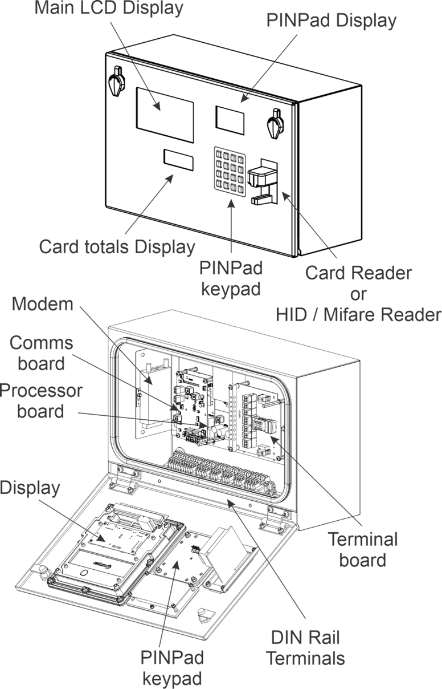
 
 

# Footprint

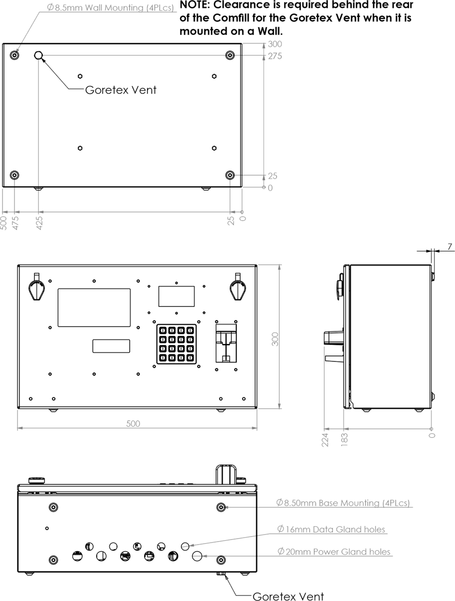

# Pre-installation

# 4.0 Zone requirements
**DANGER: The Compac Comfill V2 is NOT approved for installation in a hazardous area. Please consult the site's zone drawings to find the exact positions of the hazardous areas for the particular site.** 

For adequately ventilated fuel dispensing sites (not including CNG/NGV), in most cases the following will apply: 
- The unit is not designed to be constantly exposed to the elements. A shelter should be installed to protect it. 
- The card reader and PIN pad should face away from the prevailing wind especially in dusty or wet areas. 
- In areas experiencing extremes of weather (heat, cold, wind, rain, salt spray etc.) consideration should be given to installing additional shelter. 
- The Comfill V2 location or protection should be such as to minimise the possibility of damage from vehicles, trailers, boats, or the like. 
- On heavy vehicle sites, mounting the unit on a raised pad and/or installing bollards to help protect from damage should be considered. 
- If mounting on a post, the base needs to be attached to a smooth, level surface of sufficient strength to securely hold the retaining bolts or fasteners.  
- The Comfill V2 should be placed at least 8 metres from any above ground flammable liquid storage or handling facility other than a dispenser. 
- The Comfill V2 should be placed at least 0.5 metres from any flammable liquid fuel dispensers and 1.5 metres from any LPG dispensers. 
- The Comfill V2 should be mounted so that the base of the cabinet is at least 1.2 metres above the ground.  
- If the Comfill V2 is mounted on a post, and the post is within 4 metres of a dispenser or within 1 metre of the end of any fuel dispenser hose, then the entire interior of the post may be considered a hazardous area. Any cables running through, or electrical equipment mounted in the post should be suitable for that hazardous area (refer AS/NZS 2381). 
- Whenever running a cable through the post into the base of the cabinet always ensure that the cable entry into the cabinet uses a vapour tight gland.  
- Generally, the area below the Comfill V2 may be a hazardous area and therefore some appropriate signage may be required e.g. no smoking.  
- Lighting should be provided during the hours of operation. Lighting should be sufficient to provide safe working conditions that include, but are not limited to, clear visibility of all markings on packages, signs, instruments and other necessary items. A minimum value of 50 lux is recommended. 

For more information and guidelines on classifications of hazardous zones, please refer to AS/NZS 60079-10.1 (Classification of Areas – Explosive gas atmospheres) 
These requirements do not apply to any specific site but are merely recommendations that will apply in most cases. 
The owner/installer must ensure that the installation complies with AS/NZS 3000, AS 1940, and any other applicable regulations.
# 4.1 Static Electricity Precautions
Electronic components used are sensitive to static. Please take anti-static precautions. 
An anti-static wrist strap should be worn and connected correctly when working on any electronic equipment. If an anti-static wrist strap is unavailable, or in an emergency, hold onto an earthed part of the pump/dispenser frame whilst working on the equipment. This is not a recommended alternative to wearing an anti-static wrist strap. 

NOTE: Compac Industries Limited reserves the right to refuse to accept any circuit boards returned, if proper anti-static precautions have not been taken.

# 4.2 Tools

Having all the correct tools will make installation, upgrade and repair procedures easy and minimise the risk of damage to components.
Before you arrive on site, make sure you have a minimum of all the tools listed here.

- 5.5mm nut driver
- 7mm nut driver
- 8mm nut driver
- T30 Torx drive bit or driver
- T10 Torx drive bit or driver
- Metric spanner set
- Metric 3/8" or 1/4" drive socket set
- 1/4" screwdriver bit holder
- 1/4" A/F spanner
- 6" adjustable spanner
- Flat blade screwdriver set (1.5 - 5mm blades)
- #0, #1, #2 Phillips screwdrivers
- #1, #2 Pozidriv screwdrivers
- Set of metric Allen (hex) keys
- Fine long nose pliers, side cutters & pliers
- Hacksaw
- Stanley knife or similar sharp blade
- Ruler
- Multimeter
- Laptop or smartphone with internet

# Installation

# 5.1 Mechanical Installation

The Comfill V2 can be mounted from the rear or the bottom of the unit. Refer to Footprints for locations of the mounting holes. 
To mount the unit, the following will be supplied:

- 4x M8x25 button head hex drive stainless steel screws
- 4x M8x16 button head hex drive stainless steel screws
- 8x M8 nylon washers
- 8x M8 stainless steel flat washers
- 8x M8 stainless steel nuts

Stainless steel is recommended due to the reduced risk of corrosion when exposed to weather conditions. 
The Comfill V2 is suitable for outdoor installation. 
M8x25 screws are recommended for mounting from the rear of the unit and are suitable for mounting to surfaces up to 10mm thick. 
M8x16 screws are recommended for mounting from the bottom of the unit and are suitable for mounting to surfaces up to 4mm thick. 

# 5.2 Glanding

With the Comfill V2 unit, the following grommets will be supplied:

- 5x 16mm rubber grommets
- 5x 19.1mm rubber grommets

Any unused gland access holes should be blanked with the supplied grommets. 
19.1mm grommets will fit the 20mm access holes. 

The gland access is as follows:

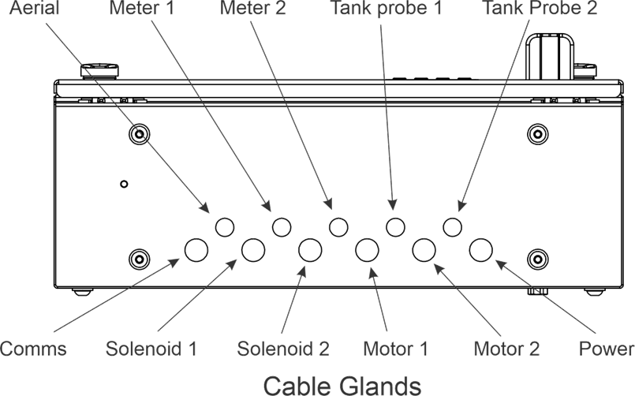

# 5.3 Perspex Guard

A Perspex guard is supplied with the unit and will need to be removed to access the terminal board and baseboard. 
The location of the guard is as shown: 
 

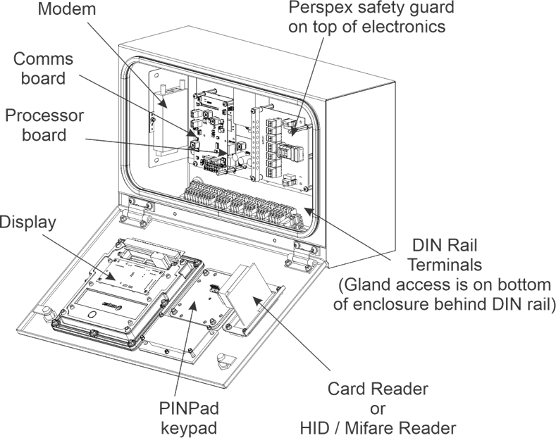

**DANGER:** The unit must be isolated before attempting to remove or reattach the Perspex guard. 

The Perspex guard is attached with 4x M4x10 pozi screws and M4 nylon washers. 
An 8mm nut driver will be appropriate for removing and reattaching the Perspex guard.

**NOTE:** *Always reattach the Perspex guard after working on the Comfill V2 unit.* 
 
**NOTE:** *Always reattach fuse covers after working on the Comfill V2 unit.*
 
 

# 5.4 SIM Card 

To install the sim card, the modem needs to be removed from the gear plate.

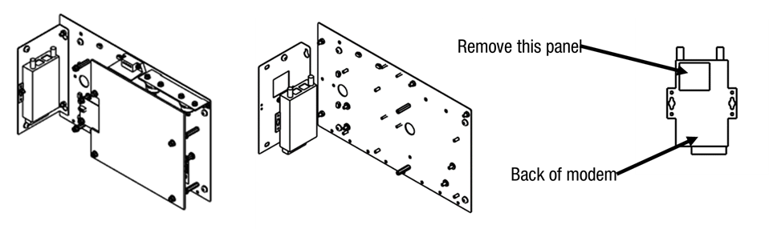

As shown, the left gear plate must be removed from the main gear plate. The modem can then be removed. 
On the back of the modem, there is a small square panel. Remove the panel and insert the sim card. 
Replace the modem and gear plate. 
Ensure that the modem is connected to the processor board. 
The LAN input on the modem should connect to the ethernet input on the processor board.

# 5.5 Modem Antenna

Depending on ordering and requirements, one of two options of modem antennae will be supplied. 
The installer will be required to attach this to the modem. 
The two options of supplied aerial are:

- High Gain Broomstick antenna with a 5m lead
- High Gain shorter antenna to be attached to the base, with a 2m lead

An IP67 plastic rated gland will be supplied for optional antenna glanding.
 
 

# 5.6 DIN Rail Connections
When the Comfill V2 arrives onsite, all internal wiring will already be connected. Incoming external cables will have to be inserted through the glands and then connected to the back of the DIN rail. The nozzle switch and meter will be connected to the DIN rail. The connections are as shown:

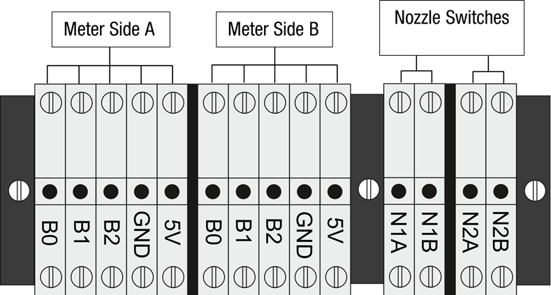

The Comfill V2 supports Compac encoders, Compac V50 Meters and most third-party meters. 
Some third-party meters require 10 kΩ resistors to be connected. In case of this, 6x 10kΩ resistors will be supplied with the Comfill V2 unit.

# 5.7 Connecting a Compac Encoder

The Compac encoder connects to the DIN rail via a six-core (only five cores used) data cable. 
The five cores used are: 
Orange or White		-	5V terminal 
Yellow or Black		-	0V terminal (GND) 
Brown			-	B0 terminal (used for single, dual, and triple channel encoders) 
Blue			-	B1 terminal (used for dual and triple channel encoders) 
Red			-	B2 terminal (used for triple channel encoders) 

Where B0, B1 & B2 are the three opto-sensor connections. Not all of these may be used depending on the meter connected. 

To reverse the rotation of the encoder sensing, the B0 & B2 wires should be reversed. The error message for reverse rotation is Err 8.

# 5.8 Connecting a Compac V50 Meter

V50 meters can be connected directly to the K-Factor board. Refer to K-Factor Board for the location of the meter plug.

# 5.9 Connecting a Piusi meter

A Piusi K700 Modular Pulse Meter has three data cores. 

If connecting a Piusi meter, the data cores should be connected as following: 
|Colour|Terminal
|-----|-----
|White|		5V terminal (a resistor should be included)
|Black|		0V terminal (GND)
|Yellow| 	B2 terminal

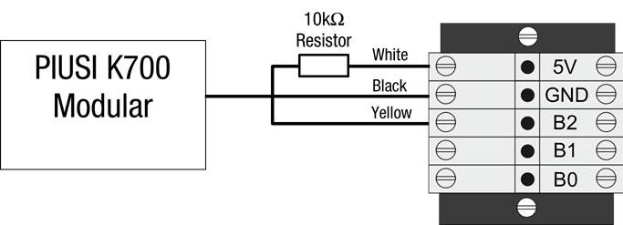

# 5.10 Connecting a Reed Switch Meter

If connecting a Reed switch type meter: 
Reed switch type meters require three signal connections and one earth connection as shown:

**NOTE:** Ensure the wiring is shorted on the meter end, not the Comfill V2 end.

 

# 5.11 Connecting a Veeder Root Pulser Meter

**Dual Channel:**

**NOTE:** Ensure the wiring is shorted on the meter end, not the Comfill V2 end.

  

**Single Channel:**

**NOTE:** Ensure the wiring is shorted on the meter end, not the Comfill V2 end.

## Comfill V2 Pulses for encoder( K-factor = 1)

|Channels|State changes|Volume 
|-----|-----|----- 
|1 channel| 50 state changes (high and low )|0.16 litres 
|2 channel| 100 state changes (high and low)|0.25 litres
|3 channel| 150 state changes (high and low)|0.50 litres

 

**Veeder Root 7671 models**

|767163-xxx|Bidirectional|Clockwise|Counter Clockwise|Pulse per rotation|C5000 rotations per litre. K factor = 1
|-----|-----|-----|-----|-----|-----
|Single Channel|-32x|-42x|-51x|100|1 rotation = 0.66 litres
|Dual Channel (staggered)|-31x|-41x|-51|50|1 rotation = 0.66 litres
|Dual channel (overlap)|-30x|-40x|-50x|50|1 rotation = 0.66 litres

**NOTE:** *Comfill V2 only supports single channel and dual channel staggered signals. 
Dual channel overlapping signals are not supported.*
 
 

# 5.12 Connecting a Macnaught meter 

Macnaught meter is a Hall Effect single channel meter

The Compac CI266A Pulser/Encoder is an optional extra. 
If fitted, it provides detection if the Meter or a Channel is disconnected.
Refer to section on **Encoder interface for 3rd party encoders** for further information 

 

**Connection to a Macnaught Meter if a Pulser/Encoder I/F is installed (on the DIN Rail)**

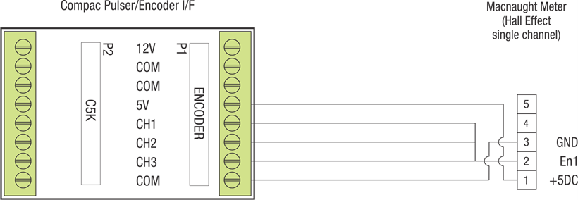

**Connection to a Macnaught Meter if a Pulser/Encoder I/F is NOT installed**

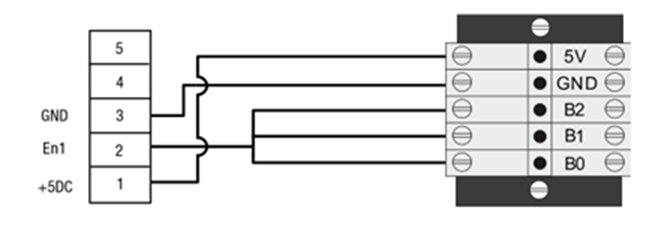

**NOTE:** *Ensure the wiring is shorted on the meter end, not the Comfill V2 end.*

# 5.13 Connecting a Tank Gauging Controller

**Important note when installing Tankgauging:**
If tank gauging is connected to the Comfill V2, then the LFD 485 option (refer to Custom settings in Local Setup section ) must be set to DISABLED, as they both use the same channel.  

If the “LFD 485” option is ENABLED, the tank gauging connection will continuously drop out

Tank gauging is optional. If a tank gauge is ordered, extra terminals will be on the DIN rail. 
If connecting a Tank Gauging Controller, connected it to the terminal block marked **TANKGNG** as shown:

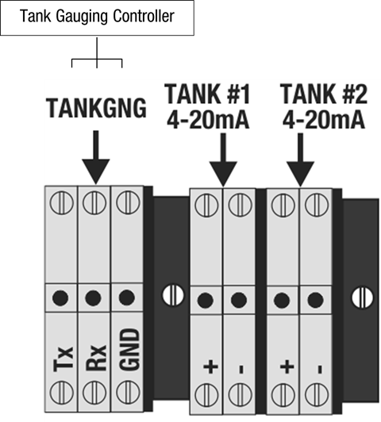

**NOTE:** Configuration may change during production. Terminal blocks may not be in the same order in every unit.

 

# 5.14 Connecting a 4-20mA Tank Probe

Connect the 4-20mA Probe for Tank 1 to the **+ve** and **-ve** Terminals marked **TANK #1 4-20mA**

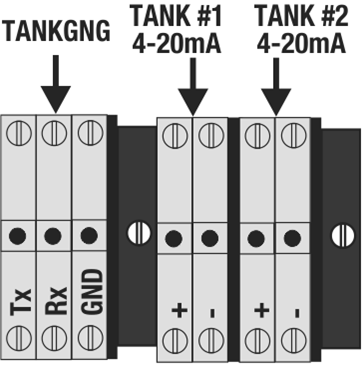

If there are two Tanks, connect the second 4-20mA Probe to the **+ve** and **-ve** Terminals marked **TANK #2 4-20mA**

# 5.15 Connecting to a Compac C4000 FUTRA Pump
Installing a COMFILL V2 Fuel Management system on a Compac Pump / Dispenser with “FUTRA” Fuel Management system (2002 to 2010)

The “FUTRA” Fuel Management system is no longer supported
Due to software and hardware incompatibility, it is not possible to convert a Compac Pump / Dispenser with “FUTRA” Fuel Management system to standard current loop comms to connect to the COMFILL V2

In this case, the built-in pump functionality in the new COMFILL V2 is used
The C4000 electronics, PINPad, Cardreader, Modem and LCD Display in the existing /Dispenser becomes redundant 

Use of the following components in the existing Pump/Dispenser are retained and wired back into the new COMFILL V2 effectively giving the customer a new pump 

•	COM50 / COM125 Flow Meter 
•	Pump Motor ( Pump models only) 
•	Solenoid (Dispenser models only)  
•	Nozzle holder with nozzle Switch 

The COMFILL V2 then becomes both the PUMP and Controller with Fuel Management System including Internet connectivity to CompacOnline. 

**Notes:**
The Nozzle cable and COM50/COM125 cable will be in a blue cable sleeve and will need to be separated.
Remove the Cardreader from the existing pump and fit the blanking plate supplied in its place
Refer to “Triac Wiring (For motors up to 1KW)” section to connect Motor to Side A

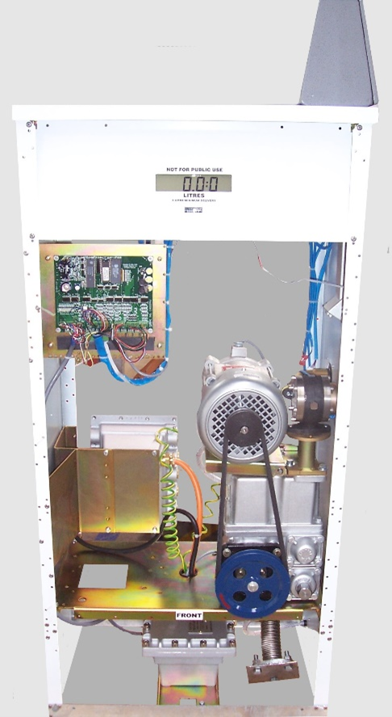

 

# 5.16 Encoder interface for 3rd party encoders

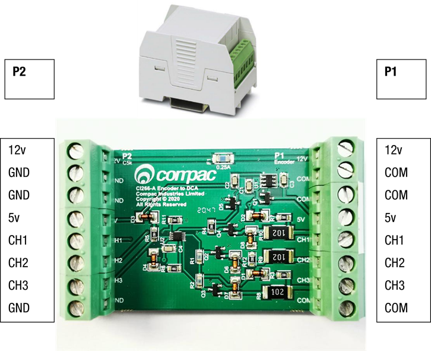

**NOTE:** The interface board is not intrinsically safe therefore it should not be used in a hazardous area.

Pulser/Encoder I/F is used to interface from third-party pulser/meter. This can be DIN rail mounted.
12V source can be connected to the 12V and GND pin 1 and 2 of P2 terminal to provide a 12V supply on P1-8. 
The terminal must not exceed 0.25A. 

If the 12V supply is not required, the I/F board will work without the 12V. The COM terminals on P1 are connected to the ground terminals of P2. 
Do not connect the COM to the pulser/meter frame and do not connect the common and frame together.

The 5V power supply must be connected to the P2 terminal pin 4 and 8 to power up the I/F board. 
5V supply can also be used to power third-party meter from terminal P1 pins 5 & 1.

P2 terminal Ch1, Ch2 and Ch3 (pins 5,6 and 7) are the signal outputs from the pulser/encoder
which need to be wired into DIN rail Ch1, Ch2, and Ch3. If not wired correctly it will cause error 9.

**P1 Terminals** 

Most third-party pulsers/meters have one or two channels and run on 12V. 
For error detection, at least two channels need to be wired from the pulser/meter. 
For single channel pulsers/ meters, two wires need to be connected together at the meter and the outputs need to be connected to Ch1 and Ch2 of the P1 terminal.

Below are some examples of wiring to a third-party pulser/meter from the P1 terminal. 
The pull-up resistors are internal to the pulser/meter.  

**Single channel third-party 12V pulser**

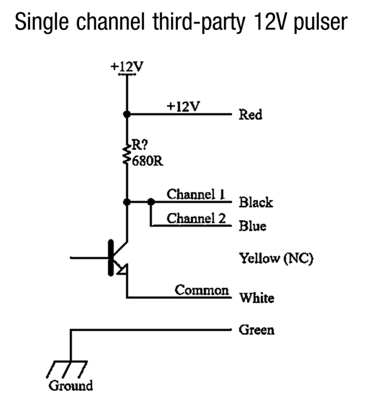

**Single channel third-party 12V pulser**

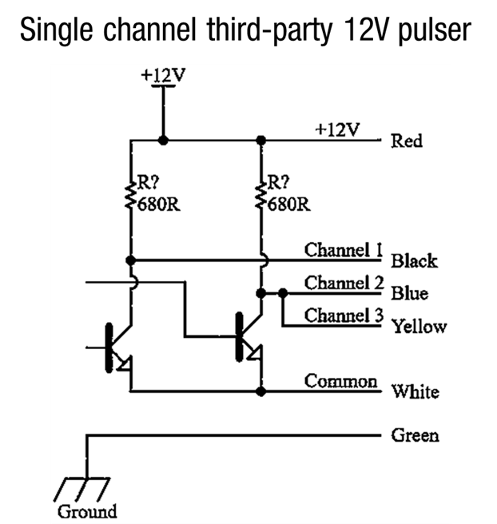

**Three channel Compac 5V pulser**

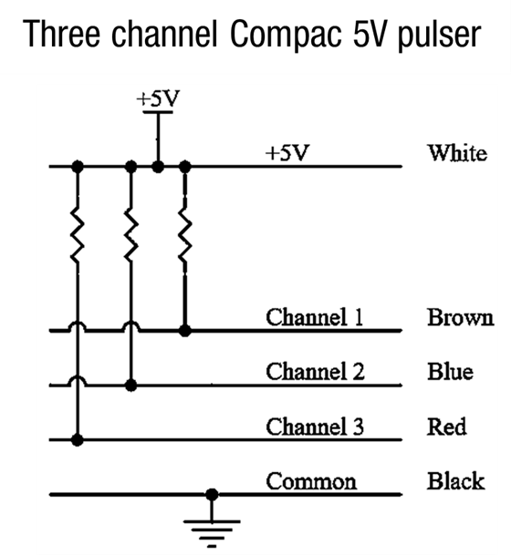

# 5.17 K Factor board

**K-Factor Board connections**
The K-Factor board connections shown are internal and will already be connected. 
If connecting a V50 meter, connect directly to the meter input instead of the DIN rail.

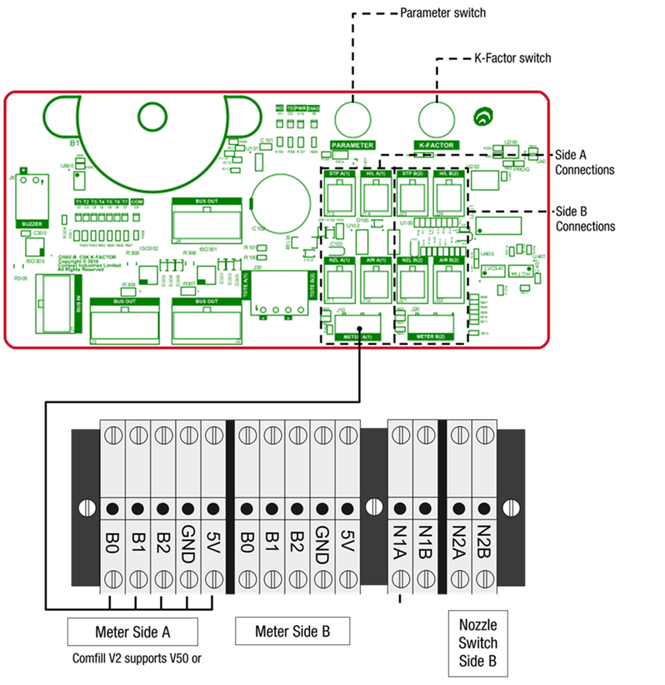

 
 

# 5.18 PINpad board

The PIN Pad board is wired to the PIN pad and the Wiegand or HID reader. These connections are internal and pre-installed. 

The locations of three dipswitches on the PIN pad board are shown.
Switch 1 changes the configuration of the unit between Cardreader mode and HID reader mode. 
|Switch 1 position|Mode
|-----|-----
|ON|HID mode
|OFF|Cardreader mode

Having this switch in the incorrect position will display XXXXXXX on the main display when a card or HID is used to take fuel. 

If the dipswitch position is changed, the unit must be repowered for the changes to take place.

Switches 2 and 3 are not currently used.

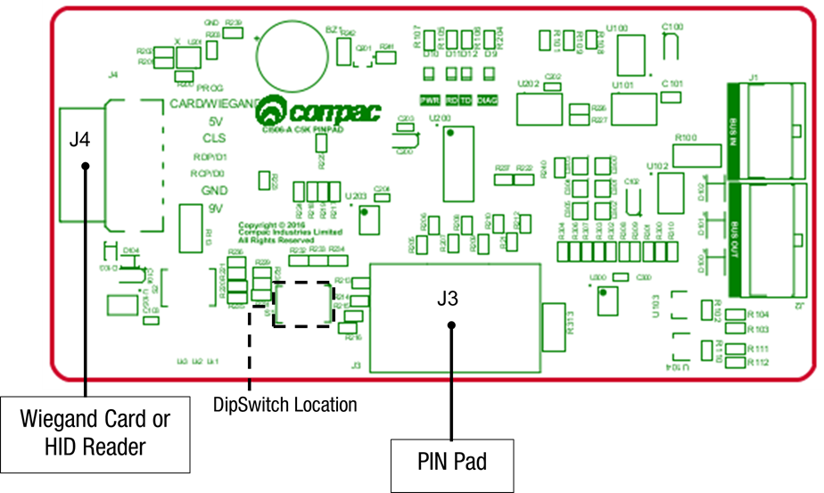

 

# 5.19 Terminal Board 230V version Mains and Motor

The external incoming mains and motor connections will need to be connected onsite. 
The motor will need to be connected for both side A and side B as shown.

|Motor|Phase terminal|Neutral Terminal|Earth 
|-----|-----|-----|-----|
|Motor Side A|TB7|Neutral|Earth Busbar
|Motor Side B|TB6|Neutral|Earth busbar

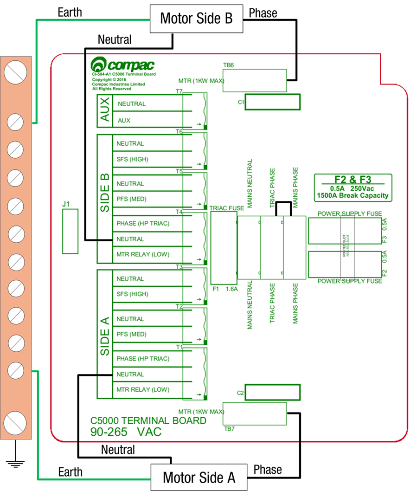

Wire the incoming mains into the terminal board. 
The incoming mains wiring is as follows. Wires have standard colours which are shown. 
In case these are unclear, the colours are as follows: 

•	Incoming mains phase: Brown 
•	Incoming mains neutral: Blue 
•	Incoming mains earth: Green/Yellow 

If wiring in an emergency connection, it should be connected to the triac-phase loop. Cutting this loop will cut power to all outputs on the terminal board. An emergency stop switch should be installed.

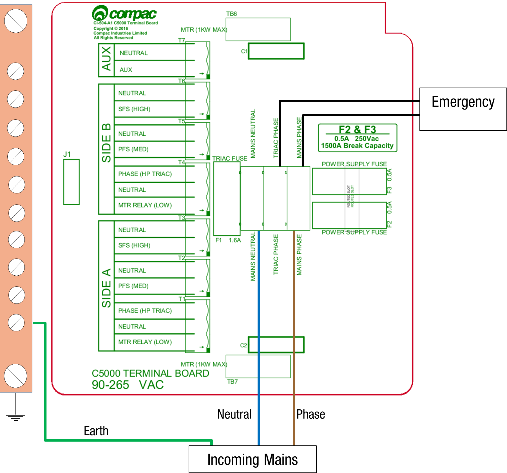

# 5.20 Triac Wiring 

Triac Wiring (For motors up to 1KW)(For motors up to 1KW)
The triac wiring will be pre-installed and, in most cases, will not need to be changed. 
The wires are colour coded with standard colours. In case these are not clear, the colours are as follows:

|Wire colour code|Terminal Board|Triac Spade Terminal
|-----|-----|-----
|Red|Triac Phase|Phase
|Orange|MTR Relay(LOW)|Gate
White|MTR (1KW MAX)|Load

The correct orientation of the triac is important for wiring. Wire the triac(s) to the terminal board terminals using 0.75𝑚𝑚2  coloured wires and link the Mains Phase and Triac Phase using a 1.5𝑚𝑚2 red wire.

Comfill V2 can support up to two 1KW single phase motors via the triac outputs. 

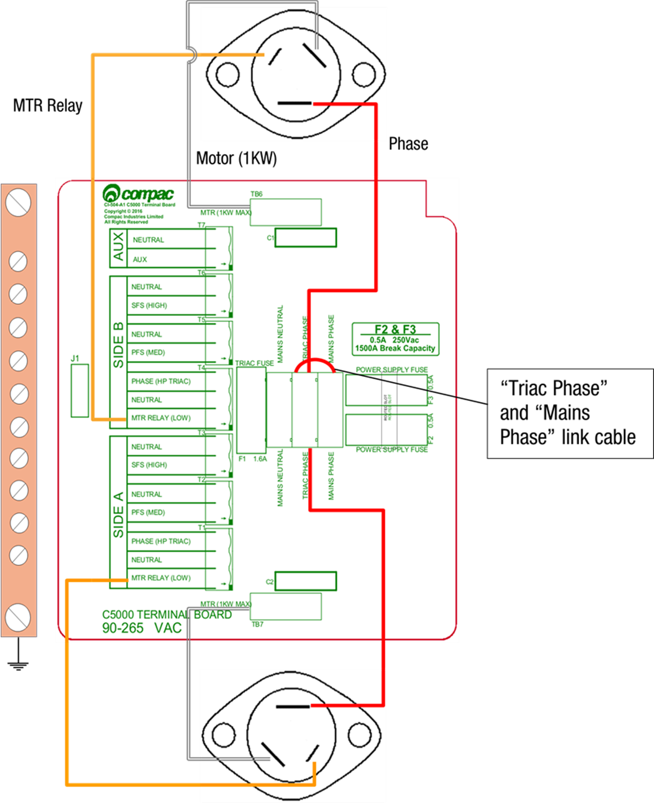

 
 

# 5.21 Motors over 1KW
The external pump connections are as shown below. Wire in the required side(s).

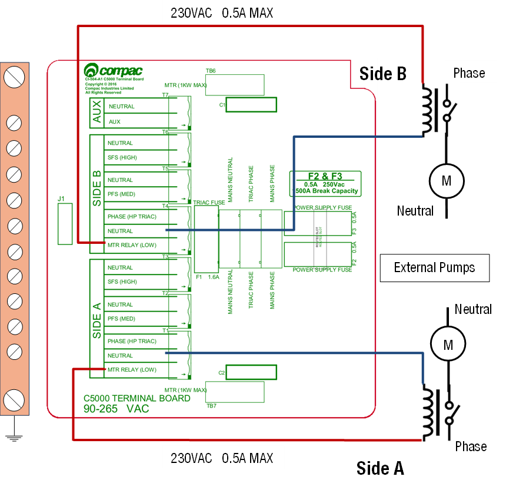

# 5.22 Connecting to external pumps

For third party pump motors over 1KW, the contactor coil needs to be connected to the “MTR RELAY (LOW)” terminal and neutral terminal beside it. 

The MTR relay (low) output is 230VAC and it can supply up to 0.5A. However, the total output from 7 triac outputs (T1-T7) must not exceed 1A.

Connect the Nozzle and meter connections to the DIN rail as necessary (Refer to the “K-Factor board” for the DIN rail terminals diagram to connect nozzles and meters).

# 5.23 Terminal Board 12 or 24 VDC version
Power Requirements for the 12V DC Comfill V2 are as follows:

## Voltage requirements

|Voltage requirement|Voltage|
|-----|-----
|Input Battery Voltage range|8-28V  
|Minimum supply voltage required at start-up (if Modem connected to Terminal Board)|13.5V  
|Minimum supply voltage required at start-up (if Modem connected directly to Battery)|11.5V  
|Minimum supply voltage once powered up and running|8V  

## Battery connection

Connect the Battery to the Terminals marked **BATT+positve** and **BATT-negative**

## 12 volt Solenoid connections

|Solenoid|Negative Wire|Positive Wire
|-----|-----|-----
|Side A Solenoid|SOL1 -ve|SOL1 +ve
|2nd Side A Solenoid (if fitted)|SOL2 -ve|SOL2 +ve
|Side B Solenoid|SOL3 -ve|SOL3 +ve
|2nd Side B Solenoid (if fitted)|SOL4 -ve|SOL4 +ve

## F101 Fuse rating
4 Amps

## Emergency Stop Switch connection

To connect an Emergancy Stop Switch:
Remove the factory fitted link between the terminals marked **OUTPUTS+** and **BATT+**
Connect the Emergency stop switch to the terminals marked **OUTPUTS+** and **BATT+**

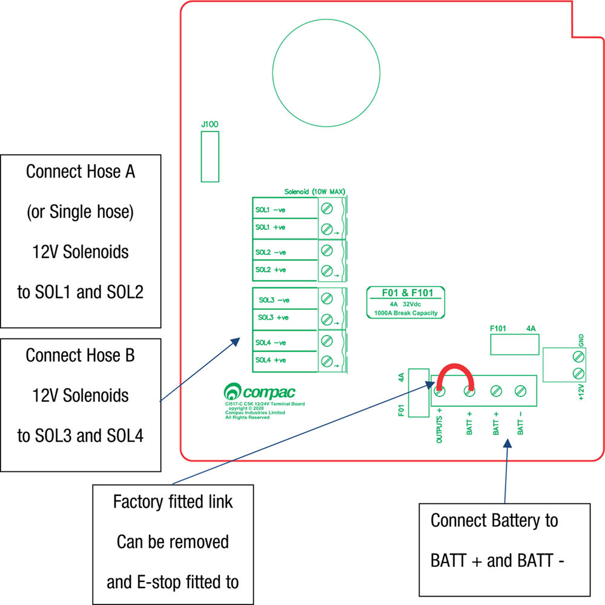

 

# 5.24 Terminal Board 12 or 24 VDC version with Solar charged Battery

|Voltage requirement|Voltage|
|-----|-----
|Input Battery Voltage range|8-28V  
|Minimum supply voltage required at start-up (if Modem connected to Terminal Board)|13.5V  
|Minimum supply voltage required at start-up (if Modem connected directly to Battery)|11.5V  
|Minimum supply voltage once powered up and running|8V  

If the COMFILL V2 is to be powered from a Battery that is charged from Solar panels, 
it is recommended that the Modem is wired directly to the battery as below to ensure that the  
COMFILL V2 and Modem have sufficient power and voltage to start up.     

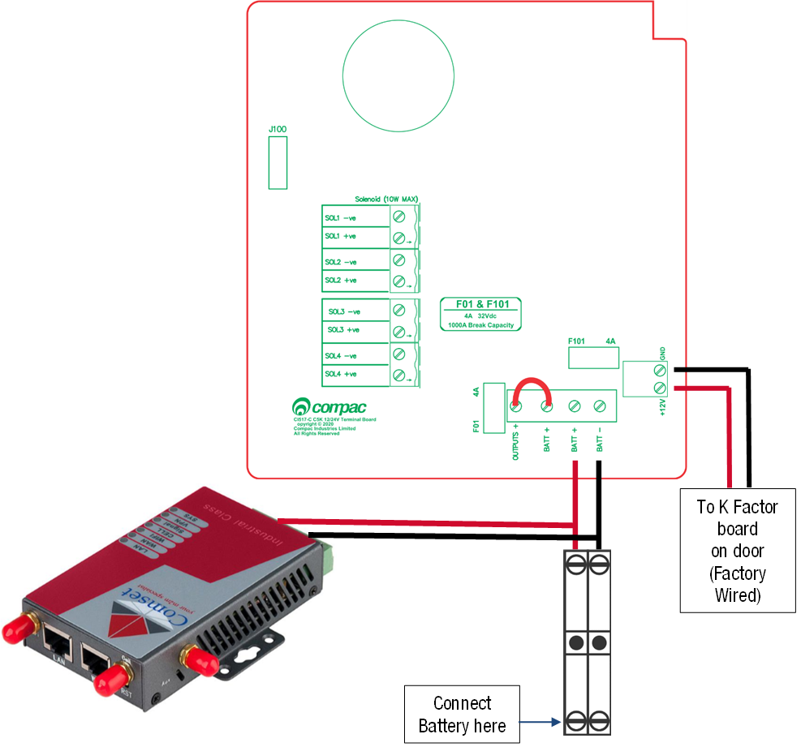

 

# Comms settings
In the ComfillV2, the CI533 Comms interface PCB board is piggy-backed on top of the Processor Board 

A 15 core multicore loom connects the CI533 Comms board to the DIN Terminal Rail where all the  site connections are made. 
The DIN Rail is clearly labelled. 
All site connections are made directly on the DIN rail. 
No site connections are required directly onto the CI533 Comms board. 

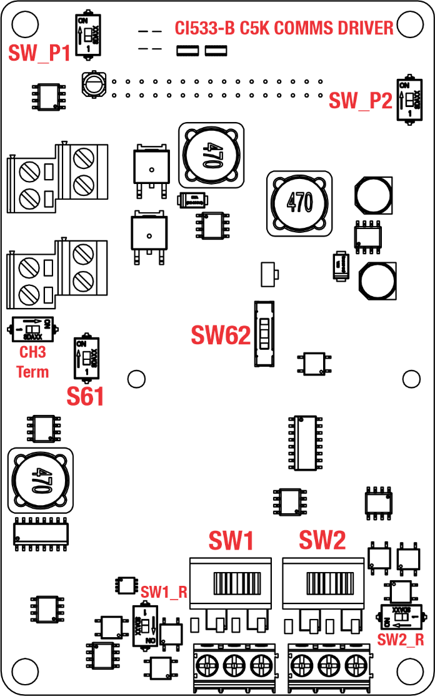

**CI533 COMMS board functions**
The CI533 Comms board has two functions.
1.	Enables the COMFILLV2 to communicate with Compac, Gilbarco and Wayne Pumps and Dispensers.
2.	It has a Tank-gauging interface to connect to either 2x 4-20m Tank Probes or a 3rd party Tank controller ( Veeder-Root or Calibri)  via RS232    

**CI533 COMMS channels**
There are three Comms channels 

**Channel 1**. CH1 can be configured for the following protocol options using Switch SW1 
•	COMPAC standard current loop comms  
•	COMPAC Comms over RS485 
•	Wayne DART protocol over RS485 
 
If Compac Comms over RS485 for long distances is required (ie greater than 100 metres), set CH1 to RS485 and configure CH1 for Compac in the COMFILL settings. Refer to Local setup / Pumps / Comms 

For Wayne DART protocol, configure CH1 for RS485 and configure CH1 in  Local setup / Pumps / Comms for Wayne DART protocol

There is an ENABLE switch SW_P1 to turn CH1 ON. A Green LED indicates that the CH1 is ON
When communicating with a Pump or Dispenser, the Tx and Rx red LEDS will flash
SW_P1 is normally left in the ON position

**Channel 2** CH2 can be configured for the following protocol options using Switch SW2 
•	COMPAC protocol over RS485 
•	GILBARCO protocol 
•	Wayne DART protocol over RS485  

If Compac Comms over RS485 for long distances is required (ie greater than 100 metres, set CH2 to RS485 and configure CH2 for Compac in the COMFILL settings. Refer to Local setup / Pumps / Comms 

For Wayne DART protocol, configure CH2 for RS485 and configure CH2 in  Local setup / Pumps / Comms for Wayne DART protocol

There is an ENABLE switch SW_P2 to turn CH2 ON. A Green LED indicates that the CH2 is ON
When communicating with a Pump or Dispenser, the Tx and Rx red LEDS will flash
SW_P2 is normally left in the ON position

**Channel 3** CH3 can be configured for either RS232 or RS485 using Switch S61
CH3 is exclusively used for Tank Gauging Controllers eg Veeder-Root or Calibri  
Only RS232 is currently supported on CH3 so the Tank Controller should also be setup for RS232

**CI533 Comms board Dipswitch settings**
These are the Dip-switch settings for Compac, Gilbarco, Wayne DART and RS485 Comms 
**SW1 CH1 Channel 1** 
1 = Compac Current Loop comms 
2 = RS485 

**SW2 CH2 Channel 2**  
1 = Gilbarco 
2 = RS485 

**S61 – CH3 Channel 3 selector switch** 
ON = RS232 
OFF = RS485 

**SW62** - This switch is used for current loop systems on channel 1 (e.g. Gilbarco, Wayne). Adjust the switch according to the current (mA) of the site protocol as required. There are three current options. 
Wayne = 45 
Gilbarco AUS = 30 
Gilbarco USA = 20 

**CH3 Term, SW1_R and SW2_R**
These switches are used for an end of line termination resistor for RS485 applications.
They are not currently supported and should be left in the OFF position 

# System Software

# 6.0 Operational Cycle

The following diagram shows a normal cycle of the Comfill V2 unit, and the displays at each point.

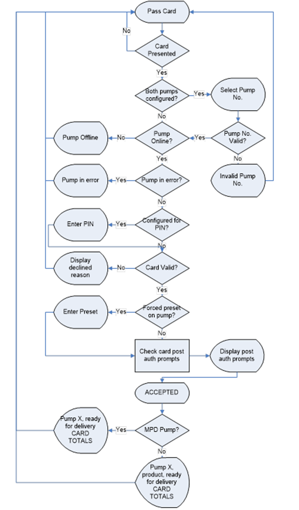

This section details what options are available for the unit and what each setting means. 
Some settings may not be available for each specific unit.  

# 6.1 Card Records

Before cards can be added, card records need to be set up from the Comfill V2 unit. 
When setting up card records, a PAN length, BIN range, and access number can be specified. 
These are encoded onto the card and can be used to restrict access to the pumps. 
PAN length is the number of digits that make up the BIN number and card number. 
The BIN range gives access to a range of cards that have similar BIN numbers. 
BIN numbers are always 6 digits long. To make this into a BIN range, two numbers must be added. 
 
For example, if a card had the following card number: 
7824331000132017 
The card is 16 digits long, therefore the PAN length is 16. 
The BIN number is 782433. To allow all cards with the same BIN number access: 
BIN low should be set to 78243300. 
BIN high should be set to 78243399. 
This would allow all cards with a BIN number of 782433 access. 
 
The Access number is used to further restrict cards. This is a 5-digit number and will be encoded onto the cards. 
0 should be entered into the Access field if the card does not have an access number. 
Once the card records are set up, specific cards can be entered into the system using PAN numbers.

If a card is hotlisted, it will be accepted even if the card PAN number has not been entered. 
Otherwise, the card’s individual PAN number will have to be entered as a card. 
Prompts are an optional setting which may be chosen when setting card records. 
The prompts that are selected when entering a card will appear when that card is swiped 
For example, if odometer is selected, the card holder will have to enter an odometer number to access the fuel pump. 
Cards can be enabled or disabled.

# 6.2 Passcode
For security, the unit has a passcode. This can be used to access settings from the unit. 
For extra security, if the settings are accessed with the passcode, some options are not able to be changed, such as the K-Factor setting. 
These must be accessed by pressing the K-Factor switch. 

The Comfill V2 supports three different authorisation modes:
- PIN
- HID
- Cardreader.

The system can be set up from either CompacOnsite or from the unit itself. 

NOTE: If the unit is changed between Cardreader and HID configurations, it is important to change the dipswitch settings on the PIN pad board. See PIN pad board section.

# 6.3 Pumps

The Comfill V2 supports two configurations, single and dual, enabling two pumps to be used simultaneously if one card is used. 
These pumps are assigned a side so that they may be individually customised. 
Each side must be numbered between 1-99.

**NOTE:** *Entering a pump number 0 will disable the pump.*

Individual settings for each pump include: 

- The fuel product used, which has a name and product code 
- The meter used at each pump. 

The unit supports encoder meters (max frequency 3.5Khz) or V50 meters. 
The K-Factor, used to calibrate fuel flow, can also be set for each pump. 
The state of the pumps can be either operational or locked, which may be desired if the pump is not operating normally. 
Pumps have two solenoids for product flow. If the solenoids are unavailable, the pump preset should also be unavailable. 
Solenoid delay, the amount of time it takes the solenoids to turn on after lifting the nozzle, can be customised for each side. 
Auto authorisation can be enabled for a pump, allowing the pump to be authorised without lifting up the nozzle.

# 6.4 Preset Cutoff and Rounding

Preset cutoff is used to deliver an accurate amount of fuel. 
 When dispensing fuel, two solenoids are used for fuel flow. 
 When the dispensed amount of product reaches the preset cutoff, one solenoid is turned off to slow delivery rate and dispense an accurate volume of product.
A two-digit number can be assigned to determine the preset rounding in litres. 
The first digit determines how the preset is rounded down, and the second digit determines how the preset is rounded up. 
For example, if Preset Rounding is set to 89 and the preset is 40;

- 40.08 is within .08 of 40 and would therefore be rounded down to 40.
- 39.91 is within .09 of 40 and would therefore be rounded up to 40.

# 6.5 Flow Range

A flow range is needed for each pump to dispense an accurate amount of product. 
If too much or too little fuel is dispensed, the meter cannot accurately measure the dispensed fuel and therefore should cut off and display an end of sale message. 
The flow range will vary for different products. Flow low should be the lower value of the flow range, while Flow high is the highest possible flow. 

**NOTE:** *Flow range is optional. The default value is 0.* 
 
A flow timeout can be set, which cuts off the motor after the set amount of time. The default is 000, which is 20 seconds.

# 6.6 Unit price and End of Sale

For the Comfill V2, the unit price is always 1. If the setting is changed in the unit to something different, the unit price will remain as 1. 

End of sale indicators show why the motor stopped during the last sale. Refer to End of Sale for the full list of these.

# 6.7 Cards and Card Users

Card numbers must be added for a card to be valid. Card or HID numbers can be added. 
These numbers should correlate to the earlier card setup done in the system section. 

Cards can also have User IDs, which are optional prompts for cards. If a User ID is asked for the customer dispensing fuel will have to enter a valid User ID. 
If a user ID is not required, and instead the retailer wants a different prompt (such as Fleet number) user ID can be configured to ask for different prompts.

# 6.8 Meters

The unit supports encoder or V50 Modbus meters. The encoder meters can be single, dual or triple channel. Single channel encoders measure the fuel dispensed. Dual channel encoders do this as well as determine the rotation of the meter (and therefore the direction of fuel flow). Triple channel meters can determine if the meter is correctly connected and functioning. 

# 6.9 K-Factor

The K-Factor is used to calibrate product flow. It is a ratio of litres dispensed per revolution of the meter. The K-Factor may need to be calibrated after periods of time. 
To calibrate the pump, dispense fuel into a certified measuring container and compare the display value with the one dispensed.
Example:
The Display shows 10.00 litres but the True volume is actually 20.00 Litres

To calculate the correct K-Factor from the information above; firstly record the existing K-Factor and use this formula to calculate the new K Factor.

**New K Factor=Existing K Factor x (Dispensed Amount)/(Displayed Amount)**

=Existing K Factor x 20/10

=Existing K Factor x 2

See Using the Dispenser Menus to edit this setting.

## 6.10 Minimum Measurable Quantity MMQ

Minimum measured quantity (MMQ) is the minimum amount of fuel that can be dispensed and measured. The MMQ is calculated with the following equation:

MMQ=M x 10^n

With the value in litres. For example, if the coefficient was set to 2, and the exponent was set to 1:

MMQ=2 x 10^1=20L

So the minimum delivery would be 20 litres.

The exponent can only be certain values;

If the coefficient is 1, the exponent can be 0, 1, 2, 3 (valid values are then 1, 10, 100, 1000)

If the coefficient is 2, the exponent can be 0, 1, 2 (valid values are then 2, 20, 200)

If the coefficient is 5, the exponent can be 0, 1, 2 (valid values are then 5, 50, 500)

If either of the values entered are not valid, or the value is left as 00, the MMQ will be calculated from the maximum flow. The MMQ is the maximum flow x 0.05. For example, if the maximum flow was 40 (the default):

MMQ=40 x 0.05=2L

Note that the MMQ still must be one of the valid values listed above. If the MMQ is calculated from the maximum flow, and is NOT one of the valid values listed above, it will be rounded up to the next valid value. For example, if the maximum flow was 600:

MMQ=600 x 0.05=30L

30L is not a valid value, and therefore the MMQ would be rounded up to 50L.

The MMQ sets the display suppression. When a transaction starts, the quantity dispensed will not show until a percentage of the MMQ has been dispensed. For LPG, display suppression is 4% of the MMQ. For non-LPG operation, display suppression is 2% of the MMQ. For example, if the dispenser is in LPG mode and the MMQ is 2L:

2 x 0.04=0.08

So the quantity dispensed will not show until more than 0.08L has been dispensed.

# 6.11 Tanks

Tanks can be set up with their corresponding product, number and capacity

# 6.12 Tank Gauging

Tank gauging is used to determine how much fuel is left in a tank. 
The Comfill V2 supports four tank gauges; 
- Veeder-Root 
- Fafnir 
- Vega 
- Virtual 

To accurately gauge the volume of fuel, the tank number, safe fill level and capacity are required. These depend on the tanks onsite. 
If a Vega electronic dipstick is used, please note that more information will be required; the position of the probe in the tank is needed. 
A Tank Strapping table ID will be required to calculate volume. A Vega electronic dipstick may also be connected differently; the gauge channel may change depending on the connection to the Comms board.

# 6.13 Device

As the C5000 electronics are used for a variety of units, the variant can be changed. 
For the Comfill V2, the variant should always be set to COMFILL V2. 
The Comfill V2 does not have a slave display and the slave display setting should be set to none. To update the software, contact Compac.
 

# Local Setup

To change settings from the unit you must either have access to the K-Factor switch, which is located on the inside of the unit on the K-Factor board or have the passcode to the unit.

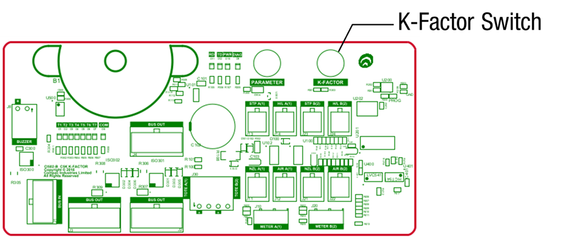

Pressing the K-Factor switch will bring up a menu displaying set up options on the Keypad display. 
The available options are shown below. 
The same menu can be accessed by pressing Cancel on the standard display and entering the passcode. 

 

**IMPORTANT NOTE:** The settings shown on each individual unit will depend on the current software version. 
Not all the options shown here may be displayed on every unit.

**NOTE:** If the menu is accessed by entering the passcode, not all the settings will be available. K-Factor and meter setup can only be accessed by pressing the K-Factor switch.
The K-Factor switch must be sealed after servicing.

NOTE: The system has a timeout of 15 seconds.

# 7.0 System

# 7.1 Device

To Access this menu, select SYSTEM from the main menu and then select DEVICE. 
Only change the device ID if the processor board is replaced.

To change the device ID,

1.	From here the device ID and CompacOnsite login can be viewed
2.	To change the Device ID, press #
3.	Enter the new device ID and press enter 

# 7.2 Passcode

To Access this menu, select SYSTEM from the main menu and then select PASSCODE. To change the Passcode,

1.	From System, select Passcode
2.	Enter the desired new passcode and press enter

# 7.3 Network

To Access this menu, select SYSTEM from the main menu and then select NETWORK. 

The IP address, subnet, gateway and DNS settings of the unit can be viewed or changed. 
Select the desired setting to be changed .Enter the new values and press enter. 

# 7.4 Time

Select SYSTEM from the main menu and then select TIME from the system menu. 

1.	To change the time and date, select the option and enter the new time or date. 
2.	To change the time zone, press 3 and select the desired time zone. 
3.	The offset is set by the time zone. 
4.	Select DST to “yes” or “no” for daylight saving.

# 7.5 Info

To access Info, select SYSTEM from the main menu and then select INFO. The information section is read only. 

1.	Selecting Software will show the software versions loaded. 

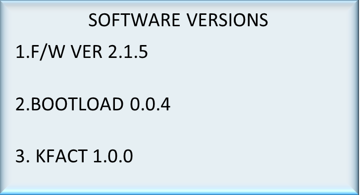 
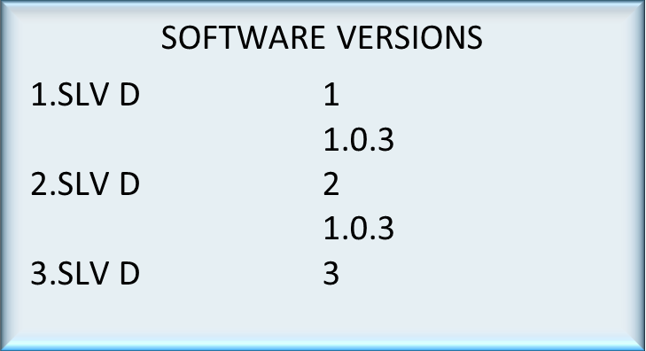

2.	Select status to see the system uptime.

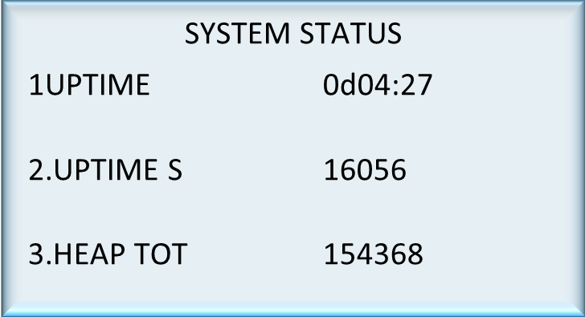

# 8.0 Hardware

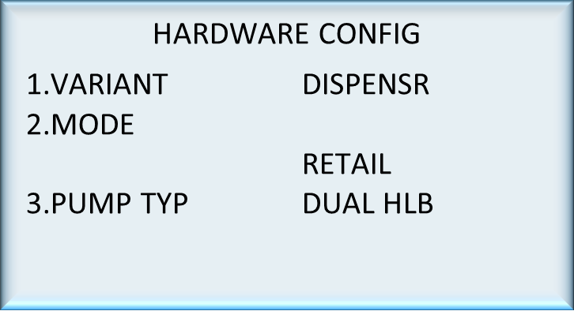

This menu is available from the main menu. Select HARDWARE. 
Variant, mode, pump type, stop switch and display settings are available in Hardware configurations. 
The following section will explain how to configure hardware.

# 8.1 Variant

 

Select HARDWARE from the main menu and then select VARIANT. To change variant,

1.	Press 1 to enter the variant from Hardware config menu.
2.	Chose the appropriate number to set the variant as a dispenser or a hybrid(controller and a dispenser). 
This will rarely need to be changed. 

# 8.2 Mode

Select HARDWARE from the main menu and then select MODE.

The pump mode is a restricted menu and can only be accessed with the K-Factor switch. 
The pump mode can be changed by selecting the desired setting. 

# 8.3 Pump Type

Select HARDWARE from the main menu and then select PUMP TYP.

Pump type is a restricted menu and can only be accessed with the K-Factor switch. 
Pump type can be changed by selecting the desired setting

# 8.4 Pump Config

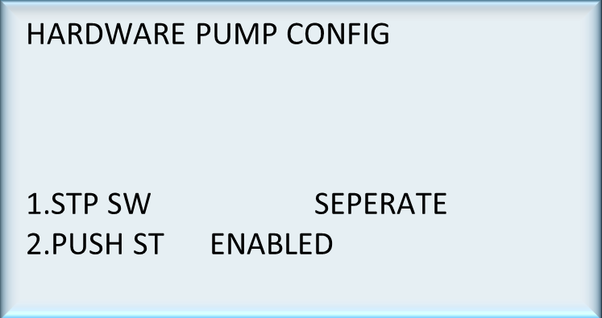

Select HARDWARE from the main menu and then select PUMP CFG.

1.	It’s a restricted option and can only be accessed by pressing the K-Factor switch. 
2.	STP SW is for sump stop switch. Stop switch can be changed between separate and combined 
3.	PUSH ST is for push start button this option can be toggled between enabled and disabled.

# 8.5 Display

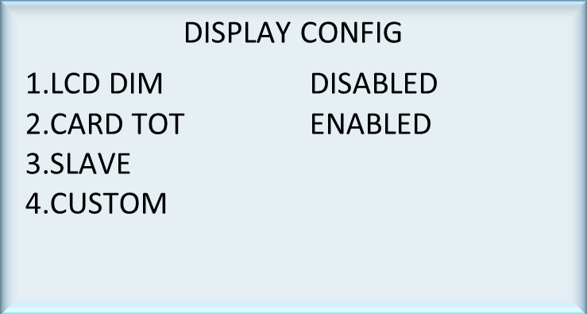

Select HARDWARE from the main menu and then select DISPLAY.
    To change the settings,
1.	Select LCD dimming or card totals to enable or disable these functions. 
2.	Slave display settings or custom display information can be accessed by selecting the desired option.  
 

# 8.6 Slave Display

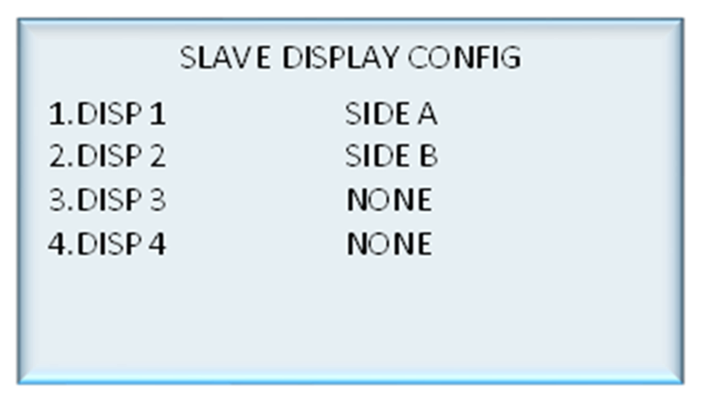

Select HARDWARE from the main menu, select DISPLAY and then select SLAVE from the display config menu.

Each connected slave display can be configured from this menu. 
Select the slave display to assign it to the appropriate side. 

# 8.7 Custom Display

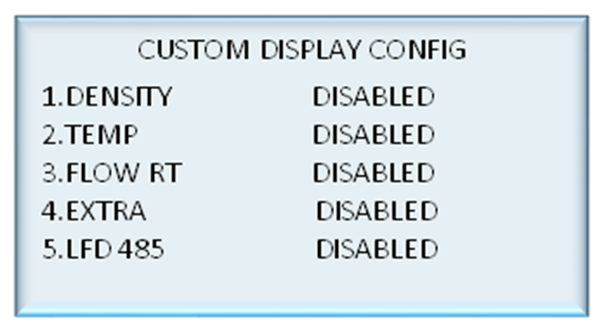

Select HARDWARE from the main menu, select DISPLAY and then select CUSTOM.
To change settings,

1.	Select the desired functionality to toggle it between enabled and disabled.
2.	Enable extra to display extra information during a transaction.

LFD 485 is an option to allow a Large Format Display to be connected to the COMFILL V2 

**Note:** This option cannot be used if there is Tank Gauging connected to the COMFILL V2 as they both use the same RS485 port.

# 9.0 Pumps

Select PUMPS from the main menu 

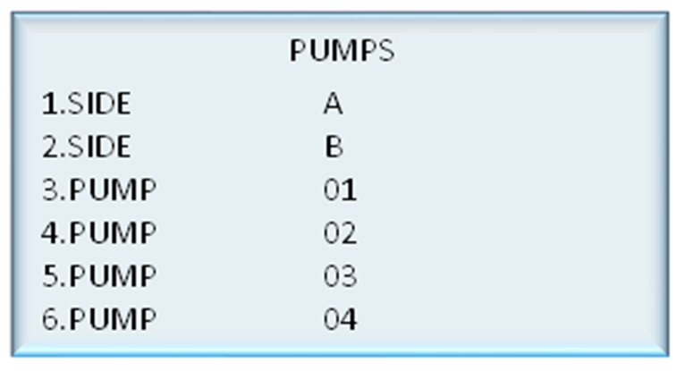

Only side A and side B are available in dispenser mode. More pumps are available in hybrid mode. 
Select a pump to configure.

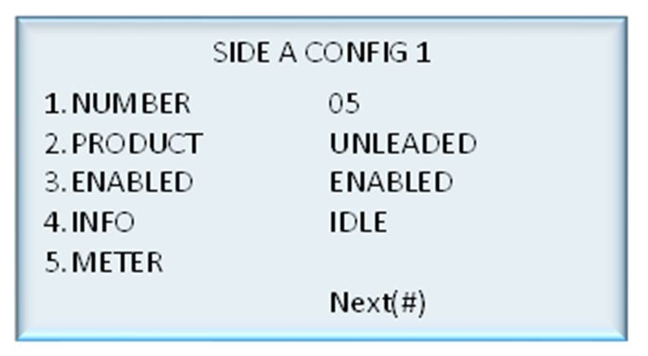

1.	Pump number can be changed by selecting number and entering the new number. 
2.	Products can be assigned to hoses by pressing 2 and selecting from the list of products. 

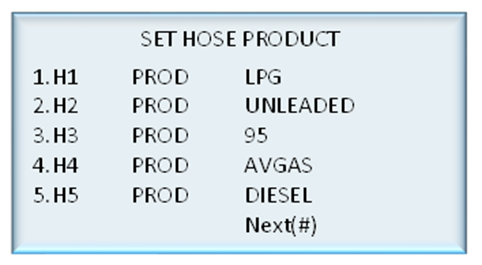

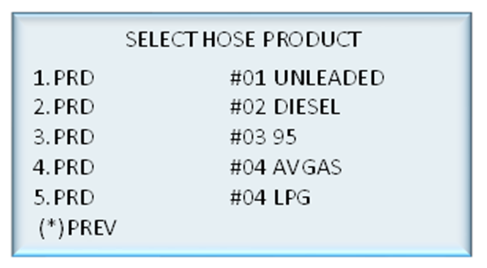

3.	The pump can be toggled between enabled and disabled by selecting enabled. 
4.	Info is read only and indicates the status of the pump.

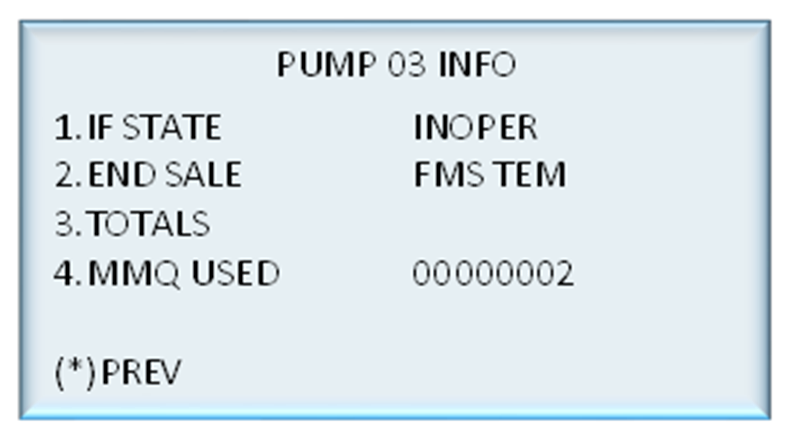

# 9.1 Meter

Select PUMPS from the main menu and select  METER  will bring up the following menu.

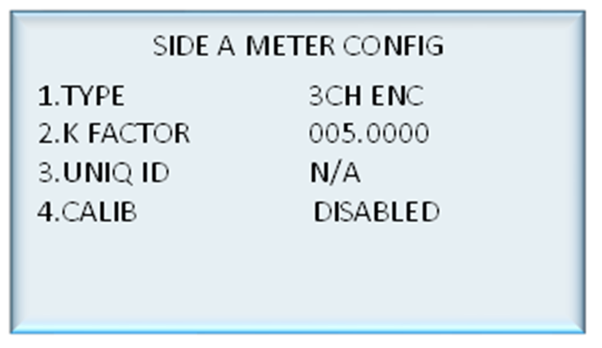

1.	The meter type can be chosen from given types. 

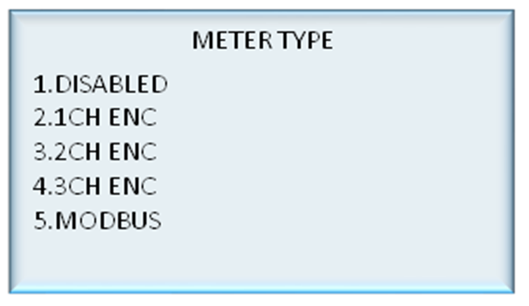

2.	K-Factor can be set to a desired value. 
3.	Unique ID is for V50 and other Modbus meters only and can be ignored for other meter types. 
4.	Calibration mode can be enabled or disabled by pressing 4.

These settings (SIDE A CONFIG 2) will be available after pressing # from the PUMPS menu

# 9.2 Flow

Select PUMPS from the main menu and press # to go to the next page. Select FLOW

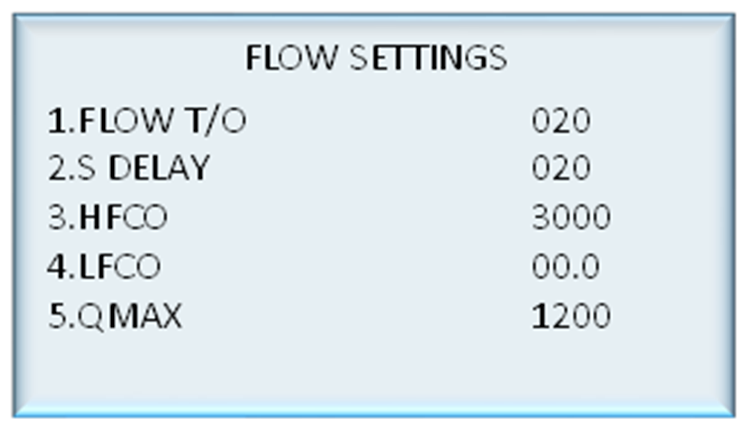

Each flow setting can be changed by selecting the setting and entering the new value. 
These settings are flow timeout, solenoid delay, high- and low-flow cut-off, and maximum flow (Qmax).

# 9.3 Preset

Select PUMPS from the main menu and press # to go to the next page. Select PRESET.

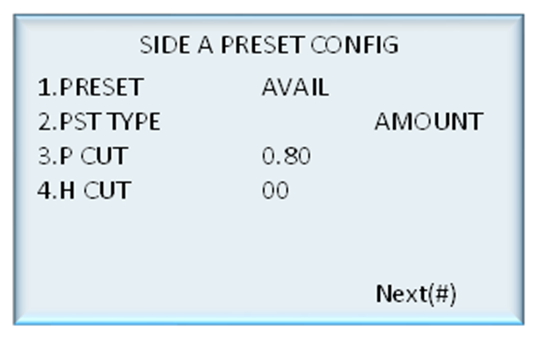

1.	Preset can be toggled between available and unavailable by pressing 1.
2.	Preset type can be toggled between amount and price by pressing 2.
3.	Preset high, preset low, and present rounding high and low (on the next screen) can be changed 
    by selecting the functionality and entering the new value.

# 9.4 Pump Mode

Select PUMPS from the main menu and press # to go to the next page. Select PUMP MODE.

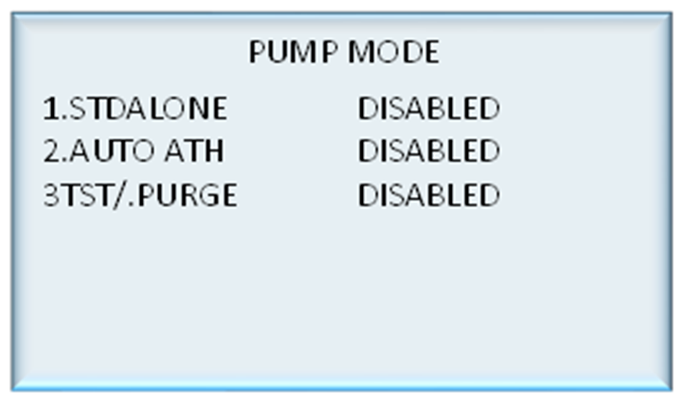

Standalone mode, auto authorisation mode, and purge mode can be toggled between enabled and disabled by selecting the functionality

# 9.5 Comms

Select PUMPS from the main menu and press # to go to the next page. Select COMMS.

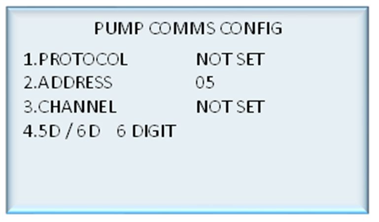

1.	The communications protocol can be set to Compac, PEC, or Gilbarco. 
2.	Select channel 1 or channel 2 to match with the comms board channel. 
3.	The address can be set by entering a desired number. Usually pump number and address will be the same. 
The display can be toggled between 5 and 6 digits by pressing 4.

# 9.6 Advanced

Select PUMPS from the main menu and press # to go to the next page. Select ADVANCED.

1.	Fuel category can be changed between Liquid Fuel , Diesel EF and LPG
2.	Quantity unit can be changed between litres compensated and litres uncompensated 
3.	A valid Minimum measurable quantity can be entered into this field to change the default value   
4.	Air switch operation can be toggled between normally open and normally closed

# 10.0 Auth

**Note:** Auth is only available in hybrid mode

Select AUTH from the main menu.

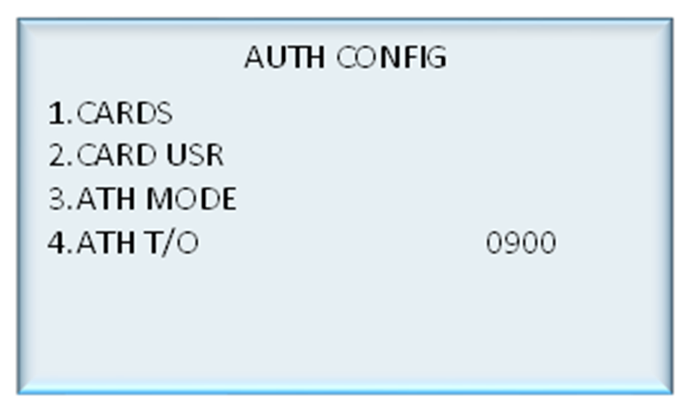

In Auth settings, cards, card user, authorisation mode and authorisation time out can be changed following section will explain how to configure each setting.

# 10.1 Cards

Select AUTH from the main menu and select CARDS.

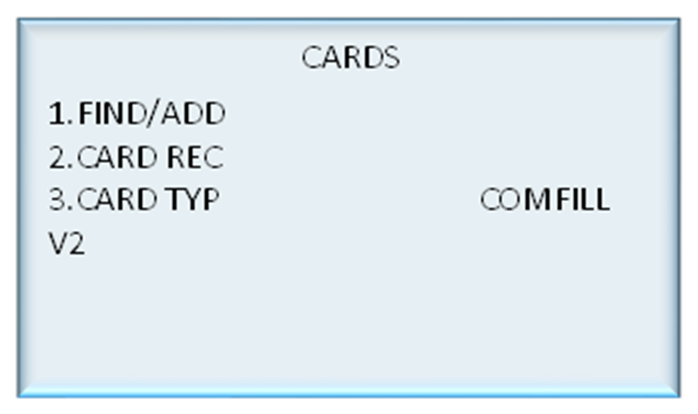

To add or change a card,

1.	From Cards, select Find/Add
2.	Enter a new card or an existing one
3.	Alternatively, swipe the card or HID tag to automatically enter the card number
4.	If a card number was entered, press enter to confirm entry
5.	To make the card valid select valid and toggle between true and false 
6.	To set a new PIN, select PIN and enter the desired PIN

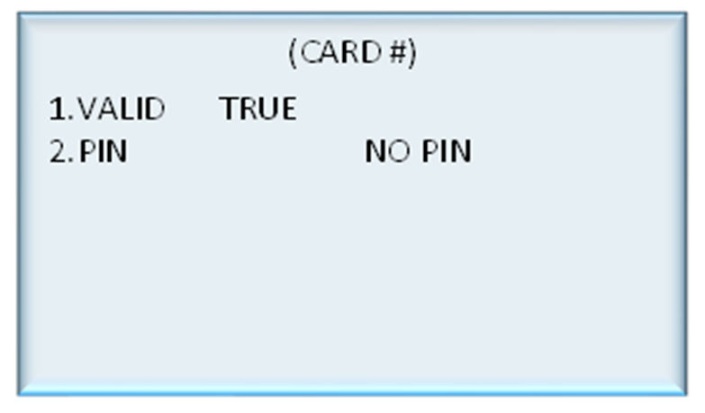

# 10.2 Card Type

Select AUTH from the main menu and select CARDS and then select CARD TYP.
Card type can be toggled between comfil and Comfill V2 s.

If desired, the card type can be changed to ‘Short Comfill V2’. This setting allows 1200 cards to be recorded, as opposed to 300. 
If this setting is implemented, only one owner detail can be saved to each card. To change this, press 1 and select the required card type.

# 10.3 Card Record

To access card record, select AUTH from the main menu, select CARDS and then select CARD RECORD. 
Select the desired number to setup a new Card record. 

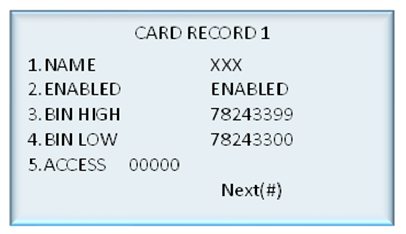

1.	Press 1 to name the card record.
2.	Pressing 2 will let to enable or disable the card record.
3.	Enter appropriate bin high / bin low values and access number.
4.	Press # to proceed to next window.

1.	Press1 to Set the length of the PAN (card number).
2.	Press 2 to set Validation. 

# 10.4 Validation

1.	Enable hot list to accept all cards within bin low and bin high range.
2.	Press 2 to enable or disable card expiry date.

# 10.5 Prompts

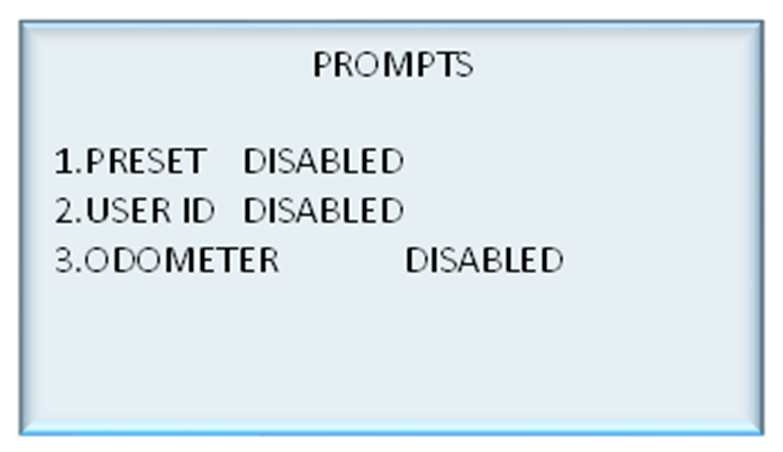

Use this menu to enable or disable prompts in authorization mode.
- Preset
- User ID
- Odometer

# 10.6 Card User

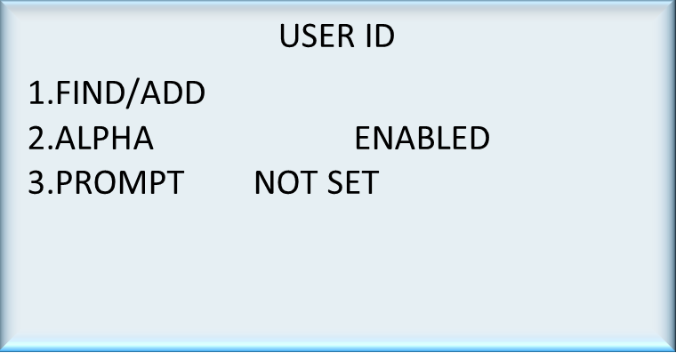

To access card user, select auth from the main menu, and then select card user from the auth config menu.

1.	User IDs can be found or added by pressing 1 and entering a user ID.
2.	Alphanumerical characters can be enabled or disabled by pressing 2.
3.	Prompts can be added by pressing 3 and entering the desired prompt

To edit and change user IDs,
1.	From Card User, select Find/Add
2.	Enter either a new user ID or an existing one
3.	If a new user ID was entered, press Enter to confirm entry
4.	The user ID can now be changed from valid to invalid and vice versa 

# 10.7 Auth Mode

To access auth mode, select AUTH from the main menu, select AUTH MODE.

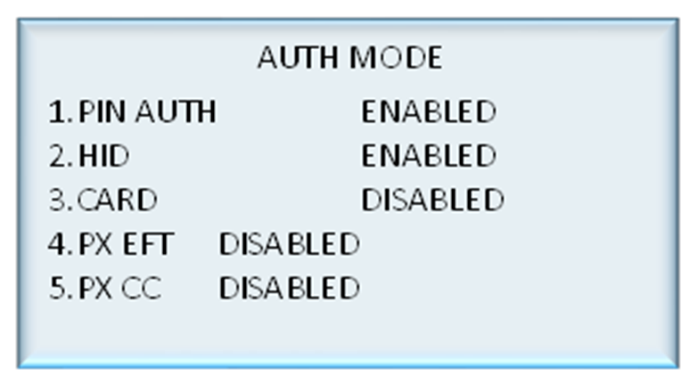

The unit can support HID Readers, PIN, and Cardreaders. 
To set or change the configuration:

1.	From System, select Auth Mode
2.	Enable or disable the desired configuration. Pressing the number corresponding to a configuration will change it from enabled to disabled and vice versa 
3.	Eftpos and credit card authorisation should be disabled for this application.

**NOTE:** *If the unit is changed between Cardreader and HID configurations, it is important to change the dipswitch settings on the PIN pad board.*

# 10.8 Auth Time Out

To access auth time out, select AUTH from the main menu, select ATH T/O.

Auth time out can be changed by pressing 4 and entering a new value.

 

# 11.0 Product

**Note:**Product is only available in hybrid mode

Select PRODUCT from the main menu. 

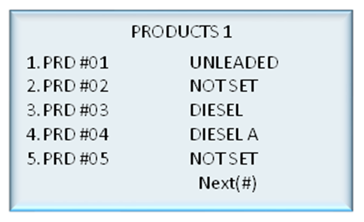

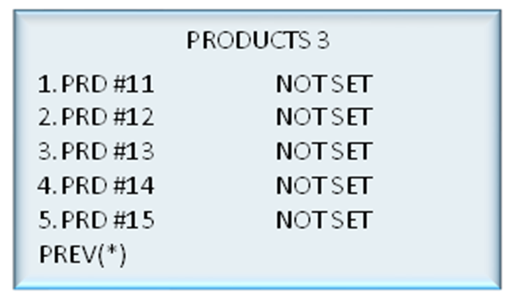

Select any product to set a new product or change an existing product.

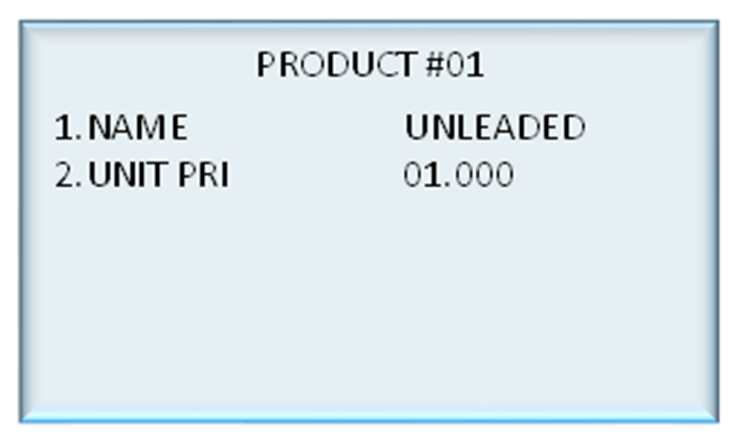

1.	Products can be named by selecting a desired product number and entering a name. 
2.	Once a product is established, a unit price can be set for each product.

 

# 12.0 Tanks

**Note:** Tanks are only available in Hybrid Mode

Select TANKS from the main menu and select  TANK A or TANK B. 

1.	The tank gauge type can be changed by selecting 1. 
2.	The options are VDR, Vega, Virtual, Fafnir. 
3.	Tank gauging can be enabled or disabled by pressing 2. 
4.	The tank number and capacity can be set by selecting the desired functionality and entering the new value. 
5.	The product can be set by pressing 4 and selecting an established product. 
6.	Safe fill level can be changed by pressing 1 and entering the new value in litres. 

# CompacOnsite

# 13.0 Login

To access CompacOnsite, the device ID is needed. The following should be entered into an internet browser, replacing device ID with the specific ID of the unit. Refer to Local Setup for instructions on finding the Device ID.

https://deviceID.compaconsite.com

The standard passwords are shown below. 

**IMPORTANT NOTES:** 

**For the security of the site, ensure the passwords are changed once the unit is installed.**

**Access to online data is dependent on the unit being powered on and connected to the internet. 
Ensure the unit is online in order to have full access to all site data.**

|Username|Password
|-----|-----
|user|c0mpac5KUser
|admin|c0mpac5KAdmin
|tech|c0mpac5KTech

After log in, the CompacOnsite home screen will appear. 

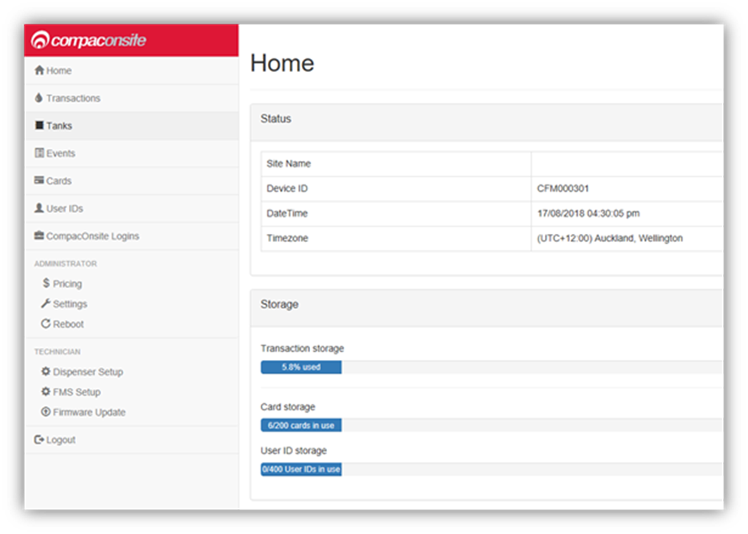

**NOTE:** *The side bar will look different depending on the access level of the user.*

# 13.1 Users

There are three different user options when logging into Compac Onsite; standard, technician and administrator. 
Each user can access different functionalities. Standard users can access all basic functionalities, such as tanks, cards and transactions.  
Admin users can also access these, as well as being able to access the system settings and reboot. 
The technician can access all these options, as well as being able to access set up options which are needed when setting up the site.

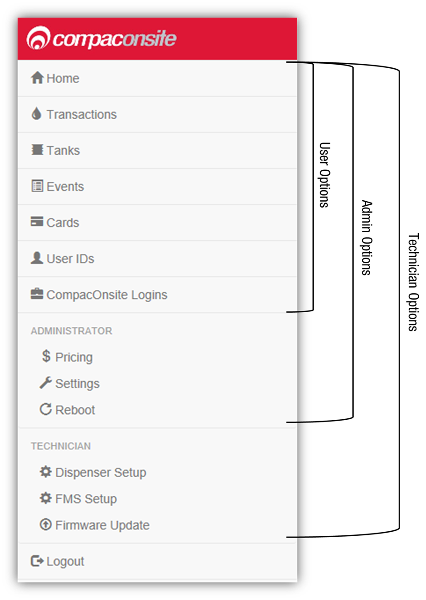

# 13.2 Standard User Options
Users have access to all the following basic functionalities.

# 13.3 Transactions

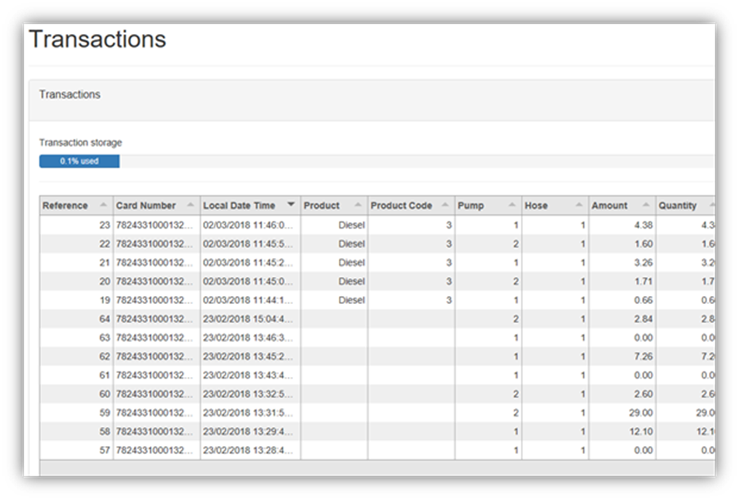

**NOTE:** *Table columns shown on page can be expanded.* 

The Transactions storage is limited. When Transaction storage is at 100%, 
the user will have to Export CSV. This will reset the Transaction storage bar and cause the data to be stored in a separate place in the system. 
This allows more transactions to be recorded.

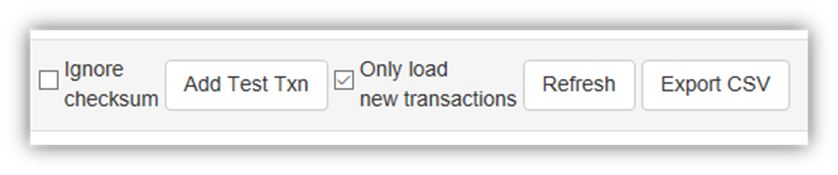

**NOTE:** *Select Refresh before adding more transactions.*
Transactions that have not been exported will be viewed in the screen as default. 
To show exported transactions untick ‘Only load new transactions’. 
 

# 13.4 Tanks

The Tanks section indicates product details and volume of fuel in the tank.

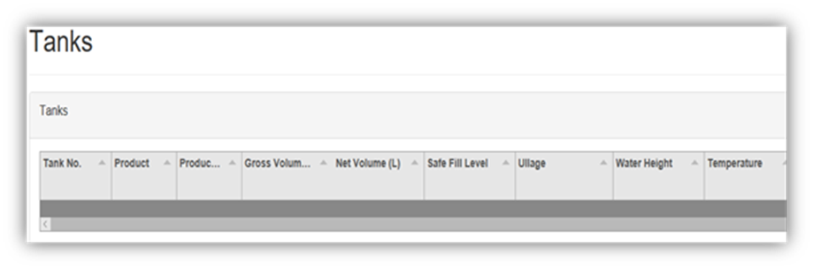

Deliveries indicate when the last transaction occurred, including tank number and date time.

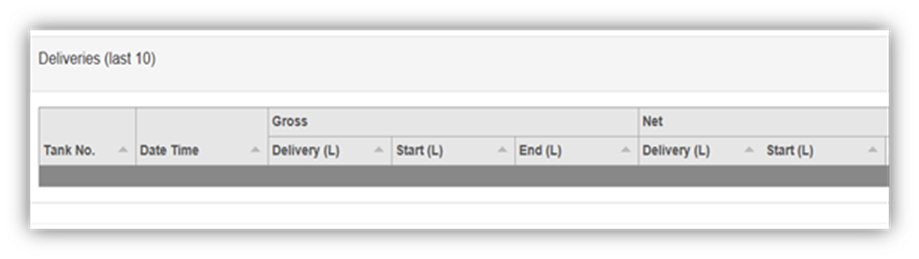

The data in this section can be downloaded by pressing Download. Select Refresh to view new data.

**NOTE:** *A reboot is required for any changes to be applied.*

# 13.5 Events

Events are notable events that occur with the pumps. 
The main event that should be examined is the Pump Snapshot event. 
This is an accumulative amount of fuel that has been pumped from the selected pump. 
Select Download to download the list of events on screen. Select Refresh to load the most recent events.

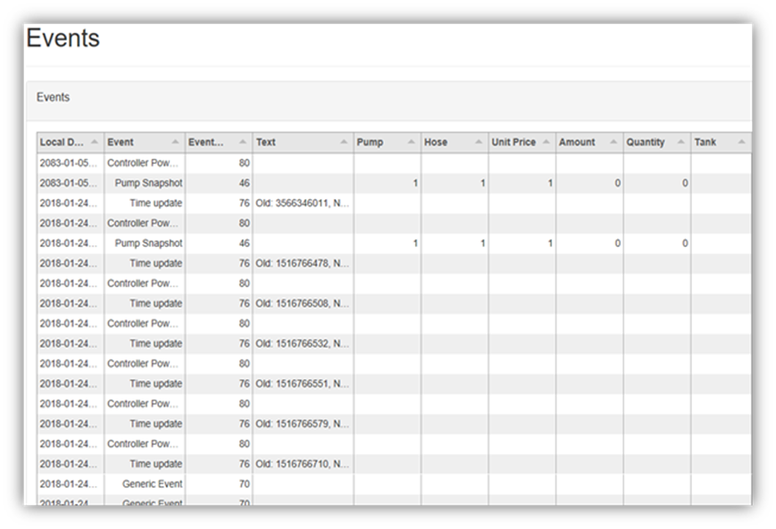

# 13.6 Cards

In this section, a new card can be created with Create New card. Decide on a card number, PIN and owner details, then select Submit. 

**NOTE:** *Ensure Enabled box is ticked to validate card.* 

If a mistake has been made, select Edit and edit card details. 
Select the trash can icon if a card is not needed. The maximum Card storage is limited at 200 cards

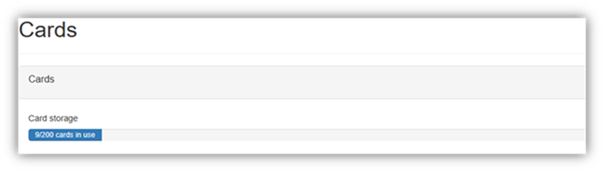

# 13.7 User IDs

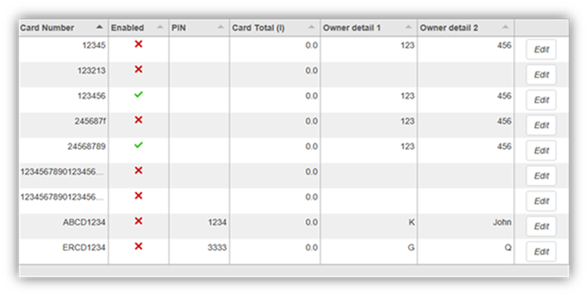

User IDs consist of any 6 numbers or less. Select Edit to Edit User IDs and owner details. 
Tick the enable box to make the User ID valid for use. The trash can icon can be selected to permanently delete the user. 

**NOTE:** *A card can have multiple users.* 

Different users will have different User IDs. 
The purpose of this is to know which user has made a transaction, and ensure they are only fuelling when required. 

**NOTE:** *All files created MUST be a csv file not an excel file.* 

Import User IDs is another way of inserting new users. It may be easier for bulk user adding.

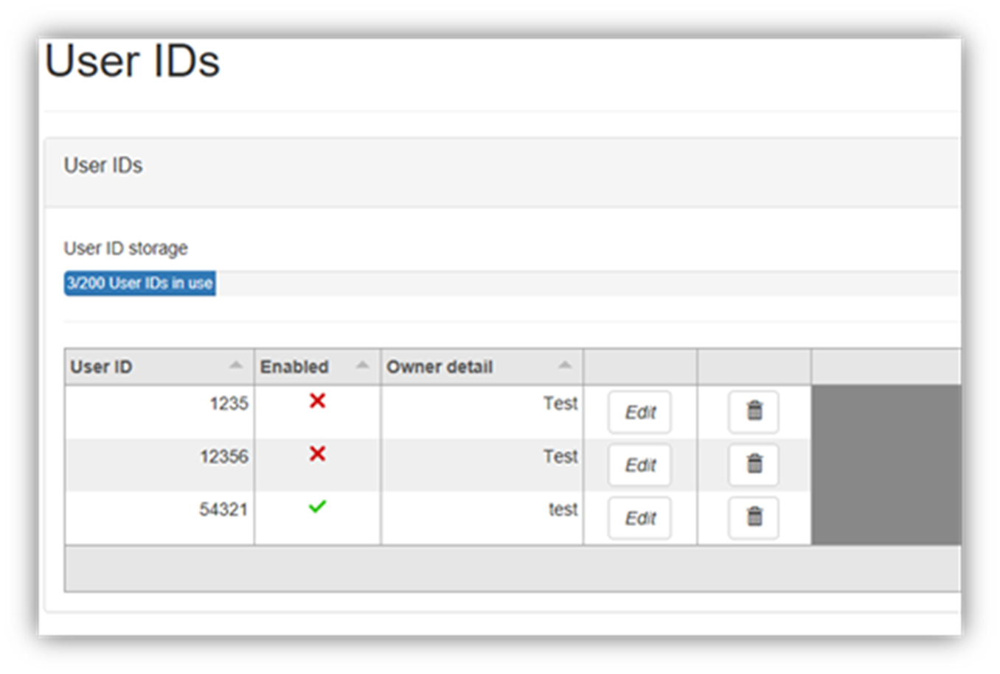

# 13.8 CompacOnsite Logins

For the security of the site, the standard passwords should be changed during set up of the unit. 
In case the passwords were not changed during installation, the process is outlined here. 
To change the passwords, go to CompacOnsite Logins, shown in the left options tab. 

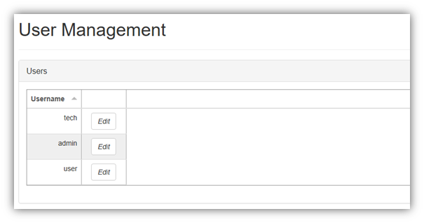

Not all users may be shown depending on the access level of the user. To edit, select Edit.  

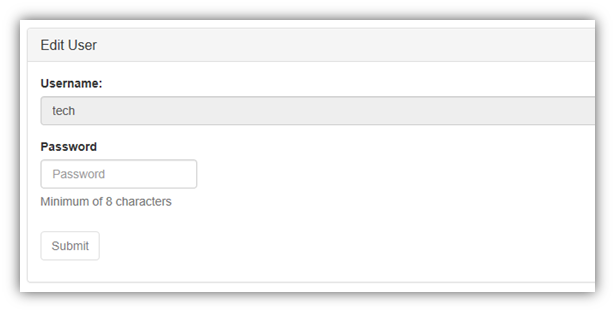

Enter the desired new password, confirm this and press Submit.  
 

# 13.9 Administrator Options

Administrators can access all the above options, as well as being able to access pricing, settings and reboot.

# 13.10 Pricing

From pricing, the pricing for different products can be viewed and changed. 

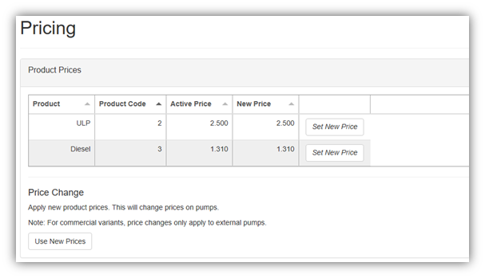

The Active Price is the price being used currently for the pumps. To change this, select Set New Price.

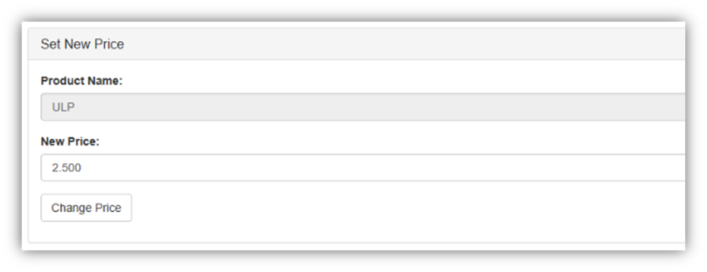

Enter the new price for any product and select Change Price. This will change the New Price. 
However, the unit will continue to use the Active Price until Use New Prices is selected, under Price Change. 
Clicking this will change the Active Price and update them to the New Price.

# 13.11 Settings

Settings can be used to set site details. Enter the site details and press submit.

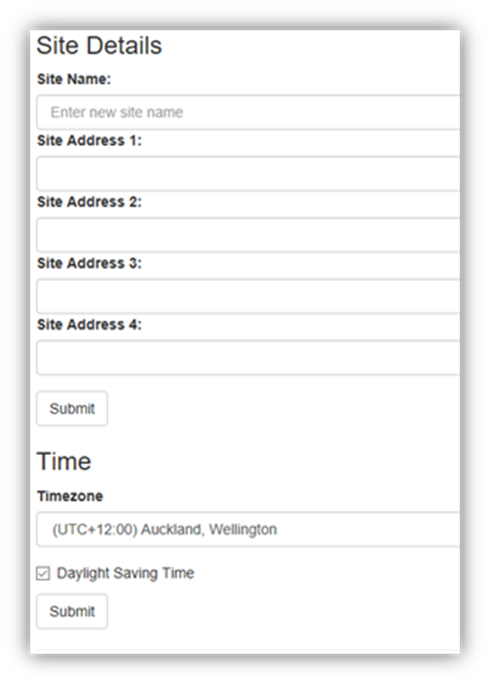

Timezone can also be set. In some cases, timezone will be automatically synced. Enter the timezone and press submit.

# 13.12 Reboot

Reboot is used to restart the application. Some settings require rebooting to update recent actions. 
The page needs to be refreshed after the Reboot process has been completed. 

**NOTE:** *The unit can only be rebooted when no transactions are taking place.* 

When someone is refuelling the C5000 unit cannot be rebooted. 
The pumps may stop fuelling as the transaction has been interrupted.

# 13.13 Technician Options

Technician users can access both administrator and standard user options. 
As well as this, they can access site setup options.

# 13.14 Dispenser Setup

Dispenser Setup will bring up a setup menu with four options;

1. Products 
2. Pumps 
3. Tank Gauging 
4. Tank Strapping. 

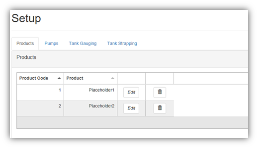

In the Products tab, the current products can be viewed. 

To create a product, select Add Product. 
The product must be named and numbered before it can be saved. 
The following menu will appear.

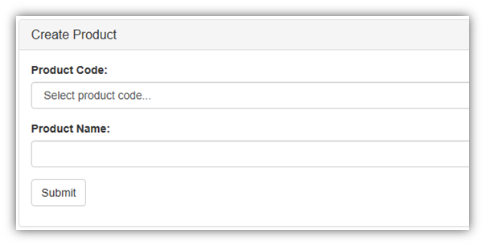

Pressing Submit will add the product. When a product is edited the same menu will appear, and the product’s name and number can be changed before resubmitting. 

To delete a product, select the recycle bin icon in the products table, and click OK on the pop-up. 

The next tab is the Pumps tab. From this tab, the configuration of the unit (single or dual) can be chosen, as well as the settings for each pump.

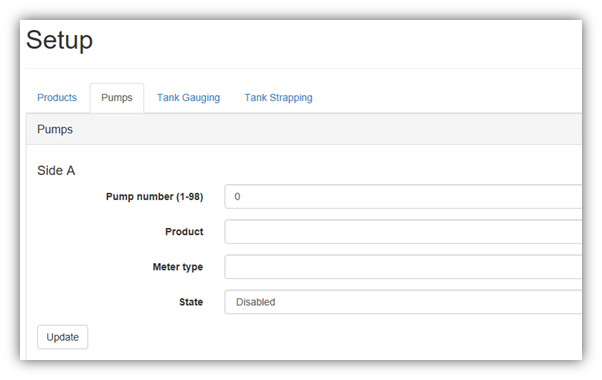

Depending on the chosen configuration, only one side may be displayed. 
To change the Pump number simply enter the new value and press Update. 
To change the product, meter type or state, select the relevant option from the drop down menus and press update. 
The Tank Gauging tab shows which tank gauge is selected for each tank. 

The current settings can be viewed. To edit a row, select Edit. 

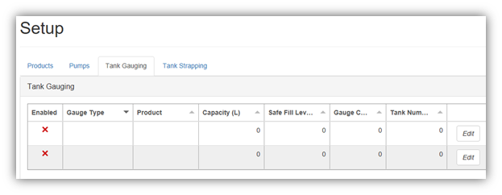

To change a setting, enter the new setting and submit the new values. 

If a 4-20mA tank probe is being used, more information is required. 
The required fields will automatically appear if a Vega meter is selected.

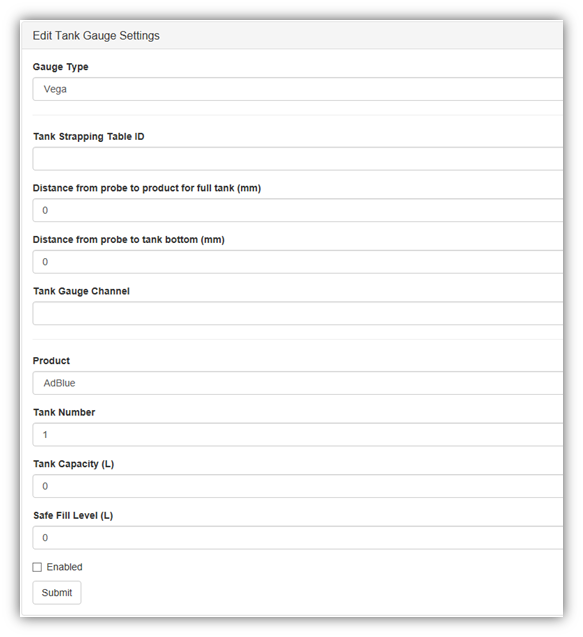

The final tab in Dispenser Setup is the Tank Strapping section. 
This section is only relevant if a Vega meter is fitted. Refer to Vega Tank Strapping for information.

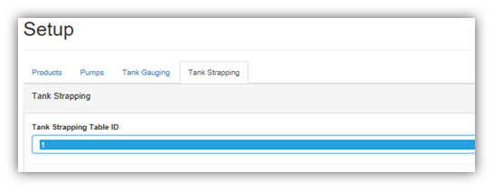

To download the tank strapping table, select download current strapping table. 
At the bottom of the page, tables can be uploaded and the table template can be downloaded. 
Use the table ID drop down menu to select the table ID.

# 13.15 FMS Setup

When setting up the unit, the FMS setup tab can be used to set up card records. 

Cards can be imported and exported as .csv files. This option can be found in this tab. 
To add a new card, fill in the required fields and check which prompts are desired. 
Checking Enabled will enable the card. When the card is finished, press Submit. 
Current cards can be viewed in the Card Prefix Table. 

# 13.16 Vega Tank Strapping

If a Vega electronic dipstick is being used, a tank strapping table will need to be created to gauge the amount of liquid in a tank. 
To do this, the tank dipstick will need to be accessed. This is a ruler showing volume that is a component of tanks. 

To make a tank strapping table:
1.	Download the table template from the Tank Strapping section on CompacOnsite. The table is shown below:
2.	Take the dipstick from the tank

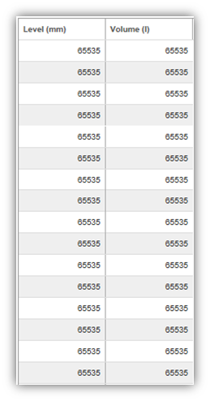

3.	Using a measuring tape and the dipstick, record the readings on the dipstick (these will be a volume) 
    and the corresponding length from the bottom of the dipstick (which rests on the bottom of the tank)
4.	Fill the table template with a table relating length from the bottom of the tank and volume. 
    This will be the Tank Strapping table
5.	Upload this onto CompacOnsite

After making a table, reinsert the dipstick into the tank and then read the volume of fuel in the tank. This is also required on CompacOnsite.

**NOTE:** *The more readings done on the tank, the more accurate the tank gauging will be.*
 

# Electronics

The following diagram shows a standard configuration for the internal wiring of the Comfill V2 unit. 
Connections may change during ordering, production or customisation. 
These connections will be pre-installed and most likely will not need to be changed.

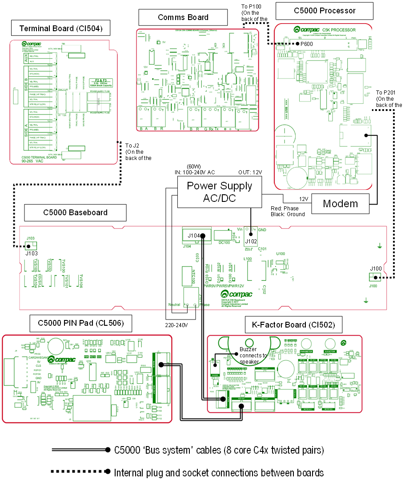

The following diagram shows the location of several of the C5000 circuit boards underneath the Perspex guard. 
The K-Factor and PIN Pad board can be found on the inside of the Comfill V2 Box cabinet door.

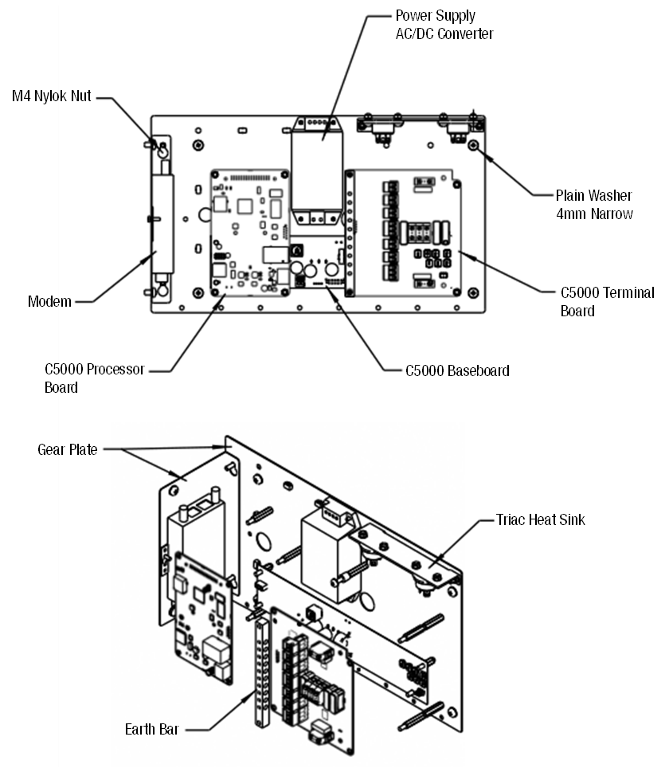

**NOTE:** If using external pumps, there will be relays in place of triacs. 

**NOTE:** The optional comms board is not shown in these drawings. 
The comms board is located above the processor board.

# 14.1 Electrical Parameters

|Paramater||Terminal|Min.|Max.|Unit
|---------|-|--------|----|----|----
|VIN (12V in)||P2: 1|9|24|V|
|VCC (5V in) ||P2: 4|4.6|5.5|V|
|VOH (Ch1, Ch2, Ch3) output high voltage||P2: 5, 6, 7|3|Vcc|V|
|VOL (Ch1, Ch2, Ch3) output low voltage||P2: 5, 6, 7|0|0.8|V
|VOUT (12V out) output current||P1: 8|0|100|mA|
|5V output current||P1: 5|0|40|mA|
|VIH (Ch1, Ch2, Ch3) input high voltage||P1: 4, 3, 2|2|24|V|
|IIH (Ch1, Ch3) input high current|VIH = 3V|P1: 4, 2|-0.14|0|mA|
||VIH > 5V||0|0.1|mA|
IIH (Ch2) input high current|VIH = 3V|P1: 3|0.1|0.15|mA|
||VIH = 5V||0.15|0.22|mA|
||VIH =12V||0.45|0.55|mA|
||VIH =24V||10|13|mA|
|VIL (Ch1, Ch2, Ch3) input low voltage||P1: 4, 3, 2|-0.5|0.8|V
|IIL (Ch1, Ch3) input low current||VIL = 0V	P1: 4, 2|-0.3|0.24|mA|
|IIL (Ch2) input low current|VIL = 0V|P1: 3|0|0|mA|
||VIL =0.8V||0|0.05|mA|

# Servicing

Having all the correct tools will make installation, upgrade and repair procedures easy and minimise the risk of damage to components. 

Before you arrive on site, make sure you have a minimum of all the tools listed here.

- 5.5mm nut driver
- 7mm nut driver
- 8mm nut driver
- T30 Torx drive bit or driver
- T10 Torx drive bit or driver
- Metric spanner set
- Metric 3/8" or 1/4" drive socket set
- 1/4" screwdriver bit holder
- 1/4" A/F spanner
- 6" adjustable spanner
- Flat blade screwdriver set (1.5 - 5mm blades)
- #0, #1, #2 Phillips screwdrivers
- #1, #2 Pozidriv screwdrivers
- Set of metric Allen (hex) keys
- Fine long nose pliers, side cutters & pliers
- Hacksaw
- Stanley knife or similar sharp blade
- Ruler
- Multimeter
- Laptop or smartphone with internet

**Maintenance** 

The Comfill V2 is a relatively simple unit with no moving parts and therefore needs minimal maintenance. 

# 15.1 Cleaning the Cabinet

The cabinet should be cleaned with a soft cloth and non-abrasive cleaner to remove dirt, grease, graffiti and unauthorised stickers. 
All instruction and branding decals should be replaced if damaged or faded. 

**NOTE:** Do not use buckets of water, hoses or water blasters to clean the cabinet as water may enter and damage delicate components. 

# 15.2 Card Reader

The card reader should be swiped through with a cleaner card wet with cleaner fluid. 
The card reader may need to be cleaned daily on dirty, dusty or wet sites.

# 15.3 PIN Pad

The PIN pad should be cleaned to keep the printing legible. A soft dry rag should be used. 
Do not use a rag wet with solvent or petrol as the PIN pad printing may be damaged. 

# 15.4 Testing

Regular zero dollar tests with valid PINs, cards or HID readers (whichever applicable) should be undertaken to ensure the unit is operating correctly.  

# 15.5 Perspex Guard

The Perspex guard houses the 230V components and will need to be removed to repair or replace components such as the power supply and several of the circuit boards.

**DANGER**

Ensure the unit is isolated before attempting to remove the Perspex guard. 
The unit should remain isolated while removing or repairing any components underneath the Perspex guard. 
Do not repower the unit until the guard is back in place.

To remove the Perspex guard, simply unscrew the M4x10 pozi screws holding the guard in place. 
Replacement is the opposite of removal. 

# 15.6 Modem or Router
The Modem or Router is not repairable on site and will need to be replaced with a new part. 

It can be removed simply by removing the screws securing it to the gear plate, and by removing any cables connecting it to other components.

# 15.7 Display and K Factor boards

The display can be found on the inside of the Comfill V2 box door. 
The display is connected to the K-Factor board. 

**CAUTION**

Always take anti-static precautions when working with electronic components for example, wearing a wristband with an earth strap.

Removal:
1.	Unplug connections to the K-Factor board. Refer to Electronics for the K-Factor board connections
2.	Remove the screws holding the display in place
3.	Gently remove the display

Replacement is the reverse of removal.  

In cases where the K-Factor board is removed from the display:
1.	Unplug connections to the K-Factor board. Refer to Electronics for the K-Factor board connections
2.	Remove the screws holding the K-Factor board in place
3.	The K-Factor board is held on to the display with a pin connection. Gently remove the board, taking care not to damage the pin

Replacement is the reverse of removal.

**Important** If the K-Factor board is replaced, press and hold the parameter button and press the K-Factor button once to transfer the old settings to the new K-Factor board.

# 15.8 PIN pad Board

The PIN Pad board can be found on the inside of the Comfill V2 box door.

**CAUTION** 

Always take anti-static precautions when working with electronic components for example, wearing a wristband with an earth strap.
Removal:
1.	Unplug connections to the PIN Pad board. Refer to Electronics for the PIN Pad board connections
2.	Remove the screws holding the board in place 

Replacement is the reverse of removal.

# 15.9 Terminal Board

Before removing the Terminal board, the Perspex guard must be removed. Refer to Perspex guard removal instructions. 

**CAUTION**
Always take anti-static precautions when working with electronic components for example, wearing a wristband with an earth strap.
Removal:
1.	Unplug all connections to the Terminal board
2.	Unscrew and remove the earth bar
3.	Remove screws holding the Terminal board in place
4.	The Terminal board is connected to the baseboard with a plug and socket connection. Remove the board with care 

Replacement is the reverse of removal. Refer to Electronics for Terminal connections.

# 15.10 Comms Board

Before removing the Comms board, the Perspex guard must be removed. Refer to Perspex guard removal instructions. 

**CAUTION**
Always take anti-static precautions when working with electronic components for example, wearing a wristband with an earth strap.
Removal:
1.	Disconnect any cables connected to the Comms board
2.	Remove screws holding the Comms board in place
3.	The Comms board is connected to the processor with a plug and socket connection. Remove the board with care 

Replacement is the reverse of removal. Refer to Electronics for Comms connections.

# 15.11 Processor Board

Before removing the processor board, the Perspex guard and Comms board (if included) will need to be removed. Refer to removal instructions in Service. 

**CAUTION**

Always take anti-static precautions when working with electronic components for example, wearing a wristband with an earth strap.

**CAUTION**

The Processor board stores all transactions and data. Before replacing the processor board, it is recommended to download the memory dump to recover information. Please contact Compac to access this. 

Removal:
1.	Disconnect any cables connected to the Processor
2.	Remove screws securing the Processor
3.	The Processor is connected to the Baseboard with a plug and socket connection. Remove the board with care

Replacement is the opposite of removal. 

If the processor board is replaced, press the K-Factor button once to transfer settings to the processor board.

# 15.12 Baseboard

The Baseboard is located underneath the Perspex guard, below the Processor and Terminal boards. 
Remove these components before removing the baseboard.  
The Baseboard can be removed simply by removing the screws securing it.

# 15.13 PIN Pad

The PIN Pad may need to be replaced if it gets worn or becomes faulty. 
The PIN Pad can be removed from the back to the Comfill V2 V2 door. 

1.	Remove any cables obstructing the PIN Pad. Refer to Electronics for the replacement of these cables
2.	Remove the white plastic brackets by removing the screws securing them
3.	Remove the PIN Pad unit 

Replacement is the opposite of removal.

# 15.14 Card Reader

To remove the card reader: 

1.	Disconnect cables going to the PIN pad board. Refer to Electronics for PIN pad board connections
2.	Remove the screws securing the card reader gear plate to the Comfill V2 V2 door
3.	Slide the card reader out into the inside of the box 

Replacement is the opposite of removal. 

Test the card reader by using a valid card to perform a zero-dollar transaction.

# 15.15 HID Reader

To remove the HID Reader: 

1.	Disconnect cables going to the PIN pad board. Refer to Electronics for PIN pad board connections
2.	Remove cables connecting to the HID Reader
3.	Remove screws securing the HID Reader to the Comfill V2 V2 door 

Replacement is the reverse of removal. 

Test the HID reader by using a valid key to perform a zero dollar transaction.

#  LED Diagnostics

# 16.1 PINPad Board 

LEDs on the circuit boards can be used to diagnose faults in the unit. 
View the LEDs and their corresponding tables to see the state of the board.

RD = Receiving Data
TD = Transmitting Data
PWR = Power
DIAG = Diagnostics

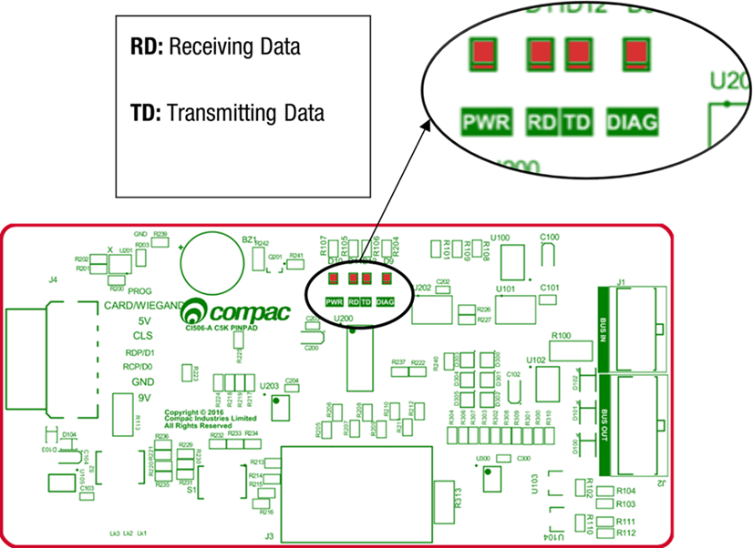

|LEDS|Operation or possible cause|
|----|---------------------------|
|Power|This should be on when there is power to the unit.|
|Diagnostics|This should be on whenever the power LED is on.|
||In normal operation, these should be on when the Diagnostics light is on, and off when the diagnostics light is off.|
Transmitting and Receiving data|If the diagnostics light is on, and the TD/RD LEDs are off, this means these is an error.  This could be due to cabling – check the bus system cables.

# 16.2 K Factor board

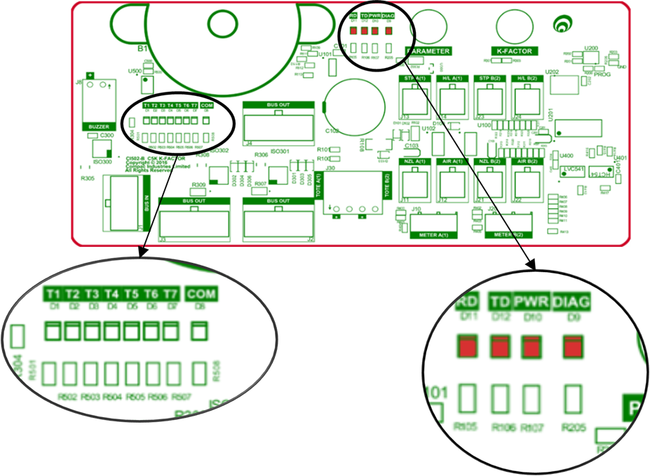

|K-Factor Board LEDs|Operation or possible cause|
|-------------------|---------------------------|
|Power (PWR)|This should be on when there is power to the unit.
|Diagnostics (DIAG)|In normal operation, this should flash slowly, and then flash quickly when the nozzle switch is lifted.|
|Output LEDs (T1-7)|These LEDs correspond to side A and B motors and solenoids. They will light up according to the hardware they represent. These outputs change depending on the configuration of the unit. See Output table below
|Receiving data/ Transmitting data (RD/TD)|In normal operation, these should be on when the Diagnostics light is on, and off when the diagnostics light is off.|
||If the diagnostics light is on, and the TD/RD LEDs are off, this means these is an error. This could be due to cabling – check the bus system cables. 

Output table

|Output|Single|Dual|Dual 160|
|------|------|----|--------|
|T1|Side A Motor|Side A Motor|Sides A anb B motors|
|T2|Side A Solenoids|Side A Solenoids|Side A Solenoids|
|T3|Side A Solenoids|Side A Solenoids|Side A Solenoids|
|T4|Side A high flow Solenoid|Side B Motor|Side B High Flow Solenoid|
|T5|Not used|Side B Solenoids|Side B Solenoids|
|T6|Not used|Side B Solenoids|Side B Solenoids|
|T7|Side A high flow Solenoid|Side A high flow Solenoid|Side A high flow Solenoid|
 

# 16.3 Processor board

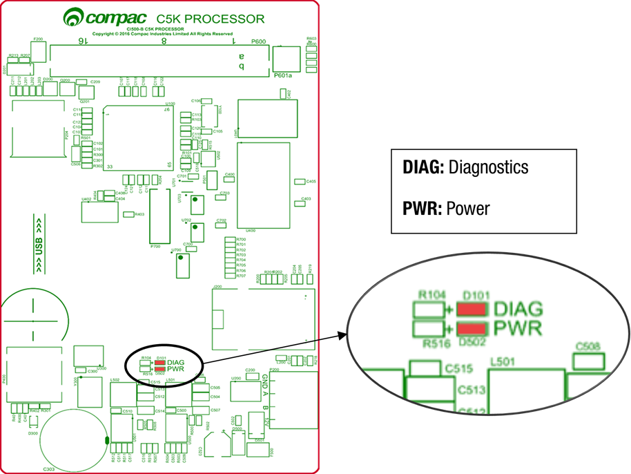

|Processor Board LEDs|Operation or Possible Cause|
|--------------------|---------------------------|
|Power|This should be on when there is power to the unit.|
||This LED shows whether the firmware is running for the board. 
||If it is off, the firmware is not running, and if it is on, it is running.|
|Diagnostics|Upon start up this LED will flash, indicating that the firmware is loading. 
||The flashing may last up to a minute before it stabilises to being constantly on. |
||If the flashing lasts longer, the board is in bootloader mode – this means that the firmware has crashed, or not loaded correctly.

 

# 16.4 Base Board

The baseboard LEDs will turn on when the respective power supplies are on

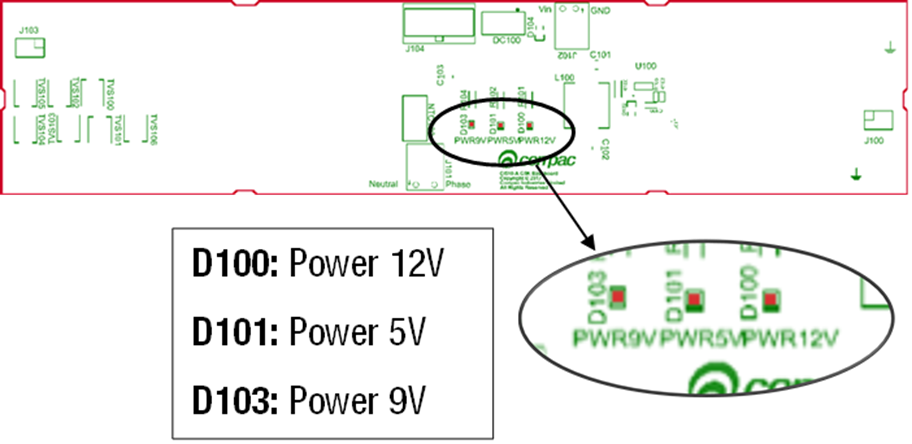

D100 = Power 12V
D101 = Power 5V
D103 = Power 9V

# 16.5 Modem LEDs

The COMFILL V2 comes with a Comset modem, which has indicating LEDs to display the status of the modem. 
Refer to the following tables to understand the modem LEDs.

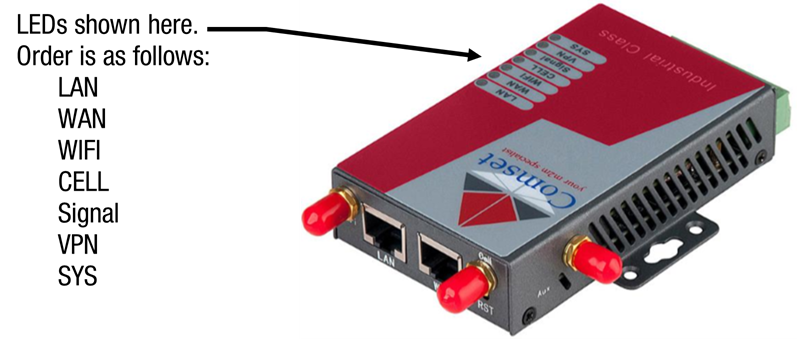

Order of LEDs on the Modem is as follows:
- LAN
- WAN
- WIFI
- CELL
- Signal
- VPN
- SYS

|LED|	Indication Light|	Description|
|---|-------------------|--------------|
|SYS|On for 25 seconds|On for 25 seconds after power up
|   |Blinking|System set-up normally|
|   |Off or still on after 25 seconds|System set-up failure
|LAN|Blinking|Ethernet data transmission|
|   |Off|No Ethernet connection|
|   |On|Ethernet is connected|
|VPN|On|VPN tunnel set-up|
|   |Off|VPN tunnel not set-up or VPN failure
|CELL|On|Cell connection is ‘UP’ and now you have access to the Internet
|WIFI|On|Wi-Fi enabled
|    |Off|Wi-Fi disabled
|    |Blinking|Ethernet data transmission
|WAN|Off|No Ethernet connection
|   |On|Ethernet is connected
|Signal|Off|No signal, or signal checking is not ready
|      |Blinks once every 4s|Signal bar is 1
|      |Blinks once every 3s|Signal bar is 2
|      |Blinks once every 2s|Signal bar is 3
|      |Blinks once every 1s|Signal bar is 4
|      |Blinks twice every 1s|Signal bar is 5

 

# Troubleshooting

|Problem|Possible cause|Recommended action|
|-------|---------------|------------------|
|No Power/No Lights|No power entering  unit|Ensure that power is entering unit, check external fuses and switches
|                  |Faulty power supply|Replace the power supply
|Will not read cards|Debris on card or magnetic head|Clean card or card reader’s magnetic head using head cleaning kit.
|                   |Wrong system (with distributer / In-house cards)|Wrong card base (ISO, Access number) Check card base is loaded onto the Comfill V2	
|Pump Error on display|One of the linked pumps or dispensers has encountered an error.|Read the error message on the pump display to find out what is wrong.
|Pumps will not dispense fuel|Wrong pump number selected|Ensure pump number set in pumps matches pump number set in controller and also pump number written on the pump.
|                            |No fuel in tanks|Verify tanks have sufficient product 
|                            |                |Try another pump to verify. Contact pump service agent 
|                            |Pump fault	  |Have service agent check pumps
|Unable to access Compac Onsite|Wrong username / passcode|Enter correct username / passcode into Compac Online software
|                              |Internet connection down|Check with internet service provider for information on internet service quality
|                              |Wrong device ID entered into browser|Enter correct Device ID
|                              |No power entering unit|See No Power/No lights	
|Wrong system on display|Card ISO number is not between card record BIN range|Refer to Compac Online > Technician Options > FMS Setup to set allowed BIN range
|Card Declined on display|Card not in Card records|Refer to Compac Online > Technician Options > FMS Setup to set card records
|Pump Buffer Full on display|Memory Full|Export transactions. Refer to Compac Online > User Options > Transactions
|                           |           |Reboot Comfill V2; the unit will save transactions to SD card  
|Expired Card on display|Card is expired|Use a valid card
|No transactions recorded|Wrong date and time|Check date and time on CompacOnsite
|                        |Pump in bypass mode|Take the pump out of bypass mode|
|                        |Meter error|Check if error code is on display. Refer to Error Codes
|                        |           |Replace meter   
|                        |Pump Error|Use another pump and check if transactions are recorded; if so, contact pump service agent	
|Tank gauging connection continuously drops out|LFD 485 option is set to ENABLED|Set LFD 485 to DISABLED. Refer to Custom Display settings in Local Setup	
		
	
# Error Codes and EOS

These are all the Error codes available in the C5000. Some are product specific so will not be found in all applications.

|Error Code      | Fuel specific | Possible causes                                | Suggested action  
-----------------| --------------| -----------------------------------------------| ---------------- 
**Er 3   Err 3**   |No             |Price not set in the Dispenser   Pump number not set in the Dispenser                 |1. If the Dispenser is connected to a Site Controller, the price on the Dispenser should be set to 0.00 and the pricing should be sent from the Controller   2. If the Dispenser is not connected to a Site Controler (ie. it is operating in standalone mode), then the price must be set in the Dispenser.   Set the hose number in the dispenser
**Er 8   Err 8**   |No             |Excessive reverse flow                          |Check that product is not flowing back into the tank once the delivery has finished. This can occur if the non-return valves on site are leaking
**Er 9   Err 9**   |No             |The Flow Meter is in an illegal state           |Re-power the Dispenser   Check Meter cable for loose wires or bad connections   Replace the Meter or the Encoder board on the Meter   
**Err91**           |No             |Meter sequence error                            |If 3rd party Meter, check the wiring
**Er 10   Err 10** |No             |Memory Error. Configuration data lost or corrupted|Re-configure Dispenser. If problem persists, replace Memory or Processor Board             
**Er 12   Err 12** |No             |Display error                                   |Replace Display
**Err 13**          |No             |Slave board has restarted                       |Power or Hardware failure
**Err 14**          |No             |K Factor board offline                          |Check the Bus Connections and C5K Power Supply
**Err 15**          |No             |K Factor board has restarted                    |Power or Hardware failure
**Err 16**          |No             |K Factor board is not talking to the LCD Display|Check wiring   Replace the K factor board or LCD Display       
**Err 31**          |No             |Transaction has ended but fuel is still flowing |The Solenoid is leaking. Repair or replace solenoid
**Er 41   Err 41** |No             | Pump not communicating with Controller          |1. If only one pump on the site is not communicating with the Controller, then the fault is likely to be in the pump.   a. Check the comms wire connection on the comms board   b. Check the diagnostic LEDs on the comms board in the Dispenser to diagnose cause   c. Check the configuration and setup in the Dispenser   2. If all pumps are not communicating, check the comms wire connections on the comms board   a. Check comms cables between the Dispenser and the Controller   b. check setup and operation of the Controller
**Er 50**           |NO               |Meter not communicating with Dispenser electronics|a. Check Meter connections   b. Check Dispenser configuration   c. Check that the Meter ID setup in the configuration matches the Meter ID
**Er 52**            | No             | Meter error | If the problem persists after repowering the unit, replace the meter.
**Er 53**            | LPG / Adblue / DEF / CNG |Meter stopped ibrating | Repower the unit. This error might display when the dispenser is powered up. In this case it is normal. If the problem persists, replace the meter
**Er 54**            | No           | Temperature sensor failure | Repower the unit. If the problem persists, replace the meter
**Er 55**            | CNG          | Meter not ready.  | Wait for meter to calibrate itself. The KG100 meter is in startup mode. If the problem persists, repower the unit.
**Er 61**            | LPG / Adblue / DEF / CNG | Error 61 happens because the Meter was not able to zero  This can be due to a leak in the line or crystals accumulated in the Meter.   Check for leaks / crystallization. Purge the line.   If that does not reset the Error 61, pull the Meter out and pour hot water on it to dissolve any crystals inside the Meter.   If the problem persists, replace the Meter.
**Er 62**            |LPG / Adblue / DEF / CNG | Meter could not reset the batch (Could not zero the transaction values when nozzle was lifted to start a new transaction)                                                                                                 | Try restarting the Meter. If the problem persists, Replace the meter.
**Er 71**            |LPG / Adblue / DEF | V50 meter is set but variant is not selected  | Configure Device to either AdBlue / DEF or LPG
**Abd**              |No             |Display offline / Display Fault | Check the connections to all displays.   Check the configuration of the  slave boards (If slave displays are connected) Check and/or replace the display
**CNG 157**          |CNG            |The Dispenser expected no flow. Potential Solenoid Valve leak                                    | Repair / rekit Solenoid
**CNG 158**          |CNG            |Tank volume predictor uncertainty | Check for leaks in the Dispenser hose or fittings
**CNG 159**          |CNG            |Temperature Probe out of range | Re-calibrate Temperature Probe
**CNG 160**          |CNG            |Pressure Probe alignment error. There is more than 10bar difference between the two probes       | Re-calibrate Pressure Probes (Dispensers with two Pressure Probes per hose)
**CNG 161**          |CNG            |Temperature Compensation calculation is uncertain |  No suggested action 
**CNG 162**          |CNG            |Generic CNG error with a number of potential causes |  No suggested action 
**CNG 164**          |CNG            |Pressure Probe error|  Check / replace / re-calibrate Pressure Probe.
**CNG 200**          |CNG            |The Dispenser is detecting unauthorised flow | Gas is flowing without the Start switch having been pressed to start a fill
**hoLd**             |No             |There are two types of HOLD error. There is a “Soft” HOLD err or that resets after the unit is re-powered and a “Hard” HOLD error that does not reset after the unit is re-powered. Display may also show Error 14 on display     | Re-power the unit. Does the HOLD error reset?   If the HOLD error resets but the problem persists, then the SD card may be corrupt and require replacement. Refer to the SD replacement procedure document.   If the HOLD error did not reset, then there is a possible hardware fault in the Power Supply PCB / Processor PCB board / K factor PCB board / other PCB board or Bus cable.
**Calib c**          |No             | K-Factor data integrity failure, or the processor board has been replaced                       |  To reset, break the K factor switch seal and momentarily press
**Calib p**          |No             |The K-Factor board has been swapped/replaced   |  To reset, break the K factor switch seal and momentarily press
**Calib**            |No             |The unit needs calibration, usually due to a hardware change   | Check the K-Factor, temperature and density calibration
**Calib f**          |No             |K-Factor is not set or is 00.0000     | Calibrate the unit and set the K factor
**Air**              |No             |1. Air is in the system. 2. Density out of range 3. Coil amplitude too low while meter is operating, displayed until next sale is started | Make sure pump is running. Check tank and pipework for leaks. Purge system. Increase the Solenoid delay on the K-Factor switch
**Orun**             |No             |Preset amount Overrun – flow above preset  | Check that solenoid is closing. Increase the preset cutoff
**5ump**             |No             |Sump error – liquid detected in the sump   | Empty the sump. Check the dispenser for leaks. Check for water etc getting into the sump.
**Ga5**              |LPG            |For LPG, the density being returned from the meter is too low  | Calibrate meter density using the K-Factor switch
**ABDL**             |No             |Display LCD error | There is a problem with the K Factor Board talking to the LCD. Check cables, plugs etc. If problem persists, replace K Factor board / LCD Display
**Er FLO**           |No             |Excess Flow        | Maximum flow rate exceeded, Increase Maximum flow rate setting or restrict flow
**ErPrSt**           |No             |The preset entered is below the MMQ   | Enter a preset above (or equal to) the MMQ
**Er dEn**           |LPG            |Density or Temperature out of Range | Calibrate meter density using the K-Factor switch  Calibrate meter temperature using the K-Factor switch

# END OF SALE Indicators

The purpose of the END OF SALE Indicator to give the reason why the last fill ended.

This is useful if it is not apparent why the last fill stopped

The EOS number will appear on the Dispenser Display at the end of the fill.
If there is a PINPad keypad / Display fitted, an EOS error code will be displayed on it

Some END OF SALE Indicators are a result of a fault in the system.

Other END OF SALE Indicators are normal operation

Note: This is a complete list of all the available END OF SALE Indicators and covers all Compac products. Some END OF SALE Indicators are Product / Fuel type specific

|Keypad Display (if fitted)   | Dispenser Display  | Description                                                              |  
|-----------------------------|--------------------|--------------------------------------------------------------------------|
**NOZ**                          | 1                  | The nozzle was hung up This is normal operation                          
**PRESET**                       | 2                  | The fill ended when it reached the preset amount or quantity          
**DISP**                         | 3                  | Normal fill                                                              
**OFFLINE**                      | 4                  | Comms not connected between Dispenser and Controller. Check comms connections and setup in the Dispenser and Controller.
**MAX**                          | 5                  | The fill reached either the maximum dollars or litres amount allowed     
**AIR**                          | 6                  | Air was detected in the fuel so the air switch cut out. Check for air in the fuel.
**ERROR**                        | 7                  | There was an error with the encoder in the flow meter. Check the Flow Meter   
**SUMP**                         | 9                  | Sump switch cut out because there was either water or fuel in the sump   
**TO ATH**                       | 12                 | Pre-auth from the Controller or Payment Terminal timed out. The customer may have taken too long to start the fill after it was authorised
**POR**                          | 13                 | The unit was repowered 
**STP SW**                       | 14                 | The Stop Switch was activated 
**PRST ERR**                     | 15                 | An Invalid preset value was entered
|                             | 17                 | There is a Display offline 
|                             | 18                 | The Displays are not paired 
|                             | 30                 | Controller initiated stop 
**DENSITY**                      | 35                 | The Density was out of range 

 

	 	

