

# CompacOnsite User Manual

# Conditions of Use

- Read this manual completely before working on, or making adjustments to CompacOnsite.

- Along with any warnings, instructions, and procedures in this manual, you should also observe any other common sense procedures that
are generally applicable to websites of this type.

- Compac Industries Limited accepts no liability for loss of profits, loss of products, and loss of time, resulting from failure to follow any warnings, instructions, and procedures in this manual, or any other common sense procedures generally applicable to software of this type, whether incurred by the user or their employees, the installer, the commissioner, a service technician, or any third party.

- Unless otherwise noted, references to brand names, product names, or trademarks constitute the intellectual property of the owner
thereof.

- Every effort has been made to ensure the accuracy of this document. However, it may contain technical inaccuracies or typographical
errors. Compac Industries Limited assumes no responsibility for and disclaims all liability of such inaccuracies, errors, or omissions in this publication.

- Compac Industries Limited reserves the right to change the specifications of its products or the information in this manual without necessarily notifying its users.

**Manufactured by:**  
52 Walls Road, Penrose, Auckland 1061, New Zealand  
P.O. Box 12-417, Penrose, Auckland 1641, New Zealand  
Phone: + 64 9 579 2094  
Fax: + 64 9 579 0635  
www.compac.co.nz   
Copyright ©2015 Compac Industries Limited, All Rights Reserved

Version 1.0.1 

Original publication date: 20th February 2019

## Table of Contents

[**1.0 Logging In**](#10-logging-in)

[**2.0 Users**](#20-users)

[**3.0 Standard User Options**](#30-standard-user-options)

[3.1 Transactions](#31-transactions)

[3.2 Tanks](#32-tanks)

[3.4 Cards](#34-cards)

[3.5 User IDs](#35-user-ids)

[3.6 CompacOnSite Logins](#36-compaconsite-logins)

[**4.0 Administrator Options**](#40-administrator-options)

[4.1 Pricing](#41-pricing)

[4.2 Settings](#42-settings)

[**5.0 Technician Options**](#50-technician-options)

[5.1 Dispenser Setup](#51-dispenser-setup)

[5.2 Vega Tank Strapping](#52-vega-tank-strapping)

[5.3 Fuel Management System Setup](#53-fuel-management-system-setup)

 

# 1.0 Logging In

CompacOnsite allows remote access of sites 24/7. From CompacOnsite, transactions, tanks,
pricing and more can be managed quickly and easily.

To access CompacOnsite, the device ID is needed. The following should be entered into an
internet browser, replacing device ID with the specific ID of the unit. Refer to Local Setup for
instructions on finding the Device ID. 

https://________.compaconsite.com

The standard passwords are shown below.

**IMPORTANT NOTES:**

**For the security of the site, ensure the passwords are changed once the unit is installed.**

**Access to online data is heavily dependent on the unit being powered on and connected
to the internet. 
Ensure the unit is online in order to have full access to all site data.**

|Username |Password |
|---------|---------|
|user     |c0mpac5KUser |
|admin    |c0mpac5KAdmin |
|tech     |c0mpac5KTech |

After logging in, the CompacOnSite home screen will appear. See Logins for managing logins.

# 2.0 Users

There are three different user options when logging into Compac Onsite; standard, technician
and administrator. 
Each user can access different functionalities. 
Standard users can access all basic functionalities, such as tanks, cards and transactions. 
Admin users can also access these, as well as being able to access the system settings and reboot. 
The technician can access all these options, as well as being able to access set up options which are needed when setting up
the site.

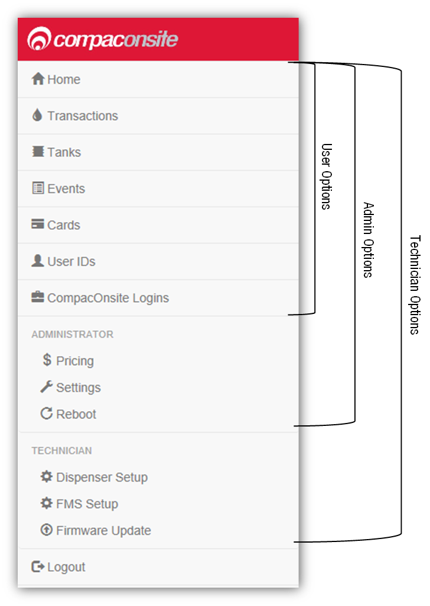

# 3.0 Standard User Options

Users have access to all the following basic functionalities.

# 3.1 Transactions

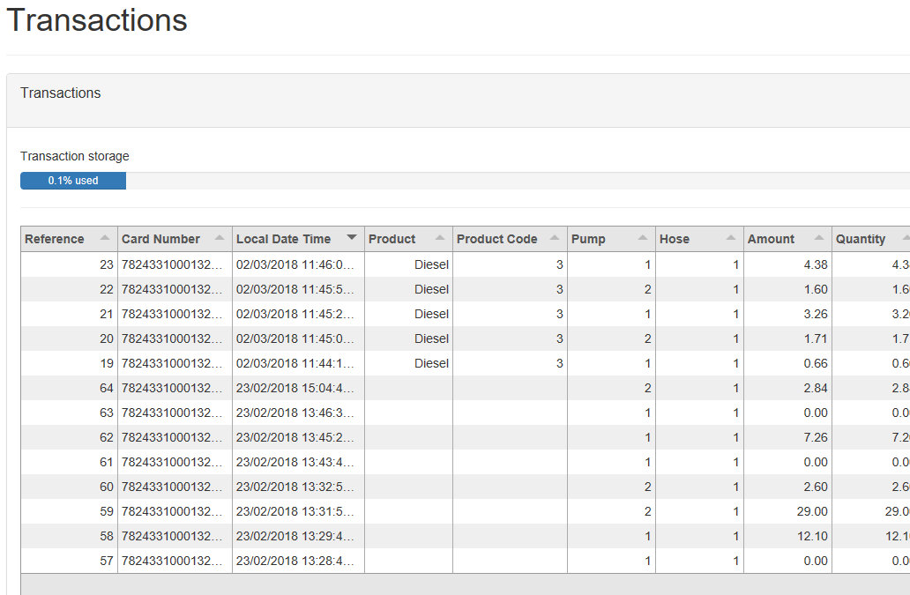

**NOTE:** Table columns shown on page can be expanded.

The Transactions page shows the transactions of fuel into the tank. 
The Transactions storage is limited. When Transaction storage is at 100%, the user will have to Export CSV. 
This will store the data locally onto your device while making the transactions data overwritable once more
transactions are recorded.

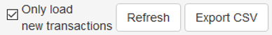

**NOTE:** *Select Refresh before adding more transactions.*

Transactions that have not been exported will be viewed in the screen as a default. 
To show exported transactions untick ‘Only load new transactions’.

# 3.2 Tanks
s
The Tanks section indicates product details and volume of fuel in the tank.

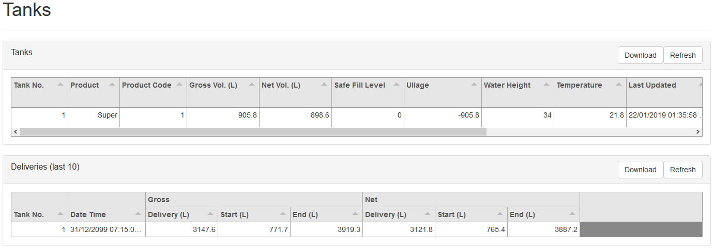

Deliveries indicate when the last transaction of fuel from the tank occurred, including the tank
number and date time. 
The data in this section can be downloaded by pressing Download. 
Select Refresh to view new data. For Technican Only tank settings, see Dispenser Setup.

**NOTE:** *A reboot is required for any changes to be applied. This may take up to 30s.*

# 3.3 Events

Events are notable events that occur with the pumps.

|Event |Description |
|------|------------|
|Pump Snapshot |Accumulative amount of fuel pumped from selected pump, logged at the
midnight instant daily|
|Tank Snapshot |Dip of fuel remaining in the tank, logged at the midnight instant daily
|Controller Power On |The processor turns on
|Time Update |Synchronises time on processor with real online time

Select Download to download the list of events on screen. Select Refresh to load the most
recent events.

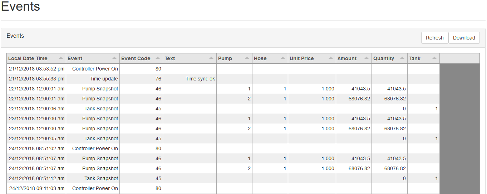

# 3.4 Cards

In this section, a new card can be created with Create New card. Decide on a card number, PIN
and owner details, then select Submit.

**NOTE:** *For card base management, see Fuel Management System Setup*

**NOTE:** *Ensure Enabled box is ticked to validate card.*

If a mistake has been made, select Edit and edit card details. 
Select the trash can icon if a card is not needed. The maximum Card storage is limited at 200 cards.

# 3.5 User IDs

User IDs consist of any 6 numbers or less. 
Select Edit to Edit User IDs and owner details. 
Tick the enable box to make the User ID valid for use. The trash can icon can be selected to permanently
delete the user.

**NOTE:** *A card can have multiple users.*

Different users will have different User IDs. 
The purpose of this is to know which user has made a transaction, and ensure they are only fuelling when required.

To add a user ID, click Create New User ID. 
To insert large numbers of user, importing a User ID file is recommended.  
Exporting a user ID file exports the data from the website onto your local device.

**NOTE:** *All User ID files created/imported **MUST** be a csv file not an excel file.*

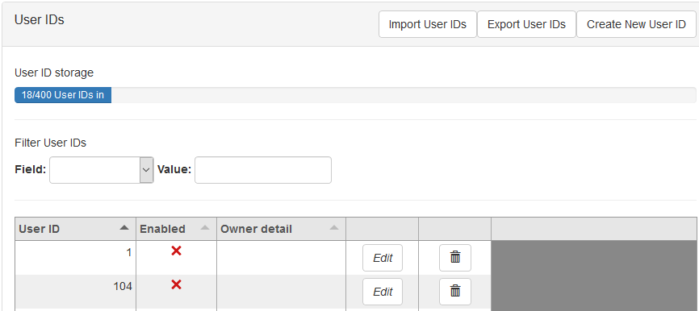

# 3.6 CompacOnSite Logins

For the security of the site, the standard passwords should be changed during set up of the unit. 
In case the passwords were not changed during installation, the process is outlined here. 
To change the passwords, go to CompacOnsite Logins, shown on the left options tab.

Not all users may be shown depending on the access level of the user. To edit, click Edit.

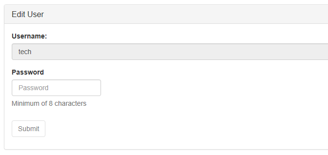

Enter the desired new password, confirm this and press Submit.

# 4.0 Administrator Options

Administrators can access all the above options, as well as being able to reboot the site and
access pricing and settings.

# 4.1 Pricing

From Pricing, the pricing for different products can be viewed and/or changed.

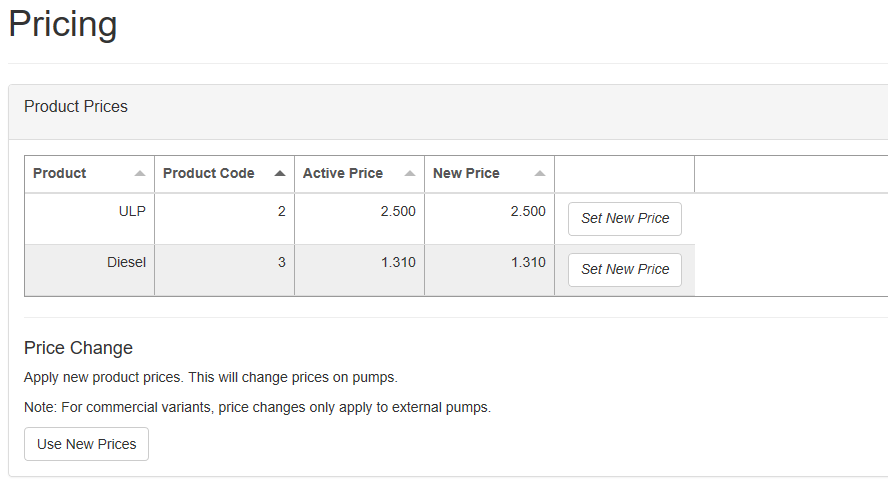

The Active Price is the price being used currently for the pumps. To change this, select Set New
Price.

Enter the new price for any product and select Change Price. 
This will change the New Price. 
However, the unit will continue to use the Active Price until Use New Prices is selected, under
Price Change. 
Clicking this will change the Active Price and update them to the New Price.

# 4.2 Settings
Settings can be used to set site details. Enter the site details and press submit.

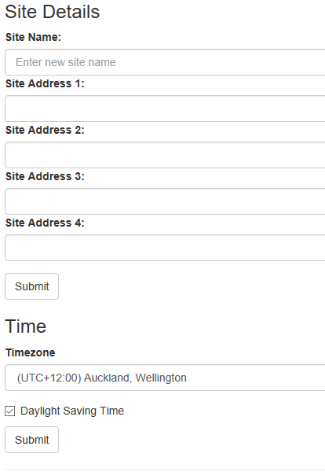

The time zone can also be set. In some cases, timezone will be automatically synced. Enter the
timezone and press submit.

# 4.3 Reboot

You can reboot the site to restart the application. 
Some settings require rebooting to update recent actions. 
The page needs to be refreshed after the Reboot process has been completed.

**NOTE:** *The unit can only be rebooted when no transactions are taking place.*

When someone is refuelling, the C5000 unit cannot be rebooted. The pumps may stop fuelling as
the transaction has been interrupted.

# 5.0 Technician Options

Technician users can access both administrator and standard user options. 
As well as this, they can access site setup options.

# 5.1 Dispenser Setup

Dispenser Setup will bring up a setup menu with four options;

- Products
- Pumps
- Tank Gauging
- Tank Strapping

In the Products tab, the current products can be viewed.

To create a product, Add Product can be selected. 
The product must be named and numbered before it can be saved. 
The following menu will appear.

Pressing Submit will add the product. 
When a product is edited the same menu will appear, and the product’s name and number can be changed before resubmitting.
 
To delete a product, select the recycle bin icon in the products table, and click OK on the pop-up.
 
The next tab is the Pumps tab. From this tab, the configuration of the unit (single or dual) can be
chosen, as well as the settings for each pump.

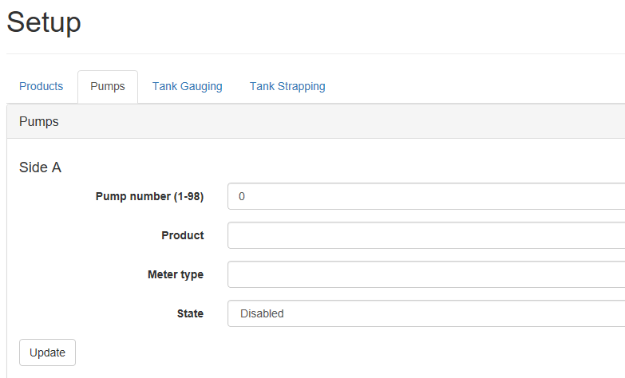

Depending on the chosen configuration, only one side may be displayed. 

To change the Pump number simply enter the new value and press Update. 

To change the product, meter type or state, select the relevant option from the drop-down
menus and press update. 

The Tank Gauging tab shows which tank gauge is selected for each tank.
 
For the Side B pump, change the State to Enabled for a dual pump.

The current settings can be viewed. To edit a row, select Edit.

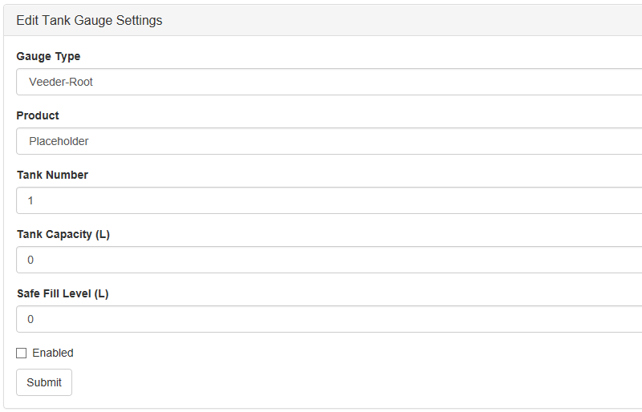

To change a setting, enter the new setting and Submit the new values. 

If a Vega tank gauge is being used, more information is required. The required fields will
automatically appear if a Vega meter is selected.

The final tab in Dispenser Setup is the Tank Strapping section. 
This section is only relevant if a Vega meter is fitted. Refer to Vega Tank Strapping for information.

To download the tank strapping table, select download current strapping table. 
At the bottom of the page, tables can be uploaded and the table template can be downloaded. 
Use the table ID drop down menu to select the table ID.

# 5.2 Vega Tank Strapping

If a Vega electronic dipstick is being used, a tank strapping table will need to be created to
gauge the amount of liquid in a tank. 
To do this, the tank dipstick will need to be accessed. 
This is a ruler showing volume that is a component of tanks.

To gather values for the tank strapping table:
1. Load a quantity of the product into the tank (eg 50L)
2. Insert a dipstick into the tank so it is perpendicular to the base.
3. Remove the dipstick gently.
4. Use a measuring tape to measure and record the length of wet dipstick onto the table. This
length will correspond to the volume 50L.
5. Load more of the product into the tank (eg +50L=100L)
6. Repeat steps 2 and 4.
7. Repeat steps 5 and 6 for every volume of product. After making a table, reinsert the dipstick
into the tank and then read the volume of fuel in the tank. This is also required on
CompacOnSite.

**NOTE:** *The more readings done on the tank, the more accurate the tank gauging will be.*

# 5.3 Fuel Management System Setup

When setting up the unit, the FMS setup tab can be used to set up card records.

Cards can be imported and exported as .csv files. 
This option can be found in this tab.
To add a new card, fill in the required fields and check which prompts are desired. 
Checking Enabled will enable the card. When the card is finished, press Submit. 
Current cards can be viewed in the Card Prefix Table.

|Authentication Mode| Required user action| 
|-------------------|---------------------|
|PIN Pad |Requires users to type in a PIN number/passcode for authentication |
|HID |Requires users to swipe a tag for authentication|
|Card Reader |Requires users to swipe a card into the card reader for authentication|

**NOTE:** *If two of the three boxes are ticked, both authentication modes will be required.*

**NOTE:** *The HID and Card Reader modes cannot both be ticked as they cannot both fit onto a
device's hardware and software.*

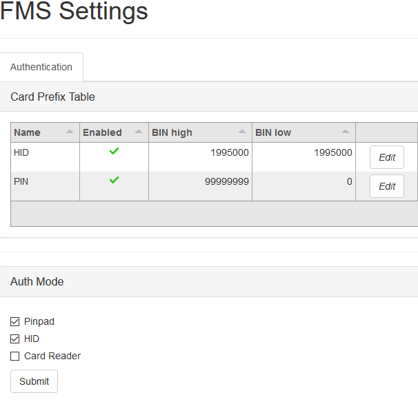

To edit a card prefix, click Edit. The following should pop up:

The PAN length is the maximum number of digits the PAN number (Card Number) can be. 
The Access Number is used as an extra step of authentication. 

Here are the boxes that can be ticked/unticked:

|Mode |Action|
|-----|------|
|Hotlist |Checks for BIN Number only, not Card Number. The recommended setting is disabled|
|User ID |Asks for the User ID as an additional step of authentication for the specific user|

|Prompts |Required used action|
|--------|--------------------|
|Expiry Check (only when Card Reader Auth Mode is enabled) |Checks for the expiry month and
year of a card, declines the card if expired |
|Preset |Prompts the user to enter the amount of fuel they want dispensed|
|Odometer |Prompts the user to enter their odometer reading |

