# CompacOnsite User Manual v.1.0.1

<!-- page 1 -->

COMPAC
ONSITE
USER MANUAL
CompacOnsite User Manual
Version 1.0.1
Date: 20th February 2019

<!-- page 2 -->

Conditions of Use
Conditions of Use
▪
Read this manual completely before working on,
or making adjustments to, the CompacOnline
website.
▪
Along with any warnings, instructions, and
procedures in this manual, you should also
observe any other common sense procedures
that are generally applicable to websites of this
type.
▪
Compac Industries Limited accepts no liability for
loss of profits, loss of products, and loss of time,
resulting from failure to follow any warnings,
instructions, and procedures in this manual, or
any other common sense procedures generally
applicable to software of this type, whether
incurred by the user or their employees, the
installer, the commissioner, a service technician,
or any third party.
▪
Unless otherwise noted, references to brand names,
product names, or trademarks constitute the
intellectual property of the owner thereof.
▪
Every effort has been made to ensure the accuracy
of this document. However, it may contain technical
inaccuracies or typographical errors. Compac
Industries Limited assumes no responsibility for and
disclaims all liability of such inaccuracies, errors, or
omissions in this publication.
▪
Compac Industries Limited reserves the right to
change the specifications of its products or the
information in this manual without necessarily
notifying its users.

Manufactured By:
52 Walls Road, Penrose, Auckland 1061, New Zealand
P.O. Box 12-417, Penrose, Auckland 1641, New Zealand
Phone: + 64 9 579 2094
Fax: + 64 9 579 0635
Email: techsupport@compac.co.nz
www.compac.biz
Copyright ©2015 Compac Industries Limited, All Rights Reserved

<!-- page 3 -->

CONDITIONS
Document Control
Document Information

Document Details
CompacOnsite User Manual v.1.0.0
Current Revision Author(s)
R Liu
Original Publication Date
24/08/18

Authorised By
W Zheng

Revision History

Version
Date
Author(s)
Revision Notes
1.0.0
24/08/18
S Laycock
New manual
1.0.1
20/02/19
R Liu
Updated screenshot of
buttons on Transactions
page, updated Tanks
Screenshots, added Note
on Cards Section, edited
VegaTank Setup and FMS
settings information

<!-- page 4 -->

1.
Contents
Contents
Logging In ............................................................................................................ 2
Users..................................................................................................................... 3
Standard User Options ......................................................................................... 4
Transactions .............................................................................................. 4
Tanks ......................................................................................................... 5
Events ........................................................................................................ 5
Cards ......................................................................................................... 6
User IDs ..................................................................................................... 7
CompacOnSite Logins ............................................................................... 8
Administrator Options ......................................................................................... 9
Settings ................................................................................................... 10
Reboot ..................................................................................................... 10
Technician Options ............................................................................................ 11
Dispenser Setup ...................................................................................... 11
Vega Tank Strapping ............................................................................... 15
Fuel Management System Setup ............................................................ 16

<!-- page 5 -->

2.
Logging In
Logging In
CompacOnsite allows remote access of sites 24/7. From CompacOnsite, transactions, tanks,
pricing and more can be managed quickly and easily.
To access CompacOnsite, the device ID is needed. The following should be entered into an
internet browser, replacing device ID with the specific ID of the unit. Refer to Local Setup for
instructions on finding the Device ID.
https://________.compaconsite.com
The standard passwords are shown below.
IMPORTANT NOTES:

For the security of the site, ensure the passwords are changed once the unit is installed.

Access to online data is heavily dependent on the unit being powered on and connected
to the internet. Ensure the unit is online in order to have full access to all site data.

Username
Password
user
c0mpac5KUser
admin
c0mpac5KAdmin
tech
c0mpac5KTech

After logging in, the CompacOnSite home screen will appear. See Logins for managing logins.

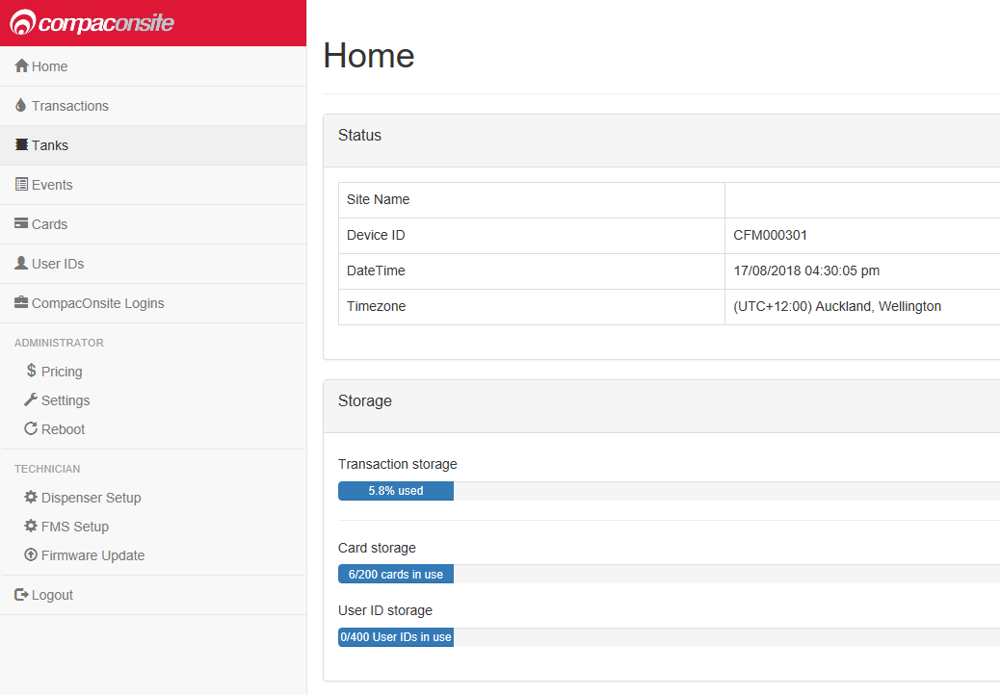

<!-- page 6 -->

3.
Users
Users
There are three different user options when logging into Compac Onsite; standard, technician
and administrator. Each user can access different functionalities. Standard users can access all
basic functionalities, such as tanks, cards and transactions. Admin users can also access these,
as well as being able to access the system settings and reboot. The technician can access all
these options, as well as being able to access set up options which are needed when setting up
the site.

User Options
Admin Options
Technician Options

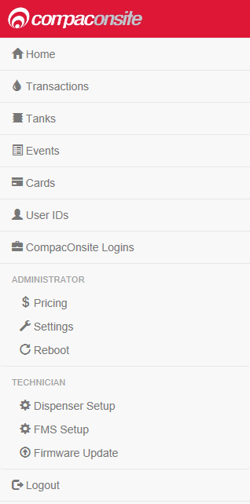

<!-- page 7 -->

4.
Standard User Options
Standard User Options
Users have access to all the following basic functionalities.
Transactions
NOTE: Table columns shown on page can be expanded.
The Transactions page shows the transactions of fuel into the tank. The Transactions storage is
limited. When Transaction storage is at 100%, the user will have to Export CSV. This will store
the data locally onto your device while making the transactions data overwritable once more
transactions are recorded.

NOTE: Select Refresh before adding more transactions.
Transactions that have not been exported will be viewed in the screen as a default. To show
exported transactions untick ‘Only load new transactions’.

<!-- page 8 -->

5.
Standard User Options

Tanks
The Tanks section indicates product details and volume of fuel in the tank.

Deliveries indicate when the last transaction of fuel from the tank occurred, including the tank
number and date time. The data in this section can be downloaded by pressing Download. Select
Refresh to view new data. For Technican Only tank settings, see Dispenser Setup.

NOTE: A reboot is required for any changes to be applied. This may take up to 30s.

Events
Events are notable events that occur with the pumps.
Pump Snapshot = Accumulative amount of fuel pumped from selected pump, logged at the
midnight instant daily
Tank Snapshot = Dip of fuel remaining in the tank, logged at the midnight instant daily
Controller Power On = The processor turns on
Time Update = Synchronises time on processor with real online time

Select Download to download the list of events on screen. Select Refresh to load the most
recent events.

<!-- page 9 -->

6.
Standard User Options

Cards
In this section, a new card can be created with Create New card. Decide on a card number, PIN
and owner details, then select Submit.
NOTE: For card base management, see Fuel Management System Setup
NOTE: Ensure Enabled box is ticked to validate card.
If a mistake has been made, select Edit and edit card details. Select the trash can icon if a card
is not needed. The maximum Card storage is limited at 200 cards.

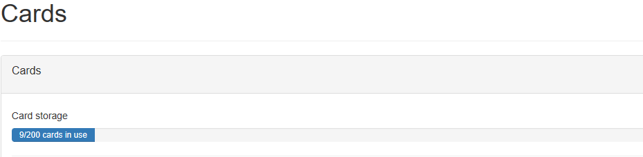

<!-- page 10 -->

7.
Standard User Options
User IDs
User IDs consist of any 6 numbers or less. Select Edit to Edit User IDs and owner details. Tick the
enable box to make the User ID valid for use. The trash can icon can be selected to permanently
delete the user.
NOTE: A card can have multiple users.
Different users will have different User IDs. The purpose of this is to know which user has made a
transaction, and ensure they are only fuelling when required.
To add a user ID, click Create New User ID. To insert large numbers of user, importing a User ID file
is recommended. Exporting a user ID file exports the data from the website onto your local device.
NOTE: All User ID files created/imported MUST be a csv file not an excel file.

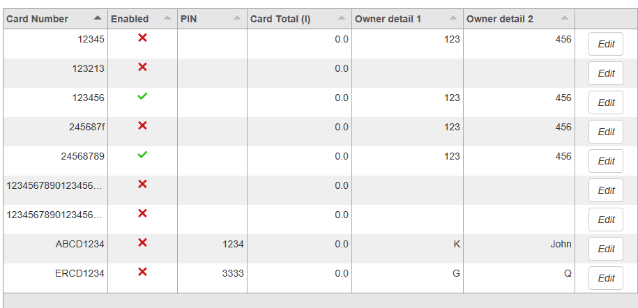

<!-- page 11 -->

8.
Standard User Options
CompacOnSite Logins
For the security of the site, the standard passwords should be changed during set up of the unit.
In case the passwords were not changed during installation, the process is outlined here. To
change the passwords, go to CompacOnsite Logins, shown on the left options tab.

Not all users may be shown depending on the access level of the user. To edit, click Edit.

Enter the desired new password, confirm this and press Submit.

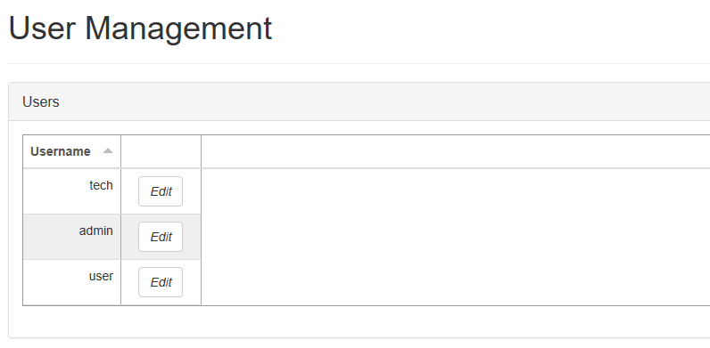

<!-- page 12 -->

9.
Administrator Options
Administrator Options
Administrators can access all the above options, as well as being able to reboot the site and
access pricing and settings.
Pricing
From Pricing, the pricing for different products can be viewed and/or changed.

The Active Price is the price being used currently for the pumps. To change this, select Set New
Price.

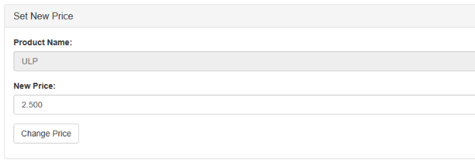

<!-- page 13 -->

10.
Administrator Options

Enter the new price for any product and select Change Price. This will change the New Price.
However, the unit will continue to use the Active Price until Use New Prices is selected, under
Price Change. Clicking this will change the Active Price and update them to the New Price.
Settings
Settings can be used to set site details. Enter the site details and press submit.

The time zone can also be set. In some cases, timezone will be automatically synced. Enter the
timezone and press submit.
Reboot
You can reboot the site to restart the application. Some settings require rebooting to update
recent actions. The page needs to be refreshed after the Reboot process has been completed.
NOTE: The unit can only be rebooted when no transactions are taking place.
When someone is refuelling, the C5000 unit cannot be rebooted. The pumps may stop fuelling as
the transaction has been interrupted.

<!-- page 14 -->

11.
Technician Options
Technician Options
Technician users can access both administrator and standard user options. As well as this, they
can access site setup options.
Dispenser Setup
Dispenser Setup will bring up a setup menu with four options; Products, Pumps, Tank Gauging
and Tank Strapping.

In the Products tab, the current products can be viewed.

To create a product, Add Product can be selected. The product must be named and numbered
before it can be saved. The following menu will appear.

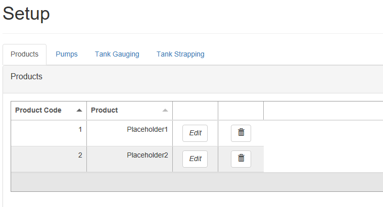

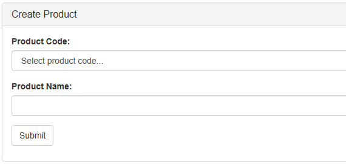

<!-- page 15 -->

12.
Technician Options
Pressing Submit will add the product. When a product is edited the same menu will appear, and
the product’s name and number can be changed before resubmitting.
To delete a product, select the recycle bin icon in the products table, and click OK on the pop-
up.
The next tab is the Pumps tab. From this tab, the configuration of the unit (single or dual) can be
chosen, as well as the settings for each pump.

Depending on the chosen configuration, only one side may be displayed.
To change the Pump number simply enter the new value and press Update.
To change the product, meter type or state, select the relevant option from the drop-down
menus and press update.
The Tank Gauging tab shows which tank gauge is selected for each tank.
For the Side B pump, change the State to Enabled for a dual pump.

<!-- page 16 -->

13.
Technician Options

The current settings can be viewed. To edit a row, select Edit.

To change a setting, enter the new setting and Submit the new values.
If a Vega tank gauge is being used, more information is required. The required fields will
automatically appear if a Vega meter is selected.

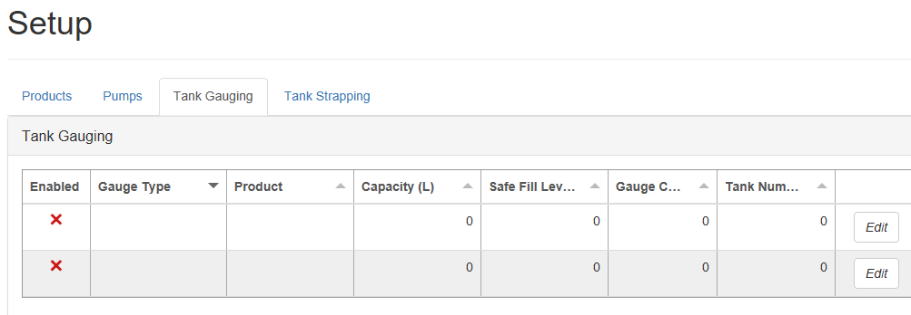

<!-- page 17 -->

14.
Technician Options

The final tab in Dispenser Setup is the Tank Strapping section. This section is only relevant if a
Vega meter is fitted. Refer to Vega Tank Strapping for information.

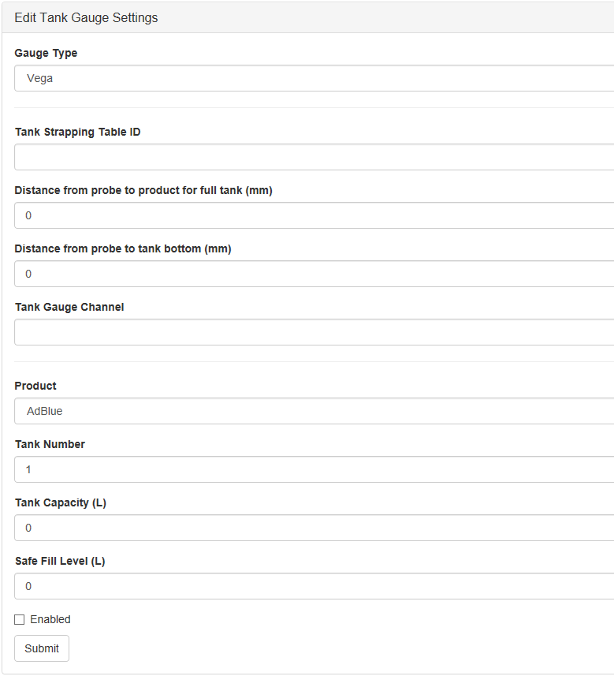

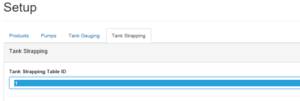

<!-- page 18 -->

15.
Technician Options

To download the tank strapping table, select download current strapping table. At the bottom
of the page, tables can be uploaded and the table template can be downloaded. Use the table
ID drop down menu to select the table ID.
Vega Tank Strapping
If a Vega electronic dipstick is being used, a tank strapping table will need to be created to
gauge the amount of liquid in a tank. To do this, the tank dipstick will need to be accessed. This
is a ruler showing volume that is a component of tanks.

To gather values for the tank strapping table:
1. Load a quantity of the product into the tank (eg 50L)
2. Insert a dipstick into the tank so it is perpendicular to the base.
3. Remove the dipstick gently.
4. Use a measuring tape to measure and record the length of wet dipstick onto the table. This
length will correspond to the volume 50L.
5. Load more of the product into the tank (eg +50L=100L)
6. Repeat steps 2 and 4.
7. Repeat steps 5 and 6 for every volume of product. After making a table, reinsert the dipstick
into the tank and then read the volume of fuel in the tank. This is also required on
CompacOnSite.

NOTE: The more readings done on the tank, the more accurate the tank gauging will be.

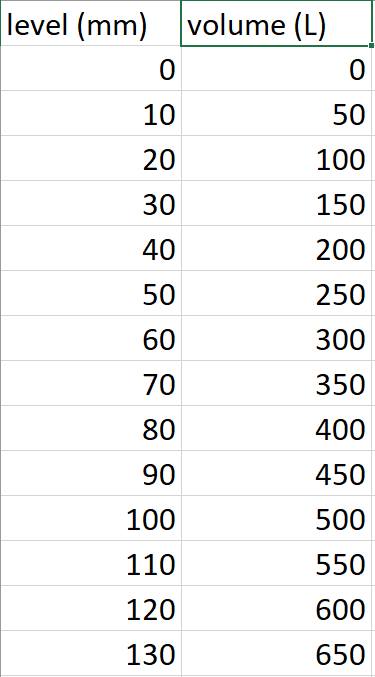

<!-- page 19 -->

16.
Technician Options

Fuel Management System Setup
When setting up the unit, the FMS setup tab can be used to set up card records.

Cards can be imported and exported as .csv files. This option can be found in this tab. To add a
new card, fill in the required fields and check which prompts are desired. Checking Enabled will
enable the card. When the card is finished, press Submit. Current cards can be viewed in the
Card Prefix Table.

PIN Pad = Requires users to type in a PIN number/passcode for authentication
HID = Requires users to swipe a tag for authentication
Card Reader= Requires users to swipe a card into the card reader for authentication
NOTE: If two of the three boxes are ticked, both authentication modes will be required.
NOTE: The HID and Card Reader modes cannot both be ticked as they cannot both fit onto a
device's hardware and software.

<!-- page 20 -->

17.
Technician Options

To edit a card prefix, click Edit. The following should pop up:
The PAN length is the maximum number of digits the PAN number (Card Number) can be.
The Access Number is used as an extra step of authentication.
Here are the boxes that can be ticked/unticked:
Mode:
Hotlist − Checks for BIN Number only, not Card Number (recommended setting: disabled)
User ID − Asks for the User ID as an additional step of authentication for the specific user
Prompts:
Expiry Check (only when Card Reader Auth Mode is enabled) − checks for the expiry month and
year of a card, declines the card if expired
Preset − Prompts the user to enter the amount of fuel they want dispensed
Odometer- Prompts the user to enter their odometer reading

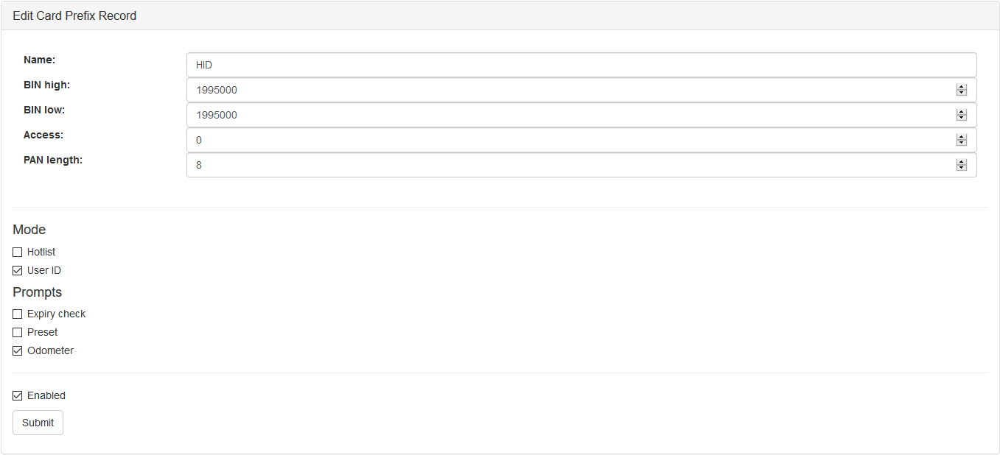
