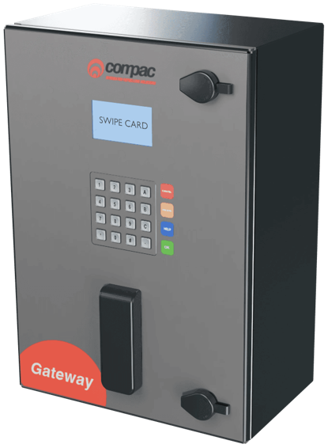
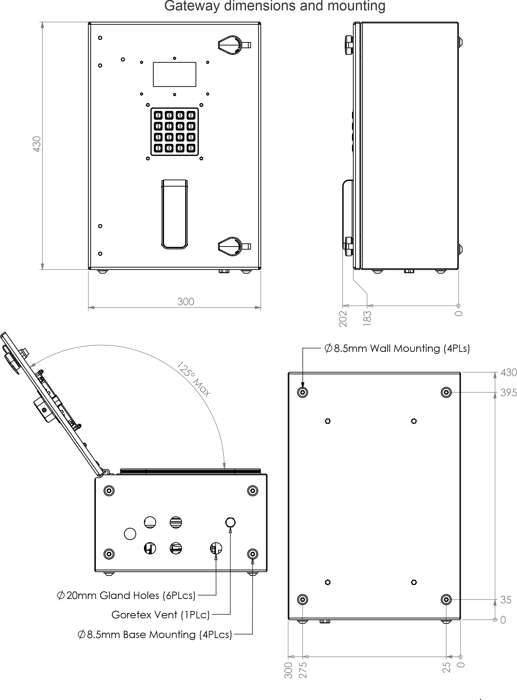
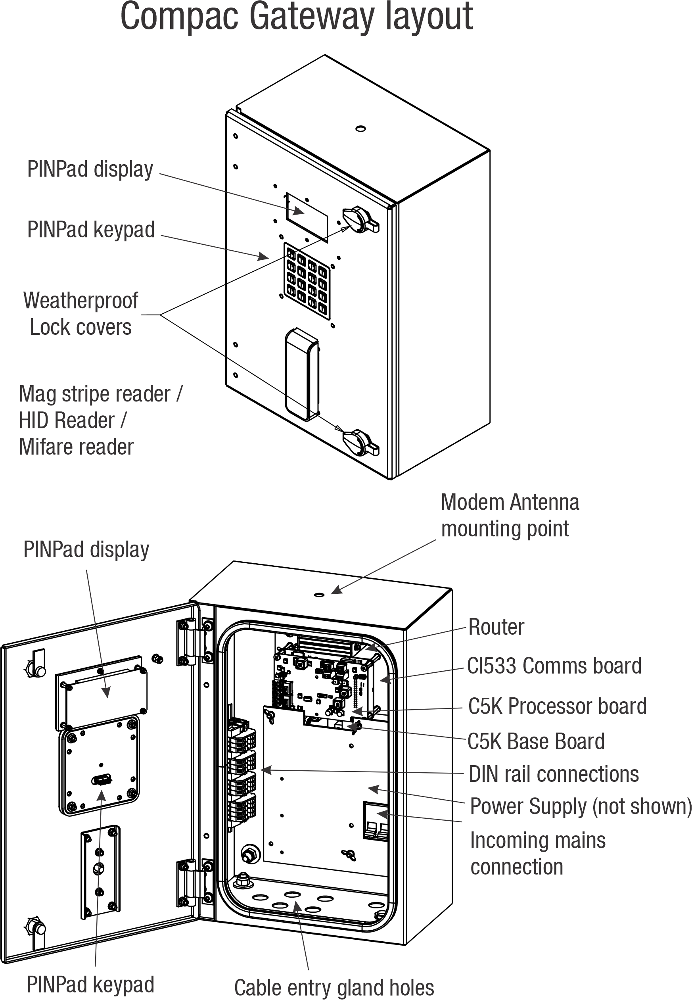
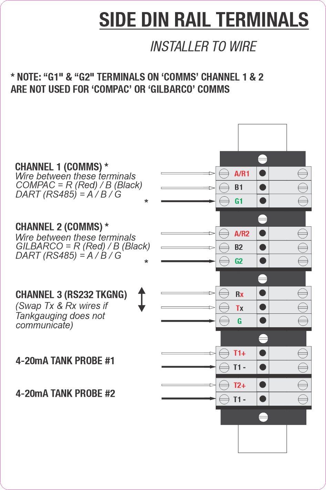
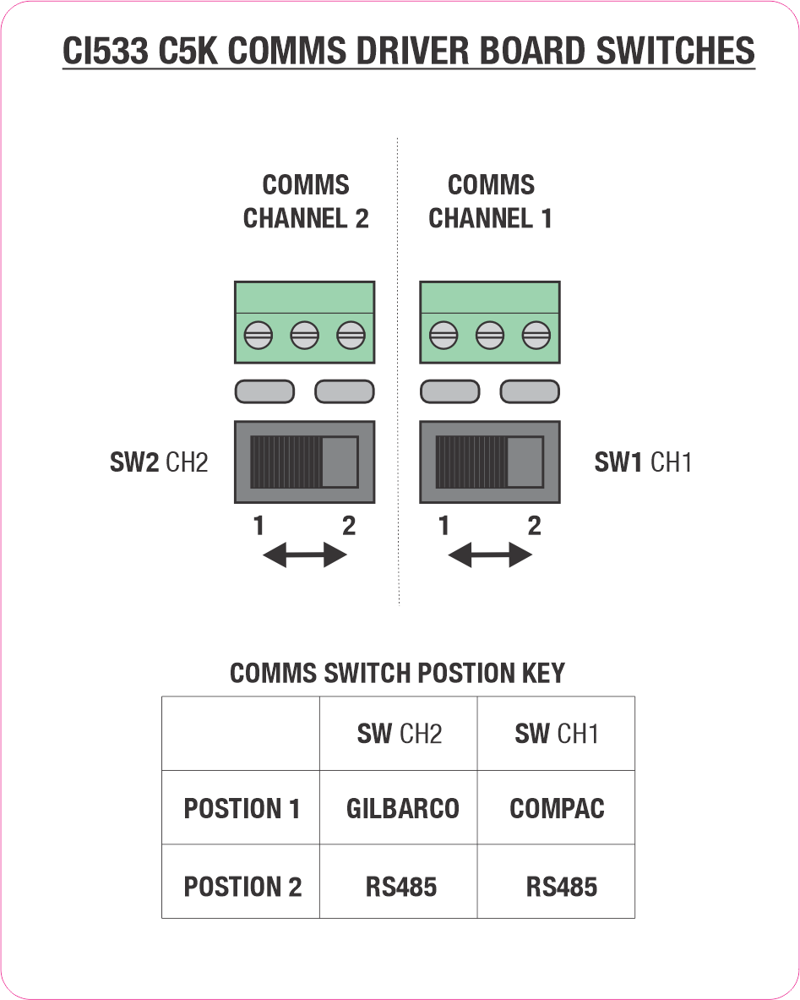
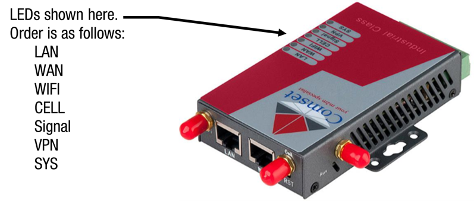

# Gateway Manual

Updated 22 September 2026

Gateway

**Conditions of Use**

- Please read this manual completely before working on, or making adjustments to the Compac Gateway 
- Compac Industries Limited accepts no liability for personal injury or property damage resulting from working on or adjusting the equipment incorrectly or without authorization.  
- Along with any warnings, instructions, and procedures in this manual, you should also observe any other common sense procedures that are generally applicable to equipment of this type. 
- Failure to comply with any warnings, instructions, procedures, or any other common sense procedures may result in injury, equipment damage, property damage, or poor performance of the Compac equipment 
- The major hazard involved with operating the Compac C5K processor is electrical shock. This hazard can be avoided if you adhere to the procedures in this manual and exercise all due care. 
- Compac Industries Limited accepts no liability for direct, indirect, incidental, special, or consequential damages resulting from failure to follow any warnings, instructions, and procedures in this manual, or any other common sense procedures generally applicable to equipment of this type. The foregoing limitation extends to damages to person or property caused by the Compac C5K processor, or damages resulting from the inability to use the Compac C5K processor, including loss of profits, loss of products, loss of power supply, the cost of arranging an alternative power supply, and loss of time, whether incurred by the user or their employees, the installer, the commissioner, a service technician, or any third party.  
- Compac Industries Limited reserves the right to change the specifications of its products or the information in this manual without necessarily notifying its users. 
- Variations in installation and operating conditions may affect the Compac C5K processor's performance. Compac Industries Limited has no control over each installation's unique operating environment. Hence, Compac Industries Limited makes no representations or warranties concerning the performance of the Compac C5K processor under the actual operating conditions prevailing at the installation. A technical expert of your choosing should validate all operating parameters for each application. 
- Compac Industries Limited has made every effort to explain all servicing procedures, warnings, and safety precautions as clearly and completely as possible. However, due to the range of operating environments, it is not possible to anticipate every issue that may arise. This manual is intended to provide general guidance. For specific guidance and technical support, contact your authorised Compac supplier, using the contact details in the Product Identification section.
- Only parts supplied by or approved by Compac may be used and no unauthorised modifications to the hardware of software may be made. The use of non-approved parts or modifications will void all warranties and approvals. The use of non-approved parts or modifications may also constitute a safety hazard.
- Information in this manual shall not be deemed a warranty, representation, or guarantee. For warranty provisions applicable to the Compac C5K processor, please refer to the warranty provided by the supplier.
- Unless otherwise noted, references to brand names, product names, or trademarks constitute the intellectual property of the owner thereof. Subject to your right to use the Compac C5K processor, Compac does not convey any right, title, or interest in its intellectual property, including and without limitation, its patents, copyrights, and know-how. 
- Every effort has been made to ensure the accuracy of this document. However, it may contain technical inaccuracies or typographical errors. Compac Industries Limited assumes no responsibility for and disclaims all liability of such inaccuracies, errors, or omissions in this publication.

**Validity**

This manual covers the following Compac products
- Compac Gateway

Compac Industries Limited reserves the right to revise or change product specifications at any time. 
This publication describes the state of the product at the time of publication and may not reflect the product at all times in the past or in the future.

**Manufactured by:** 
The Gateway is designed and manufactured by Compac Industries Limited 
52 Walls Road, Penrose, Auckland 1061, New Zealand 
P.O. Box 12-417, Penrose, Auckland 1641, New Zealand 
Phone: + 64 9 579 2094 
Fax: + 64 9 579 0635 
Email: techsupport@compac.co.nz 
www.compac.co.nz 
Copyright ©2015 Compac Industries Limited, All Rights Reserved
 
 

# Table of Contents

[**Safety**](#safety)

[**Gateway Technical Drawings**](#gateway-technical-drawings)

[Gateway Footprint](#gateway-footprint)

[Gateway Layout](#gateway-layout)

[**Pre-installation**](#pre-installation)

[Zone requirements and Electrical Approvals](#zone-requirements-and-electrical-approvals)

[Static Electricity Precautions](#)

[Tools](#tools)

[**Installation**](#installation)

[**Mechanical Installation**](#mechanical-installation)

[Mounting](#)

[Glanding](#glanding)

[Perspex Guard](#perspex-guard)

[**Electrical Installation**](#electrical-installation) 

[Pump setup](#pump-setup)

[eSim](#esim)

[230V Mains connection](#230v-mains-connection)

[Pump comms connection](#pump-comms-connection)

[**Servicing**](#servicing)

[**Maintenance**](#maintenance)

[Cleaning the Cabinet](#cleaning-the-cabinet)

[Cleaning the Card Reader](#cleaning-the-card-reader)

[Cleaning the PIN Pad](#cleaning-the-pin-pad)

[Testing](#testing)

[Removing and replacing the Perspex Guard](#removing-and-replacing-the-perspex-guard)

[Modem](#modem)

[**Modem LEDs**](#modem-leds)

[**Troubleshooting**](#)

# Safety

Please adhere to the following safety precautions at all times when working on the Compac Gateway. 
Failure to observe these safety precautions could result in damage to the Compac Gateway, injury, or death. 
Ensure that you read and understand all safety precautions before installing, servicing or operating the Compac Gateway.

**PRECAUTIONS**

Always follow safe operating procedures, any national or local regulations and site specific instructions. 

Make sure that the service area is thoroughly clean when servicing. Dust and dirt entering the components reduce the life span of the components and can affect operation. 

Some components have sharp edges and corners. Wear gloves whenever practicable while working inside the cabinet. 

**Site Safety**

Comply with all safe site regulations for the site you are working on and any additional instructions from the site manager. 

Wear and use appropriate safety equipment such as safety boots, high visibility clothing, hard hat, gloves and barrier cream. 

Cordon off the area you are working in using cones, barriers, caution tape etc.

**CAUTION** 

When working near any flammable goods area, take all precautions to avoid all potential sources of ignition. This includes but is not limited to: Open flames, hot exhausts, welding flames or sparks, static electricity, non-intrinsically safe electrical equipment, use of mobile phones. 

These instructions are to be used as a guide only and may not cover all situations. It is the responsibility of yourself and the site manager to take appropriate health and safety precautions. 

**Electrical Safety**

**CAUTION** 

Always turn off the power to the Compac Gateway before removing the high voltage area Perspex guard. Never touch wiring or components inside the high voltage area with the power on. 

Always turn off the power to the Compac Gateway before removing or replacing software. 

Always take basic anti-static precautions when working on the electronics, i.e., wearing a wristband with an earth strap.

**240 Volts** 

The Compac Gateway is powered by 240 Volt AC mains power. The mains power enters the cabinet via a gland in the base and is connected to the terminal board. From the terminal board, the power supply goes to the power supply. The power supply steps down the 230 Volts AC to 12 volt DC to power the main electronic components. 

Technicians should be able to safely operate and diagnose a Gateway with the cabinet door open as long as they do not touch any of the 230 Volt powered components behind the Perspex cover or the 230 Volt terminals on the power supply.
 

# Gateway Technical Drawings

# Gateway Footprint 

 

# Gateway Layout

 

# Pre-installation

# Zone requirements and Electrical Approvals

**Electrical Approvals**

**DANGER: 
the Compac Gateway is NOT approved for installation in a hazardous area. 
Please consult the site's zone drawings to find the exact positions of the hazardous areas for the particular site.** 

For adequately ventilated fuel dispensing sites (not including CNG/NGV), in most cases the following will apply: 
- The unit is not designed to be constantly exposed to the elements. A shelter should be installed to protect it. 
- The card reader and PIN pad should face away from the prevailing wind especially in dusty or wet areas. 
- In areas experiencing extremes of weather (heat, cold, wind, rain, salt spray etc.) consideration should be given to installing additional shelter. 
- The Gateway location or protection should be such as to minimise the possibility of damage from vehicles, trailers, boats, or the like. 
- On heavy vehicle sites, mounting the unit on a raised pad and/or installing bollards to help protect from damage should be considered. 
- If mounting on a post, the base needs to be attached to a smooth, level surface of sufficient strength to securely hold the retaining bolts or fasteners.  
- The Gateway should be placed at least 8 metres from any above ground flammable liquid storage or handling facility other than a dispenser. 
- The Gateway should be placed at least 0.5 metres from any flammable liquid fuel dispensers and 1.5 metres from any LPG dispensers. 
- The Gateway should be mounted so that the base of the cabinet is at least 1.2 metres above the ground.  
- If the Gateway is mounted on a post, and the post is within 4 metres of a dispenser or within 1 metre of the end of any fuel dispenser hose, then the entire interior of the post may be considered a hazardous area. Any cables running through, or electrical equipment mounted in the post should be suitable for that hazardous area (refer AS/NZS 2381). 
- Whenever running a cable through the post into the base of the cabinet always ensure that the cable entry into the cabinet uses a vapour tight gland.  
- Generally, the area below the Gateway may be a hazardous area and therefore some appropriate signage may be required e.g. no smoking.  
- Lighting should be provided during the hours of operation. Lighting should be sufficient to provide safe working conditions that include, but are not limited to, clear visibility of all markings on packages, signs, instruments and other necessary items. A minimum value of 50 lux is recommended. 

For more information and guidelines on classifications of hazardous zones, please refer to AS/NZS 60079-10.1 (Classification of Areas – Explosive gas atmospheres) 
These requirements do not apply to any specific site but are merely recommendations that will apply in most cases. 
The owner/installer must ensure that the installation complies with AS/NZS 3000, AS 1940, and any other applicable regulations.
# Static Electricity Precautions
Electronic components used are sensitive to static. Please take anti-static precautions. 
An anti-static wrist strap should be worn and connected correctly when working on any electronic equipment. If an anti-static wrist strap is unavailable, or in an emergency, hold onto an earthed part of the pump/dispenser frame whilst working on the equipment. This is not a recommended alternative to wearing an anti-static wrist strap. 

**NOTE:** *Compac Industries Limited reserves the right to refuse to accept any circuit boards returned, if proper anti-static precautions have not been taken.*

# Tools

Having all the correct tools will make installation, upgrade and repair procedures easy and minimise the risk of damage to components.
Before you arrive on site, make sure you have a minimum of all the tools listed here.

- 5.5mm nut driver
- 7mm nut driver
- 8mm nut driver
- T30 Torx drive bit or driver
- T10 Torx drive bit or driver
- Metric spanner set
- Metric 3/8" or 1/4" drive socket set
- 1/4" screwdriver bit holder
- 1/4" A/F spanner
- 6" adjustable spanner
- Flat blade screwdriver set (1.5 - 5mm blades)
- #0, #1, #2 Phillips screwdrivers
- #1, #2 Pozidriv screwdrivers
- Set of metric Allen (hex) keys
- Fine long nose pliers, side cutters & pliers
- Hacksaw
- Stanley knife or similar sharp blade
- Ruler
- Multimeter
- Laptop or smartphone with internet

# Installation

# Mechanical Installation

# Mounting

The Gateway can be mounted from the rear or the bottom of the unit. Refer to Footprints for locations of the mounting holes. 
To mount the unit, use the following:

- 4x M8x25 button head hex drive stainless steel screws
- 4x M8x16 button head hex drive stainless steel screws
- 8x M8 nylon washers
- 8x M8 stainless steel flat washers
- 8x M8 stainless steel nuts

Stainless steel is recommended due to the reduced risk of corrosion when exposed to weather conditions. 
The Gateway is suitable for outdoor installation. 
M8x25 screws are recommended for mounting from the rear of the unit and are suitable for mounting to surfaces up to 10mm thick. 
M8x16 screws are recommended for mounting from the bottom of the unit and are suitable for mounting to surfaces up to 4mm thick. 

# Glanding

Grommets are supplied with the Gateway unit to blank off unused gland holes

Any unused gland access holes should be blanked with the supplied grommets. 
19.1mm grommets will fit the 20mm access holes. 

# Perspex Guard

A Perspex guard is supplied with the Gateway and will need to be removed to access the terminal board and baseboard. 
The location of the guard is as shown: 
 

**DANGER:** The unit must be isolated before attempting to remove or reattach the Perspex guard. 

The Perspex guard is attached with 4x M4x10 pozi screws and M4 nylon washers. 
An 8mm nut driver will be appropriate for removing and reattaching the Perspex guard.

**NOTE:** *Always reattach the Perspex guard after working on the Comfill V2 unit.* 
 
**NOTE:** *Always reattach fuse covers after working on the Comfill V2 unit.*

 

# Electrical Installation 

Scope of Electrical installation of the Gateway is as follows:

1. Connect the 240V Mains 

2. Connect the Pump Comms 

3. Fit the Modem Antenna

# Pump setup

The pumps are already set up on CompacOnline during provisioning of the Gateway unit during manufacure at the Compac Factory so it is not ususally necessary to do this as part of the installation.

If additional pumps are required to be set up, this must be done on CompacOnline.

# eSIM

As the Gateway,in most cases,has already been set up in the Compac Factory with an eSIM, there is no physical SIM card requied

# DIN Rail Connections

When the Gateway arrives onsite, all internal wiring will already be connected. 

All site connections are to be made on the DIN rail 

Incoming external cables need to be glanded through the holes provided in the cabinet
and then connected to the DIN rail which is mounted in the unit on the left hand side. 

The connections are as shown below: (This label is also inside the unit )

# 230V Mains connection

Connect the 230V incoming Mains as shown: (This label is also inside the box)

# Pump comms connection

Connect pump comms to the DIN rail 

To connect a Compac pump to the Gateway with Compac comms: 

Connect the pump comms to CHANNEL 1 (COMMS) on the DIN Rail as shown in the SIDE DIN RAIL TERMINALS diagram
For Compac Comms, connect thepump comms to **A/R1 (Red)** and **B1 (Black)**

The CI533 Comms board should already be set up for Compac comms on Channel 1 during manufacture at the Compac factory
Diagram below is for reference only if required. (This label is also inside the unit )

# Servicing

Having all the correct tools will make installation, upgrade and repair procedures easy and minimise the risk of damage to components. 

Before you arrive on site, make sure you have a minimum of all the tools listed here.

- 5.5mm nut driver
- 7mm nut driver
- 8mm nut driver
- T30 Torx drive bit or driver
- T10 Torx drive bit or driver
- Metric spanner set
- Metric 3/8" or 1/4" drive socket set
- 1/4" screwdriver bit holder
- 1/4" A/F spanner
- 6" adjustable spanner
- Flat blade screwdriver set (1.5 - 5mm blades)
- #0, #1, #2 Phillips screwdrivers
- #1, #2 Pozidriv screwdrivers
- Set of metric Allen (hex) keys
- Fine long nose pliers, side cutters & pliers
- Hacksaw
- Stanley knife or similar sharp blade
- Ruler
- Multimeter
- Laptop or smartphone with internet

# Maintenance

The Gateway is a relatively simple unit with no moving parts and therefore needs minimal maintenance. 

# Cleaning the Cabinet

The cabinet should be cleaned with a soft cloth and non-abrasive cleaner to remove dirt, grease, graffiti and unauthorised stickers. 
All instruction and branding decals should be replaced if damaged or faded. 

**NOTE:** *Do not use buckets of water, hoses or water blasters to clean the cabinet as water may enter and damage delicate components.* 

# Cleaning the Card Reader

The card reader should be swiped through with a cleaner card wet with cleaner fluid. 
The card reader may need to be cleaned daily on dirty, dusty or wet sites.

# Cleaning the PIN Pad

The PIN pad should be cleaned to keep the printing legible. A soft dry rag should be used. 
Do not use a rag wet with solvent or petrol as the PIN pad printing may be damaged. 

# Testing

Regular zero dollar tests with valid PINs and Cards should be undertaken to ensure that the unit is operating correctly.  

# Removing and replacing the Perspex Guard

The Perspex guard houses the 230V components and will need to be removed to repair or replace components such as the power supply and several of the circuit boards.

**DANGER**

Ensure the unit is isolated before attempting to remove the Perspex guard. 
The unit should remain isolated while removing or repairing any components underneath the Perspex guard. 
Do not repower the unit until the guard is back in place.

To remove the Perspex guard, simply unscrew the M4x10 pozi screws holding the guard in place. 
Replacement is the opposite of removal. 

# Modem
The Modem is not repairable on site and will need to be replaced with a new part. 

It can be removed simply by removing the screws securing it to the gear plate, and by removing any cables connecting it to other components.

# Modem LEDs

The COMFILL V2 comes with a Comset modem, which has indicating LEDs to display the status of the modem. 
Refer to the following tables to understand the modem LEDs.

Order of LEDs on the Modem is as follows:
- LAN
- WAN
- WIFI
- CELL
- Signal
- VPN
- SYS

|LED|	Indication Light|	Description|
|---|-------------------|--------------|
|SYS|On for 25 seconds|On for 25 seconds after power up
|   |Blinking|System set-up normally|
|   |Off or still on after 25 seconds|System set-up failure
|LAN|Blinking|Ethernet data transmission|
|   |Off|No Ethernet connection|
|   |On|Ethernet is connected|
|VPN|On|VPN tunnel set-up|
|   |Off|VPN tunnel not set-up or VPN failure
|CELL|On|Cell connection is ‘UP’ and now you have access to the Internet
|WIFI|On|Wi-Fi enabled
|    |Off|Wi-Fi disabled
|    |Blinking|Ethernet data transmission
|WAN|Off|No Ethernet connection
|   |On|Ethernet is connected
|Signal|Off|No signal, or signal checking is not ready
|      |Blinks once every 4s|Signal bar is 1
|      |Blinks once every 3s|Signal bar is 2
|      |Blinks once every 2s|Signal bar is 3
|      |Blinks once every 1s|Signal bar is 4
|      |Blinks twice every 1s|Signal bar is 5

 

# Troubleshooting

|Problem|Possible cause|Recommended action|
|-------|---------------|------------------|
|No Power/No Lights|No power entering  unit|Ensure that power is entering unit, check external fuses and switches
|                  |Faulty power supply|Replace the power supply
|Will not read cards|Debris on card or magnetic head|Clean card or card reader’s magnetic head using head cleaning kit.
|Pump Error on display|One of the linked pumps or dispensers has encountered an error.|Read the error message on the pump display to find out what is wrong.
|Pumps will not dispense fuel|Wrong pump number selected|Ensure pump number set in pumps matches pump number set in controller and also pump number written on the pump.
|                            |No fuel in tanks|Verify tanks have sufficient product 
|                            |                |Try another pump to verify. Contact pump service agent 
|                            |Pump fault	  |Have service agent check pumps
|Card Declined |Card not in Card records|Refer to CompacOnline
|Expired Card on display|Card has expired|Use a valid card
|Pump not communicating with the Gateway|Comms issue|Check operation of the Tx an Rx diagnostic LEDS on poth the pump and the CI533 Comms Board in the Gateway.
|                                       |Pump software issue|Ensure that the pump has the correct software version. 
|                                       |Pump not configured correctly| If the Pump is an old C4000 Futra that has been converted to Compac pump comms by upgrading the software, ensure that the Comms and Power Supply are also configured correctly for Pump Comms. Just updating the software may not be enough.                    |  	
		
 

	 	

