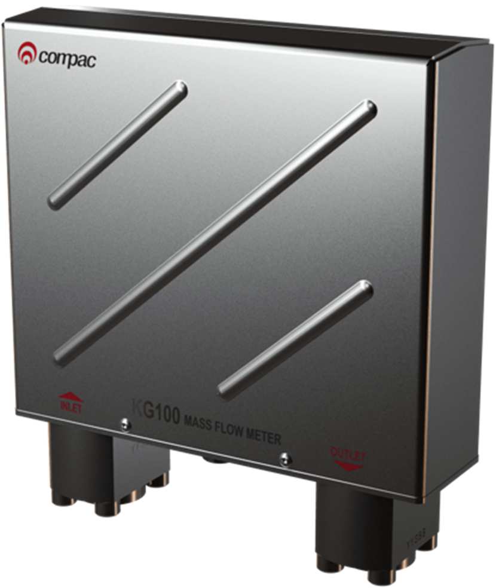
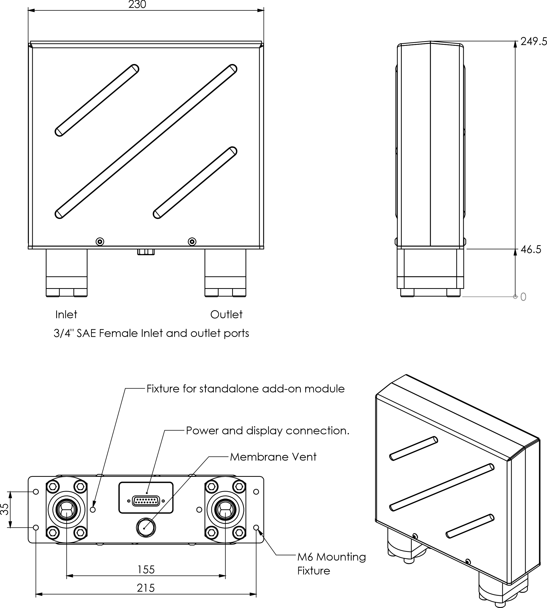

# KG100 Coriolis Mass Flow Meter  

The KG100 Coriolis meter is an example of innovative Compac technology, designed and manufactured in our New Zealand facility using automated production methods to ensure precision measurement.

It exceeds OIML standards for accuracy and is rated for inlet pressures up to 350 bar.

# Benefits:

- High speed processor and intelligent software guarantees accuracy and reliability

- Laser precision bends and computer controlled automated assembly provides unrivalled precision

- Heat treatment ensures zero point stability and prevents calibration drift

- SAE parallel thread fittings with o-rings prevent leaks

 

# Specifications 

|      |      |
|------|------|
|Manufacturer|Compac Industries Ltd
|Nominal Flow Rate|0-100 kg/min
|Maximum Inlet Pressure|350 bar|
|Temperature Range|Ambient temperature range -40°C to +55°C|
|                 |Intermittent Gas Temp -55°C to +80°C|
|Weight|4.1kgs|
|Accuracy on CNG|To latest OIML R139 Standard|
|Material Specification|All wetted parts Stainless Steel|

 

# Dimensions

# Electrical Approvals
The Compac KG100 Coriolis Mass Flow Meter has IECEx and ATEX approvals for installation in a hazardous area 

- IECEx Certificate of Conformity **IECEx ExTC 18.0016X**

- ATEX **TUV 18 ATEX 8330 X**
