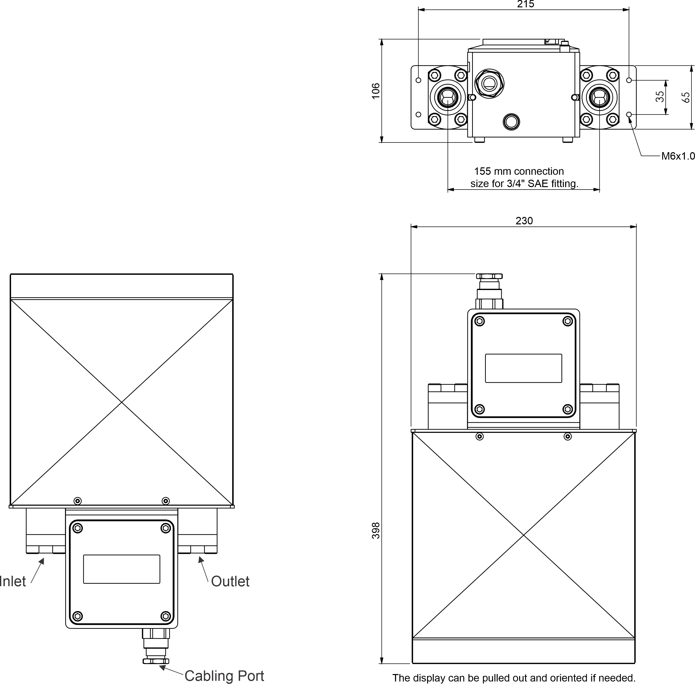
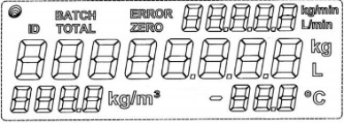
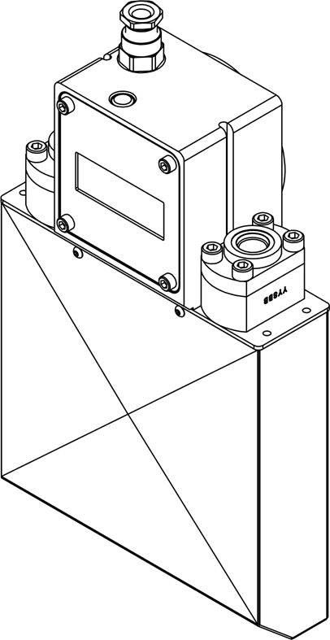

 

Sensor with External Transmitter Data Sheet
  

Version V1.0

 

<table border="1" style="border-collapse: collapse;">
 
  <tr>
    <th style="width:120px;">Features</th>
    <td style="width:400px;">Standalone Coriolis meter with an integrated power    supply and isolated communication. Suitable for   integration into existing measuring systems.</td>
  </tr>

</table>

<table border="1" style="border-collapse: collapse;">
  
  <tr>
    <th style="width:120px;">Performance</th>
    <td style="width:400px;">Flow rate: 2.0kg/min to 80 kg/min </td>
  </tr>
  <tr>
    <td></td>
    <td>Batch accuracy:  ± 0.5% </td>
  </tr>
   <tr>
    <td></td>
    <td>Gas temperature range: -40 °C to 80 °C </td>
  </tr>
   <tr>
    <td></td>
    <td>Rated pressure: 350 bar </td>
  </tr>
</table>

<table border="1" style="border-collapse: collapse;">
  <tr>
    <th style="width:120px;">Weight</th>
    <td style="width:400px;">7.3kg</td>
  </tr>
</table>

<table border="1" style="border-collapse: collapse;">
  <tr>
    <th style="width:120px;">Inlet/Outlet</th>
    <td style="width:400px;">3/4 Inch SAE port</td>
  </tr>
</table>

<table border="1" style="border-collapse: collapse;">
  <tr>
    <th style="width:120px;">Power source</th>
    <td style="width:400px;">12V DC / 220-240V AC  </td>
  </tr>
</table>

<table border="1" style="border-collapse: collapse;">
 

  <tr>
    <th style="width:120px;">Inputs</th>
    <td style="width:270px;">RS485(MODBUS)</td>
    <td style="width:110px;"></td>
  </tr>

  <tr>
    <td></td>
    <td><ul><li>Meter Control</td>
    <td></td>
  </tr>

   <tr>
    <td></td>
    <td></td>
    <td><ul><li>Metering</td>
  </tr>

   <tr>
    <td></td>
    <td></td>
    <td><ul><li>Zeroing</td>
  </tr>

   <tr>
    <td></td>
    <td></td>
    <td><ul><li>Metering</td>
   </tr>

   <tr>
    <td></td>
    <td>Stop/Stop Control</td>
     <td></td>
  </tr>

  <tr>
    <td></td>
    <td><ul><li>Integrated momentary  start/stop button</td>
     <td></td>
  </tr>
</table>

<table border="1" style="border-collapse: collapse;">
  <tr>
    <th style="width:120px;">Outputs</th>
    <td style="width:400px;">RS485(MODBUS)</td>
  </tr>
  <tr>
    <td></td>
    <td><ul><li>Batch Quantity</td>
  </tr>
  <tr>
    <td></td>
    <td><ul><li>Flow rate</td>
  </tr>
   <tr>
    <td></td>
    <td><ul><li>Temperature (gas)</td>
  </tr>
   <tr>
    <td></td>
    <td><ul><li>Temperature (ambient)</td>
  </tr>
   <tr>
    <td></td>
    <td><ul><li>Quantity totalizer</td>
  </tr>
  <tr>
    <td></td>
    <td><ul><li>Density</td>
  </tr>
</table>

 

 
 

Compac Industries | sales@compac.co.nz | 52 Walls Road, Penrose, Auckland

