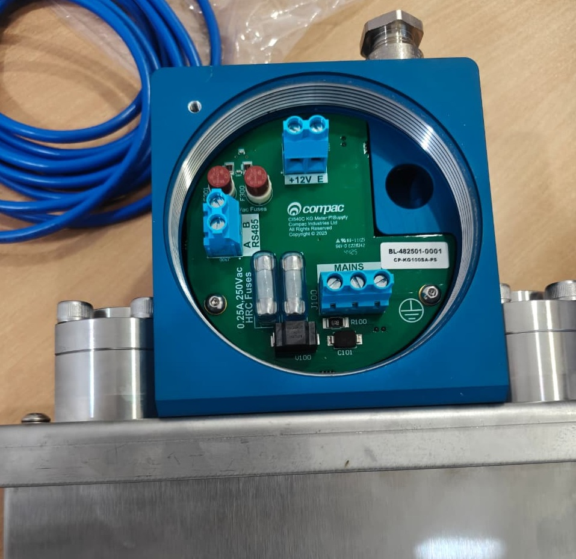

# KG100 Standalone Meter Installation Manual  

updated 5 May 2026

## Table of Contents

[**1.0 Safety**](#10-safety)

[**2.0 Introduction**](#20-introduction)

[**3.0 Operation**](#30-operation)

[**4.0 Drawings**](#40-drawings)

[**5.0 Mechanical connections**](#50-mechanical-connections)

[**6.0 Electrical connections**](#60-electrical-connections)

[**7.0 Calibration**](#70-calibration)

[**8.0 MODBUS Registers**](#80-modbus-registers)

# 1.0 Safety

**DANGER PRECAUTIONS** 

You must adhere to the following safety precautions at all times when working on the Compac equipment. 
Failure to observe these safety precautions could result in damage to the dispenser, injury, or death. 
Make sure that you read and understand all safety precautions before operating the Compac equipment 
Failure to take adequate safety precautions could result in explosion, injury and loss of life.

# 1.1 System Design
Ensure the system design does not allow the dispenser inlet pressure to exceed its rating. 
The dispenser does not include any safeties to protect against excessive inlet pressure. 
If necessary, suitable protective devices should be fitted prior to the dispenser inlet.

# 1.2 Mechanical Safety

Observe the following mechanical precautions: 

- Never tighten a fitting under pressure, even if a fitting or joint is leaking. Always depressurise the line first.
- Never disassemble a fitting under pressure. Always depressurise the line first.
- Be very careful when disassembling frozen pipework, as gas pressure may be trapped and suddenly released. Always depressurise the line before using.
- Never reuse any O-ring seals that have been in a high pressure gas atmosphere and then exposed to air. These o-rings swell and cannot be reused. Always make sure you have a new seal kit available to replace the seals before disassembly.
- Make sure that all internal surfaces are cleaned and that sliding surfaces are lightly greased with O-ring lubricant before reassembly. Dust and dirt entering components reduce the life span of the components and can affect operation.
- Ensure the service area is thoroughly cleaned before initiating service on CNG components. Dust and dirt entering the components reduce the life span of the component and affect future operations. 

# 1.3 Electrical Safety

Observe the following electrical precautions: 

- Always turn off the power to the KG100 Standalone Meter before removing the box lid. Never touch wiring or components with power on.
- Never power up the CKG100 Standalone Meter with the flameproof box lid removed.
- Always turn off the power to the KG100 Standalone Meter upgrading software or replacing components.
- Always take basic anti-static precautions when working on the electronics, i.e., wearing a wristband with an earth strap. 

# 2.0 Introduction

The Compac KG100 Standalone Meter. 

# 3.0 Operation

The Meter has two modes
- Zeroing Mode
- Normal Mode

You can see which mode the Meter is in by viewing the Display 

The top line will display 
0 = The Meter is zeroing
kg.min = The Meteris in normal mode

# 4.0 Drawings

# 5.0 Mechanical connections 

# 6.0 Electrical connections 

# 7.0 Calibration

The lid of the Display Enclosure has provision for tamper-proof wire sealing

To change the calibration 

Cut the Calibration seal wire 
Remove the Display enclosure lid
Press the button on the PCB. 
The first digit will flash
Hold the button down while the first digit scrolls though.Release when thecorrect number 

**Meter accuracy.**
The KG100 Standalone Meter meets the accuracy requirements of OIML R139

# 8.0 MODBUS Registers

**Electrical interface** 

Communication is made via 5V TTL RS232.  

**Communication protocol** 

The communication protocol is standard Modbus RTU with the following packet structure:  

|Start|Address|Function|Data|CRC|End| 
|---|---|---|---|---|---|
|>3.5 char|8 bits|8 bits|N * 8 bits|16 bits|>3.5 char| 

**Common Modbus registers** 

Table 1 below contains commonly used registers when integrating the KG100 Meter (Integrable Meter) into a dispenser/controller system.  The complete list of registers is available upon request.

Register|Type|Access|Designation 
-------|-----|-----|-----
0001|U16|RO|Processor Software Major 
0002|U16|RO|Processor Software Minor 
0003|U16|RO|Processor Software day | Software month 
0004|U16|RO|Processor Software year|
0005|U16|R/W|Modbus address 
0006|U16|RO|Secondary Processor Software Major 
0007|U16|RO|Secondary Processor Software Minor 
0008-0009|U16|RO|Unique ID 
0010|U16|RO|Runtime seconds 
0065|INT16|R/W|wStatus 
0066|INT16|RO|rStatus 
0070-0071|FLOAT|RO|VOL_FLOW 
0072-0073|FLOAT|RO|VOL_BATCH 
0074|U16|RO|Density 
0075|U16|RO|TEMPERATURE 
0076|U16|RO|cSTATUS 
0080-0081|FLOAT|RO|KG_FLOW 
0082-0083|FLOAT|RO|KG_BATCH 
0084|U16|RO|cDensity 
0085|INT16|RO|cTemperature
0129|U16|R/W|Pair ID 1 
0130|U16|R/W|Pair ID 2 
0132|U16|R/W|REQ Address 
0136|U32|R/W|K Factor (flow calibration factor) 
0138|INT16|R/W|Density offset 
0139|INT16|R/W|Temperature offset 
0142|U16|R/O|OWID EXT A 
0143|U16|R/O|OWID EXT B 
0144|U16|R/O|OWID EXT C 
0145|U16|R/O|OWID EXT D 
0146|U16|R/O|OWID INT A 
0147|U16|R/O|OWID INT B 
0148|U16|R/O|OWID INT C 
0149|U16|R/O|OWID INT D 
0176|FLOAT|R/W|Flow cutoff 

**Table 1 - Commonly used meter registers** 