

# KG100 Standalone Meter Manual  

Updated 13 May 2026

**Conditions of Use**  

Please read this manual completely before working on, or making adjustments to Compac equipment

Compac Industries Limited accepts no liability for personal injury or property damage resulting from working on or adjusting the equipment incorrectly or without authorization.

Along with any warnings, instructions, and procedures in this manual, you should also observe any other common sense procedures that are generally applicable to equipment of this type.

Failure to comply with any warnings, instructions, procedures, or any other common sense procedures may result in injury, equipment damage, property damage, or poor performance of the Compac equipment

The major hazard involved with operating the Compac KG100 Standalone Meter is electrical shock. This hazard can be avoided if you adhere to the procedures in this manual and exercise all due care.

Compac Industries Limited accepts no liability for direct, indirect, incidental, special, or consequential damages resulting from failure to follow any warnings, instructions, and procedures in this manual, or any other common sense procedures generally applicable to equipment of this type. The foregoing limitation extends to damages to person or property caused by the Compac KG100 Standalone Meter, or damages resulting from the inability to use the Compac C5K processor, including loss of profits, loss of products, loss of power supply, the cost of arranging an alternative power supply, and loss of time, whether incurred by the user or their employees, the installer, the commissioner, a service technician, or any third party.

Compac Industries Limited reserves the right to change the specifications of its products or the information in this manual without necessarily notifying its users.

Variations in installation and operating conditions may affect the Compac KG100 Standalone Meter performance. Compac Industries Limited has no control over each installation's unique operating environment. Hence, Compac Industries Limited makes no representations or warranties concerning the performance of the Compac KG100 Standalone Meter under the actual operating conditions prevailing at the installation. A technical expert of your choosing should validate all operating parameters for each application.

Compac Industries Limited has made every effort to explain all servicing procedures, warnings, and safety precautions as clearly and completely as possible. However, due to the range of operating environments, it is not possible to anticipate every issue that may arise. This manual is intended to provide general guidance. For specific guidance and technical support, contact your authorised Compac supplier, using the contact details in the Product Identification section.

Only parts supplied by or approved by Compac may be used and no unauthorised modifications to the hardware of software may be made. The use of non-approved parts or modifications will void all warranties and approvals. The use of non-approved parts or modifications may also constitute a safety hazard.

Information in this manual shall not be deemed a warranty, representation, or guarantee. For warranty provisions applicable to the Compac C5000 processor, please refer to the warranty provided by the supplier.

Unless otherwise noted, references to brand names, product names, or trademarks constitute the intellectual property of the owner thereof. Subject to your right to use the Compac KG100 Standalone Meter, Compac does not convey any right, title, or interest in its intellectual property, including and without limitation, its patents, copyrights, and know-how.

Every effort has been made to ensure the accuracy of this document. However, it may contain technical inaccuracies or typographical errors. Compac Industries Limited assumes no responsibility for and disclaims all liability of such inaccuracies, errors, or omissions in this publication.

## Table of Contents

[**1.0 Safety**](#10-safety)

[**2.0 Introduction**](#20-introduction)

[**4.0 Assembly Drawings**](#40-assembly-drawings)

[**5.0 Connecting the KG100PSD to the KG100 Meter**](#50-connecting-the-kg100psd-to-the-kg100-meter)

[**6.0 Installation & Safety Data for the KG100PSD**](#60-installation--safety-data-for-the-kg100psd)

[6.1 Area of use](#61-area-of-use)

[6.2 Cable entries](#62-cable-entries)

[6.3 Certification](#63-certification)

[6.4 Opening the flameproof box lid](#64-opening-the-flameproof-box-lid)

[6.5 Calibration](#65-calibration)

[6.6 Display Orientation](#66-display-orientation)

[6.7 Installation](#67-installation)

[6.8 Earthing](#68-earthing)

[6.9 Terminal wiring](#69-terminal-wiring)

[6.10 Connection of Mains or 12V and RS485 cables](#610-connection-of-mains-or-12v-and-rs485-cables)

[6.11 Internal Connection](#611-internal-connection)

[6.12 I.S. Output](#612-is-output)

[**7.0 Calibration**](#70-calibration)

[7.1 Calibration Method 1](#72-calibration-method-2)

[7.2 Calibration Method 2](#72-calibration-method-2)

[7.3 Changing the K-factor of the KG100 Standalone Meter](#73-changing-the-k-factor-of-the-kg100-standalone-meter)

[**8.0 MODBUS Registers**](#80-modbus-registers)

[**9.0 IECEx Approval Certificate of Conformity**](#90-iecex-approval-certificate-of-conformity)

 

# 1.0 Safety

**DANGER PRECAUTIONS** 

Please adhere to the following safety precautions at all times when working on Compac equipment. 
Failure to observe these safety precautions could result in damage to the Meter, injury, or death. 
Make sure that you read and understand all safety precautions before operating Compac equipment 
Failure to take adequate safety precautions could result in explosion, injury and loss of life.

# 1.1 System Design
Ensure the system design does not allow the gas pressure to exceed its rating. 
The KG100 Meter does not include any safeties to protect against excessive inlet pressure. 
If necessary, suitable protective devices should be fitted prior to the dispenser inlet.

# 1.2 Mechanical Safety

Observe the following mechanical precautions: 

- Never tighten a fitting under pressure, even if a fitting or joint is leaking. Always depressurise the line first.
- Never disassemble a fitting under pressure. Always depressurise the line first.
- Be very careful when disassembling frozen pipework, as gas pressure may be trapped and suddenly released. Always depressurise the line before using.
- Never reuse any O-ring seals that have been in a high pressure gas atmosphere and then exposed to air. These o-rings swell and cannot be reused. Always make sure you have a new seal kit available to replace the seals before disassembly.
- Make sure that all internal surfaces are cleaned and that sliding surfaces are lightly greased with O-ring lubricant before reassembly. Dust and dirt entering components reduce the life span of the components and can affect operation.
- Ensure the service area is thoroughly cleaned before initiating service on CNG components. Dust and dirt entering the components reduce the life span of the component and affect future operations. 

# 1.3 Electrical Safety

Observe the following electrical precautions: 

- Always turn off the power to the KG100 Standalone Meter before removing the box lid. Never touch wiring or components with power on.
- Never power up the CKG100 Standalone Meter with the flameproof box lid removed.
- Always turn off the power to the KG100 Standalone Meter upgrading or replacing components.
- Always take basic anti-static precautions when working on the electronics, i.e., wearing a wristband with an earth strap. 

# 2.0 Introduction

The Compac KG100 Standalone Meter. 

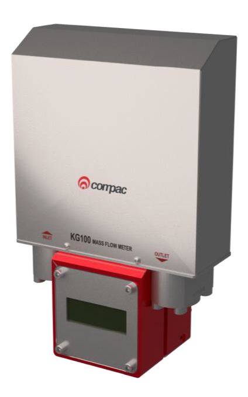

The KG100 Coriolis meter is an example of innovative Compac technology, designed and manufactured in our New Zealand facility using automated production methods to ensure precision measurement.

It exceeds OIML standards for accuracy and is rated for inlet pressures up to 350 bar.

**Benefits:**

- High speed processor and intelligent software guarantees accuracy and reliability

- Laser precision bends and computer controlled automated assembly provides unrivalled precision

- Heat treatment ensures zero point stability and prevents calibration drift

- SAE parallel thread fittings with o-rings prevent leaks 

The Standalone version of the Compac KG100 Coriolis meter with a built-in display has been developed for metering CNG / Biogas in both Dispensing and applications other than vehicle filling.

Typical applications: 
- Metering CNG / Biogas in a gas supply line with a non-resettable totaliser
- Master Meter for calibrating CNG dispensers with batch filling reset function

**Features:**

- Integrated 3-inch display which includes a non-resettable totalised and Batch fill function reset button

- Integrated Ex-rated junction box and power converter, allowing for either AC mains or a general purpose 12VDC power supply 

- Easy integration into existing systems with common Modbus RTU communication protocol

- Ultra low maintenance throughout the lifespan of the flow meter

|Specifications||
|-----|-----
|Nominal Flow Rate|0-100kg/min|
|Maximum inlet pressure|350bar|
|Temperature Range|-55C to +80C|
|Weight|Approx 4.1kgs|
|Accuracy|As per International Standard OIML R139 
|Material|All wetted parts Stainless Steel

 

# 4.0 Assembly Drawings

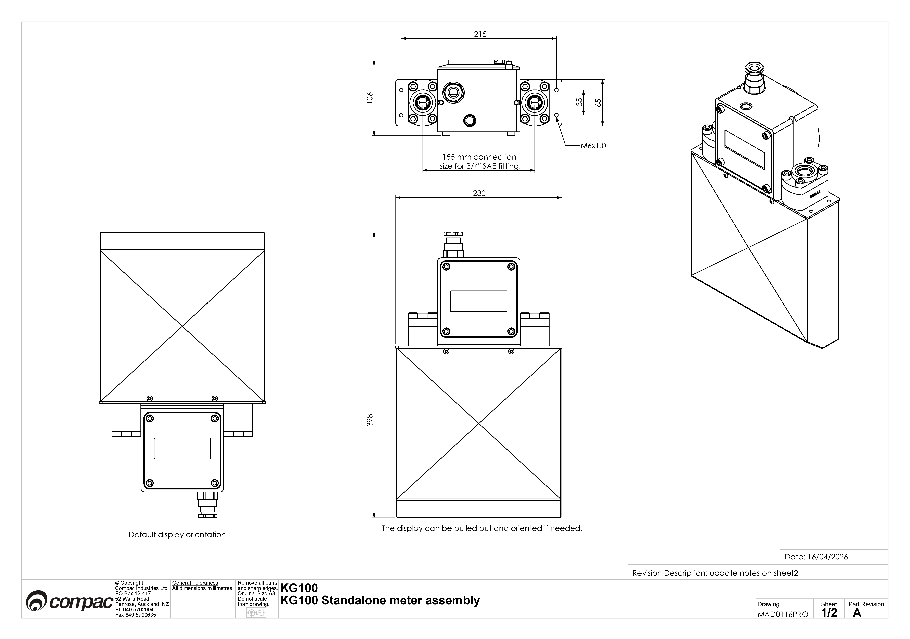

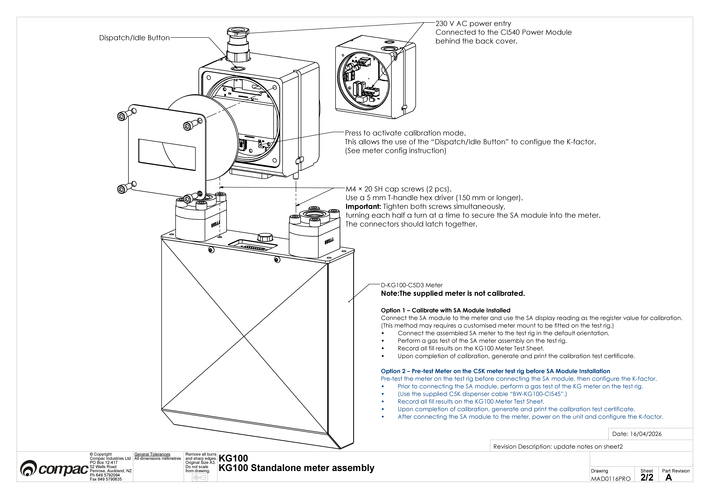

# 5.0 Connecting the KG100PSD to the KG100 Meter 

Assemble the Standalone Meter Power Supply on the Meter as per the MAD116PRO drawings in section 4  

# 6.0 Installation & Safety Data for the KG100PSD

Reference document: AP420:Rev A:30-APR-2-26
This document is also available for download from the Compac website www.compac.co.nz

# 6.1 Area of use

**Class I Zone 1 Group IIA T4 IP65** 

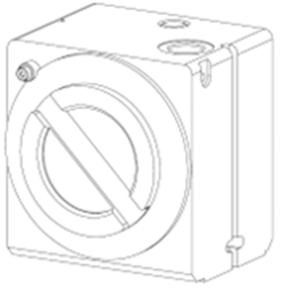

- This power supply and display is suitable for use in Class I Zone 1 hazardous locations and provides outputs suitable for Class I Zone 1 hazardous locations.  
- The group classification is Group IIA. This includes suitability for propane, petrol, methane, ethanol, etc. 
- The surface temperature classification is T4 - maximum surface temperature of 135°C. 
- The ambient operating temperature range is  40°C to +70°C 
- The operating atmospheric pressure range is 60 kPa to 110 kPa (approximate altitude <4500m) 
- With the use of an appropriate gland, and when mounted with a KG100 Meter (with CI545) this enclosure provides a degree of protection of IP65. 
- Maximum voltage Um: 250 V (this is a safety limit – not an operating rating). Um applies to non‑intrinsically safe circuits, specifically the Mains input (J100), 12 VDC input (J101), and RS485 interface (J300). It does not apply to intrinsically safe circuits or connectors. 

# 6.2 Cable entries

There is only one cable/conduit entry which is at the bottom of the box. The cable/conduit entry is an M20x1.5mm thread with thread depth of 20mm. 

Cable glands and connected cables shall be suitable for a minimum service temperature of 80°C 

If a thread adapter is necessary, use only an appropriately certified adapter. 

# 6.3 Certification

The KG100PSD is in compliance with: 

**IEC Standards:** 
- IEC 60079-0 ed 7.0 (2017) 
- IEC 60079-1 ed 7.0 (2014) 
- IEC 60079-11 ed 7.0 (2023) 

**EN Standards** 
- EN IEC 60079-0:2018 
- EN 60079-1:2014 
- EN IEC 60079-11:2024 

The KG100PSD has IECEx and ATEX certification. The label shown will be attached to the display fascia. 

This equipment has been constructed in accordance with the safety requirements of relevant industrial standards. 

# 6.4 Opening the flameproof box lid
- Always disconnect power (isolate all circuits). 
- Remove the lid using a hook spanner. 

# Closing the flameproof box lid

- Ensure the o-ring is sitting correctly in the o-ring groove of the lid. 
- Ensure the threaded surfaces are clean, free of debris, and undamaged. 
- Align the lid with the enclosure threads carefully to avoid cross-threading. 
- Rotate the lid clockwise by hand until resistance is felt. 
- Use hook spanner for final tightening and tighten until the lid is fully seated against the enclosure body. 

# 6.5 Calibration

The display cover is secured with four M4 screws. Each screw has a hole in its head for threading a sealing wire, which prevents tampering after calibration. 

To adjust calibration: 
- If present, remove the sealing wire and then unscrew the four M4 screws securing the display lid. 
- Remove the display lid along with the glass window and O-ring to access switch SW200. 
- Press switch SW200. The CAL indicator will illuminate, confirming that calibration mode is active. 
- Use the external button on the top or bottom of the power supply enclosure to adjust the calibration. 
- When reinstalling the display lid, make sure its orientation aligns with the display. 

# 6.6 Display Orientation

This meter supports two power supply positions: beneath the meter or on top. For gas measurements, the power supply is typically at the bottom. To accommodate both configurations, the display can be rotated 180°. 

Steps to rotate the display: 
- If present, remove the sealing wire and then unscrew the four M4 screws securing the display lid. 
- Remove the display lid along with the glass window and O-ring. 
- Unscrew the four screws securing the display PCB (CI543). 
- Lift the top board disconnecting the connector linking the top and bottom boards. 
- Rotate the top board 180°, and reinstall it, ensuring the connector pins align correctly. 
- Note: The display window is offset within the lid. When reinstalling, make sure the opening aligns with the display. If the display is rotated, the lid must also be rotated 180° to match.

# 6.7 Installation

- Ensure that any limitations specified on the relevant certificates for the certified glands or adapters used in the assembly, are observed. 
- Use appropriately rated glands and adapters if the IP65 rating of the equipment is to be maintained. 
- Connect the power supply to only one input: 
- J100 for a mains supply (100–240 VAC, 50/60 Hz, 2 A), or 
- J101 for a 12 VDC supply (0.5 A). 

Do not use both inputs simultaneously.

# 6.8 Earthing

**Earthing with Mains Input** 
When the mains input is being used, the main incoming earth should be connected to the internal earthing facility. The earth lead must have a cross-sectional area at least equal to the largest live conductor. 

**Earthing with 12Vdc Input** 

When the 12Vdc input is being used the enclosure still needs to be earthed. This can be done in several ways: 
- It is recommended to run a separate protective earth wire in the cable and connect this to the internal earthing facility, or 
- Connect an external earth to the external earthing facility on the enclosure, or  
- Use the -ve wire of the 12V supply as the protective earth wire but then ensure it is suitably bonded to earth at the source and connected to the internal earthing facility. 

**External Earth Facility** 

The external earthing facility is suitable for a lug with up to a 4-mm2 conductor. The main earth connection is to be made using the internal, external, or both earthing facilities. The connection to the external earthing facility is to be made using a brass or zinc-plated steel washer on each side of the lug and a brass or zinc-plated steel M5 x 8 mm screw to fix it to the flameproof box. 

If there is a requirement for electrical bonding, then the external earthing facility can be used. The earth lead must have a cross-sectional area at least equal to the largest live conductor

# 6.9 Terminal wiring

- All wiring must be carried out in accordance with the relevant code of practice and/or instructions e.g., IEC 60079-14 or EN 60079-14 
- All mains wiring must have a cross-sectional area of 0.5 to 4 mm2. 
- The voltages shown on the label must not be exceeded. 
- The wiring used should be suitable for 80°C. 
- The wiring insulation must extend to within 1 mm of the metal face of the terminal. 
- All wiring must be suitably insulated for the maximum voltage. 
- Not more than one single or multi-stranded conductor shall be connected into each terminal unless the conductors have been pre-joined in an appropriate manner (e.g., with an insulated crimped bootlace ferrule) 

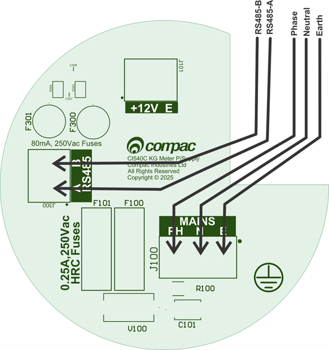

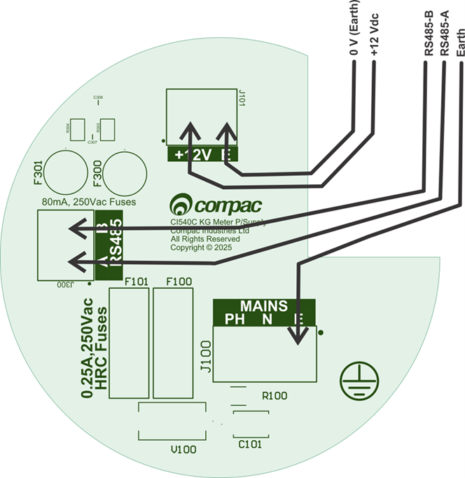

# 6.10 Connection of Mains or 12V and RS485 cables

 

# Mains Supply (J100)

Note: Connect either the mains supply or the 12 Vdc supply. Although both may be connected simultaneously without causing damage, this is not recommended. 

The input mains supply is rated for 100 to 240 Vac, 50/60Hz, 2A, OVC I/II/III 

The Mains supply must be supplied via an appropriately rated switch or circuit-breaker that is suitably located, easily reachable, and marked as the disconnecting device for this equipment. 

**Mains Fuses** 

There are two serviceable fuses: F100 & F101. Always replace these fuses with one of the fuses listed here. 

**F100 & F101** are 0.25 A, 250 Vac, 1500A breaking capacity fuses and must be replaced with one of the following. 
- Bel Fuse 5HT-250-R or 
- Little Fuse 0215.250MXP 
- OptiFuse TCD-250MA 

# 12V Supply (J101) 

Note: Connect either the mains supply or the 12 Vdc supply. Both may be connected simultaneously without causing damage, but this is not recommended. 

The input 12V supply is rated for 12Vdc±8%, 200mA, OVC I/II. The device includes protection against input voltages up to 80 V and reverse polarity; however, prolonged exposure to these conditions can lead to permanent damage. 

The 12V supply must be supplied via an appropriately rated switch or circuit-breaker that is suitably located, easily reachable, and marked as the disconnecting device for this equipment. 

# RS485 (J300)

The RS485 (MODBUS) is isolated from earth with 3kVac/1s isolation. It is suitable for OVC I/II/III circuit. Maximum baud rate is 38400. It is not terminated and should not need to be terminated unless the network is over 50m. 

The RS485 A/B circuit can be run in the same cable as the supply.  

The RS485 circuit shall be supplied through a suitably rated switch or circuit breaker that is mechanically ganged or otherwise interlocked with the primary supply switch or circuit breaker. Where ganging or interlocking is not feasible, both the RS485 and primary supply devices must be clearly labeled to indicate that both must be disconnected to isolate this equipment.

# 6.11 Internal Connection

There is a ribbon cable cemented into the internal wall of the enclosure. This cannot be replaced or repaired so do not damage this cable. All circuits in the ribbon cable are intrinsically safe circuits which power the display and intrinsically safe circuits on the D-Sub (J203) connector 

**The intrinsically safe equipment connected to the DSub15 connector**

This equipment is designed to have a KG100 meter with CI545 plugged onto the DSub15 connector. In future other meters may be able to connect to this equipment. 

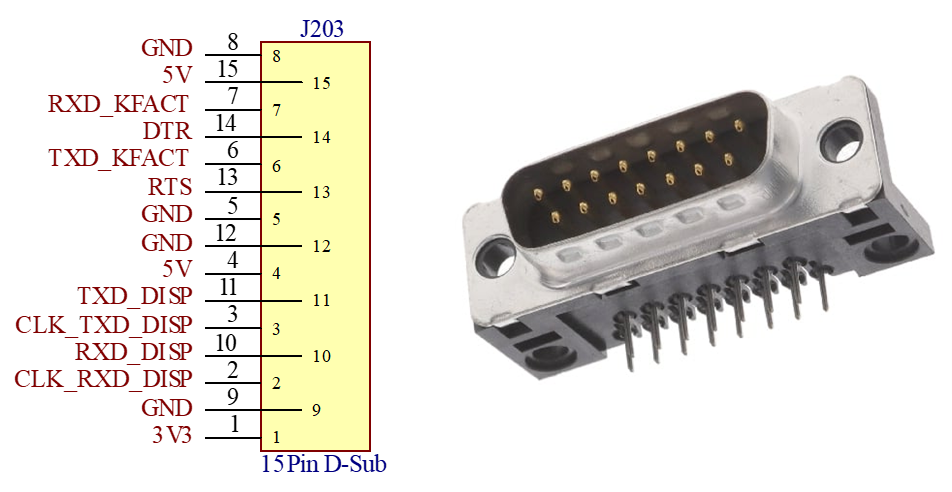

# 6.12 I.S. Output

The output of this equipment provides a single Intrinsically Safe circuit with connections to J203 which is a male D Sub15 connector. 
The output parameters for this intrinsically safe supply are shown below.

|KG100PSD I.S. Output pins Pin Nos|Associated Apparatus Parameters|Must be|Hazardous Area / Hazardous Locations Device Parameters|KG100 with CI545 Parameters|
|---|---|---|---|---|
|1 to 15|Uo = 6 V|	≤|	Ui|	  Ui = 6 V
|       |Io = 225 mA|	≤|	Ii| 	Ii = 235 mA
|       |Co = 220 µF|	≥|	Ci| 	Ci = 137 µF
|       |Lo = 50 µH | 	≥|	Li| 	Li  = 50 µH
|       |PO = 1 W   |	≤|	Pi| 	Pi = 1.1 W
|5, 8, 9, & 15|Earth| |Common Earth 

**Conditions of use pertaining to the certification of this equipment** 
1.	The flame paths are not intended to be repaired. 
2.	Only cable glands and thread adapters which have been separately certified to IEC 60079-0 and IEC 60079-1 shall be used.  
3.	The 12V DC input shall only be connected to a circuit with overvoltage category (OVC) II or lower. 
4.	The intrinsically safe output circuits are bonded to the metallic enclosure, and this must be taken into account when interconnecting in the system. 

# 3.0 Operation

# 3.1 Zeroing the Meter

The KG100 Meter must be zeroed before the stat of every fill.
This is done remotely by the PLC using MODBUS (Compac to provide full details of the Register to use later) 

The Meter has two modes
- Zeroing Mode
- Normal Mode

You can see which mode the Meter is in by viewing the Display 

The top line will display either 
0 = The Meter is zeroing 
kg/min = The Meter is in normal mode

# 7.0 Calibration

There are two Calibration methods

# 7.1 Calibration Method 1

**Method 1 – Calibrate with SA (Standalone) Module Installed **

Connect the SA module to the meter and use the SA display reading as the register value for calibration. 

(This method may require a customised meter mount to be fitted on the test rig.) 

- Connect the assembled SA meter to the test rig in the default orientation. 
- Perform a gas test of the SA meter assembly on the test rig. 
- Record all fill results on the KG100 Meter Test Sheet. 
- Upon completion of calibration, generate and print the calibration test certificate. 

# 7.2 Calibration Method 2

**Method 2 – Pre-test Meter on the C5K meter test rig before SA (Standalone) Module Installation** 

Pre-test the meter on the test rig before connecting the SA module, then configure the K-factor. 

- Prior to connecting the SA module, perform a gas test of the KG meter on the test rig. 
- (Use the supplied C5K dispenser cable “BW-KG100-CI545”.) 
- Record all fill results on the KG100 Meter Test Sheet. 
- Upon completion of calibration, generate and print the calibration test certificate. 
- After connecting the SA module to the meter, power on the unit and configure the K-factor. 

# 7.3 Changing the K-factor of the KG100 Standalone Meter

- The lid of the Display Enclosure has provision for a tamper-proof wire seal
- To change the K-Factor, it is necesary to first cut the Calibration seal wire 
- Remove the Display enclosure lid
- Press the Dispatch/Idle button on the PCB. 
- The first digit will flash
- Hold the button down while the first digit scrolls though. Release when the correct number appears 
- Allow to reset
- Hold the Dispatch/Idle button down to move to the next digit.

Repeat the above until the K-Factor is set correctly

**NOTE** You can verify the K-Factor in the Meter by momentarily pressing the Dispatch/Idle button. 
The K-Factor will be displayed.
Check the K-Factor and allow the Display to reset

# 8.0 MODBUS Registers

**Electrical interface** 

Communication is via 5V TTL RS485.  

**Communication protocol** 

The communication protocol is standard Modbus RTU with the following packet structure:  

|Start|Address|Function|Data|CRC|End| 
|---|---|---|---|---|---|
|>3.5 char|8 bits|8 bits|N * 8 bits|16 bits|>3.5 char| 

**Common Modbus registers** 

Table 1 below contains commonly used registers when integrating the KG100 Meter (Integrable Meter) into a dispenser/controller system.  The complete list of registers is available upon request.

Register|Type|Access|Designation 
-------|-----|-----|-----
0001|U16|RO|Processor Software Major 
0002|U16|RO|Processor Software Minor 
0003|U16|RO|Processor Software day | Software month 
0004|U16|RO|Processor Software year|
0005|U16|R/W|Modbus address 
0006|U16|RO|Secondary Processor Software Major 
0007|U16|RO|Secondary Processor Software Minor 
0008-0009|U16|RO|Unique ID 
0010|U16|RO|Runtime seconds 
0065|INT16|R/W|wStatus 
0066|INT16|RO|rStatus 
0070-0071|FLOAT|RO|VOL_FLOW 
0072-0073|FLOAT|RO|VOL_BATCH 
0074|U16|RO|Density 
0075|U16|RO|TEMPERATURE 
0076|U16|RO|cSTATUS 
0080-0081|FLOAT|RO|KG_FLOW 
0082-0083|FLOAT|RO|KG_BATCH 
0084|U16|RO|cDensity 
0085|INT16|RO|cTemperature
0129|U16|R/W|Pair ID 1 
0130|U16|R/W|Pair ID 2 
0132|U16|R/W|REQ Address 
0136|U32|R/W|K Factor (flow calibration factor) 
0138|INT16|R/W|Density offset 
0139|INT16|R/W|Temperature offset 
0142|U16|R/O|OWID EXT A 
0143|U16|R/O|OWID EXT B 
0144|U16|R/O|OWID EXT C 
0145|U16|R/O|OWID EXT D 
0146|U16|R/O|OWID INT A 
0147|U16|R/O|OWID INT B 
0148|U16|R/O|OWID INT C 
0149|U16|R/O|OWID INT D 
0176|FLOAT|R/W|Flow cutoff 

**Table 1 - Commonly used meter registers** 

Further registers to be added later including the register to zero the Meter

# 9.0 IECEx Approval Certificate of Conformity

IECEx ExTC 26.0002X 
Issue No. 0
Date of issue: 6 May 2026
This document is also available for download from the Compac website www.compac.co.nz

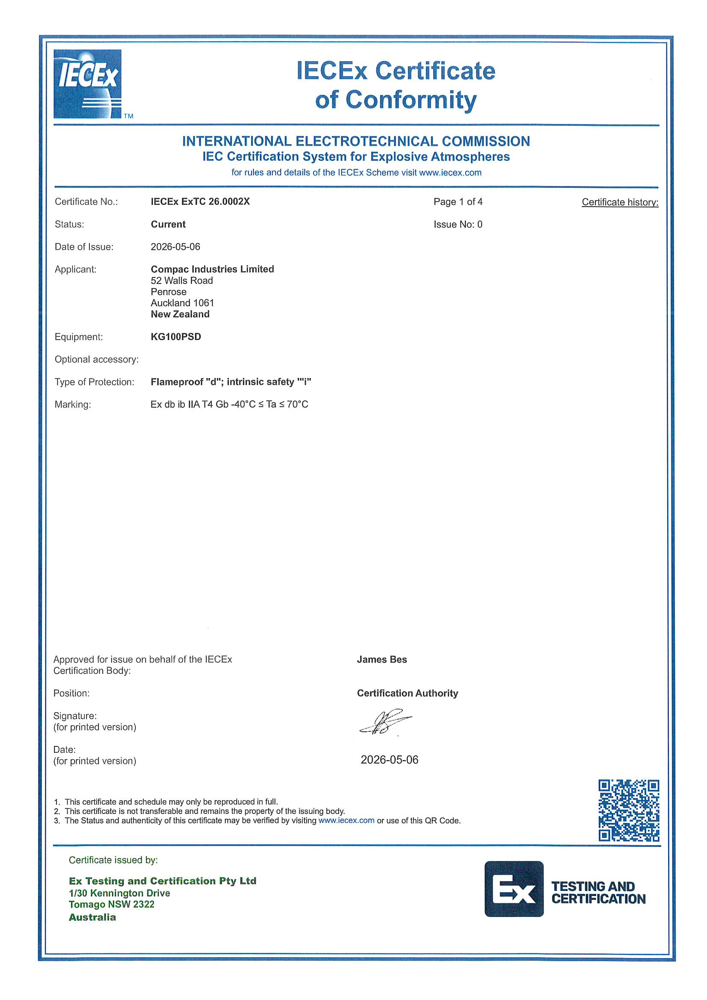

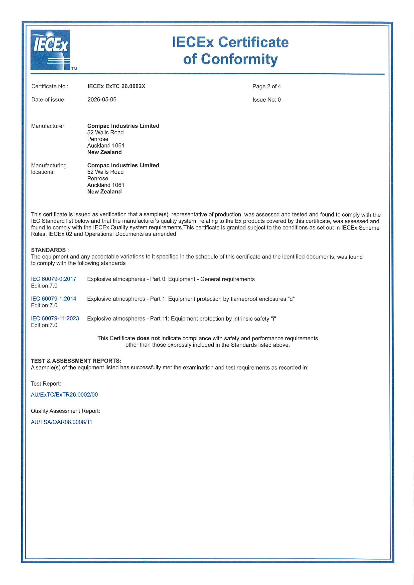

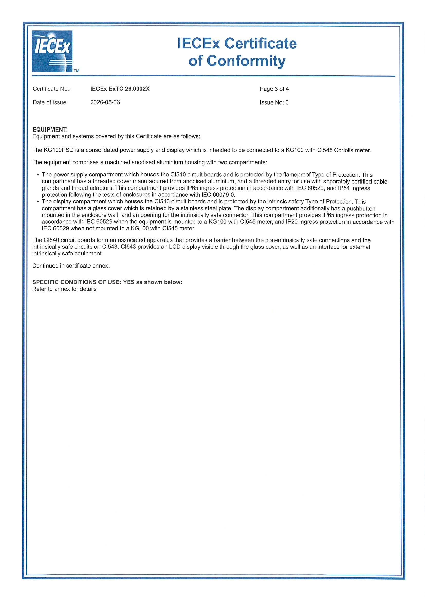

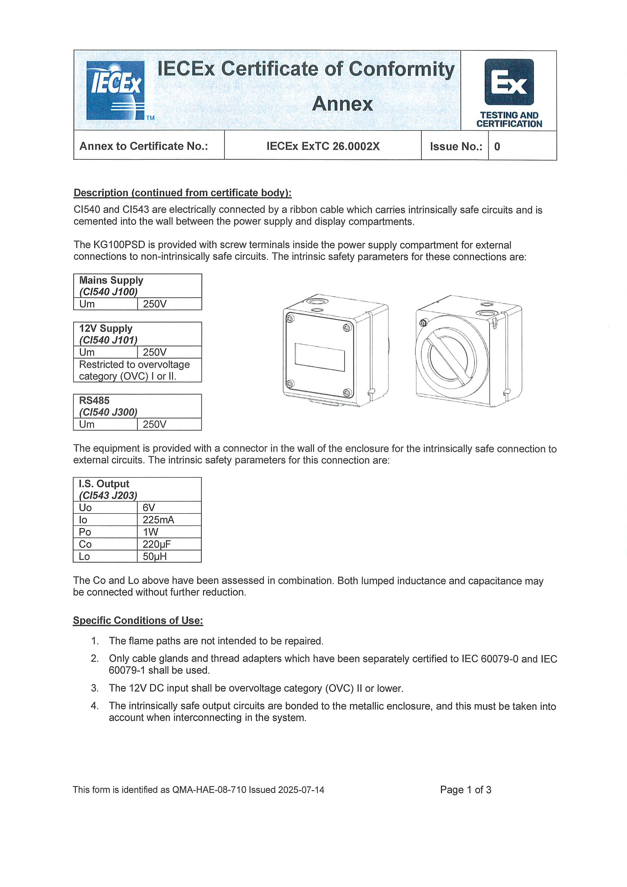

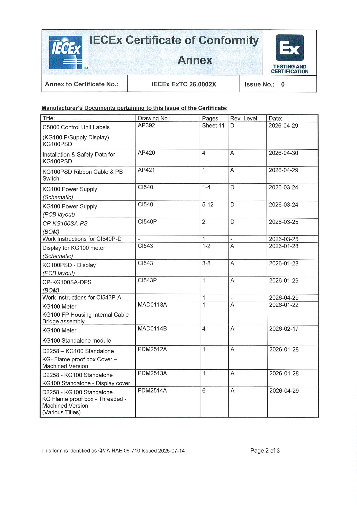

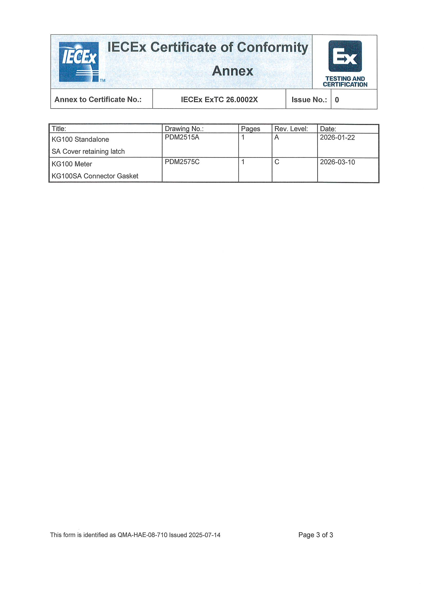

