

# Installation Manual for the Compac Ultra MR800S Dispenser

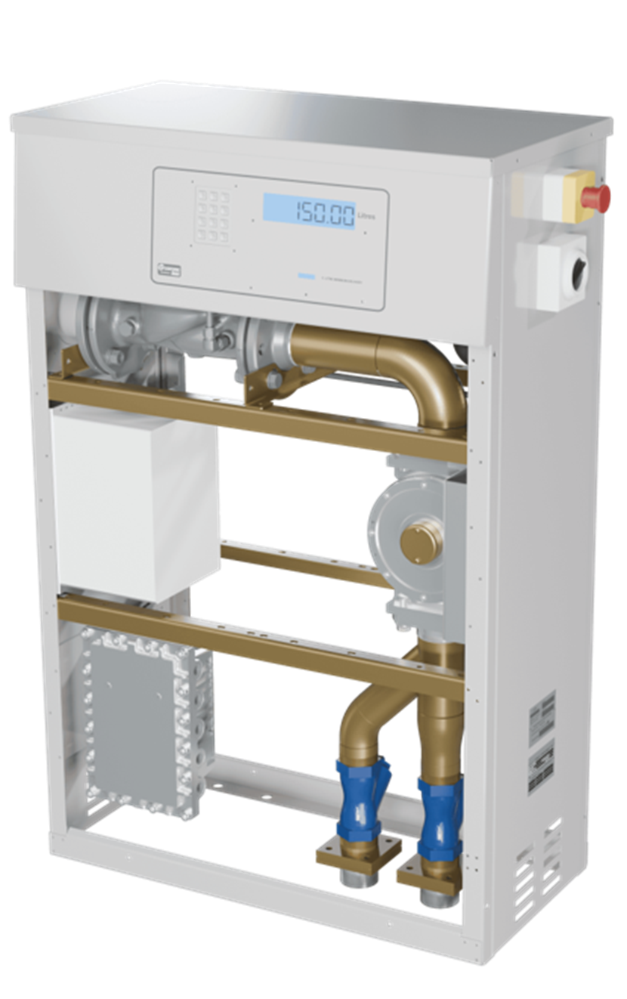

Updated 21 July, 2026

**Conditions of Use**

- Please read this manual completely before working on, or making adjustments to Compac equipment 
- Compac Industries Limited accepts no liability for personal injury or property damage resulting from working on or adjusting the equipment incorrectly or without authorization.  
- Along with any warnings, instructions, and procedures in this manual, you should also observe any other common sense procedures that are generally applicable to equipment of this type. 
- Failure to comply with any warnings, instructions, procedures, or any other common sense procedures may result in injury, equipment damage, property damage, or poor performance of the Compac equipment 
- The major hazard involved with operating the Compac C5000 processor is electrical shock. This hazard can be avoided if you adhere to the procedures in this manual and exercise all due care. 
- Compac Industries Limited accepts no liability for direct, indirect, incidental, special, or consequential damages resulting from failure to follow any warnings, instructions, and procedures in this manual, or any other common sense procedures generally applicable to equipment of this type. The foregoing limitation extends to damages to person or property caused by the Compac C5000 processor, or damages resulting from the inability to use the Compac C5000 processor, including loss of profits, loss of products, loss of power supply, the cost of arranging an alternative power supply, and loss of time, whether incurred by the user or their employees, the installer, the commissioner, a service technician, or any third party.  
- Compac Industries Limited reserves the right to change the specifications of its products or the information in this manual without necessarily notifying its users. 
- Variations in installation and operating conditions may affect the Compac C5000 processor's performance. Compac Industries Limited has no control over each installation's unique operating environment. Hence, Compac Industries Limited makes no representations or warranties concerning the performance of the Compac C5000 processor under the actual operating conditions prevailing at the installation. A technical expert of your choosing should validate all operating parameters for each application. 
- Compac Industries Limited has made every effort to explain all servicing procedures, warnings, and safety precautions as clearly and completely as possible. However, due to the range of operating environments, it is not possible to anticipate every issue that may arise. This manual is intended to provide general guidance. For specific guidance and technical support, contact your authorised Compac supplier, using the contact details in the Product Identification section.
- Only parts supplied by or approved by Compac may be used and no unauthorised modifications to the hardware of software may be made. The use of non-approved parts or modifications will void all warranties and approvals. The use of non-approved parts or modifications may also constitute a safety hazard.
- Information in this manual shall not be deemed a warranty, representation, or guarantee. For warranty provisions applicable to the Compac C5000 processor, please refer to the warranty provided by the supplier.
- Unless otherwise noted, references to brand names, product names, or trademarks constitute the intellectual property of the owner thereof. Subject to your right to use the Compac C5000 processor, Compac does not convey any right, title, or interest in its intellectual property, including and without limitation, its patents, copyrights, and know-how. 
- Every effort has been made to ensure the accuracy of this document. However, it may contain technical inaccuracies or typographical errors. Compac Industries Limited assumes no responsibility for and disclaims all liability of such inaccuracies, errors, or omissions in this publication.

**Models covered**

This manual is specifically for the Compac MR800S Ultra Dispenser and should not be used for any other model

**Validity**

Compac Industries Limited reserves the right to revise or change product specifications at any time. 
This publication describes the state of the product at the time of publication and may not reflect the product at all times in the past or in the future.

**Manufactured by:** 
Compac Laser and Master Dispensers are designed and manufactured by Compac Industries Limited 
52 Walls Road, Penrose, Auckland 1061, New Zealand 
P.O. Box 12-417, Penrose, Auckland 1641, New Zealand 
Phone: + 64 9 579 2094 
Fax: + 64 9 579 0635 
Email: techsupport@compac.co.nz 
www.compac.co.nz 
Copyright ©2015 Compac Industries Limited, All Rights Reserved
 
 

# Table of Contents

[**1.0 Product Identification**](#10-product-identification)

[**2.0 Footprint**](#20-footprint)

[**3.0 Installation**](#30-installation)

[3.1 Static Electricity Precautions](#31-static-electricity-precautions)

[3.2 Pre-installation Check](#32-pre-installation-check)

[3.3 Procedures](#33-procedures)

[3.4 Dispensing Hoses and Nozzles](#34-dispensing-hoses-and-nozzles)

[3.5 Breakaways](#35-breakaways)

[**4.0 Wiring**](#40-wiring)

[4.1 Incoming Mains](#41-incoming-mains)

[4.2 Comms connections](#42-comms-connections)

[4.3 K-Factor Board](#43-k-factor-board)

[4.4 Terminal Board connections](#44-terminal-board-connections)

[**5.0 Setting up the C5000 in the MR800S**](#50-setting-up-the-c5000-in-the-mr800s)

[**5.1 K-Factor settings**](#51-k-factor-settings) 

[5.1.1 Changing the K factor F](#511-changing-the-k-factor-f)

[5.1.2 Changing the Solenoid Delay](#512-changing-the-solenoid-delay)

[**5.2 Parameter Switch Settings**](#52-parameter-switch-settings)

[5.2.1 Changing the Pump Number](#521-changing-the-pump-number)

[5.2.2 Changing the Price](#522-changing-the-price)

[5.2.3 Standalone Mode](#523-standalone-mode)

[**6.0 Notes**](#60-notes)

[6.1 Pump Controller](#61-pump-controller)

[6.2 Spare Fuses](#62-spare-fuses)

[6.3 Precautions if Using Generator Power](#63-precautions-if-using-generator-power)

[**7.0 Error Messages**](#70-error-messages)

[**8.0 End of Sale indicators**](#80-end-of-sale-indicators)

[**9.0 C5000 Modulated Valve Details**](#90-c5000-modulated-valve-details)

[9.1 Core-functionality](#91-core-functionality)

[9.2 C5000 Terminal board mapping](#92-c5000-terminal-board-mapping)

[9.3 Solenoid truth table](#93-solenoid-truth-table)

[9.4 Flow State table](#94-flow-state-table)

[9.5 Ideal vs real flow rate graph](#95-ideal-vs-real-flow-rate-graph)

[9.6 Modulated valve configurable settings](#96-modulated-valve-configurable-settings)

[9.7 Pinpad Settings Navigation](#97-pinpad-settings-navigation)

[9.8 Tuning to correctly hit a preset amount](#98-tuning-to-correctly-hit-a-preset-amount)

[9.9 Advanced settings](#99-advanced-settings)

[**10.0 Troubleshooting**](#100-troubleshooting)

[10.1 Modulated Valve](#101-modulated-valve)

[**11.0 Software versions**](#110-software-versions)

# 1.0 Product Identification

Ensure you are using the correct installation instructions and footprint drawing before commencing site work or installation. 
The identification plate is fastened to the bottom of the right-hand side panel when facing the front of the dispenser. 
The model number is on the first line of the identification plate. 

Understanding the model number:
The model number for dispensers is split into: Chassis style, hose configuration, pump or dispenser and specific application.
Use the table below to help identify the unit.

The same format applies to both Laser and Master models
The following example is for the Master Pump or Dispenser

|Style|L/min oer hose|Pump style|Options
|-----|-----|-----|-----|
MR=single hose|MR40 = one hose @ 40l/min|P = Pump|Blank = standard|
MMR=multi hose|MMR40=two hoses @ 40 l/min|S = Dispenser|Avi = Aviation|
| |MMR80-40 = side A 80 lpm, side B = 40 lpm||Marine = Marine|

For example: **MMR 80-40S Marine** is a two-hose unit. 
Hose side A is 80 l/min, side B is 40 l/min with external pumps. 
As a marine model, it has stainless steel pipework and stainless-steel chassis for marine conditions.

# 2.0 Footprint

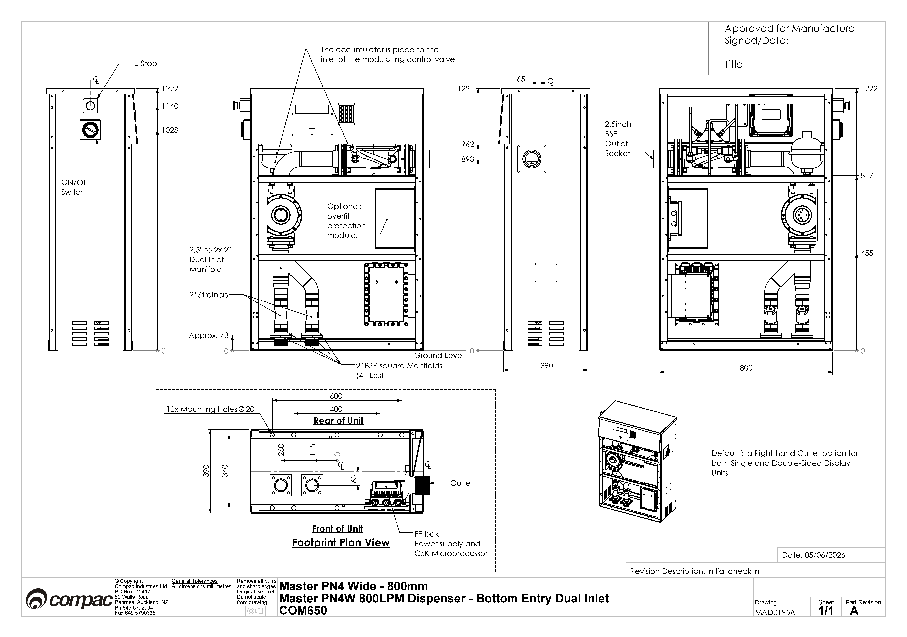

# 3.0 Installation

# 3.1 Static Electricity Precautions
Electronic components used are sensitive to static. Please take anti-static precautions.
An anti-static wrist strap should be worn and connected correctly when working on any electronic equipment. If an anti-static wrist strap is unavailable, or in an emergency, hold onto an earthed part of the pump/dispenser frame whilst working on the equipment. This is not a recommended alternative to wearing an anti-static wrist strap. 

**NOTE:** Compac Industries Limited reserves the right to refuse to accept any circuit boards returned, if proper anti-static precautions have not been taken.

# 3.2 Pre-installation Check
Once the pump is received on site, check that no damage has occurred while in transit – in particular, damage to electronics due to vibration or jarring. 
All terminals and plugs should be checked, including IC chips, to ensure they are securely in place.

# 3.3 Procedures
Installation should be in accordance with local regulations. 
The dispensing equipment shall be installed to prevent the delivery hose from contacting the ground when not in use. 
Where local regulations require a sump to be fitted: 
a.	Sumps must be provided at all dispenser installations with secondary containment pipework and at all new installations. 
b.	At all sites with sumps, dispensers must be installed with a liquid level detection device fitted in the sump that will raise an alarm if liquid is detected in the base of the sump. 
c.	All Compac Master dispensers at automotive sites must have a safe break device installed in the delivery hose. 
d.	External pump systems required to have an automatic emergency shut-off device installed at the base of each dispenser and it must be activated if the dispenser is knocked over or pulled from its mount. 

# 3.4 Dispensing Hoses and Nozzles

The unit may or may not be supplied with dispensing hose and nozzle assemblies.  
If customer supplied hose assemblies, pylons, reels, safe breaks and nozzles are used they must comply with the requirements outlined in AS/NZS 2229. 
All dispenser nozzles must trip shut when returned to the nozzle holder. 

# 3.5 Breakaways

For all dispensers fitted with breakaways, ensure the breakaway is installed between the nozzle and the high-mast or pylon (if fitted). 
Any breakaways that have been subject to a break-away situation should be inspected and refitted or replaced in accordance with the original manufacturer’s instructions.

# 4.0 Wiring

The instructions below refer to basic installation wiring. 
Prior to pump installation ensure that there is at least a two-metre tail on both the incoming underground mains supply cable and
comms cable (if comms enabled). 
These cables are terminated at the C5000 power supply, which is housed in the flameproof enclosure located in the bottom of the pump, behind the door. 
Mains power wiring should be rated for a maximum current draw of 10 A rms at 220-240 V ac.
Refer to AS/NZS 60079.14 for appropriate cabling. 

**NOTE:** All cables entering the power supply must be glanded with certified 20mm flameproof
glands. 
**NOTE:** Output to submersible pump(s) is 230 V ac, 300 mA max. It is wired to the pump
contactor/relay at the switchboard and not directly to the pump. 
**NOTE:** Before any additional switch or replacement switch (e.g. remote nozzle or sump switch) is
connected to the K-Factor board (J11-J14 or JJ21-J24), the switch circuit must be tested to
ensure that with the two switch wires connected together there is at least 500Vac (700Vdc)
isolation between the switch and earth. 
**NOTE:** Comms cable is not intrinsically safe. 
**NOTE:** Pump comms connects to pump controller such as a ComfillV2, PT1 or 3rd Party Controller etc. (optional). 
When replacing the lid of the flameproof enclosure, ensure the sealing O ring is in place

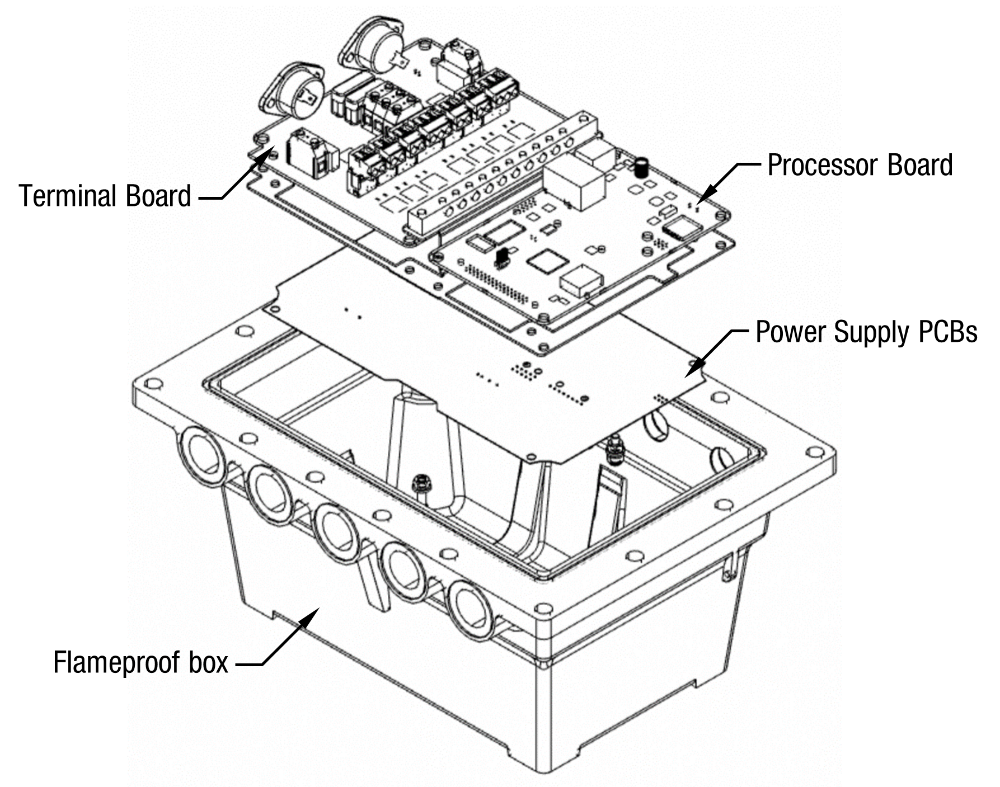

# 4.1 Incoming Mains
Incoming mains connections should be brought in to the terminal board. 
 
If an emergency stop button was ordered with the dispenser, it will be factory wired into the
terminal board, shown below. 
This will be in place of the normal loop between the triac and
main phases. 
If there is an Overfill Protection System (either Compac or Third Party), it should be wired as an Emergency Stop Switch would be between the Triac Phase and Mains Phase 
If there is both an Emergency Stop Switch and an Overfill Protection System, they should be wired in series so that either can interupt the Triac Phase in case of an emergency 

Wires have standard colours which are shown. In case these colours are unclear, they are as
follows: 
▪ Incoming mains phase: Brown 
▪ Incoming mains neutral: Blue 
▪ Incoming mains earth: Green/Yellow 

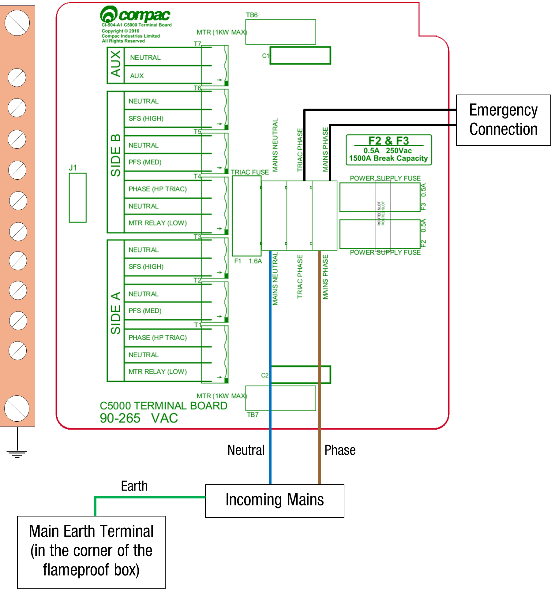

 

# 4.2 Comms connections
The comms I/O is controlled by the connections to the CI501 Comms board which is piggy backed on the Power Supply inside the flame-proof enclosure. 

Refer to the following diagram for connecting RS485, RS232, Compac or Gilbarco pumps. The shown switch should be set to the desired setting.  

**NOTE** Ensure that SW200 (Switch 1) is set the required protocol

 

Switches 300, 302, and 303 are for RS485/RS232 Terminator application.
Use the following table to configure these switches. Switch 300 is for channel 1, and switches 302 and 303 are for channel 2.

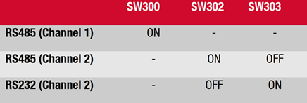

# 4.3 K-Factor Board

Both the Parameter switch and K-Factor switch are found on the K-Factor board. Meters and air switches are also connected to this board. See below for the location of these.

## K-Factor Settings
The settings that can be accessed from the K-Factor switch are shown below.
Not all of these will need to be changed during installation as default settings are installed during manufacture. 

| Setting               | Dscription          | Default  |
|-----------------------|---------------------|----------|
CA    |C pump settings side A | 0000003
qA    |Maximum flow rate side A |0800
F     |K Factor side A              |003.7000 (TCS meter 700-35SPA2DX with Compac encoder)
C     |Configuration code    | 	0000011 (Litres only display)
CC    |Comms      |   0011 (Compac) 0013 (Gilbarco)
dpA   |Decimal place side A         |0000
SdA   |Solenoid Delay side A |000
PCA   |Amount of liters in bypass mode |1.00
PrL   |Preset low side A |0.00
PrH   |Preset High Side A |0.00
n-A   |No flow timeout |120
GPiO  |GPIO Settings |0000
gPiO Pu |Gpio Settings |00000

# 4.4 Terminal Board connections

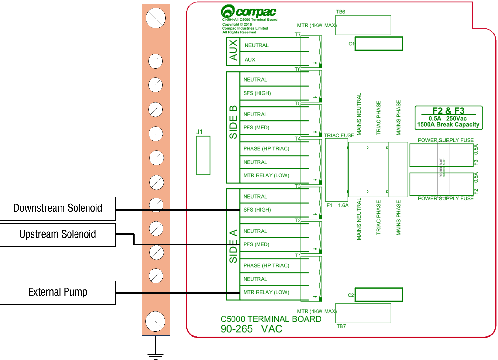

# 5.0 Setting up the C5000 in the MR800S

# 5.1 K-Factor settings 

# 5.1.1 Changing the K factor F

The K-Factor is used to calibrate product flow. It is a ratio of litres dispensed per revolution of the meter. The K-Factor may need to be calibrated after periods of time. 
To calibrate the pump, dispense fuel into a certified measuring container and compare the display value with the one dispensed.
Example:
The Display shows 10.00 litres but the True volume is actually 20.00 Litres

To calculate the correct K-Factor from the information above; firstly record the existing K-Factor and use this formula to calculate the new K Factor.

**New K Factor=Existing K Factor x (Dispensed Amount)/(Displayed Amount)**

=Existing K Factor x 20/10

=Existing K Factor x 2

See Using the Dispenser Menus to edit these settings. Use the procedure for both side A and B.

 

# 5.1.2 Changing the Solenoid Delay

This is the time delay from when the submersible pump starts to when the solenoids in the dispenser open to allow time for the leak detector to reset. 

This is factory set by Compac at 005 (five seconds). 

If problems are experienced with the leak detector tripping, firstly check that the solenoid delay is still set and then, if necessary, make it longer as follows. 

To change the solenoid delay, depress the K-Factor switch repeatedly until the following display is shown. To increment a digit, press and hold the parameter switch when the desired digit is flashing. Repeat this procedure for side B if applicable.

# 5.2 Parameter Switch Settings
The settings that can be accessed from the parameter switch are shown below. 
Not all of these will need to be changed during installation as default settings are installed during manufacture. 

|Setting             |Description       |Default              |
|--------------------|------------------|---------------------| 
PnA |Pump number |00
PA  |Price for Side A |01.000
bA  |B pump settings side A |1500
LFA |Low flow cut off side A |0.00
HFA |Hig FLow cut off side A |0000
HCA |Time at Low Flow |02
B   |B config setting |0000
dS  |Slave Display setting |0002
dC  |Custom Display |0000
nuCC|Modulated valve setting |0001
nu HFr|Target Flow Rate |800
dP  |Decimal place |0000
du  |  |0000

Further information regarding the **nuCC** setting 

**Factory default Valve Modulation settings** 

The MR800S has default PID Modulated Valve settings loaded at time of manufacture   
To reload these settings, For example, if they were changed using the advanced Valve settings function but you want to go back to the default settings: 
- Cycle through the parameters using the Parameter button.
- Set the nuCC parameter to 1xxx. 
**Note 1:** The value will not visibly change, but the unit will emit a long beep to confirm the action.  
**Note 2:** When the deaults are reloaded, the Target Fow rate **nu HFr** will be set to 500lpm to ensure that the dispenser will operate.  
You can then increase the Target FLow Rate in the Parameter Switch settings to find th optimumm flowrate that the Dispenser will operate at. Refer to to the troubleshooting sectin of this manual for more information on the Target Flow Rate setting  

# 5.2.1 Changing the Pump Number
If the parameter switch is continually depressed, the following menu to change the pump number will appear. 
Each side must be numbered between 1-99. Entering a pump number 0 will disable the pump.  
To change the pump number, depress the parameter switch repeatedly until the following display is shown. 
To increment a digit, press and hold the parameter switch when the desired digit is flashing. Repeat this procedure for side B if applicable.

# 5.2.2 Changing the Price
The price must be set before the dispenser can be used, otherwise an error will be returned. Set the price in dollars per litre. 

To change the price, depress the parameter switch repeatedly until the following display is shown. To increment a digit, press and hold the parameter switch when the desired digit is flashing. Repeat this procedure for side B if applicable.

# 5.2.3 Standalone Mode
In standalone operation, the dispenser will continue working when not connected to a controller. When in Standalone mode no authorisation of fills is required and so fills are simply initiated by removing the refuelling assembly from its holder. If standalone operation is inhibited, the dispenser will not work in standalone mode, regardless of whether the dispenser is ONLINE to a controller or not.   
The dispenser ceases to work in standalone mode if connected to a controller, regardless of the position of standalone setting.   
Generally, on retail forecourts the dispenser should be set-up for standalone operation.  Hence, if the forecourt controller breaks down the dispensers can be set to work in standalone mode simply by turning them off then on again.   
For unattended refuelling sites, the dispensers should not be able to work in standalone mode in the event of a controller failure. Therefore, the dispenser should be set-up to inhibit standalone operation.   
This is set in the b code on the K factor switch. The bA code to run Standalone without Dispenser Controller is 1000.  The bA code to inhibit Standalone is 0000.

# 6.0 Notes

# 6.1 Pump Controller
If the MR800S Dispenser is connected to a controller, check that pump data and transaction information is being correctly uploaded to it. 
Refer to the controller manual for specific instructions regarding connection and setup.

# 6.2 Spare Fuses
In the event of a fuse blowing on the C5000 Power supply a bag of 3 is included in each flameproof box. Any fuses used from this bag should be replaced. 
NOTE: There are three different ratings used. If replacing a fuse, ensure that the correct value is used. 

# 6.3 Precautions if Using Generator Power
The power output from onsite generators can cause power spikes that may damage electrical components within the cabinet. When connecting to sites powered by generators, please take the following precautions:
1.	Install a power conditioner. Although generators are fitted with power regulators, most are not filtered sufficiently for powering sensitive electrical components. We recommend installing a commercial power conditioner and/or UPS between the generator and the unit.
2.	Before starting a generator, make sure the power to the unit is turned off. Start the generator, let the generator reach stable operating speed and wait 30 seconds before reconnecting the power to the unit.
3.	For units where the generator starts and stops on demand, install a delay timer or PLC to automatically isolate the unit until the operating speed and consistent power output is achieved.
4.	Isolate the unit before shutting down the generator.

# 7.0 Error Messages

These are all the Error codes available in the C5000 for liquid fuels (does not include CNG specific errors). 
Some are product specific so will not be found in all applications.

|Error Code      | Fuel specific | Possible causes                                | Suggested action  
-----------------| --------------| -----------------------------------------------| ---------------- 
**Er 3   Err 3**   |No             |Price not set in the Dispenser   Pump number not set in the Dispenser                 |1. If the Dispenser is connected to a Site Controller, the price on the Dispenser should be set to 0.00 and the pricing should be sent from the Controller   2. If the Dispenser is not connected to a Site Controler (ie. it is operating in standalone mode), then the price must be set in the Dispenser.   Set the hose number in the dispenser
**Er 8   Err 8**   |No             |Excessive reverse flow                          |Check that product is not flowing back into the tank once the delivery has finished. This can occur if the non-return valves on site are leaking
**Er 9   Err 9**   |No             |The Flow Meter is in an illegal state           |Re-power the Dispenser   Check Meter cable for loose wires or bad connections   Replace the Meter or the Encoder board on the Meter   
**Err91**           |No             |Meter sequence error                            |If 3rd party Meter, check the wiring
**Er 10   Err 10** |No             |Memory Error. Configuration data lost or corrupted|Re-configure Dispenser. If problem persists, replace Memory or Processor Board             
**Er 12   Err 12** |No             |Display error                                   |Replace Display
**Err 13**          |No             |Slave board has restarted                       |Power or Hardware failure
**Err 14**          |No             |K Factor board offline                          |Check the Bus Connections and C5K Power Supply
**Err 15**          |No             |K Factor board has restarted                    |Power or Hardware failure
**Err 16**          |No             |K Factor board is not talking to the LCD Display|Check wiring   Replace the K factor board or LCD Display       
**Err 31**          |No             |Transaction has ended but fuel is still flowing |The Solenoid is leaking. Repair or replace solenoid
**Er 41   Err 41** |No             | Pump not communicating with Controller          |1. If only one pump on the site is not communicating with the Controller, then the fault is likely to be in the pump.   a. Check the comms wire connection on the comms board   b. Check the diagnostic LEDs on the comms board in the Dispenser to diagnose cause   c. Check the configuration and setup in the Dispenser   2. If all pumps are not communicating, check the comms wire connections on the comms board   a. Check comms cables between the Dispenser and the Controller   b. check setup and operation of the Controller
**Er 50**           |NO               |Meter not communicating with Dispenser electronics|a. Check Meter connections   b. Check Dispenser configuration   c. Check that the Meter ID setup in the configuration matches the Meter ID
**Er 52**            | No             | Meter error | If the problem persists after repowering the unit, replace the meter.
**Er 53**            | LPG / Adblue / DEF / CNG |Meter stopped ibrating | Repower the unit. This error might display when the dispenser is powered up. In this case it is normal. If the problem persists, replace the meter
**Er 54**            | No           | Temperature sensor failure | Repower the unit. If the problem persists, replace the meter
**Er 61**            | LPG / Adblue / DEF / CNG | Error 61 happens because the Meter was not able to zero  This can be due to a leak in the line or crystals accumulated in the Meter.   Check for leaks / crystallization. Purge the line.   If that does not reset the Error 61, pull the Meter out and pour hot water on it to dissolve any crystals inside the Meter.   If the problem persists, replace the Meter.
**Er 62**            |LPG / Adblue / DEF / CNG | Meter could not reset the batch (Could not zero the transaction values when nozzle was lifted to start a new transaction)                                                                                                 | Try restarting the Meter. If the problem persists, Replace the meter.
**Er 71**            |LPG / Adblue / DEF | V50 meter is set but variant is not selected  | Configure Device to either AdBlue / DEF or LPG
**Abd**              |No             |Display offline / Display Fault | Check the connections to all displays.   Check the configuration of the  slave boards (If slave displays are connected) Check and/or replace the display
**hoLd**             |No             |There are two types of HOLD error. There is a “Soft” HOLD err or that resets after the unit is re-powered and a “Hard” HOLD error that does not reset after the unit is re-powered. Display may also show Error 14 on display     | Re-power the unit. Does the HOLD error reset?   If the HOLD error resets but the problem persists, then the SD card may be corrupt and require replacement. Refer to the SD replacement procedure document.   If the HOLD error did not reset, then there is a possible hardware fault in the Power Supply PCB / Processor PCB board / K factor PCB board / other PCB board or Bus cable.
**Calib c**          |No             | K-Factor data integrity failure, or the processor board has been replaced                       |  To reset, break the K factor switch seal and momentarily press
**Calib p**          |No             |The K-Factor board has been swapped/replaced   |  To reset, break the K factor switch seal and momentarily press
**Calib**            |No             |The unit needs calibration, usually due to a hardware change   | Check the K-Factor, temperature and density calibration
**Calib f**          |No             |K-Factor is not set or is 00.0000     | Calibrate the unit and set the K factor
**Air**              |No             |1. Air is in the system. 2. Density out of range 3. Coil amplitude too low while meter is operating, displayed until next sale is started | Make sure pump is running. Check tank and pipework for leaks. Purge system. Increase the Solenoid delay on the K-Factor switch
**Orun**             |No             |Preset amount Overrun – flow above preset  | Check that solenoid is closing. Increase the preset cutoff
**5ump**             |No             |Sump error – liquid detected in the sump   | Empty the sump. Check the dispenser for leaks. Check for water etc getting into the sump.
**Ga5**              |LPG            |For LPG, the density being returned from the meter is too low  | Calibrate meter density using the K-Factor switch
**ABDL**             |No             |Display LCD error | There is a problem with the K Factor Board talking to the LCD. Check cables, plugs etc. If problem persists, replace K Factor board / LCD Display
**Er FLO**           |No             |Excess Flow        | Maximum flow rate exceeded, Increase Maximum flow rate setting or restrict flow
**ErPrSt**           |No             |The preset entered is below the MMQ   | Enter a preset above (or equal to) the MMQ
**Er dEn**           |LPG            |Density or Temperature out of Range | Calibrate meter density using the K-Factor switch  Calibrate meter temperature using the K-Factor switch

# 8.0 End of Sale indicators
 
The purpose of the END OF SALE Indicator to give the reason why the last fill ended.

This is useful if it is not apparent why the last fill stopped

The EOS number will appear on the Dispenser Display at the end of the fill.  
If there is a PINPad keypad / Display fitted, an EOS error code will be displayed on it

Some END OF SALE Indicators are a result of a fault in the system.

Other END OF SALE Indicators are normal operation

Note: This is a complete list of all the available END OF SALE Indicators and covers all Compac products. 
Some END OF SALE Indicators are Product / Fuel type specific

|Keypad Display (if fitted)   | Dispenser Display  | Description                                                              |  
|-----------------------------|--------------------|--------------------------------------------------------------------------|
**NOZ**                          | 1                  | The nozzle was hung up This is normal operation                          
**PRESET**                       | 2                  | The fill ended when it reached the preset amount or quantity          
**DISP**                         | 3                  | Normal fill                                                              
**OFFLINE**                      | 4                  | Comms not connected between Dispenser and Controller. Check comms connections and setup in the Dispenser and Controller.
**MAX**                          | 5                  | The fill reached either the maximum dollars or litres amount allowed     
**AIR**                          | 6                  | Air was detected in the fuel so the air switch cut out. Check for air in the fuel.
**ERROR**                        | 7                  | There was an error with the encoder in the flow meter. Check the Flow Meter   
**SUMP**                         | 9                  | Sump switch cut out because there was either water or fuel in the sump   
**TO ATH**                       | 12                 | Pre-auth from the Controller or Payment Terminal timed out. The customer may have taken too long to start the fill after it was authorised
**POR**                          | 13                 | The unit was repowered 
**STP SW**                       | 14                 | The Stop Switch was activated 
**PRST ERR**                     | 15                 | An Invalid preset value was entered
|                             | 17                 | There is a Display offline 
|                             | 18                 | The Displays are not paired 
|                             | 30                 | Controller initiated stop 
**DENSITY**                      | 35                 | The Density was out of range 

# 9.0 C5000 Modulated Valve Details

# 9.1 Core-functionality

A Compac C5000 processor supports the control of up to 2 dual-solenoid driven diaphragm valves.

Flow control through the main valve is achieved through height regulation of the valves diaphragm. This is indirectly controlled through solenoid valves linked upstream and downstream of the valve. These solenoids can increase, decrease or lock the diaphragm height depending on their states to respectively increase, decrease or hold the flow rate through the main valve steady.
 
Figure 1 Control Valve Schematic

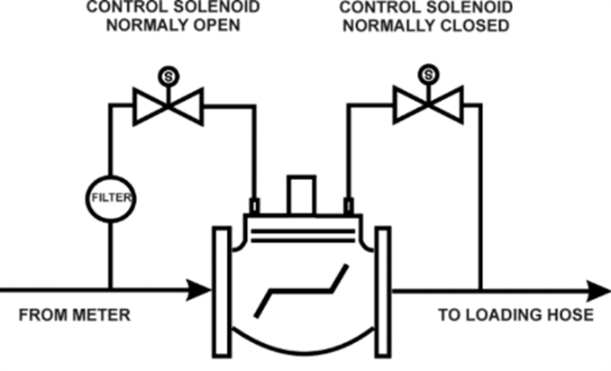

With solenoid valves configured as per figure 1 above, using a normally open solenoid upstream and a normally closed valve downstream, the valve will decrease flow when both solenoids are de-energized. This ensures a safe failure mode should power to the dispenser be lost during a fill. 

With the main valve shut, the 2 solenoid valves are also used as a bypass circuit for bypass flow (trickle flow) to carefully reach a desired preset cutoff volume. The flow rate of this circuit is dependent on the size of piping and the solenoid valve used but is approximately 3-6 liters per minute.

# 9.2 C5000 Terminal board mapping
 
Solenoids should be wired to the following terminals on the C5000 terminal board.  
The mapping of these terminals cannot be changed.

|Side A||Side B||
|------|-|------|-|
Terminal|	Controls|	Terminal|	Controls
T2|	Upstream solenoid|	T5|	Upstream solenoid
T3|	Downstream solenoid|	T6|	Downstream solenoid

# 9.3 Solenoid truth table

Using a normally open upstream solenoid and a normally closed downstream solenoid, the terminal-solenoid truth table is as follows.

|Terminal-Solenoid truth table| | | |
|-----------------------------|-|-|-|
Solenoid|	Polarity|	Terminal state|	Solenoid state
|Upstream |Normally open |HIGH |CLOSED
| | |LOW |OPEN
|Downstream|Normally closed|HIGH |OPEN
| | |LOW |CLOSED

# 9.4 Flow State table
 
Flow regulation through the valve using control of the solenoids is as follows.

|Flow state table | | | | |
|-----------------|-|-|-|-|
|Flow state	|Upstream solenoid terminal |Downstream solenoid terminal |Upstream solenoid-valve state |Downstream solenoid-valve state
|Increase flow |HIGH |HIGH |CLOSED |OPEN
|Decrease flow |LOW |LOW |OPEN |CLOSED
|Hold flow steady |HIGH |LOW |CLOSED |CLOSED
|Bypass (trickle flow) |LOW |HIGH |OPEN |OPEN

# 9.5 Ideal vs real flow rate graph

The system transitions through the following states during dispensing.

1. Ramp to high flow
2. Hold constant high flow
3. Ramp down to medium flow
4. Hold medium flow
5. Switch to the bypass circuit (trickle flow)

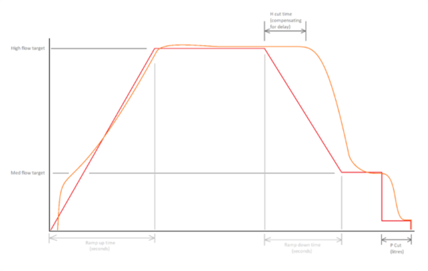

Figure 2 - Ideal vs real flow rate during dispensing

Figure 2 shows an exaggerated example of the flow rate profile for a typical fill (orange) compared to the desired flow rate profile generated inside the C5000 (red). An internal PID controller is used to follow the desired flow-rate profile which has configurable settings dependent on the valve type used. For control of valves not supported by Compac, these control settings may need to be changed to ensure the following error from the desired flow profile is kept to a minimum.

# 9.6 Modulated valve configurable settings

The following settings are applicable for setting up a modulated valve.  
Preset settings (change in pinpad or kfactor menu)
|Setting |Unit |Recommend value (recommended range) |Notes
|--------|-----|------------------------------------|-----
|H Cut |Seconds |4 (4-10) |*Treated as a unit of time rather than volume as is standard.
|P Cut |Litres |1.75 (1.5-3.5) |Remaining dispense volume before transitioning to the bypass (trickle flow) circuit

Valve settings (requires a pinpad to change)
|Setting |Unit |Recommend value (recommended range) |Notes
|--------|-----|------------------------------------|-----
|High flow rate target |Litres/min |400 (must be above medium)|	 
|Medium flow rate target |Litres/min |110 (90-120) | |	 
|Ramp up time |Seconds |8.00 (8.00-15.00) |	Ramp up time from no flow to the high flow rate target. increase for large valves|
|Ramp down time |Seconds |11.00 (10.00-15.00) |	Ramp down time from high flow to the medium flow rate target. *(warning, if setting is too low, the PID controller may struggle resulting in an undershoot of the medium flow rate target)*|
|kP |Unitless |90 (80-200) |Proportional gain. Increase if the system is slow to respond|
|kI |Unitless |60 (30-100) |Integral gain. Increase if the system is not being pulled to the target high or medium flow rate target)
|kD	|Unitless |60 (10-100) |Derivative gain. Increase to minimize undershooting/overshooting set point targets and dampen the system. May result in instability If a noisy flow meter is being used with little averaging.
|Minimum pulse width |Seconds |0.01 (0.01-0.1) |Minimum time a solenoid valve should be pulsed for
|PWM width |Seconds |1.4 (0.5-1.5) |PID update rate and the maximum time a solenoid valve will be turned on for. This is the rate at which the system re-evaluates the output drive/duty level.

# 9.7 Pinpad Settings Navigation

Valve settings accessed via the pinpad can be found under Hardware -> Next page -> Modulated valve “MOD VALV”.  
The first page shown features commonly changed flow parameters whereas the second page shows less-frequently changed settings for the internal PID controller.

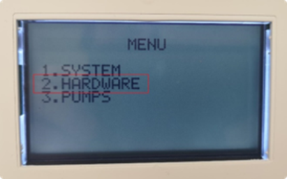

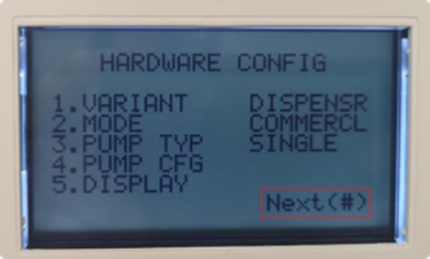

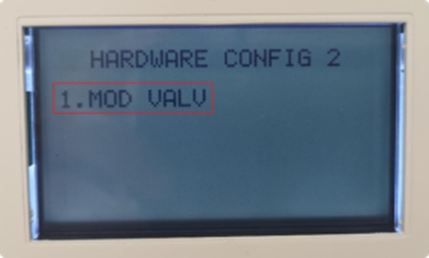

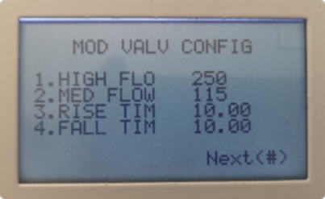 

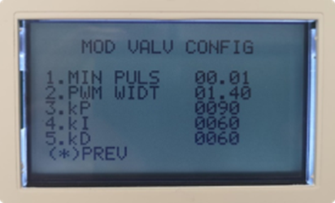

# 9.8 Tuning to correctly hit a preset amount
 
The following settings are recommended to be tuned from their defaults during the commissioning process to correctly hit the preset and to minimize the time spent flowing through the bypass (trickle flow) circuit.

- H Cut  

This is treated as a unit of time to account for lag in the system due to nonlinearities in controlling a diaphragm valve. 
For a 2” valve flowing at approximately 400LPM it can take many seconds before the valve starts to respond to a solenoid input.  
It is recommended that this setting be increased until stable flow rate at the medium flow rate target occurs for a few seconds before switching over to the bypass (trickle flow) circuit.

- P Cut  

This is the remaining dispensing volume before the system switches over to the bypass (trickle flow) circuit. 
Once met, the valve will shut leaving the bypass circuit open. This should be increased until the valve is fully shut and running on the bypass circuit for the last 0.5L before reaching the preset. If this setting is too low, the system may over run the preset. 
If the setting is too low, the system may timeout due to the low flow rate.

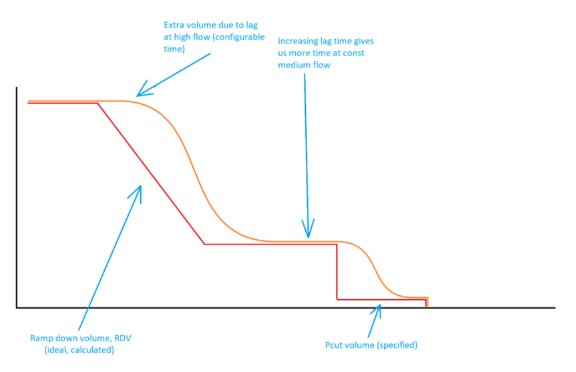

Precautions when adjusting
 
The following settings affect the system stability and should be changed taking great precautions.

- kP
- kI
- kD
- Minimum pulse width
- PWM width
- Medium flow rate*
 
*The medium flow rate target should be treated with a minor precaution as if this is too low nonlinearities in the system make the valve difficult to control. 
For a 2” diaphragm valve this is approximately 80 L/min.

# 9.9 Advanced settings

The Compac Ultra MR800S has default settings for the Modulated Valve installed at time of manufacture.
In most installations, no changes will be required to the default advanced settings and the dispenser will operate correctly.

The Advanced settings are in a separate menu that is not visible which needs to be enabled to allow changes to be made.

If you enable advanced settings you will get extra settings after the modulated valve setting “nuCC". 
To enable this, you need to set the nuCC to XX21

Advanced Modulated Valve settings

|Setting             |Description       |Default              |
|--------------------|------------------|---------------------| 
nu nfl |	Medum flow rate  |	110
nu ru.t|	Ramp up time	 |  8.00
nu rd.t|	Ramp down time   |	11.00
nu tP  |	PID P setting	 |  090
nu ti  |    PID i setting	 |  060
nu td  |	PID d setting	 |  060
nu nP.u|	Minimum time a solenoid valve should be pulsed for |	0.01
nu Pu.u|	PWM width        |	0.50

 

# 10.0 Troubleshooting

# 10.1 Modulated Valve

Refer to the Advance Modulated Valve settings in section 9 to access these parameters 

|Symptom|Possible cause|Action
|-------|--------------|-------
|Valve keeps ticking and does not reach the target flow rate|The target flow rate may be too high, or the pump pressure may be insufficient.| Try decreasing the target flow rate.
|Ramping too fast| The ramp-up time may be set too low. |Increase the ramp-up time (nu ru.t), or
| | The PWM width (nu Puu) may be too large. |Reduce it.
|Valve attempts to close (ticking) but responds slowly |The target flow rate may be too close to the maximum flow rate. |Reduce the target flow rate (nu HFr) by approximately 50 L/min.
|Valve starts ramping too early |Check the time at low flow setting. |Ensure it is not set to 00. If a value is set, try reducing it.

# 11.0 Software versions

**Important** 

The MR800S has special versions of software installed in both the C5K Processor board and K-factor board as follows:

- C5K_Processor_2.3.28.9
- K-factor firmware: CI502-K-FACTOR_BOARD_1.0.0.52

If ordering replacement C5K Processor or K-factor board as spare parts, please quote the Dispenser serial number to ensure that the parts are supplied with the correct software installed. 

