

# COM5 PT1 Installation and Service Manual  

updated 21 April 2026

# Conditions of Use  

Please read this manual completely before working on, or making adjustments to Compac equipment

Compac Industries Limited accepts no liability for personal injury or property damage resulting from working on or adjusting the equipment incorrectly or without authorization.

Along with any warnings, instructions, and procedures in this manual, you should also observe any other common sense procedures that are generally applicable to equipment of this type.

Failure to comply with any warnings, instructions, procedures, or any other common sense procedures may result in injury, equipment damage, property damage, or poor performance of the Compac equipment

The major hazard involved with operating the Compac C4000 processor is electrical shock. This hazard can be avoided if you adhere to the procedures in this manual and exercise all due care.

Compac Industries Limited accepts no liability for direct, indirect, incidental, special, or consequential damages resulting from failure to follow any warnings, instructions, and procedures in this manual, or any other common sense procedures generally applicable to equipment of this type. The foregoing limitation extends to damages to person or property caused by the Compac C4000 processor, or damages resulting from the inability to use the Compac C5K processor, including loss of profits, loss of products, loss of power supply, the cost of arranging an alternative power supply, and loss of time, whether incurred by the user or their employees, the installer, the commissioner, a service technician, or any third party.

Compac Industries Limited reserves the right to change the specifications of its products or the information in this manual without necessarily notifying its users.

Variations in installation and operating conditions may affect the Compac C4000 processor's performance. Compac Industries Limited has no control over each installation's unique operating environment. Hence, Compac Industries Limited makes no representations or warranties concerning the performance of the Compac C4000 processor under the actual operating conditions prevailing at the installation. A technical expert of your choosing should validate all operating parameters for each application.

Compac Industries Limited has made every effort to explain all servicing procedures, warnings, and safety precautions as clearly and completely as possible. However, due to the range of operating environments, it is not possible to anticipate every issue that may arise. This manual is intended to provide general guidance. For specific guidance and technical support, contact your authorised Compac supplier, using the contact details in the Product Identification section.

Only parts supplied by or approved by Compac may be used and no unauthorised modifications to the hardware of software may be made. The use of non-approved parts or modifications will void all warranties and approvals. The use of non-approved parts or modifications may also constitute a safety hazard.

Information in this manual shall not be deemed a warranty, representation, or guarantee. For warranty provisions applicable to the Compac C4000 processor, please refer to the warranty provided by the supplier.

Unless otherwise noted, references to brand names, product names, or trademarks constitute the intellectual property of the owner thereof. Subject to your right to use the Compac C5K processor, Compac does not convey any right, title, or interest in its intellectual property, including and without limitation, its patents, copyrights, and know-how.

Every effort has been made to ensure the accuracy of this document. However, it may contain technical inaccuracies or typographical errors. Compac Industries Limited assumes no responsibility for and disclaims all liability of such inaccuracies, errors, or omissions in this publication.

# Specifications

## Models Covered

> **Note:** Do not use this manual for earlier models. Contact Compac for archived manuals if required.

# Validity

Compac Industries Limited reserves the right to revise or change product specifications at any time. This publication describes the state of the product at the time of publication and may not reflect the product at all times in the past or in the future.

# Manufactured By

The Compac PT1 Payment Terminal is designed and manufactured by Compac Industries Limited

52 Walls Road, Penrose, Auckland 1061, New Zealand

P.O. Box 12-417, Penrose, Auckland 1641, New Zealand

Phone: + 64 9 579 2094

Fax: + 64 9 579 0635

**Email:** [techsupport@compac.co.nz](mailto:techsupport@compac.co.nz)

**Website:** [http://www.compac.co.nz](http://www.compac.co.nz)

Copyright ©2015 Compac Industries Limited, All Rights Reserved

# Document Control

## Document Information

**Manual Title:** COM5 PT1 Installation and Service Manual

**Current Revision Author(s):** Trevor Watt

**Original Publication Date:** 20 September 2021

**Authorised By:** Emily Sione

**File Name:** COM5 PT1 Installation and Service Manual v.1.0.5

## Table of Contents

[**1.0 Installation and Zoning**](#installation-and-zoning)

[**2.0 Safety**](#safety)

[2.1 Site Safety](#21-site-safety)

[2.2 Electrical Safety](#22-electrical-safety)

[**3.0 Footprint Drawings**](#30-footprint-drawings)

[3.1 PT1 Dimensions](#31-pt1-dimensions)

[3.2 PT1 Footprint](#32-pt1-footprint)

[3.3 PT1 Components](#33-pt1-components)

[**4.0 Tools Checklist**](#40-tools-checklist)

[4.1 Biannual Service](#41-biannual-service)

[4.2 Annual Service](#42-annual-service)

[**5.0 Mechanical Installation**](#50-mechanical-installation)

[5.1 Mounting the PT1 Payment Terminal on a Post](#51-mounting-the-pt1-payment-terminal-on-a-post)

[**6.0 Electrical Installation**](#60-electrical-installation)

[6.1 Cable Requirements](#61-cable-requirements)

[**7.0 Electrical connections**](#71-incoming-mains)

[7.1 Incoming Mains](#71-incoming-mains)

[7.2 CI533 C5K COMMS Driver Board switches](#72-ci533-c5k-comms-driver-board-switches)

[7.3 Side DIN Rail Terminals](#73-side-din-rail-terminals)

[7.4 Modem and Network connections](#74-modem-and-network-connections)

[7.5 Glanding](#75-glanding)

[**8.0 COMMS connections**](#80-comms-connections)

[**9.0 Electrical Testing**](#90-electrical-testing)

[9.1 Tank Gauging Setup](#91-tank-gauging-setup)

[9.2 System and Transaction Tests](#92-system-and-transaction-tests)

[9.3 Changing the IP address on a PT1](#93-changing-the-ip-address-on-a-pt1) 
 

[**10.0 Installation Checklist**](#100-installation-checklist)

[**11.0 PT1 Operation and Servicing**](#110-pt1-operation-and-servicing)

[11.1 Operation](#111-operation)

[11.2 Downloading COM5 PT1 Transaction Data](#112-downloading-com5-pt1-transaction-data)

[11.3 Components](#113-components)

[**12.0 Servicing and Maintenance**](#120-servicing-and-maintenance)

[12.1 Regular Testing](#121-regular-testing)

[12.2 Card Reader](#122-card-reader)

[12.3 PIN Pad](#123-pin-pad)

[12.4 Receipt Printer](#124-receipt-printer)

[12.5 Electronic Module Replacement](#125-electronic-module-replacement)

[12.6 Power Supply Replacement](#126-power-supply-replacement)

[12.7 UPS Motherboard Connections](#127-ups-motherboard-connections)

[12.8 Power Loss](#128-power-loss)

[12.9 Battery](#129-battery)

[12.10 COMMS Board Replacement](#1210-comms-board-replacement)

[12.11 C5K Processor Board Replacement](#1211-c5k-processor-board-replacement)

[12.12 UPS Motherboard replacement](#1212-ups-motherboard-replacement)

[12.13 PIN Pad Replacement](#1213-pin-pad-replacement) 

[12.14 Card Reader Replacement](#1214-card-reader-replacement)

[12.15 Fan & Filter](#1215-fan--filter)

[12.16 Modem LEDs](#1216-modem-leds)

[**13.0 Troubleshooting**](#130-troubleshooting)

[**14.0 Spare Parts**](#140-spare-parts)

# 1.0 Installation and Zoning

**DANGER:** The Compac PT1 Payment Terminal is NOT suitable for mounting in any hazardous area.

It must be installed OUTSIDE the Hazardous areas.

Please refer to the site's Zonal drawings to find the exact positions of the hazardous areas for each particular site.

The Site Zonal drawings consider all the equipment on site, not just the Compac equipment.

As a guide, PT1 Payment Terminal installations should comply with all the following requirements.

> **Important Note:** The following are guidelines only

If in doubt, consult a Hazardous Area specialist.

- The PT1 should be placed at least 8 metres from any above ground flammable liquid storage or handling facility other than a dispenser.

- The PT1 should be placed at least 0.5 metres from any flammable liquid fuel dispensers and 1.5 metres from any LPG dispensers.

- The PT1 should be mounted so that the base of the cabinet is at least 0.5 metres above the ground. If mounted on the post supplied by Compac it will be 0.5 metres high.

- If the PT1 post is within 4 metres of a dispenser or within 1 metre of the end of any fuel dispenser hose, then the entire interior of the post may be considered a hazardous area. Any cables running through, or electrical equipment mounted in the post should be suitable for that hazardous area (refer AS/NZS 2381).

For adequately ventilated fuel dispensing sites (not including CNG/NGV), in most cases the following will apply:

- The unit is not designed to be constantly exposed to the elements. A shelter should be installed to protect it.

- The card reader and PIN pad should face away from the prevailing wind especially in dusty or wet areas.

- In areas experiencing extremes of weather (heat, cold, wind, rain, salt spray etc.) consideration should be given to installing additional shelter.

- The PT1 location or protection should be such as to minimise the possibility of damage from vehicles, trailers, boats, or the like.

- On heavy vehicle sites, mounting the unit on a raised pad and/or installing bollards to help protect from damage should be considered.

- If mounting on a post, the base needs to be attached to a smooth, level surface of sufficient strength to securely hold the retaining bolts or fasteners.

- Whenever running a cable through the post into the base of the cabinet always ensure that the cable entry into the cabinet uses a vapour tight gland.

- Generally, the area below the PT1 may be a hazardous area and therefore some appropriate signage may be required e.g. no smoking.

- Lighting should be provided during the hours of operation. Lighting should be sufficient to provide safe working conditions that include, but are not limited to, clear visibility of all markings on packages, signs, instruments and other necessary items.

> **Note:** A minimum value of 50 lux is recommended.

These requirements do not apply to any specific site but are merely recommendations that will apply in most cases. The owner/installer must ensure that the installation complies with AS/NZS 3000, AS 1940, and any other applicable regulations.

# 2.0 Safety

You must adhere to the following safety precautions at all times when working on the Compac COM5 PT1. Failure to observe these safety precautions could result in damage to the COM5 PT1, injury, or death. Make sure that you read and understand all safety precautions before installing, servicing, or operating the Compac COM5 PT1.

## PRECAUTIONS

Always follow safe operating procedures, any national or local regulations and site-specific instructions.

Make sure that the service area is thoroughly clean when servicing. Dust and dirt entering the components reduce the life span of the components and can affect operation.

Some components have sharp edges and corners. Wear gloves whenever practicable while working inside the cabinet.

# 2.1 Site Safety

Comply with all safe site regulations for the site you are working on and any additional instructions from the site manager.

Wear and use appropriate safety equipment such as safety boots, high visibility clothing, hard hat, gloves, and barrier cream.

Cordon off the area you are working in using cones, barriers, caution tape etc.

**CAUTION:**

When working near any flammable goods area, take all precautions to avoid all potential sources of ignition. This includes but is not limited to: Open flames, hot exhausts, welding flames or sparks, static electricity, non-intrinsically safe electrical equipment, use of mobile phones.

These instructions are to be used as a guide only and may not cover all situations. It is the responsibility of yourself and the site manager to take appropriate health and safety precautions.

## 2.2 Electrical Safety

**CAUTION:**

Always turn off the power to the COM5 PT1 before removing the high voltage area Perspex guard. Never touch wiring or components inside the high voltage area with the power on.

Always turn off the power to the COM5 PT1 using the mains switch and the battery isolation switch before removing or replacing any PCB’s.

Always take basic anti-static precautions when working on the electronics, i.e., wearing a wristband with an earth strap.

### 240 Volt

The COM5 PT1 is powered by 240-volt AC mains power. The mains power enters the cabinet via a gland in the base and is connected into the main circuit breaker on the DIN rail. From the circuit breaker, power goes to a connector block where it is split with wires running to the thermostat/heater and to the power supply mounted on the back of the electronic module. The power supply steps down the 230 Volts AC to 16-volt DC to power the main electronic components.

Technicians should be able to safely operate and diagnose an COM5 PT1 with the cabinet door open if they do not touch any of the 230 volt powered components behind the Perspex cover or the 230 Volt terminals on the power supply.

Turning off the mains power at the mains circuit breaker should be sufficient to allow maintenance of the COM5 PT1 providing isolation is tested.

The 2 DIN rails hold 230 Volt components. The 230 Volt components (230 Volt connector block, circuit breaker, thermostat, and heater) should not be touched unless isolated. The 5 Volt wires on the left-hand side can be safely touched to help diagnose connection problems.

**CAUTION:**

The cabinet heater operates when the temperature inside the cabinet drops below a pre-set level. In cold weather the heater can start without warning and may get hot enough to cause skin burns if touched (105°C).

### 12 Volt

The COM5 PT1 runs on 16 Volts DC and has an internal 12 Volt battery to supply power in the case of mains failure. When the mains power is turned off, the unit will still be powered by the battery. Turn off the battery isolation switch or turn off the mains power before working on any electronic components.

**CAUTION:**

When removing the battery, take care not to short the positive terminal on the chassis of the COM5 PT1. Make sure the positive terminal is insulated before installing the battery.

## Power Supply

The power supply converts the 230 Volt AC power to 16 Volt DC power. It is located behind the electronics module and has exposed terminals. Do not place your hand in the gap between the left-hand side of the electronics module and the cabinet side unless you have isolated the mains power.

# 3.0 Footprint Drawings

# 3.1 PT1 Dimensions

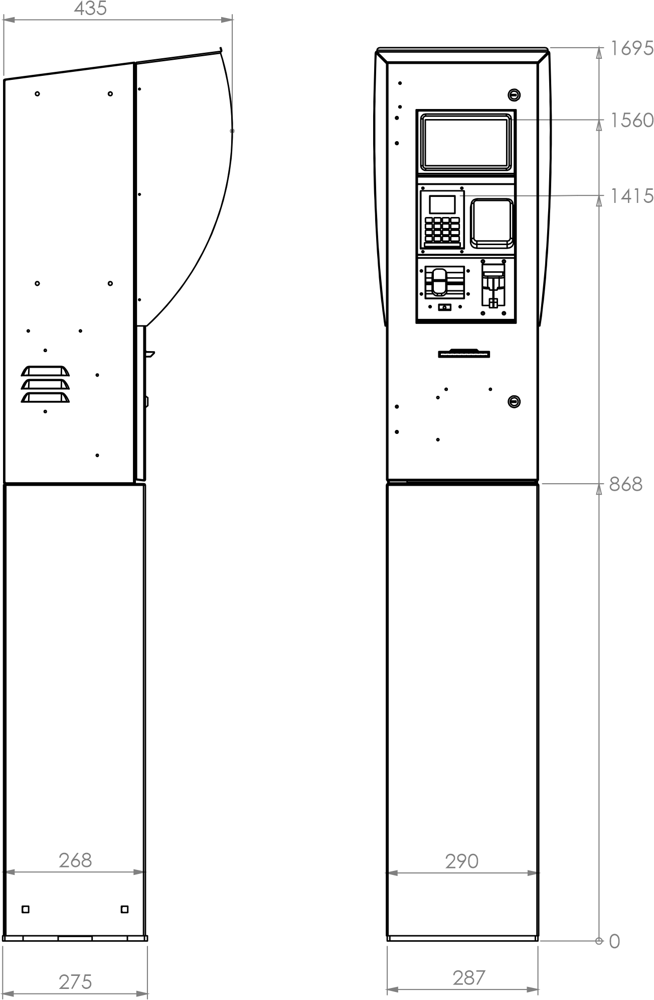

# 3.2 PT1 Footprint

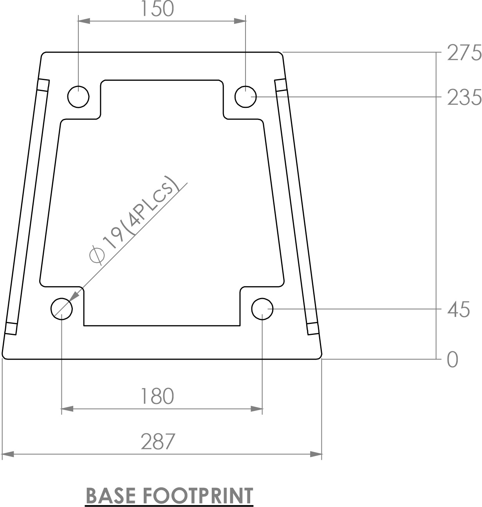

# 3.3 PT1 Components

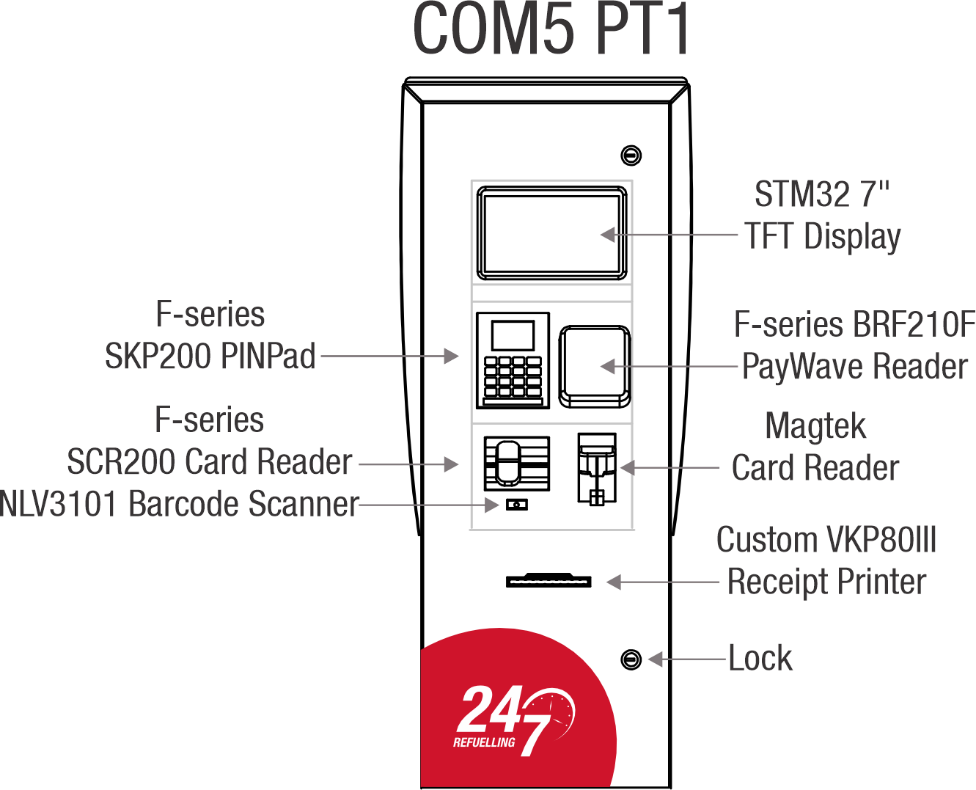

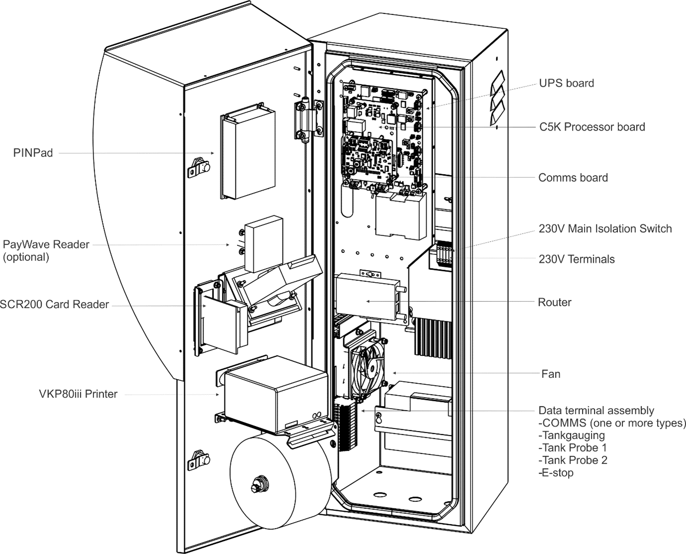

# 4.0 Tools Checklist

Having all the correct tools will make installation, upgrade and repair procedures easy and minimise the risk of damage to components.

Before you arrive on site, make sure you have a minimum of all the tools listed here:

> **Note:** Make sure your cell phone and laptop are fully charged.

- 5.5mm nut driver

- 7mm nut driver

- 8mm nut driver

- T30 Torx drive bit or driver

- T10 Torx drive bit or driver

- Metric spanner set

- Metric 3/8" or 1/4" drive socket set

- 1/4" screwdriver bit holder

- 1/4" A/F spanner

- 6" adjustable spanner

- Flat blade screwdriver set (1.5 - 5mm blades)

- #0, #1, #2 Phillips screwdrivers

- #1, #2 Pozidriv screwdrivers

- Set of metric Allen (hex) keys

- Fine long nose pliers, side cutters & pliers

- Hacksaw

- Stanley knife or similar sharp blade

- Felt tip pen or marker

- Glue - Loctite 601 or similar

- Insulating tape and masking tape

- Spray bottle of water and detergent

- Ruler

- Multimeter

- Isopropyl alcohol wipes, cleaning spray and cloths, baby wipes for cleaning

- Flat Precision screwdriver 0.23 x 1.5 mm tip

# 4.1 Biannual Service

- Clean or replace the ventilation filter.

- Check the ventilation fan runs smoothly and without abnormal noise.

- Check the UPS by powering down the unit at the mains switch and timing how long before the unit switches off. If the unit turns off in less than 20 minutes the battery may need replacing.

- Ensure the printer has sufficient paper.

# 4.2 Annual Service

- Check the seals on the COM5 PT1 door are not damaged or worn and that the COM5 PT1 base is secure.

# 5.0 Mechanical Installation

## Prior to Installation

Read the relevant parts of this manual and make sure you have the following information:

- All necessary approvals to work on the site

- The PT1 factory set up sheet

- The site audit document

- The telephone number, user name and password for ADSL sites

- Contact details for site owner or manager

- Contact details for help desk

> **Note:** For ADSL sites, check that the broadband account is set up.

> **Note:** For wireless sites check that the SIM card is registered to a valid account.

> **Note:** It is advisable to book an installation time with the help desk at least 24 hours before going to site. This will ensure that help desk staff will be prepared for your inquiries. Help desk hours are currently Monday to Friday 8.00am to 7pm NZ Standard Time.

Bring the following equipment:

- Mechanical and electrical tools

- Multimeter

- Fastenings to mount the PT1 Payment Terminal

- Security key drivers (Security TORX or unique security key if Extra Security equipped)

- A fully charged laptop computer

- A charged cell phone

- OPT spares kit

- SIM cards for wireless sites (if not supplied with unit)

## Position

Refer to the Site Audit document for location.

Check the site drawings for details regarding hazardous areas. If in any doubt about the location, refer to the site manager.

Install the OPT in a sheltered position and if possible, facing away from prevailing wind and rain direction.

If possible, install out of direct sunlight to avoid raising the temperature inside the OPT cabinet more than necessary.

Situate the OPT so the PIN pad display will not be in direct sunlight at any time during the day as it makes it hard to read.

Make sure that you position the PT1 Payment Terminal to ensure you can open the cabinet door. If mounted on a post, you must also allow clearance be able to remove and replace the access panel on the post.

# 5.1 Mounting the PT1 Payment Terminal on a Post

If a post is part of the installation, the post must be securely attached to the ground using appropriate fastenings.

> **Note:** Due to the variability in sites, Compac does not supply ground fastenings with the post. The base plate has 4 x 19mm holes for fastenings, select appropriate fastenings according to the surface and location where the OPT is to be mounted.

**CAUTION:** Take care when opening the PT1 cabinet door before the cabinet is securely mounted. The door holds several heavy components that will cause the cabinet to tip when opened.

## To mount the post onto the base:

- Place the post over the base with the opening facing away from where the front of the PT1 will be.

- If the PT1 has been supplied with the extra security upgrade, place the powder coated stainless steel bolt covers over the base mounting nuts (trim the bolts if needed). Secure using the supplied stainless steel bolts passing through the bolt cover, post and base plate. (The bolts may need trimming.)The rounded head faces out and place a flat washer under the nut on the inside of the post.

- Standard PT1s do not have the bolt covers. Fasten using the supplied galvanised bolts with the rounded head facing out and a flat washer under the nut.

## To mount the PT1 onto the post:

- PT1s with the extra security upgrade use special keyed machine screws. The head of the bolts face out. Standard PT1s use four M10 bolts, nuts, flat and spring washers.

- Place the PT1 cabinet on top of the post and securely fasten the cabinet to the post using a flat washer and spring washer under the nut.

- Feed the wiring into the base of the OPT using vapour resistant glands and block any unused holes.

- Coil and secure all loose wiring inside the post. Neatly cable-tie the wiring inside cabinet to existing cable routings. Ensure wiring will not contact any equipment when the door is closed and ensure it is not under tension.

- Fit the cover plate on the back of the post using the supplied M6 Security Torx head screws or security keyed M6 machine screws for the extra security models.

> **Note:** Use only the Compac supplied 4 bolt mounting plate to secure the OPT to the post.

> **Note:** Security Torx or Security Keyed head screws must be used on the cover plate of the post to prevent unauthorised access to the wiring.

**CAUTION:** Any unused holes in the bottom of the PT1 cabinet must be blanked. No open holes in the base of the PT1 cabinet are permitted.

# 6.0 Electrical Installation

# 6.1 Cable Requirements

## Power Cable

3 Core Steel Wire Armour Cable 2.5mm². 230 Volts, 10A, 50 Hz. Connect the incoming mains as follows:

- Live - Connect to the Left bottom screw down terminal of the mains switch.

- Neutral - Connect to the Right bottom screw down terminal of the mains switch.

- Earth - Connect to the busbar.

## Pump Comms

2 Core Steel Wire Armour Cable 1.5mm². Total cable length in the comms circuit should not exceed 100 metres.

Terminals will be labelled depending on the brand of pump on site. Correct polarity must be observed.

> **Note:** For pump comms, tank gauging and ADSL connections it is suggested that the wires are crimped to a ferrule to provide a greater contact area for the screw fastener.

> **Note:** Make sure the clamping screw contacts the terminal and not the insulation.

## Tank Gauging

Connect the wires from the tank gauging unit to the terminals on the Din rail marked Tx, Rx and G. The Tx wire from the tank gauging unit connects to the Rx terminal. Refer to the Side DIN Rail Terminal drawing

Cable length should be less than 3 metres. Cable length can be extended up to 10 metres if an opto-isolator is used.

> **Note:** Site electrical and magnetic interference can reduce transmission distance.

# 7.0 Electrical connections

Note: The following drawings can also be found on a label inside the PT1 cabinet

 

# 7.1 Incoming Mains

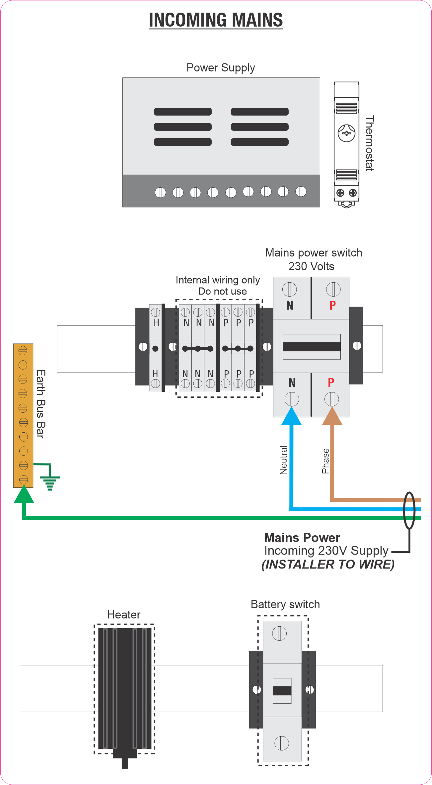

 

# 7.2 CI533 C5K COMMS Driver Board switches

Refer to COMMS Wiring and Setup section for more detailed information

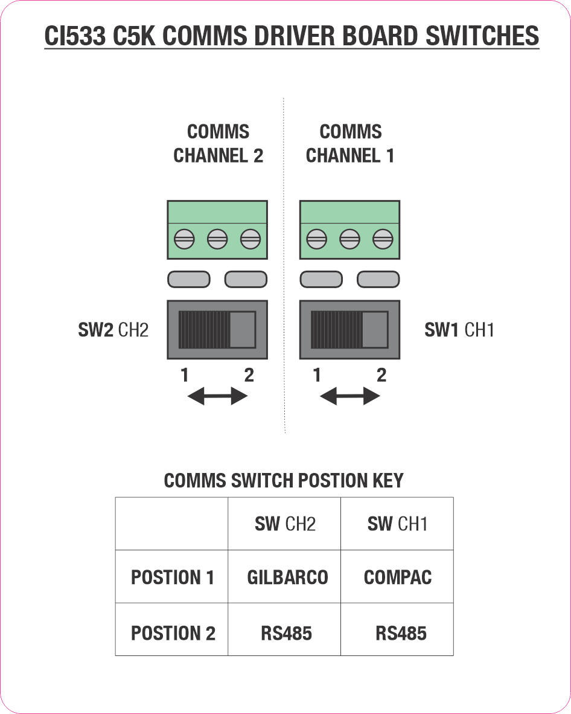 

 

# 7.3 Side DIN Rail Terminals

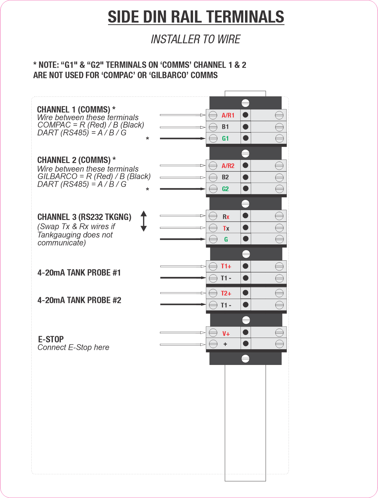

 

# 7.4 Modem and Network connections

4G & 5G Aerial/Antennae Installation

For wireless connected units where the aerial is mounted remotely from the cabinet, the aerial cable should be run through ducting that provides suitable protection and flexibility.

When choosing a location for aerial installation, ensure that as much of the aerial as possible, especially the fibreglass whip section, is mounted away from metallic obstructions such as pillars and roof overhang. Ensure it is not mounted within one metre of any other aerials to minimise signal interference.

**IMPORTANT NOTE:**  
When installing the spring-loaded aerial, it is essential to leave enough loose cable at the bottom of the aerial for when the spring flexes. A loop of 50mm before fixing the cable should be sufficient.

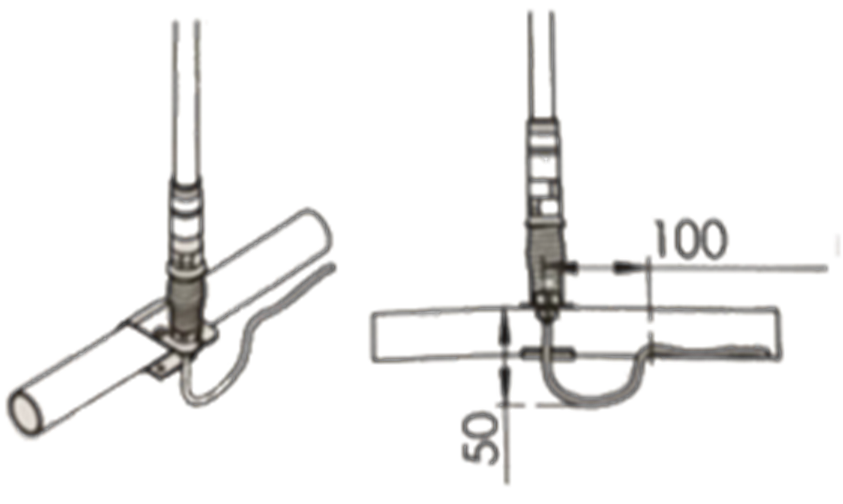

The aerial plugs into the wireless router. Neatly cable-tie the aerial cable to existing wiring and feed any excess into the base where it can be coiled and cable tied out of the way. Make sure the aerial cable does not interfere with the paper roll when the door is closed.

# 7.5 Glanding

Gland the mains power, pumps comms, tank gauging and Antenna/Network SWA cables up through the post into the 20mm holes provided in the bottom of the cabinet.

Certain configurations will use wireless communication to internet and therefore not require a network cable.

Ensure the Perspex terminal cover is refitted after the cables are connected

**NOTE:** Check that all cables are securely fastened by pulling each one in turn to make sure they are properly attached.

**CAUTION:** Ensure Perspex terminal cover is refitted after all cables are connected.

**NOTE:** Due to varying customer requirements, connections may change from what is shown above.

# 8.0 COMMS connections

## CI533 Comms board

In the PT1, the CI533 Comms interface PCB board is piggy-backed on top of the Processor Board

A 15 core multicore loom connects the CI533 Comms board to the DIN Terminal Rail where all the  site connections are made. The DIN Rail which is clearly labelled.

All site connections are made directly on the DIN rail.

No site connections are required directly onto the CI533 Comms board.

### CI533 COMMS board functions

The CI533 Comms board has two functions.

1.	Enables the COMFILLV2 to communicate with Compac, Gilbarco and Wayne Pumps and Dispensers.

2.	It has a Tank-gauging interface to connect to either 2x 4-20m Tank Probes or a 3rd party Tank controller ( Veeder-Root or Calibri)  via RS232

### CI533 COMMS channels

There are three Comms channels

Channel 1. CH1 can be configured for the following protocol options using Switch SW1

•	COMPAC standard current loop comms

•	COMPAC Comms over RS485

•	Wayne DART protocol over RS485

If Compac Comms over RS485 for long distances is required (ie greater than 100 metres), set CH1 to RS485 and configure CH1 for Compac in the COMFILL settings. Refer to Local setup / Pumps / Comms

For Wayne DART protocol, configure CH1 for RS485 and configure CH1 in  Local setup / Pumps / Comms for Wayne DART protocol

There is an ENABLE switch SW_P1 to turn CH1 ON. A Green LED indicates that the CH1 is ON

When communicating with a Pump or Dispenser, the Tx and Rx red LEDS will flash

### SW_P1 
This switch is normally left in the ON position

Channel 2 CH2 can be configured for the following protocol options using Switch SW2

•	COMPAC protocol over RS485

•	GILBARCO protocol

•	Wayne DART protocol over RS485

If Compac Comms over RS485 for long distances is required (ie greater than 100 metres, set CH2 to RS485 and configure CH2 for Compac in the COMFILL settings. Refer to Local setup / Pumps / Comms

For Wayne DART protocol, configure CH2 for RS485 and configure CH2 in  Local setup / Pumps / Comms for Wayne DART protocol

There is an ENABLE switch SW_P2 to turn CH2 ON. A Green LED indicates that the CH2 is ON

When communicating with a Pump or Dispenser, the Tx and Rx red LEDS will flash

### SW_P2
This switch is normally left in the ON position

Channel 3 CH3 can be configured for either RS232 or RS485 using Switch S61

CH3 is exclusively used for Tank Gauging Controllers eg Veeder-Root or Calibri

Only RS232 is currently supported on CH3 so the Tank Controller should also be setup for RS232

CI533 Comms board Dipswitch settings

These are the Dip-switch settings for Compac, Gilbarco, Wayne DART and RS485 Comms

### SW1 
CH1 Channel 1

1 = Compac ( standard Current Loop) comms

2 = RS485

### SW2 
CH2 Channel 2

1 = Gilbarco

2 = RS485

### S61 
– CH3 Channel 3 selector switch

ON = RS232

OFF = RS485

### SW62 
This switch is used for current loop systems on channel 1 (e.g. Gilbarco, Wayne). Adjust the switch according to the current (mA) of the site protocol as required. There are three current options.

Wayne = 45

Gilbarco AUS = 30

Gilbarco USA = 20

CH3 Term, SW1_R and SW2_R

These switches are used for an end of line termination resistor for RS485 applications.

They are not currently supported and should be left in the OFF position

# COMPAC/PEC COMMS V1.0 09-08-2021

## Connections

The following are the connections and switch settings for Compac/PEC comms on the CI533A. 

Note that Channel 2 is free to be used as Gilbarco or Dart

Also, you need to make sure that the Channel that you are using is switched on. When the channel is on, the led indercater will be on.

## Configuration / Setup

To set up pumps talking Gilbarco right click on the Site and the click on edit site.
Then click on the pumps tab

### Setup the pump as follows

Pump number: The number of the pump that you will select when prompted

Pump ID: This is the ID set in the pump (normally set the same as the pump number)

Channel: Compac/PEC is always on Channel 1

Pump Type: Set the Pump type “Compac12 ”,“Compac24”, “PEC12” and “PEC12\_6digit” Depending on what the Dispenser is set to

Flow timeout: This is the time in seconds after the C5000 says “Ready for delivery” before the c5000 times out and cannels the 
authorisation

Then, click the “Add” button

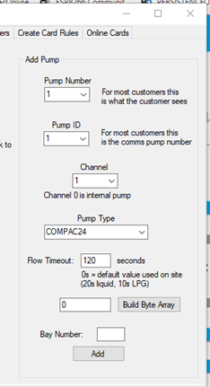

### Setup the Hoses

Assign the grades and the hoses on the pump

After the pump is setup in the admin tool, you have to flag the site to update the pump
Setup. 

To do this right click on the site and click “Flag status”. Then click “Update Pumps”

You then can check the events to see if the pumps have been updated

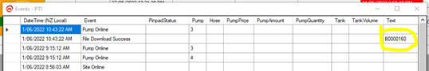

## Extra Compac/PEC settings
There are some pumps that need specific settings. 

Below is the symptom and the pump type to use. 

If you are changing a setting, you MUST reset the C5000 after making the change

Symptom|Setting to use
------|------|
The Dispenser seems to keep trying to price change or the price is displayed as $4.123 and it should be $1.234|If PEC12 change to Compac12 and if Compac12 change to PEC12
Compac dispenser. When you enter the auth $10 the pump is stopping at 10 litres because some Compac dispensers only do litres preset|Add the setting below this makes the C5000 work out the litres equivalent and sends it to the pump

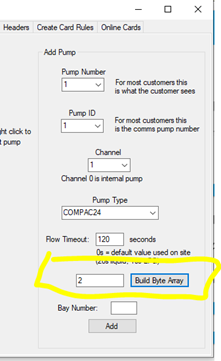|

# Gilbarco Comms V1.0 9/08/2021

## Connections

The following is the connections and switch setting for Gilbarco on the CI533A. Note that Channel 1 is free to be used as Compac or Dart

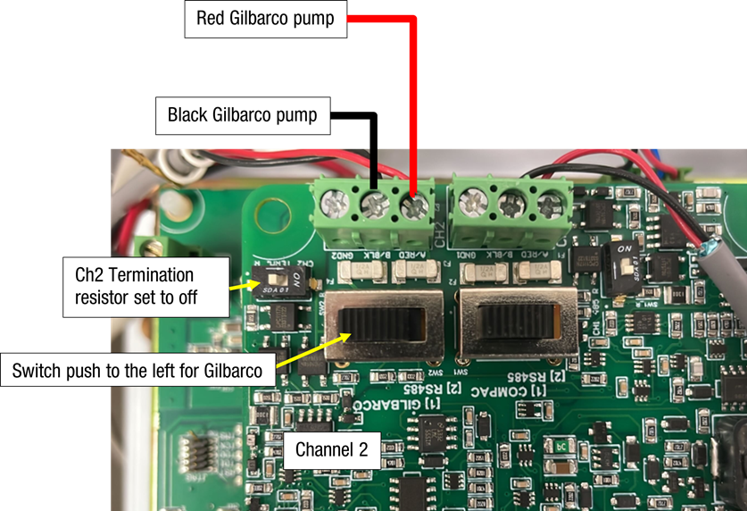

Also need to make sure that the Channel that you are using is switched on. When the channel is on the led indicator will be on.

## Configuration / Setup

To set up pumps talking Gilbarco right click on the Site and the click on edit site.
Then click on the pumps tab

### Setup the pump

Pump number: The number of the pump that you will select when prompted

Pump ID: This is the ID set in the pump (normally set the same as the pump number)

Channel: Gilbarco is always on Channel 2

Pump Type: Set the Pump type “GILBARCO_V2_6D” or “GILBARCO_V2_5D” Depending on what the Dispenser is set to

Flow timeout: This is the time in seconds after the C5000 says “Ready for delivery” before the c5000 times out and cannels the authorisation

Then click the “Add” button

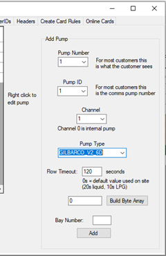

### Setup the Hoses
Assign the grades the hoses on the pump

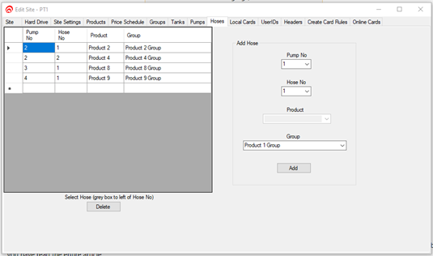

After the pump is setup in the admin tool yoy have to flag the site it update the pump
Setup.to do this right click on the site and click “Flag status”. Then click “Update Pumps”

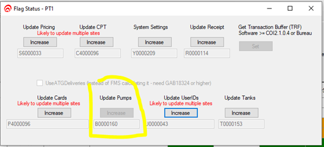

You then can check the events to see if the pumps have been updated

## Extra Gilbarco Settings

The C5000 is setup to automatically set the correct Gilbarco protocol. But sometimes the dispenser is a little different. In these cases, we have special Gilbarco protocol versions.

GILBARCO_V2_5D_Preset2D

GILBARCO_V2_5D_Preset4D

GILBARCO_V2_6D_Preset2D

GILBARCO_V2_6D_Preset4D

GILBARCO_V1_5D_Preset2D

GILBARCO_V1_5D_Preset4D

GILBARCO_V1_6D_Preset2D

GILBARCO_V1_6D_Preset4D

Compac Pumps Running Gilbarco need to be set to “GILBARCO_V1_5D_Preset2D” or “GILBARCO_V1_6D_Preset2D”
 
 
# Dart Connections V1.0 09-08-2021

The following is the connections and switch setting for Dart on the CI533A Ch1 and Ch2

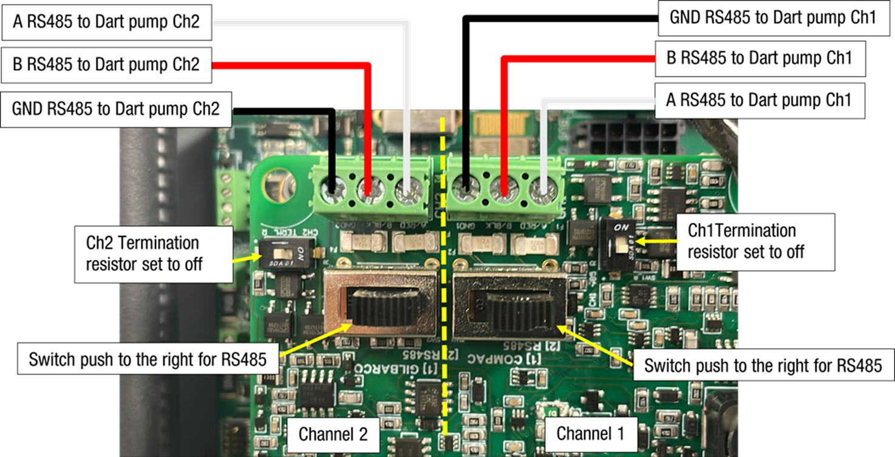

Also need to make sure that the Channel that you are using is switched on. When the channel is on the led indicator will be on.

## Configuration / Setup

To set up pumps talking Dart right click on the Site and the click on edit site.

Then click on the pumps tab

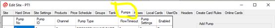

### Setup the pump

Pump number: The number of the pump that you will select when prompted

Pump ID: This is the ID set in the pump (normally set the same as the pump number)

Channel: The Channel that the pumps are connected to on the CI533 see above

Pump Type: set the Pump type “DRESSER WAYNE DART”

Flow timeout: This is the time in seconds after the C5000 says “Ready for delivery” before the c5000 times out and cannels the authorisation

Then click the “Add” button

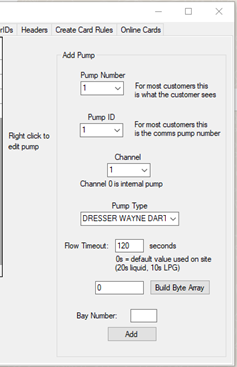

### Setup the Hoses

Assign the grades to the hoses on the pump

After the pump is setup in the admin tool yoy have to flag the site it update the pump
Setup.to do this right click on the site and click “Flag status”. Then click “Update Pumps”

You then can check the events to see if the pumps have been updated

# 9.0 Electrical Testing

This procedure outlines how to perform an electrical operations test on the PT1 before carrying out a full site test.

Once the power and comms terminations have been completed, check all terminals, plugs and chips inside the unit to make sure they have not become loose during transit.

Site information provided to the factory may have been entered into the unit to help with commissioning, but all settings must be checked when on site to make sure they are correct.

> **Caution:** Some of the options shown below and described in this section may not appear in certain configurations. The numbers used to select the options may change with different versions of software.

> **Note:** Ensure all terminations are secure and made to the copper wire, not to the insulation.

System Power Up

- Turn on the main circuit breaker inside the OPT then turn on the power switch on the UPS board. When the unit is turned on, two LEDs above the power switch should turn on. LED labelled D5 indicates the 230V mains power is OK, D6 indicates the battery is connected and OK.

- If D6 does not light up when then unit is first turned on it may be because the battery has discharged during transport and storage or that the battery terminals have become loose. If this happens, remove the battery from the holder and check that the battery terminals are secure and then re-install it. If D6 still does not light up leave the unit connected to the 230V supply for an hour or so to charge the battery and then re-check.

- Check the Router or ADSL modem is turned on and the power LED is lit.

- Check the green power led on the right side of the Compac Box is on. If not, check the switch on the left-hand side of the box is turned on.

## Communications

Check that the ATG and Pump Communications LEDs on the CI533 Comms board are lit.

LED|Colours|Comment
-----|-----|-----
| Pump Comms (NZ) | Yellow Green Red | Toggles Yellow / Green = Normal Red = Comms short|
| Pump Comms (Aus) | Green Red | Toggles Red Green = Normal |
| ATG (NZ) | Green Red | Toggles Red Green = Normal |
| ATC (Aus) | Green Red | Toggles Red Green = Normal |

# 9.1 Tank Gauging Setup

Tank gauging is wired into the terminals marked Tx, Rx and G.

The tank gauging unit will have to be set up with the correct outputs to communicate with the FMS board.

| Type | Mode | Baud Rate | Parity | Bit | 1 Stop Bit | Handshake |
 --- | --- | --- | --- | --- | --- | --- |
| Veeder Root | Serial | 9600 | No Parity | 8 Bit | Yes | Off |

The Compac settings for the tank gauge are usually either set at the factory or sent via CompacOnline.

# 9.2 System and Transaction Tests

When you are happy that the PT1 is powered up and communicating, contact the Compac Help Desk. The COmpac Help Desk will check that the PT1 is communicating correctly and will ask you to perform various checks to confirm this.

The exact site test setup and procedure will vary from customer to customer but as a minimum we would suggest the following:

- Check that the current price is correct.

- Check each dispenser making sure the correct price has been applied.

- Dispense fuel from each pump on site, confirming that the correct pump is authorised when requested and you are able to dispense fuel.

- After dispensing fuel, check the receipt and make sure the correct dollars, litres, fuel grade and site details are printed on the receipt.

- Test the VoIP help phone function if fitted.

- The Help Desk will open CompacOnline and check that the transactions have been recorded correctly. They will also check that the tank gauging is active and sending back the correct levels.

- If your initial test transactions were completed with the PT1 door open, you will need to close and lock the cabinet and perform your transaction tests again.

- Complete the Install Checklist.

 

# 9.3 Changing the IP address on a PT1 

## V1.0 04/05/2022

If you have a PT1 unplug the card reader. You can do this by unplugging the host plug from the card reader

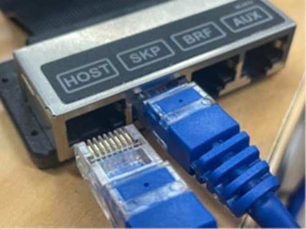

If you have a PT1 you will have to plug a External pinpad into the UPS. After you might have to repower the unit

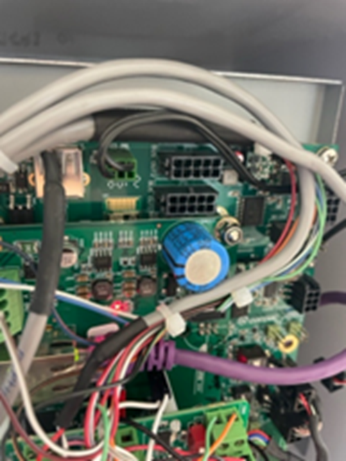

The Pinpad should be displaying the the following. Press the red cancel button.

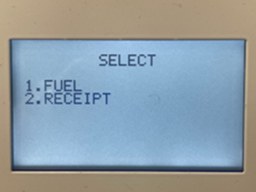

If you know the Pass code enter it now. If you don’t   you will have to call the helpdesk to get the backdoor passcode for that unit.

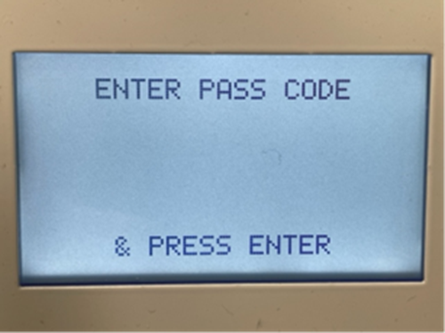

Press 1 for system

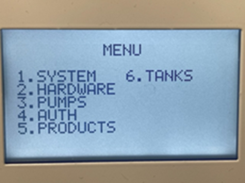

Press 3 for network

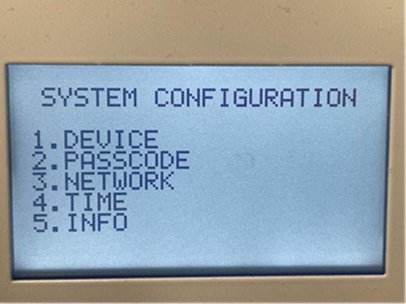

The following is the Network setting

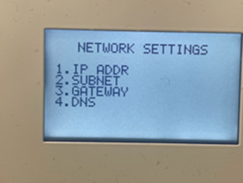

Enter the IP address using * for the decimal place

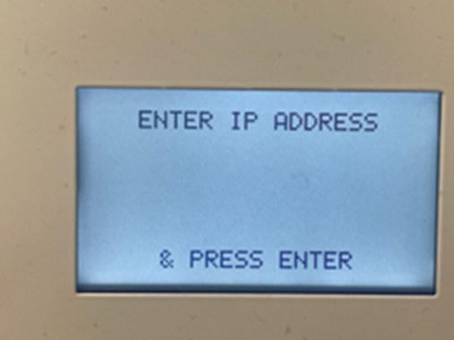

Do the same for the subnet mask, gateway and the DNS

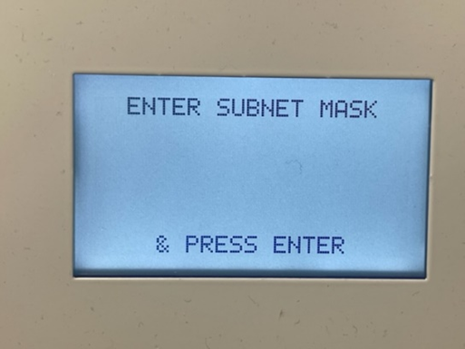

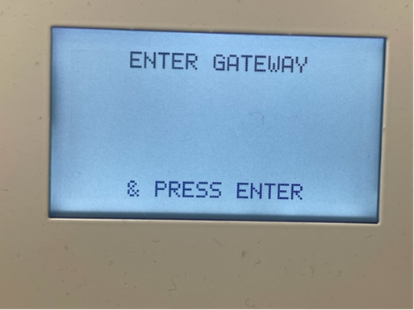

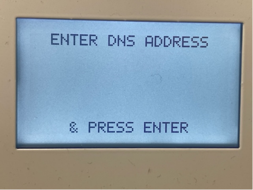

Now, REPOWER the unit. The Unit MUST be repowered to take the new settings

# 10.0 Installation Checklist

Before leaving site, ensure the installation checklist is completed. If any of the following tests fail, please contact Helpdesk.

| Mechanical | Yes | No                |
| --- | -----| --- |
Check that the unit has been securely bolted down.
Check all panels are securely fastened.
Check that all cable entries to the PT1 are through glands.

| Wiring | Yes | No |
| --- | --- | --- |
Check that power has been connected to the main breaker in the OPT.
Check that the phone line is connected to the router. (Wired ADSL units)
Check that the SIM card has been inserted into the modem and the aerial wired 
and mounted appropriately. (Wireless internet PT1)
Check that the pump comms have been connected.
Check that the tank gauging is connected and operating correctly (where fitted) 
abd replace ATG cable to PT1 where possible.

| Power On Tests | Yes | No |
| --- | --- | --- |
Check that the UPS board, COM5 board, pinpad, printer, cardreader, router and modem all power up.
Check that the router logs in and is able to access the internet using a laptop and network cable plugged into the router.
Get the installer to call the number on the back of the pinpad and get the PIN pad activated. (NZ only at present)
Make sure the pumps are re-priced by the OPT to the current fuel price.
Check that different fuels are correctly priced on all hoses.
Check that the site logs onto CompacOnline and that a temperature is recorded at site.

| Transaction Tests | Yes | No |
| --- | --- | --- |
Check that all pumps can be selected when starting a transaction on the PIN pad.
Check that the correct $, L and fuel grade are printed on the receipt and that a receipt is issued after each transaction when the card is re-swiped.
Check that the transactions that appear on CompacOnline match up to the receipt information that is printed on site.
Check that date and time zones are correct.

| Tank Information Tests (where fitted) | Yes | No |
| --- | --- | --- |
Check that tanks are set up in CompacOnline and that correct information from the equipment is being displayed on screen.
Check that the correct fuels have the correct levels and that one fuel is not being reported as a different fuel.

| VoIP Tests (where fitted) | Yes | No |
| --- | --- | --- |
Press the green button on the front of the unit and complete a test call to the service centre. It should be a clear conversation at both ends.

| Finishing | Yes | No |
| --- | --- | --- |

Ensure all cables are plugged back in after remote accessing.

Check that door switch alarm has cleared.

Tidy up all rubbish and clean the PT1 before leaving.

# 11.0 PT1 Operation and Servicing

The Online Payment Terminal (COM5 PT1) enables unattended refuelling at unmanned sites such as truck stops, marinas, aviation sites and supermarkets where the driver, skipper or pilot can pay for fuel by credit card, distributor card or on enabled sites, by EFTPOS. The COM5 PT1 can accept multiple card bases simultaneously through Compac's EFTPOS partner, WindCave.

The COM5 PT1 is a National Measurement Institute (NMI) approved control system for fuel dispensers. It incorporates a forecourt controller that is capable of controlling Compac, PEC, Gilbarco, and Dart protocol pumps. Tank levels can be monitored with Veeder-root, Calibri, Fafnir, and Franklin tank gauges. The COM5 PT1 is designed to AS/NZS 3100 wiring standards.

Card are authorised online in real time. Offline mode can be enabled. Card bases can be set up as "Limited Validation" meaning a list of valid cards is stored or as "Extended Validation" meaning the card base is unlimited and the hot (lost/stolen) card lists are stored.

The COM5 PT1 has a backup power supply to allow communications and receipts to be printed in the event of a power failure. For an overview of the backup battery operation refer to Power Loss.)

## 11.1 Operation

- Following the instructions displayed on the COM5 PT1, the user inserts and removes their card.

- The COM5 PT1 requests the user to select which pump they wish to refuel from.

- The user follows on-screen prompts to authorise the transaction. The prompts will vary according to the type of card, the network in use and the country of use.

- The COM5 PT1 display advises the user to take fuel.

- After fuel has been taken and the pump nozzle hung up a receipt can be obtained by the customer by re-inserting and removing their card. This can be done up to 20 minutes after the transaction

## 11.2 Downloading COM5 PT1 Transaction Data

EFTPOS and credit card transactions are handled by banks and transaction processing entities.

Distributor card transactions are sent to the CompacOnline website www.compaconline.com.in real time via the Internet. 
Instructions for using the CompacOnline website are contained in the CompacOnline User Guide.

## 11.3 Components

The unit has the following main components:

- Galvanised post base: Strong base bolted to concrete ground

- Post: This post is manufactured from stainless steel and has a removable panel to allow the COM5 PT1 housing to be easily bolted on and electrically wired.

- COM5 PT1 housing: The housing is manufactured from stainless steel and is powder coated. The card-reader, printer and PIN pad keypad/display are fitted into the COM5 PT1 housing doors.

- Electronics module: Communicates to the pumps authorising them and recording and processing Distributor card transactions. 
It also sets up price, fuel, groups, hose, and tank information. 
Communicates to banks via a secure internet connection for credit card and EFTPOS authorisation. 
Communicates to EFTPOS PIN pad and card reader. 
Provides power in normal operation and in the event of a power outage enables the unit to finish any current transaction and print a receipt.

- PIN pad and card reader module: The Card Reader can accept 1 or 2 track Magstrip with EMV chip card meeting EMV level 2 standards.

- Receipt Printer: Thermal type printer with an integrated cut-off style receipt dispenser. It uses special waterproof thermal paper. A thermostat-controlled heater element is mounted in the cabinet to help eliminate paper jams.

> **Note:** Do not use standard thermal paper as this may absorb moisture and jam in the printer. Always order replacement paper from Compac.

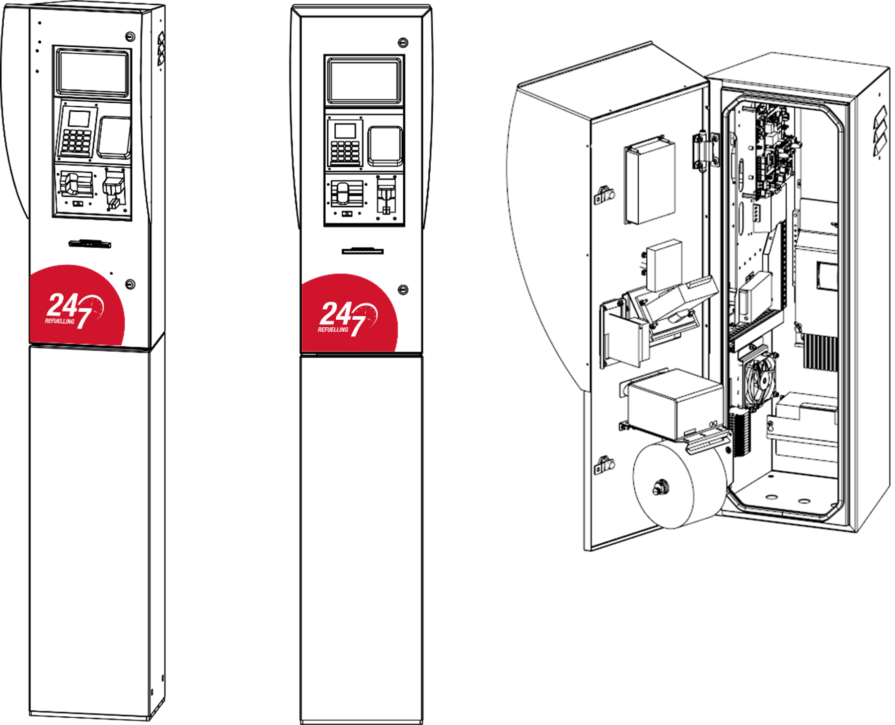

 
 

COM5 PT1 Housing Layout 
Note: This manual covers both the PT1 and PT1 with 7” TFT Display

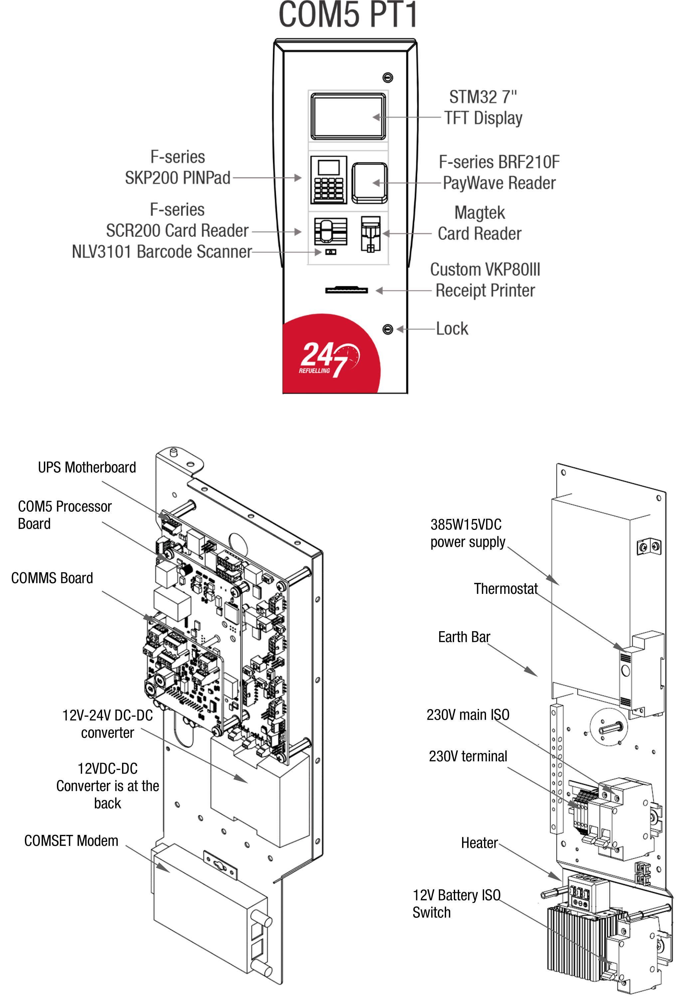

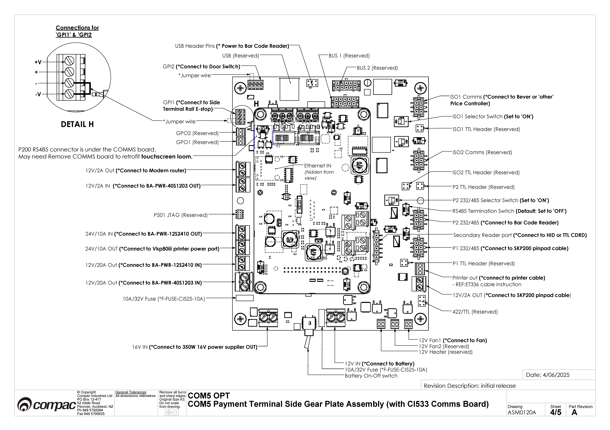

# 12.0 Servicing and Maintenance

The COM5 PT1 is designed for trouble free operation if the following regular maintenance is performed. Depending on the environmental conditions and usage of the site, maintenance may be required more frequently than stated.

# 12.1 Regular Testing

For trouble free operation, the COM5 PT1 should be regularly tested by performing zero value transactions with a known working card.

Swipe card and enter PIN number etc.

Lift pump nozzle and wait until the pump indicates that it is ready to dispense then return pump nozzle without dispensing fuel.

Swipe card and check that a receipt prints out.

Perform this task weekly or more frequently if customers have trouble with the COM5 PT1 operation.

## 12.2 Card Reader

Card reader should be swiped through with a cleaner card wet with cleaner fluid. The card reader may need to be cleaned daily on dirty, dusty, or wet sites.

## 12.3 PIN Pad

The PIN pad keys should be inspected and cleaned to keep the printing legible. A soft cloth should be used. Do not use a cloth moistened with solvent or petrol as the keys may be damaged.

## 12.4 Receipt Printer

Check for foreign matter in the receipt box. Any dust or dirt should be cleaned away with a clean dry fine bristled brush. Perform this task weekly or more frequently in dusty or harsh environments.

Ensure printer has sufficient paper. Remote sites should have a new roll installed at every visit. If there is a local site contact, leave part rolls with them.

## Changing Paper

CAUTION

Use only Compac supplied thermal paper. If you do not use this paper, you may void the warranty, damage the printer, and have receipt printing problems.

To change the paper:

- 	Open the COM5 PT1 door.

- 	Tear the paper and remove from printer.

- 	Lift the paper roll and pull it off the paper roll holder.

- 	Put a new roll into the paper roll holder.

- 	Check the paper is feeding the correct way off the roll (when facing the printer, the end of the paper is closest to you). Push the end of the paper into the slot at the back of the printer. The printer will take the paper and feed it through the machine. (Make sure the paper end is cut square or you may have problems.)

- 	The paper will automatically feed into the printer.

## Clearing Jam

If the receipt paper is jammed, try to clear it using the following technique:

- 	Lift the plastic lid on the top of the printer.

- 	Pick out any loose or jammed paper.

- 	Check the receipt chute is clear and undamaged.

- 	Lower the plastic lid.

- 	Feed the paper back into the machine and perform a test print.

If the printer roll appears wet or damaged, replace it.

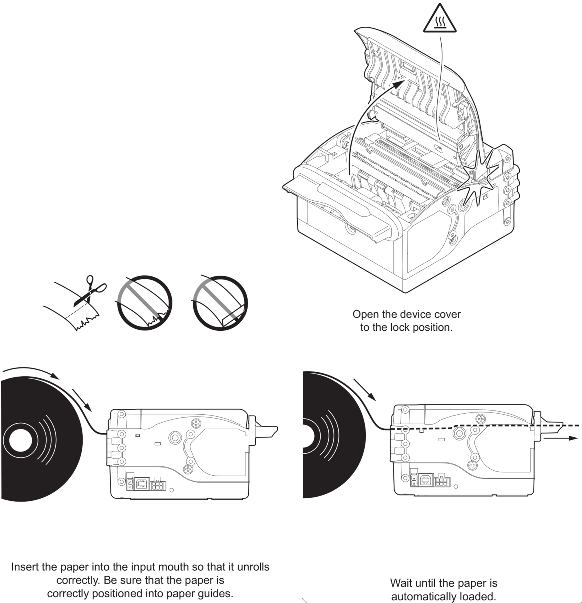

## Removal

- 	Isolate the COM5 PT1

- 	Remove paper roll

- 	Unplug the power and communication connectors from the back of the printer

- 	Unscrew the nylok nuts that fasten the printer to the door and remove the printer

- 	Taking note of the position and orientation of the paper roll support arm, undo the retaining screws and remove

- 	Unplug the paper low sensor from the printer

## Replacement

- 	Fasten the old paper roll arm onto the new printer in the same position as it was on the old printer

- 	Plug the paper low sensor into the printer

- 	Fasten the new printer to the door

- 	Plug the power and communication cables back into the printer

- 	Replace the printer roll, repower the COM5 PT1 and do a test print

- 	Perform a test transaction.

# 12.5 Electronic Module Replacement

To replace the power supply or for easier access to components, the electronic module can be removed from the cabinet.

- 	Push the bottom latch toward the PT1 to fold the electronic module forward or backward.

- 	Pull down the top hinge to remove the electronic module from the PT1.

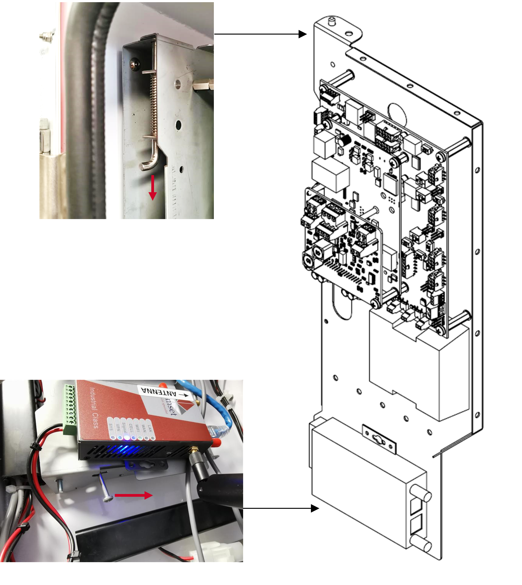

CAUTION

Always take anti-static precautions when working with electronic components for example, wearing a wristband with an earth strap.

**NOTE:** If the module is still functioning, contact the Technical Help Desk to ensure all data has been retrieved before disconnecting.

## Disconnecting the Electronic Module

**CAUTION**

Before any connections are removed, be sure to write down, label, photograph or otherwise record all the connections. Due to the variety of customer requirements and variations in manufacturing the connection instructions given here can only be used as a guide.

- 	COMMS Board. Unscrew all the wires from the COMMS board.

- 	UPS Motherboard. Unscrew all the terminal block connections and unplug all the connectors on the UPS board.

- 	COM5 PT1 Processor board. Disconnect the ethernet cable from the processor board.

- 	Power Supply. Unscrew terminals marked L, N, FG (Live, Neutral and Frame Ground respectively). Disconnect all the wires connected to the power supply module.

Cut any cable ties that may be securing the wires to the chassis or wires that are part of the module.

NOTE: The module is heavy. Make sure it is well supported and no wires are pulled as you remove it.

## Electronic Module Removal

- 	Turn off the mains switch and the Battery Isolation switch before commencing this procedure.

- 	Remove all the connectors/ wires and disconnect from the electronic module.

- 	Unscrew the four Electronic Module retaining nuts at the bottom of the unit.

- 	Using both hands pull the Module forward off the studs.

## Replacement

- 	Reconnect all the cables that were removed.

- 	Lift the module up, place on the studs and fasten with nuts and washers.

- 	Check all connections are secure.

- 	Re-power and test.

# 12.6 Power Supply Replacement

The power supply is a modular unit and repair is not recommended except by an experienced power supply repair technician.

- 	Turn off the mains switch and disconnect the positive terminal from the battery before commencing this procedure.

- 	Note the connections to the screw down terminals and remove the connections.

- 	Remove the power supply.

# 12.7 UPS Motherboard Connections

Connector|Use|Wire Colours|Comment
|-----|-----|-----|-----|
Fan 1| 12V Out| Red=12V Black=GND| 12V Supply to the Fan 1
Heater|	12V Out| Red=12V Black=GND| 12v supply to the Heater
12v in| Battery In|	Red=12V Black =GND|	12V input from the battery
16V IN|	Power In| Red=12V Black=GND| Power from the 16V power suppply
12V/20A Out| 12-12 VDC converter| Red=12V Black=GND| 12V out for the 12-12 VDC converter
12V/20A Out| 12-24 VDC converter| Red=12V Black=GND| Output to the 24V step up converter
24V OUT| To VKP80III printer| Red=12V Black=GND| 24V OUT to the Printer
24V/10A IN| Output from 12-24 VDC converter| Yellow=12V Black=GND| 24V out from the 24V step up converter
12V/2A IN| Output from 12-12 VDC converter|	Yellow=12V Black=GND| 12V out from the 12-12 VDC converter
12V/2A Out|	12V supply to the router| Red=12V Black=GND| Power supply to the router

**CAUTION:**

Use the above table as a guide only as wire colours can change during production and after servicing.

**CAUTION:**

Take care to observe correct polarity as there are components that can be permanently damaged if connected incorrectly.

# 12.8 Power Loss

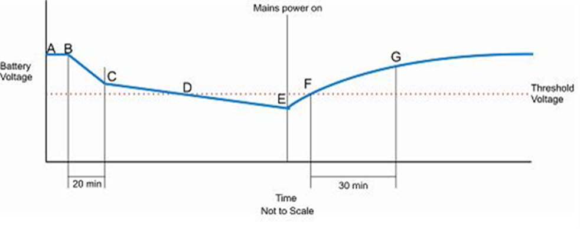 

The diagram above shows what happens when power is lost and then restored.

A =	Battery fully charged and mains power is powering the unit

B =	Mains power failure, unit running on battery.

C =	20 minutes after mains failure, power is shut off.

D = If mains power failed for a significant amount of time, the voltage of the battery may dip below the set 11.5 volts threshold.

E =	Mains power restored; battery charging begins.

F =	Battery reached set threshold level.

G = 30 minutes after battery reaching the threshold level, transactions can now take place.

- 	After mains power to the unit is lost it will no longer allow transactions, but the user will still be able to obtain a receipt that was generated before the power outage.

- 	A receipt can be obtained for up to 20 minutes after mains power failure. The unit will completely power down after 20 minutes. After restoring mains power, the unit will power up. If the voltage of the battery dipped below the threshold level at any time, transactions will be disabled until the battery has been charged for at least 30 minutes above the threshold voltage. This is to ensure there is enough power to print receipts should power fail again.

- 	If the battery voltage does not dip below the threshold level while the mains power is disconnected, normal operation can resume as soon as mains power has been restored.

# 12.9 Battery

The backup battery has an expected life of 5 years in ideal conditions. If the COM5 PT1 stays on for less than 20 minutes during a power failure, then the battery may need replacing.

The backup battery for the UPS is mounted inside the electronics chassis.

**CAUTION:**

Always take precautions with the exposed battery terminals to avoid arcs and short circuits. This can damage sensitive components or cause fire or explosion.

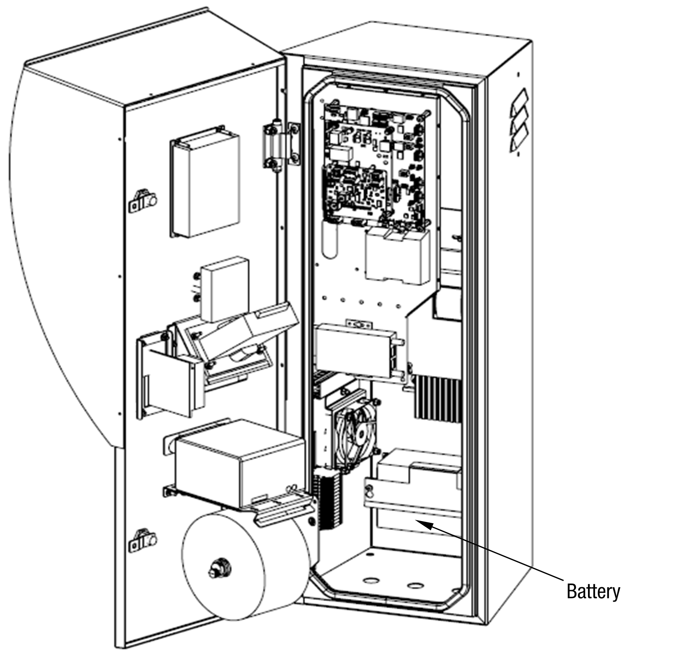

Removal

- 	Remove the electronic module.

- 	Turn off the battery isolation switch.

- 	Unscrew the battery, and remove from electronic module, remove the positive and negative leads from the battery.

- 	Replace.

**CAUTION:**

Take care not to touch the exposed battery cables with the steel bracket.

**CAUTION:**

Ensure the Red lead connects to the red battery terminal marked Severe internal damage can be caused if the battery is connected the wrong way around.

**CAUTION:**

Please ensure the used battery is disposed of in accordance with local environmental regulations

# 12.10 COMMS Board Replacement

**CAUTION:**

Before removing the original CI533 comms board, record all dipswitch settings and configure the replacement Comms board correctly for the site.

**CAUTION:**

Always take anti-static precautions when working with electronic components. i.e., wearing a wristband with an earth strap.

**CAUTION:**

Always take precautions to avoid arcs and short circuits that may damage sensitive components.

### Removal

- 	Turn off the mains switch and the Battery Isolation switch.

- 	Take note of their location and unplug the connections.

- 	Undo the 2 hex nuts holding the COMMS board to the processor board.

- 	Pull the COMMS board out to remove the board from the electronic module.

### Replacement

- 	Align the COMMS board 32pin DIN connector with the COM5 Processor board DIN connector

- 	Align the 2 plastic standoffs and 2 screws.

- 	Push the board onto the standoffs until they click into place.

- 	Fasten the 2 bolts in with the washers.

- 	Test for correct operation.

# 12.11 C5K Processor Board Replacement

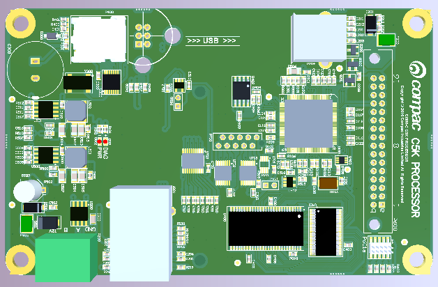 

**CAUTION:**

Always take anti-static precautions when working with electronic components such as wearing a wristband with an earth strap.

**CAUTION:**

Always take precautions to avoid arcs and short circuits that may damage sensitive components.

**NOTE:** Before replacing the processor board, contact the Compac Help Desk to ensure all data has been uploaded. Do not unplug the board until this has been done.

### Removal

- 	Turn off the mains switch and the Battery Isolation switch.

- 	Remove the COMMS board as stated above. Label and photograph if required.

- 	Unplug the Ethernet cable from the COM5 Processor board.

- 	Unscrew the four hex bolts from the board.

- 	Pull the board off the UPS Motherboard to disconnect the processor board from the UPS motherboard.

**NOTE:** The COM5 Processor board MUST be installed the right way round. Installing Processor board the wrong way will destroy them and will void any warranty.

### Replacement

- 	Reconnect the COM5 Processor board to the UPS motherboard making sure that the 2 connectors are connected properly.

- 	Hand tight the 4 bolts in to secure the processor board.

- 	Plug in the ethernet cable to the processor board.

- 	Install the COMMS board.

- 	Make sure all the connectors are connected properly.

- 	Repower the unit.

- 	Contact the Help Desk and follow their instructions to re-install site parameters.
# 12.12 UPS Motherboard replacement

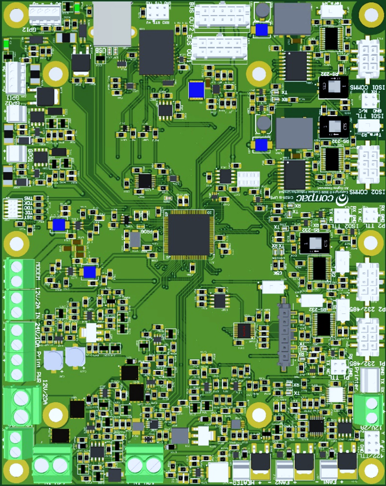

**CAUTION:**

Always take anti-static precautions when working with electronic components such as wearing a wristband with an earth strap.

**CAUTION:**

Always take precautions to avoid arcs and short circuits that may damage sensitive components.

**NOTE:** Before replacing the board, contact the Compac Help Desk to ensure all data has been uploaded. Do not unplug the board until this has been done.

### Removal

- 	Turn off the mains switch and the Battery Isolation switch.

- 	Remove all the wires from the UPS motherboard terminals and disconnect all the connectors.

- 	Remove the COMMS board and the COM5 Processor board as stated above. Label and photograph if required.

- 	Remove the six bolts that are holding the board to the chassis.

- 	Pull the board off the UPS Motherboard to disconnect the processor board from the UPS motherboard.

**NOTE:** The COM5 Processor board MUST be installed the right way round. Installing Processor board the wrong way will destroy them and will void any warranty.

### Replacement

- 	Bolt in the UPS motherboard to the chassis of the COM5 PT1.

- 	Reconnect the COM5 Processor board and the COMMS board to the UPS Motherboard.

- 	Plug in the ethernet cable to the processor board.

- 	Reconnect all the wires and connectors to the terminals of the UPS Motherboard.

- 	Make sure all the connectors are connected properly.

- 	Repower the unit.

Contact the Compac Help Desk and follow their instructions to re-install site parameters.

### Connections Layout

Connector| Use|	Wire Colours| Comment
|-----|-----|-----|-----|
Secondary reader Port| Secondary reader| Red, Blue, White, Green, Brown| Optional card reader
P1 232/485| SCR reader COMMS| Orange/White, Brown/White, Green/ White|	SCR reader
Printer out| Printer COMMS| Black, White, Red| Printer cable

**CAUTION:**

Use the above table as a guide only as wire colours can change during production and after servicing.

# 12.13 PIN Pad Replacement

**CAUTION:**

Removal of the PIN pad or any of its covers will permanently disable it. Do not remove the PIN pad unless you have a new replacement on hand.

### Removal & Replacement

- 	Turn off the mains switch and the Battery Isolation switch.

- 	Unplug the cable from the back of the PIN pad.

- 	Undo the 4 nylok nuts holding the Pin pad to the door.

- 	Gently remove the PIN pad.

- 	Return the PIN pad to Compac.

- 	Replace.

### Anti-tamper Protection

A unit that has been disabled will display the message: "Secure Link Fail - Terminal Locked".

***NOTE:*** The PIN pad is equipped with an anti-removal and anti-tamper protection. Once the unit has been powered up the protection devices are armed. After this, removal of the unit or any of its covers or subjecting it to mechanical force, extremes of temperature or voltage will disable it requiring return to the factory for testing and resetting.

# 12.14 Card Reader Replacement

CAUTION

Removal of the Card Reader or any of its covers will permanently disable it. Do not remove the Card Reader unless you have a new replacement on hand.

### Removal & Replacement

- 	Turn off the mains switch and the Battery Isolation switch.

- 	Unplug the PIN pad to card reader cable.

- 	Undo the 4 nuts holding the card reader to the door.

- 	Gently remove the card reader

- 	Replace

### Anti-tamper Protection

A unit that has been disabled will display the message: "Secure Link Fail - Terminal Locked".

NOTE: The card reader is equipped with an anti-removal and anti-tamper protection. Once the unit has been powered up the protection devices are armed. After this, removal of the unit or any of its covers or subjecting it to mechanical force, extremes of temperature or voltage will disable it requiring return to the factory for testing and resetting.

# 12.15 Fan & Filter

The Filter element can become blocked up in dusty environments and may be removed from the ducting and cleaned with a vacuum cleaner or compressed air. If the filter is excessively dirty or damaged it can be replaced with a new filter.

The Fan has a Life expectancy of 100,000 hours in ideal conditions. If the fan fails or becomes excessively noisy it should be replaced.

### Filter Replacement

### Removal & Replacement

- 	Unclip the fan connector or turn off the COM5 PT1

- 	Unscrew the four screws that hold the air duct together and remove the filter housing.

- 	Remove the filter.

- 	Replace.

**NOTE:** The filter element can be cleaned with a vacuum or compressed air.

### Fan Replacement

### Removal & Replacement

- 	Unclip the fan connector.

- 	Remove fan from COM5 PT1 housing.

- 	Replace.

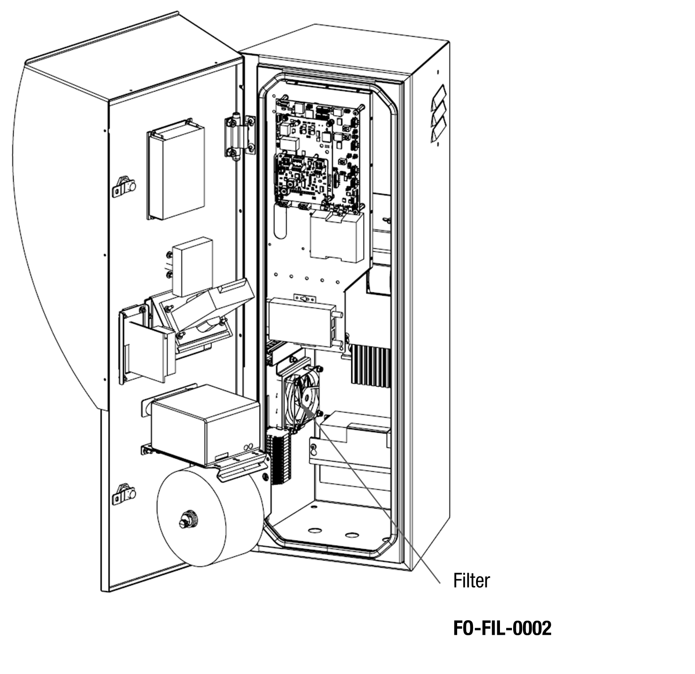

# 12.16 Modem LEDs

Comset modems are currently used in the COM5 PT1. The LEDs can be used to diagnose problems with the modems. The LEDs of these modems are as follows.

Refer to the accompanying table to understand the modem LEDs.

LED| Indication Light| Description
|-----|-----|-----|
|SYS| On for 25 seconds| On for 25 seconds after power up
| |Blinking| System set-up normally
| |Off or still on after 25 seconds|	System set-up failure
| | | |
LAN| Blinking| Ethernet data transmission
| |Off|	No Ethernet connection
| |On|Ethernet is connected
| | | |
VPN| On|	VPN tunnel set-up
| | Off|	VPN tunnel not set-up or VPN failure
| | | |
CELL| On|	Cell connection is ‘UP’ and now you have access to the Internet
| | | |
WIFI| On|	WiFi enabled
| | Off|	WiFi disabled
| | Blinking| Ethernet data transmission
| | | |
WAN| Off|	No Ethernet connection
| |On| Ethernet is connected
| | | |
Signal|	Off| No signal, or signal checking is not ready
| | Blinks once every 4s|	Signal bar is 1
| | Blinks once every 3s|	Signal bar is 2
| | Blinks once every 2s|	Signal bar is 3
| | Blinks once every 1s|	Signal bar is 4
| | Blinks twice every1s|	Signal bar is 5
| | 

 

# 13.0 Troubleshooting

|Problem|Possible Cause|Recommended Action
|-----|-----|-----
|No Power/No Lights|No power entering unit|Ensure that power is entering unit, check external fuses and switches
||Faulty power supply|Replace the Power Supply module
|Will not Print|No power to printer|Check the voltage on the printer power cable and try performing test print
||Printer data cable unplugged|Check cable is plugged in correctly at both ends and is free from corrosion
||Transaction not complete|Ensure all nozzles relating to the transaction are properly hung up
||Trying to print on wrong side of paper|Remove paper and re-insert
||Faulty Printer|Replace Printer
||Faulty Electronics module|Replace the electronics module
|Paper low message on internal PIN pad. EFTPOS PIN pad displays Receipt unavailable OK? message after swiping card|No paper or low on paper|Load a full roll of paper
||Faulty low paper sensor|Disable Low Paper Sensor
||Poor adjustment of low paper sensor|Disable Low Paper Sensor
||Door Open|Close Door
||Wrong system with distributer or In-house cards|Wrong card base (ISO, Access number)Check card base is loaded onto the COM5 PT1
||Intermittent or broken connection between COM5 Processor board and the Router.|Re-power COM5 PT1 and jiggle network cables to see if fault re-occurs. If so, try replacing cables and/or connectivity module. Replace the Router module
|Will not communicate to pumps|Connection to the pumps has been cut|If not check the pump comms cabling from pumps to the COMS board.  
||No power on pumps|Check power
||Wrong pump protocol|Check that the pumps and their protocols matches what is set in the COM5 PT1. 
||Faulty pump or pumps|Repair pump
|Pump offline meassage on EFTPOS PIN pad after pump number has been selected|Pumps have gone into standalone mode|Configure pumps for inhibit standalone mode. Refer to Pump or Dispenser manual for detailed instructions	
||Board fault|Replace Board
|Pump Error meassage on display|One of the linked pumps or dispensers has encountered an error.|Read the error message on the pump display to find out what is wrong.
|System Not Ready message on EFTPOS PIN pad|Internet connection to card processing company unavailable|Re-power COM5 PT1. Check connection by plugging laptop computer into one of the connectivity module ports and trying to open a common web site.
|Unable to Auth or Block cards from CompacOnline|Internet connection quality low or intermittent|Check with internet service provider for information on internet service quality.	
||COM5 PT1 not communicating with pumps|See Will not communicate to Pumps section above
|Pumps will not dispense fuel|Wrong pump number selected|Ensure pump number set in pumps matches pump number set in PT1 and pump number written on the pump.
||No fuel in tanks|Verify tanks have sufficient product
||Pump fault|Try another pump to verify. Contact pump service agent.Have service agent check the pumps
|Unable to get data from COM5 PT1|Internet connection down|Check with internet service provider for information on internet service quality
|COM5 PT1 is beeping constantly and displays System Not Ready message when card transaction is attempted.|Unit lost Mains power, Low Battery.|Check the internal screen to confirm if there is No Mains or Battery Low messages on the screen and get the electrician to investigate if there is a power or battery issue.

# 14.0 Spare Parts

|Description|Part number
|-|-
F series SKP200 PINPad|FO-BA-PPAD-ABFS
F series SCR200 Card Reader|FO-BA-CDRD-ABFS
F series BRF210F PayWave Reader|F-BA-PWV-ABFSV
NLV3101 Barcode Scanner|F-BA-BCS-NLV3101
Magtek Card Reader|F-BA-CDR-MT-TTL2
STM32 7" TFT Display|F-BL-CGLCD-DSP7P
Custom VKP80III Receipt Printer|F-BA_PRT-VKP80
UPS Motherboard|F-CP-C5K-UPS
COM5 processor Board|F-CP-C5K-CMPGIL
COMMS Board|F-CP-C5K-CG485FM
12V-12V DC-DC converter|F-BA-PWR-40S1203
12V-24V DC-DC converter|F-BA-PWR-12S2410|
COMSET Modem Telstra AUS|FO-MDM-CMST4GXTA
COMSET Modem Vodafone NZ|FO-MDM-CMST4GXVN
COMSET Modem Spark NZ|FO-MDM-CMST4GXXT
16VDC power supply module|F-BA-PWRLRS35015
Thermostat|FD-BA-TEMP-STAT
230V main ISO Switch|FD-BS-2P-ISO-SW
Heater|FD-BA-HEATER-45W
Fan|F-CU-MXFAN-KT
Camlock with keys|F-KEYS-418HSL

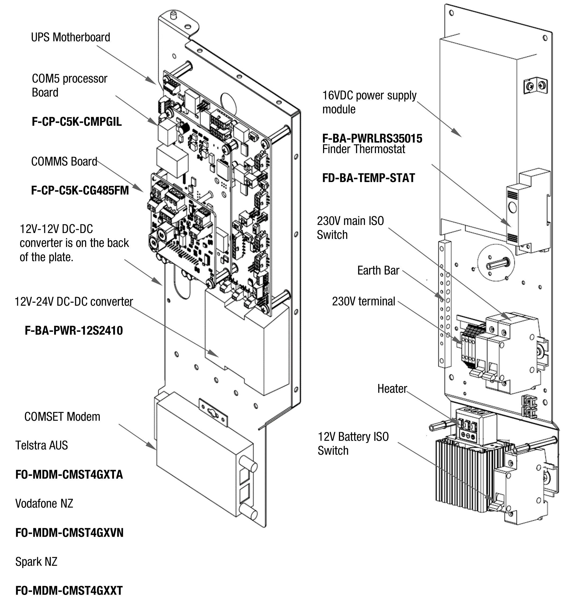

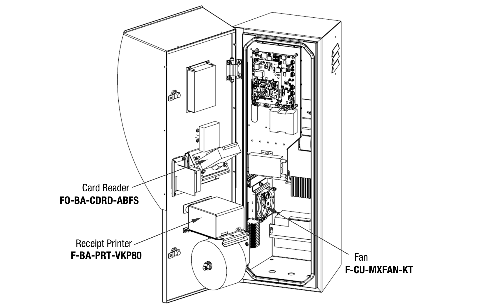

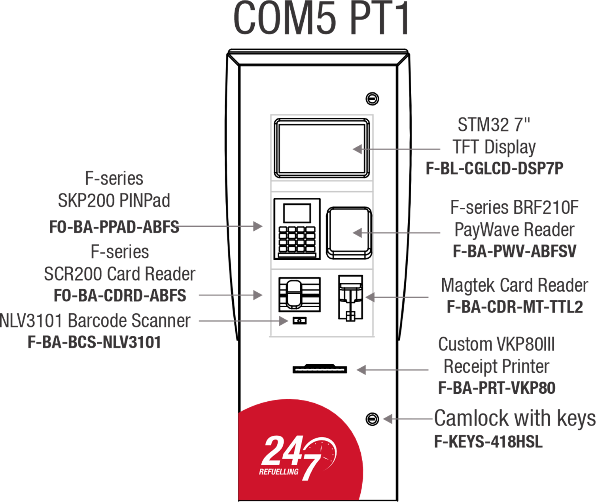