# CompacOnline V2 User Manual

**Version No:** 1.0.1
**Date:** 29th December 2025

---

## Conditions of Use

**Compac Industries Ltd.**
52 Walls Road. Penrose. Auckland 1061. New Zealand.
PO Box 12 417. Penrose. Auckland 1642. New Zealand.
Tel: +64 9 579 2094 Fax: +64 9 579 0635 info@compac.co.nz
www.compac.co.nz

- Read this manual completely before working on, or making adjustments to, the CompacOnline website.
- Along with any warnings, instructions, and procedures in this manual, you should also observe any other common sense procedures that are generally applicable to websites of this type.
- Compac Industries Limited accepts no liability for loss of profits, loss of products, and loss of time, resulting from failure to follow any warnings, instructions, and procedures in this manual, or any other common sense procedures generally applicable to software of this type, whether incurred by the user or their employees, the installer, the commissioner, a service technician, or any third party.
- Unless otherwise noted, references to brand names, product names, or trademarks constitute the intellectual property of the owner thereof.
- Every effort has been made to ensure the accuracy of this document. However, it may contain technical inaccuracies or typographical errors. Compac Industries Limited assumes no responsibility for and disclaims all liability of such inaccuracies, errors, or omissions in this publication.
- Compac Industries Limited reserves the right to change the specifications of its products or the information in this manual without necessarily notifying its users.

**Manufactured By:**
52 Walls Road, Penrose, Auckland 1061, New Zealand
P.O. Box 12-417, Penrose, Auckland 1641, New Zealand
Phone: + 64 9 579 2094
Fax: + 64 9 579 0635
www.compac.co.nz

Copyright ©2015 Compac Industries Limited, All Rights Reserved

---

## Document Control

### Revision History

| Version | Date       | Author(s)  | Revision Notes                                                                                  |
|---------|------------|------------|-------------------------------------------------------------------------------------------------|
| 1.0.0   | 23/08/2024 | R Comision | New Manual                                                                                      |
| 1.0.1   | 29/12/2025 | W Zheng    | Added Document Control and Contents table. Updated screenshots and Transactions and Cards pages. |

---

## Contents

- [Overview](#overview)
- [Registration](#registration)
- [Logging on](#logging-on)
- [Home Page](#home-page)
- [Sites Page](#sites-page)
- [Transactions Page](#transactions-page)
- [Products Page](#products-page)
- [Price Schedule Page](#price-schedule-page)
- [Card Management](#card-management)
- [User Management](#user-management)
- [Monitor Page](#monitor-page)

---

## Overview

This document provides a high-level overview of CompacOnline V2 and is intended to assist users in navigating the portal.

Access to CompacOnline V2 requires valid login credentials. The availability of features described in this document may vary depending on the access level assigned by Compac and your Administrator. For further information, please contact your Compac representative.

---

## Registration

Users who are added to CompacOnline will receive an invitation email to set up their account. Follow the link in the email to complete the registration process.

---

## Logging on

After completing registration, access CompacOnline by visiting [https://portal.compaconline.com/](https://portal.compaconline.com/) and logging in with your credentials.

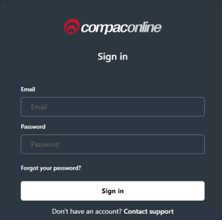

Contact your Compac Representative if SSO (Single Sign On) is required to be set up to access CompacOnline Portal.

---

## Home Page

Once logged in, you will be presented with the Home page. Options are found on the left-hand side of the page.

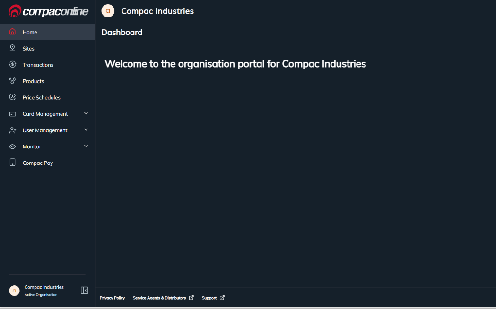

- **Home** – This is reserved for future Dashboard development.
- **Sites** – displays all Sites listed under the current Organisation
- **Transactions** – displays all transactions processed through this Organisation
- **Products** – displays all Products available to be used under the current Organisation
- **Price Schedule** – displays all Price Schedules available under the current Organisation
- **Card Management**
  - **BIN Ranges** – displays all BIN Ranges that can be configured under the current Organisation
  - **Cards** – displays individual card that can be processed through CompacOnline (Account Cards)
- **User Management**
  - **Users** – displays all current users that have access to the Organisation and the permission group the user is allocated to. You will not see the permission groups users are assigned to, if they have higher permissions than you.
  - **Permission Groups** – displays the permission groups created and individual permissions enabled for the user. You can only see permission groups that have the same or less permissions than you.
- **Monitor**
  - **Events** – displays all events/notification triggered from a site of the current Organisation
  - **Activity Logs** – displays all activity and configuration changes made by users within the Organisation
  - **Alerts**
    - **Alert History** – displays all alert history
    - **Alert Rules** – displays a list of all alerts created
    - **User Groups** – displays a list of User Groups created for Alerts
- **Compac Pay**
  - **Organisation** – this enables Mobile App function for the organisation
  - **Sites** – this contains Windcave Mobile merchant details for each site

---

## Sites Page

Sites created under the Organisation is listed on this page. To view or edit site specific information and configuration, select the site required.

> **Note:** Editing the site config will trigger a config/systems download to the device.

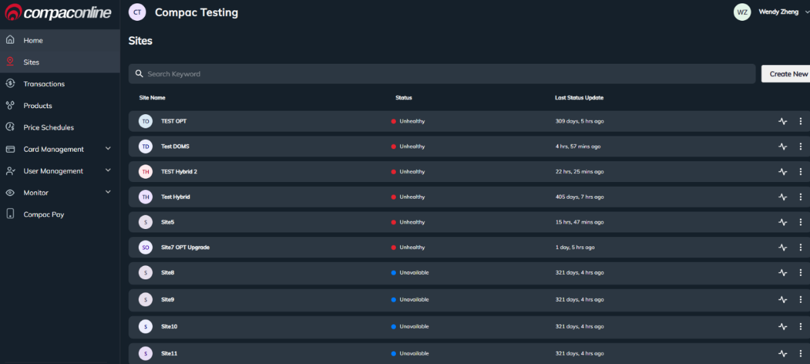

Click on the status button of a site will display the high-level status of the Terminal, Pumps, Tanks and Forecourt Controller.

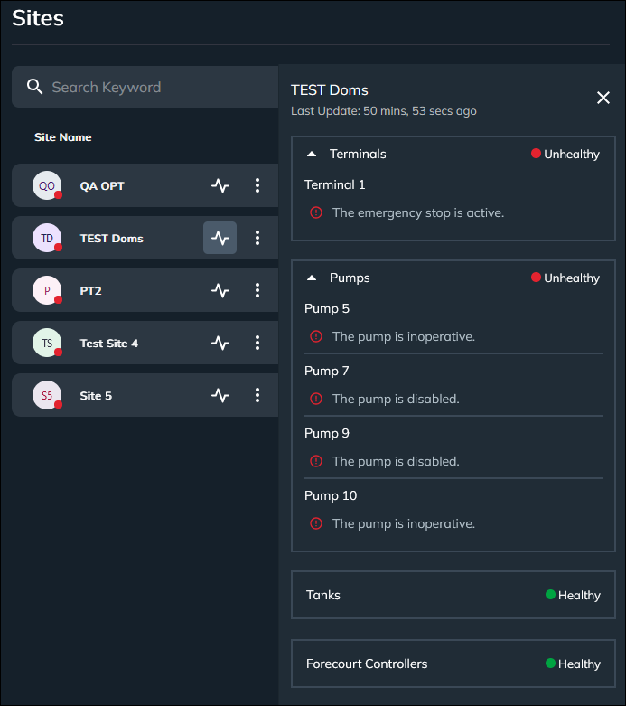

Under Sites, the following options are available:

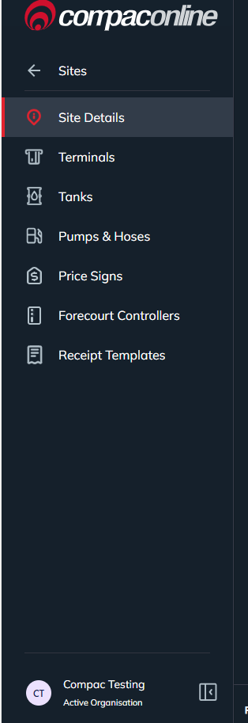

### Site Details

This page lists the site details: *Site Name, Currency, Address, Tax Rate and Tax Identifier*.

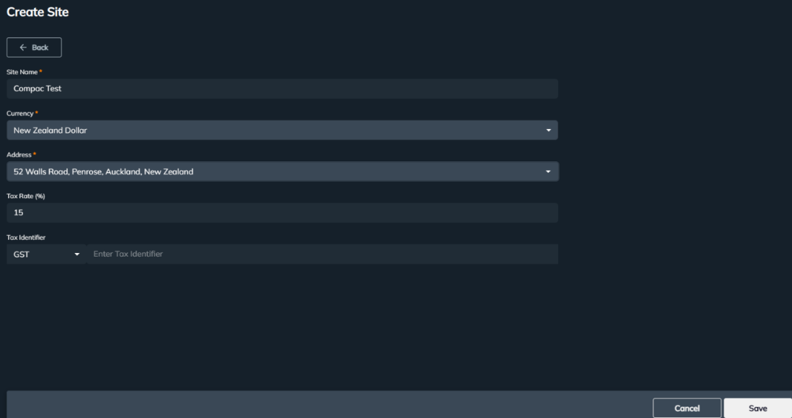

### Terminals

Displays a list of terminals connected to site.

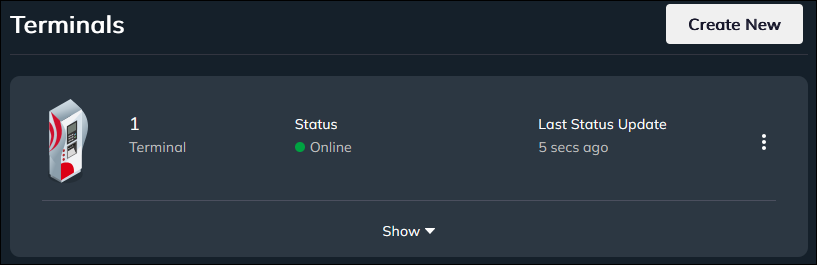

Selecting the terminal will open the configuration page. Selecting the *Show* button will show more information of the status of the terminal.

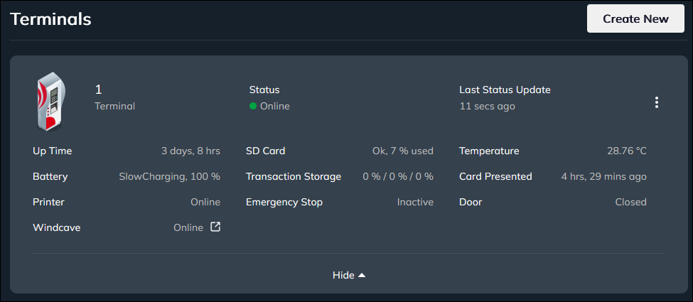

Selecting the Windcave status will show the status of each Windcave hardware connected to the unit.

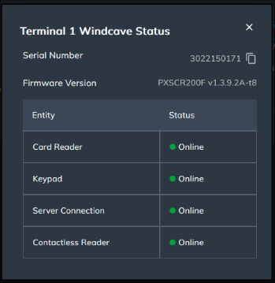

Selecting the 3 dots on the side of each terminal will bring up the Operations menu related to that specific terminal. You may see different options based on the permissions you are assigned with.

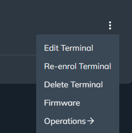

Under "Operations", you may see more options based on your permission levels:

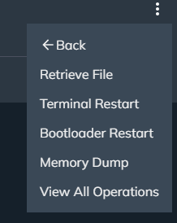

### Pumps & Hoses

Displays all pumps and hoses configured for this site.

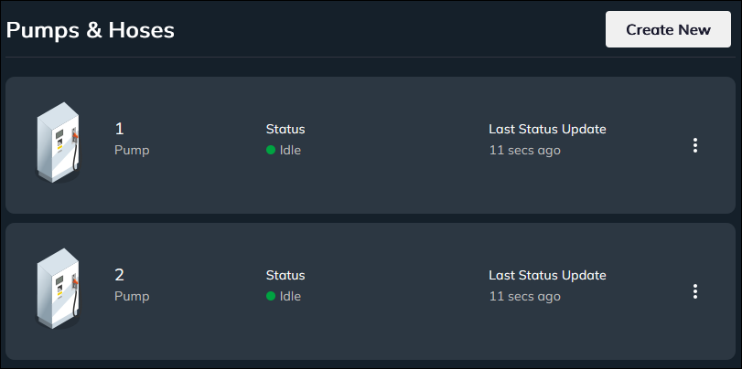

Pump configuration can be viewed by selecting each pump number.

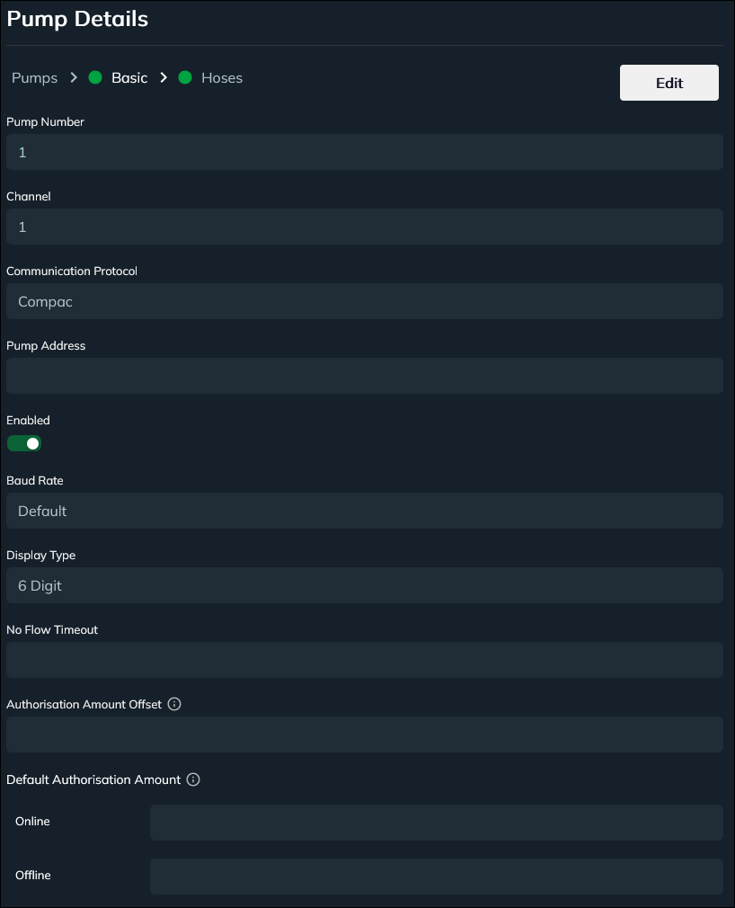

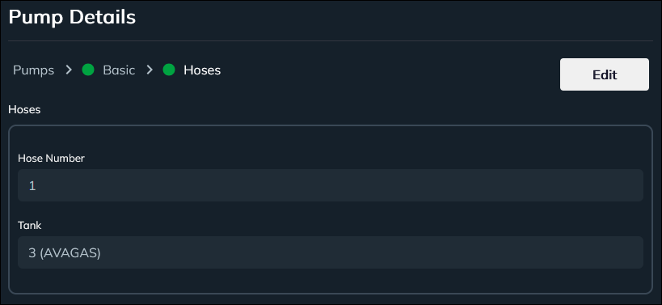

### Tanks

Displays the Tank/s configured for site.

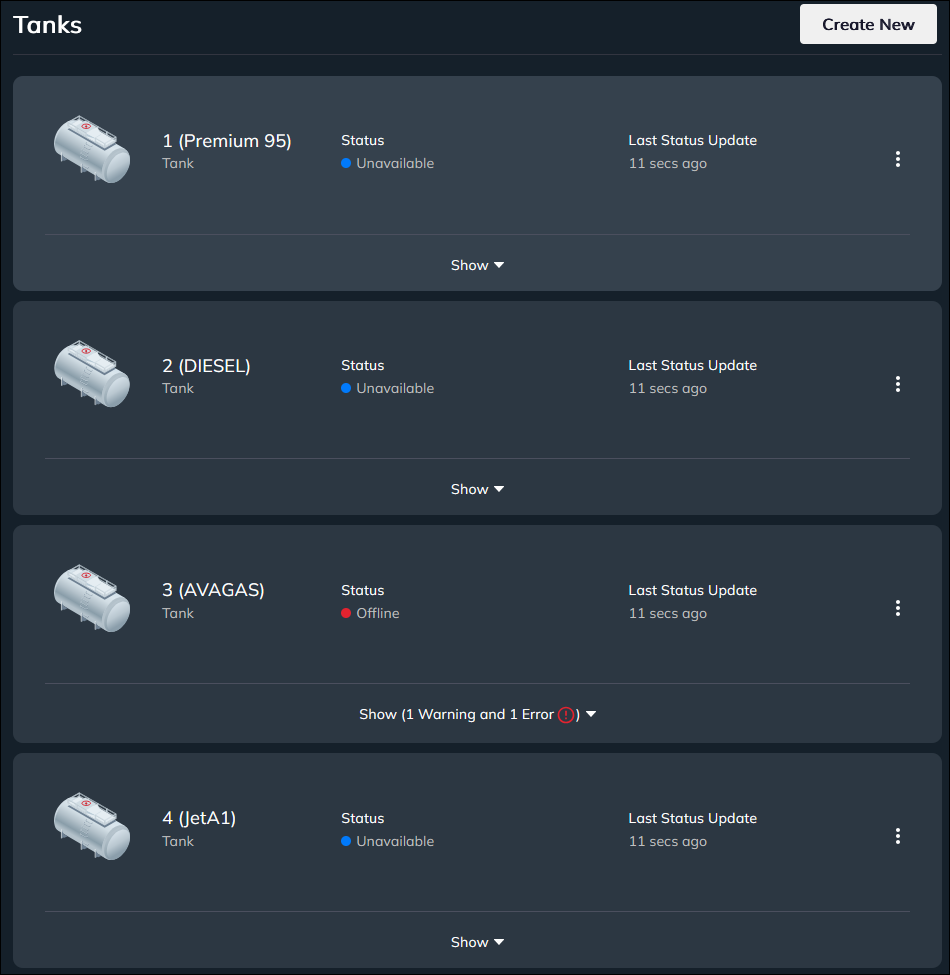

Each tank listed is linked to a Product configured for the Organisation. Tank details can be viewed by selecting each tank. Details include *Tank Number, Product, Capacity and Gauge*.

### Price Sign

Displays the Price Sign configured for the site.

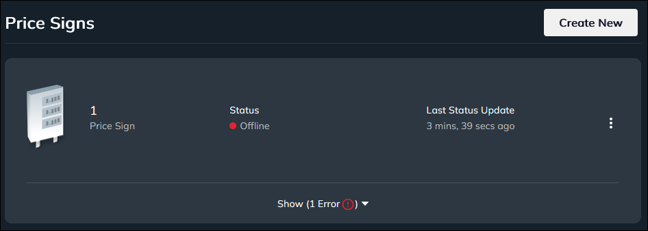

Price Sign details can be viewed by selecting the Price Sign.

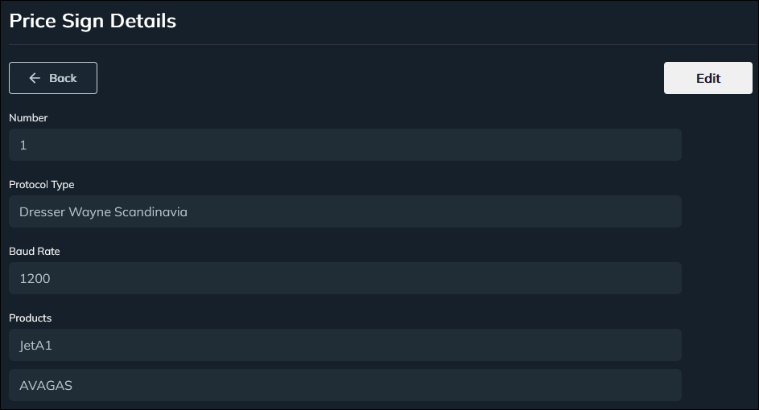

### Forecourt Controllers

Displays the forecourt controller that your Compac OPT is connected to.

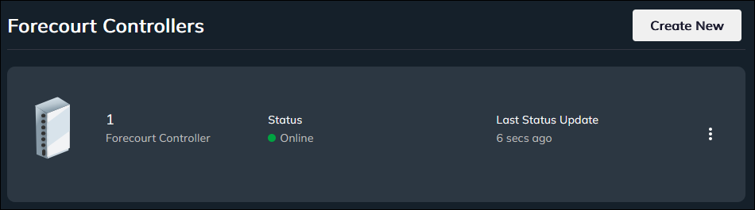

### Receipt Templates

Displays the receipt template of each BIN Range.

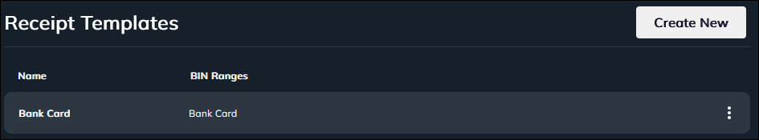

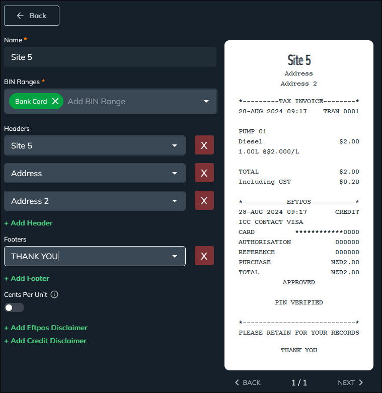

Each receipt template corresponds to a BIN Range that is available under the Organisation.

The following features can be added on receipts:

- **Headers and Footers** – configured for site name and addresses, can also be customised
- **Cents Per Unit** – enabling this will print the unit price in cents
- **Eftpos and/or Credit Card disclaimer** – standard authorisation disclaimer can be added for bank card transactions

---

## Transactions Page

This page will display all transactions happened under the current Organisation. This will include the transactions processed using Mobile App. App transactions can be identified with a different reference number. E.G.: `CP2339`.

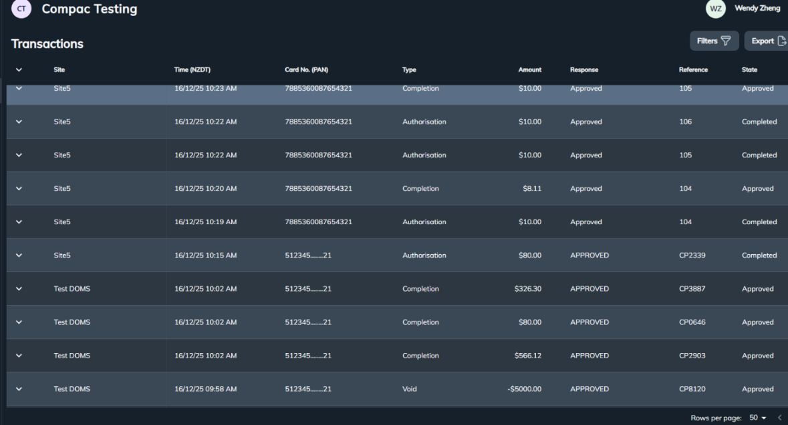

- **Authorisation and Completion** on a transaction can be viewed individually by selecting the corresponding transaction.

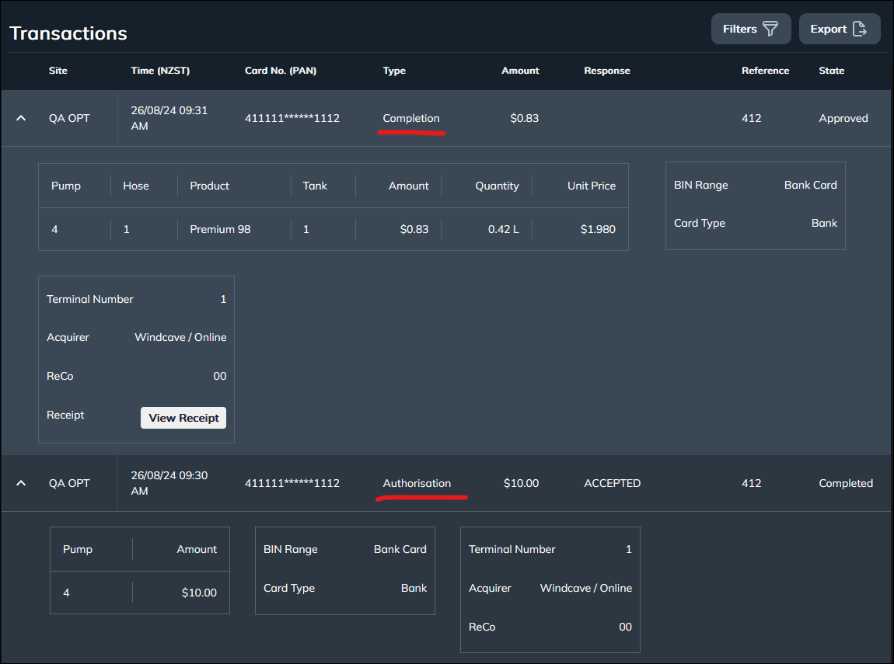

Selecting the *View Receipt* will display the printed receipt of the transaction.

### Example of Using Filters to narrow down specific transactions

Suppose you want to check all the transactions taken by card `7885360087654321` during this week on site 'Site5'.

- Select the Organisation **Compac Testing** which 'Site5' belongs to.

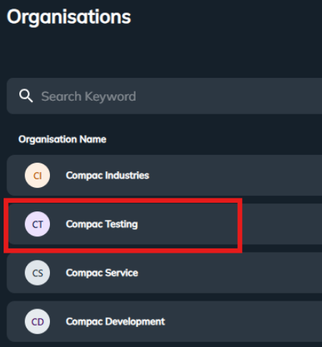

- On the Sidebar, select **Transactions**

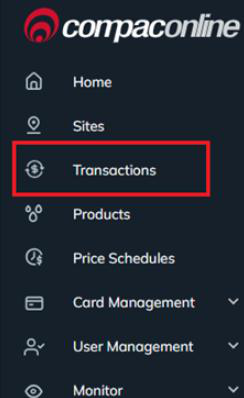

- Select **Filters** on the top right of the transaction page to set the filter. In the filter, select the correct site name, Date Range and input the card number then click on 'Apply'.

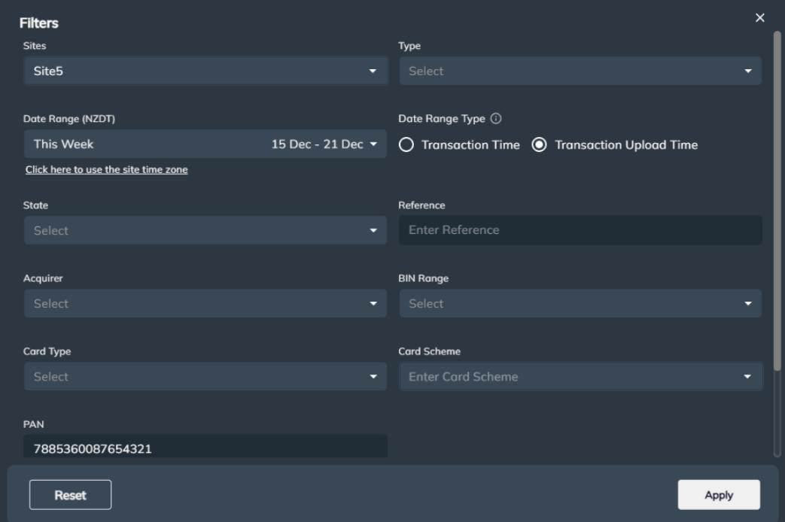

- Now all the transactions you want to check are listed as following screen shot.

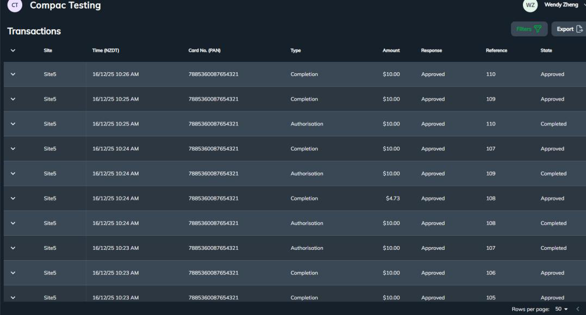

Transactions can be exported from CompacOnline. To export transactions, select **Export** from the top right corner of the page.

There are currently 3 types of exports available. Transaction export is only available in CSV format. Transaction Totals Card Scheme and Transaction Totals Product can be exported in CSV or PDF format.

Transaction export has columns selection whereas the other two reports don't. Transaction export also has more filter options than the other two reports.

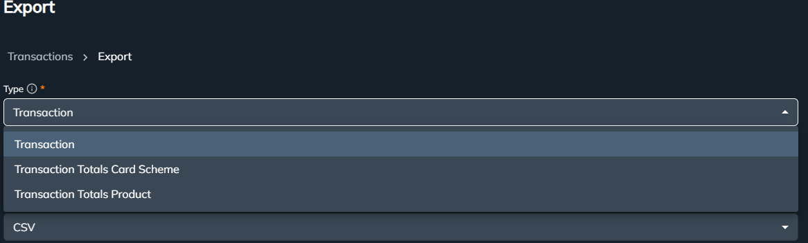

Enter and configure the report as required using the following:

- **Name**: Give your exported transaction file a name
- **Filters**: Use this option to filter and narrow down the criteria of the transactions. Select **Edit**.
  - **Sites**: Select a site, or leave blank for all sites (multi site filter not supported)
  - **Type**: Select a Transaction Type or leave blank to select all
  - **Date Range**: Select the date range from the list or leave blank to capture all transactions
    - For *Custom* date, specific date/time is required
  - **Date Range Type**: Select either *Transaction Time* or *Transaction Upload Time*
    - *Transaction Time*: Only transactions that occurred in the specified date range will be included in the report
    - *Transaction Upload Time*: Only transactions that were uploaded in the specified date range will be included in report. This option is useful for ensuring no transactions are missed when there is a delay in uploading them
  - **State**: Select a transaction state or leave blank to select all (multi selection of transaction state not supported at this stage)
  - **Reference**: Enter the reference number or leave blank
  - **Acquirer**: Select an Acquirer or leave blank to select all Acquirers
  - **BIN Range**: Select a BIN Range or leave blank to select all BINs
  - **Card Type**: Select a Card Type or leave blank to select all
  - **PAN**: Enter PAN or leave to select all
  - **Card Tags**: Select a Card Tag and specify the value or leave blank to select all

Select **Apply** to apply the filters.

> **NOTE**: Select **Reset** to reset the filter values and select *Apply* to save, if you don't want the browser to save this filter option for next time use.

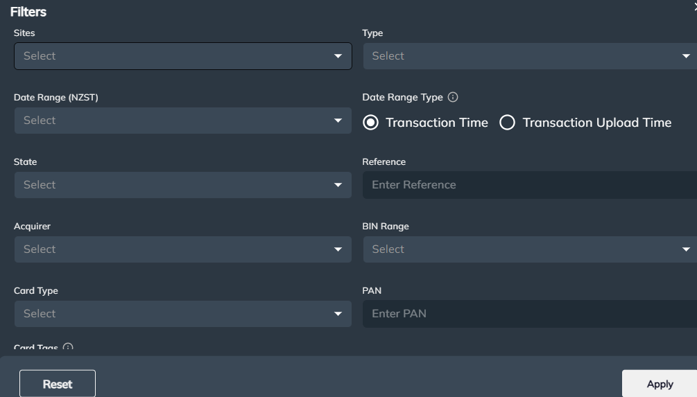

- **Columns**: Here you can add the columns required on the report. To change the order of columns, simply drag and drop them. The leftmost column will be displayed as the first column in the generated report file. Click on the "setup" icon for Date Time Site Local Column to change the time format.

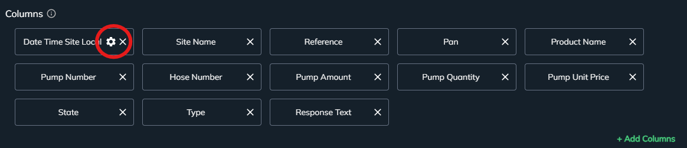

To add columns, select **+ Add Columns**. Select the missing columns and select Add.

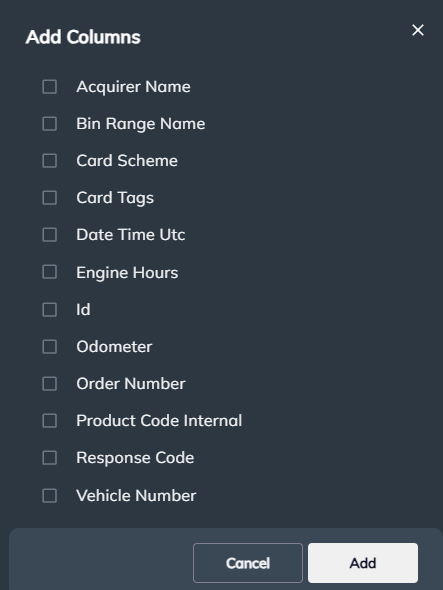

Select **Export** to start exporting the transactions.

---

## Products Page

This page will display all current products that have been added to the Organisation.

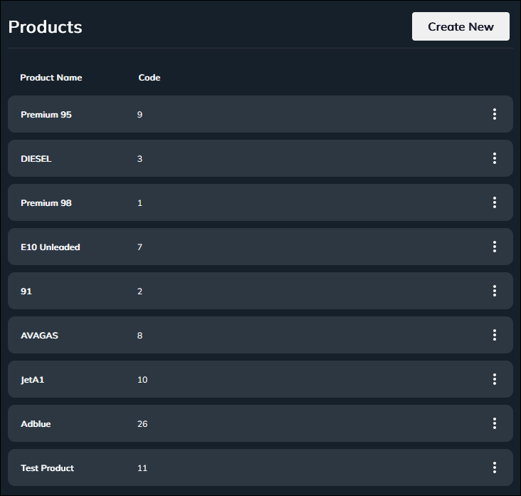

To view the details of each product, select the corresponding product. The product details includes *Unit of Measure* and *Product Code*.

---

## Price Schedule Page

This page contains the price schedule of each product. Price schedules can be applied to one or multiple sites within the Organisation.

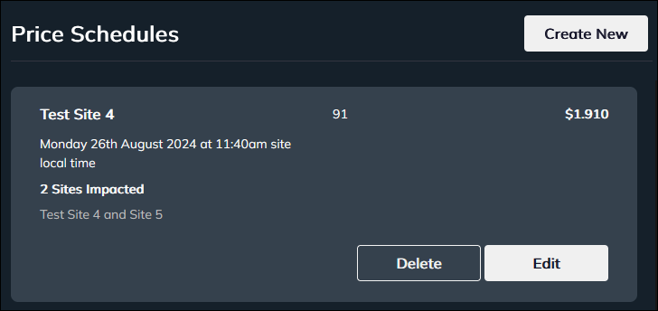

Each price schedule can be applied to a single or multiple sites within the Organisation, a site can only have one price schedule linked to it.

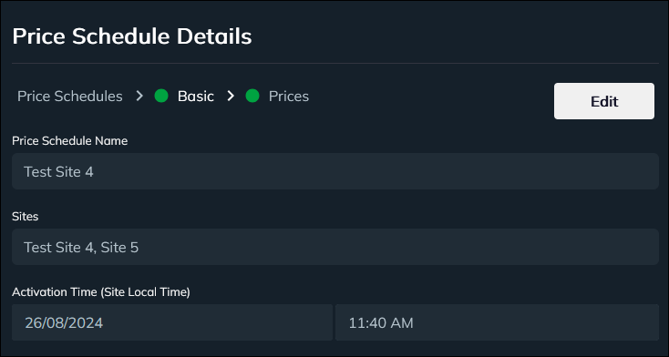

---

## Card Management

### BIN Ranges

This page displays the current card bin range that the Organisation can process.

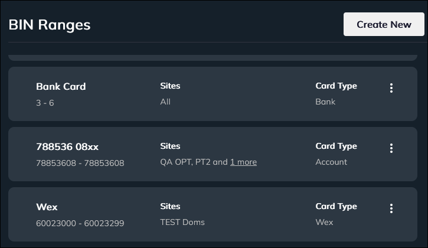

Specific routing and processing rules e.g. Offline acceptance, auth limits and prompts can be configured here, please contact Compac Industries to arrange this.

### Cards

This page displays individual cards that can be processed through CompacOnline (Account Cards). Cards that are processed through an acquirer e.g. Windcave or WEX can not be added.

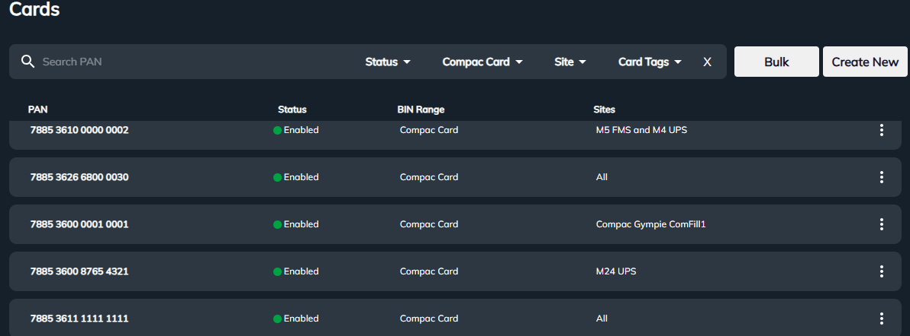

Each card can be configured to a site, restrict product and/or have a set pin.

Account cards can be added individually using *Create New* button or through *Bulk* upload function to CompacOnline.

#### Create New

Each card can be configured to a specific site, multiple sites or all sites under the Organization. Card can be configured to be restricted to products, to an expiry date, to a PIN. If PIN needs to be reset by user at terminal, this can be configured. Card related details can be entered under Card "Tags".

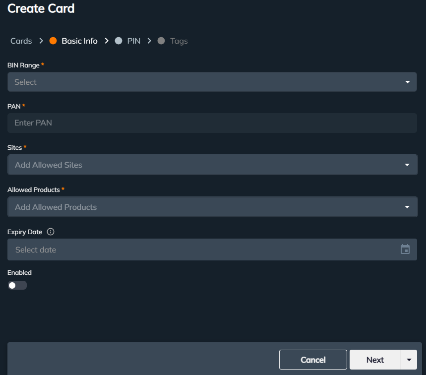

#### Bulk Card Upload

1. Click on **Card Management / Cards**

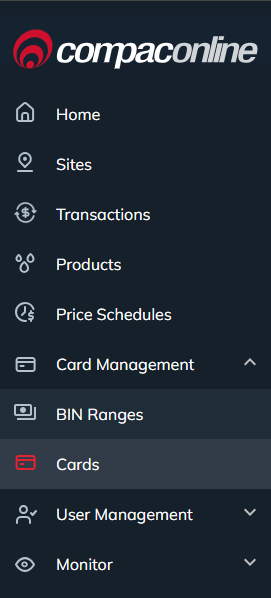

2. On the right hand side click **Bulk**

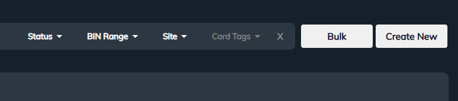

3. On the right hand side click **Start New**

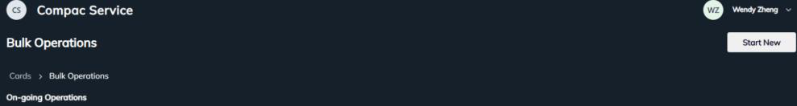

4. Click on the **Import Cards Template CSV**.

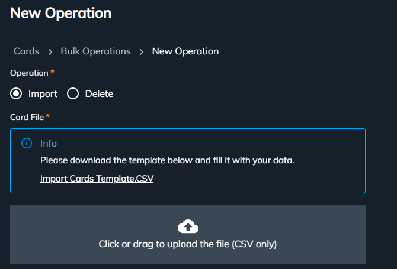

5. Fill out the required fields for all cards you want to import.

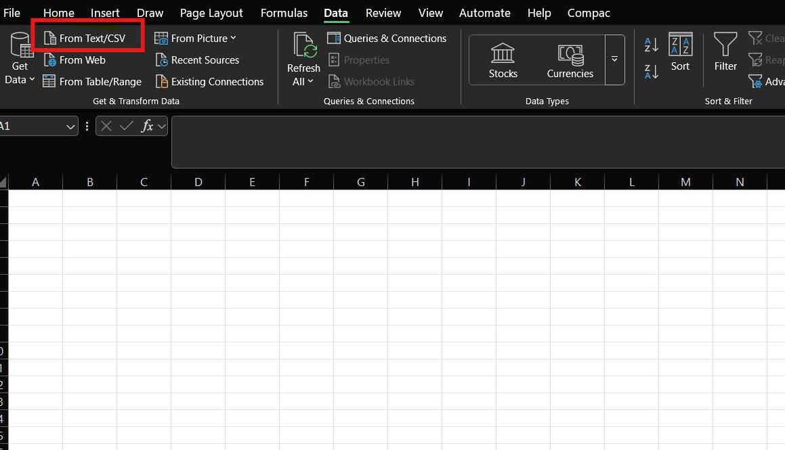

6. Open a new Excel sheet. Click on "Data" then select "Get Data From Text/CSV"

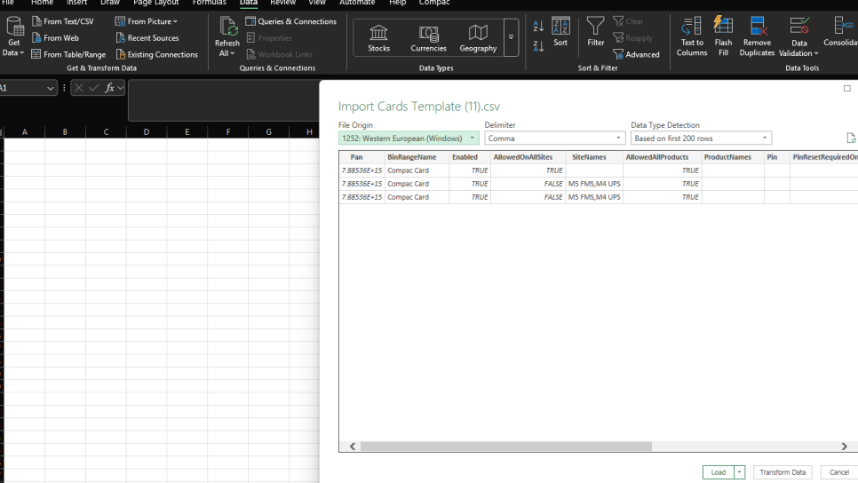

7. Select the updated card file and Click on "Transform Data".

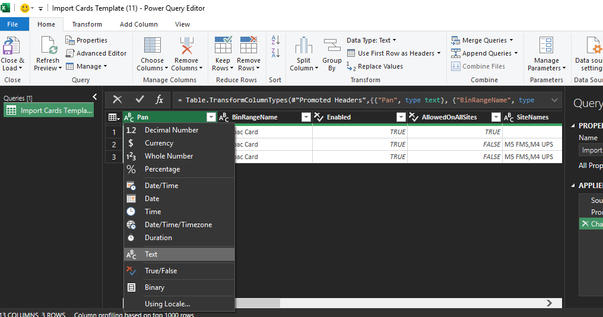

8. Change the format of the Pan column to "text" and replace the current data in that column.

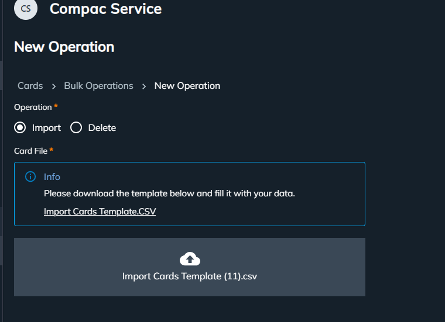

9. Close and Load the file. Save it as CSV.

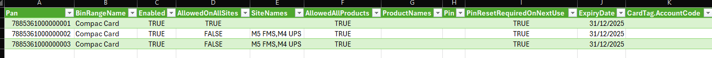

10. Upload the modified csv file.

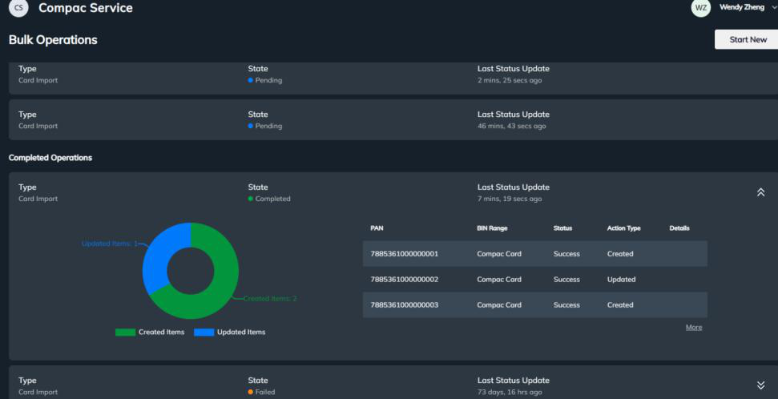

11. Click on **Start** and then view progress. Once all cards are uploaded, it will display under the Completed Operations. Click on down-arrow to view details.

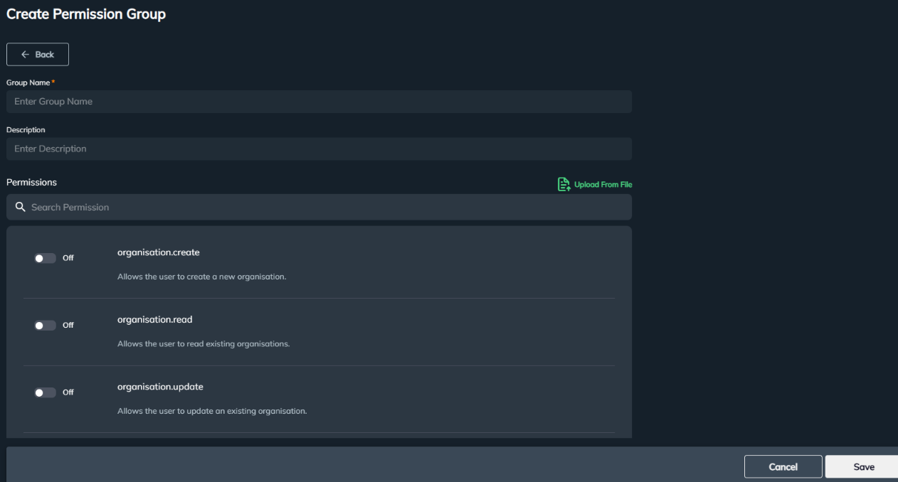

---

## User Management

### Permission Groups

Permission Group defines whether this group of users have access to specific functions. You can set up different permission groups based on the different operation requirements for your users. For example, your service and maintenance team may need to have access to the status of the site, pumps and tanks. Your pricing team may need to only have access to the site and pump prices, not others. Your fuel scheduling team or company may only need to have access to your tank data.

Click on **Create New** to generate new permission group.

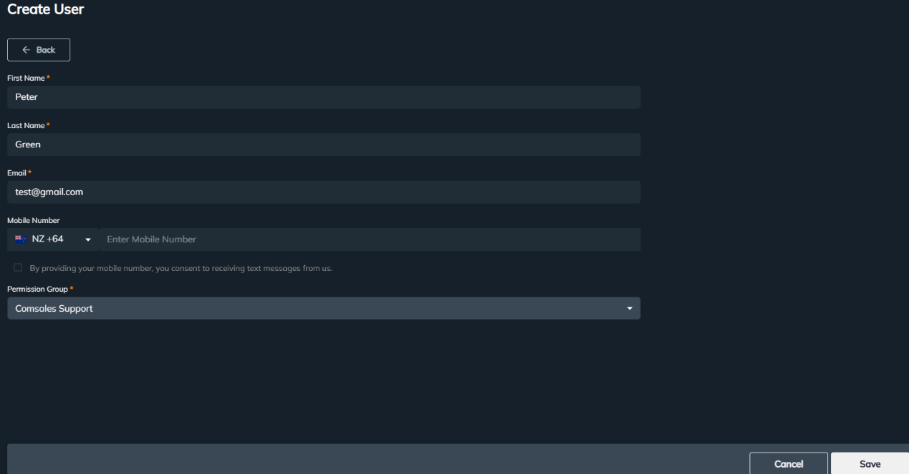

There are large number of refined permissions available in this list. There is an option to upload from a file, if ticking box one by one is too time consuming.

### Users

This page displays all local *Users* created for the *Site*.

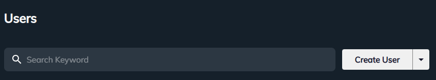

To create a new user, select *Create User* and enter all required details.

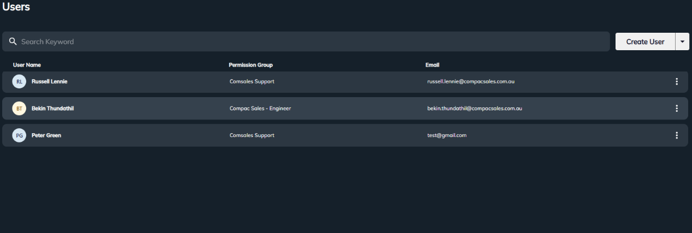

Mobile number is only required if this user needs to receive Txt Alert. Otherwise leave it blank.

Permission Group needs to be created before user is invited, as user needs to be assigned to an appropriate permission group.

Click on **Save** once all required fields are filled out. New user will receive an invitation email with a link to set up their portal password.

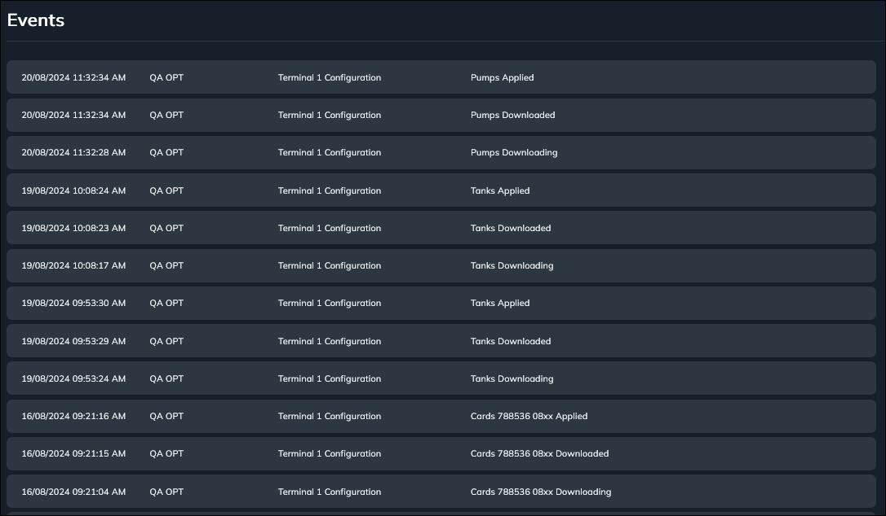

### Inviting a Guest User

Select the drop down option:

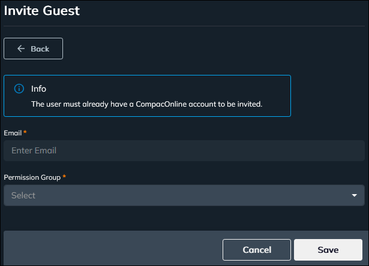

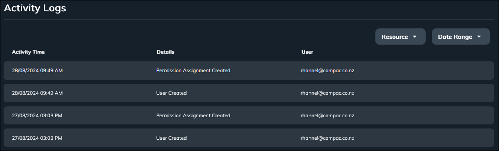

This function will enable users that already has access to other sites in the Organisation to be added to the new site as a guest user.

---

## Monitor Page

### Events

All events and notifications triggered from a site will be available on this page e.g. Terminal Configuration changes, card swipes, Online/Offline states.

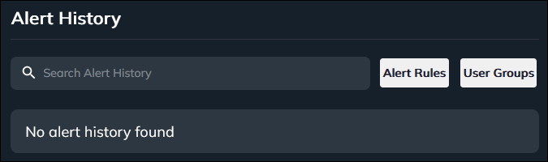

Use the *Search* field or the filter to find specific events.

When using the filters, the *Clear* option has to be selected to reset the filters.

### Activity Logs

Activities relating to an organisation or a site will be listed on this page.

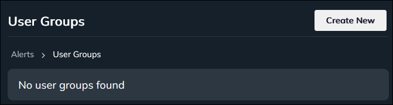

### Alerts

Selecting this page displays all alert history triggered for an organisation or site/s.

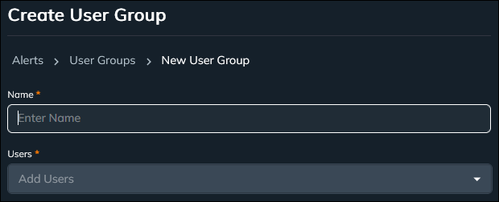

To set up an alert, a user group must be created before an *Alert Rule* can be configured. Select *User Groups* and *Create New*.

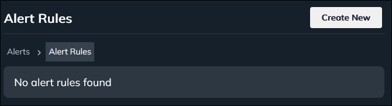

Enter the *Name* and add *Users* to the user group and select *Save*.

Now to add a specific alert, select *Alert Rules* and select *Create New*.

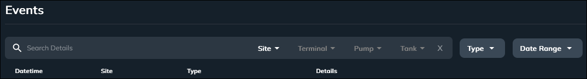

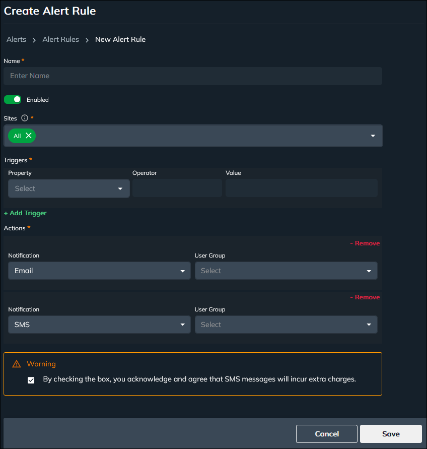

Add the required details e.g. Site; Triggers and the notification method and select Save. Once an alert rule is triggered, a notification will be sent through email or sms.

---

*End of CompacOnline V2 User Manual*
